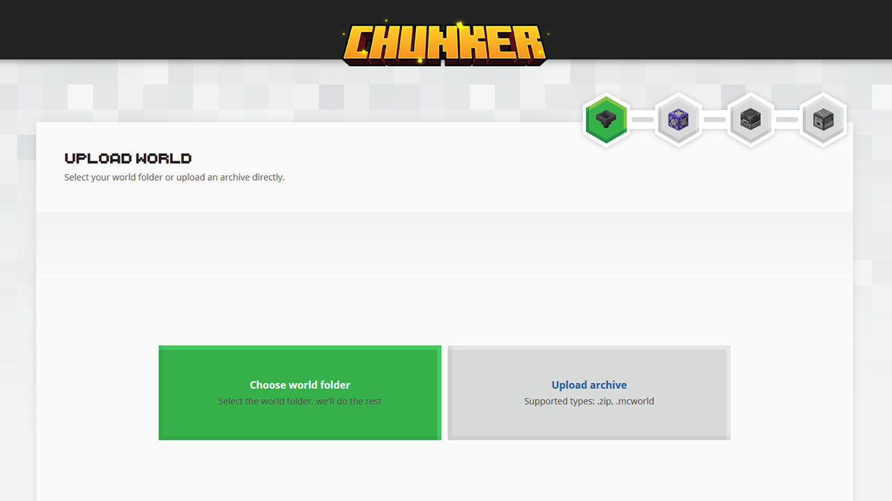
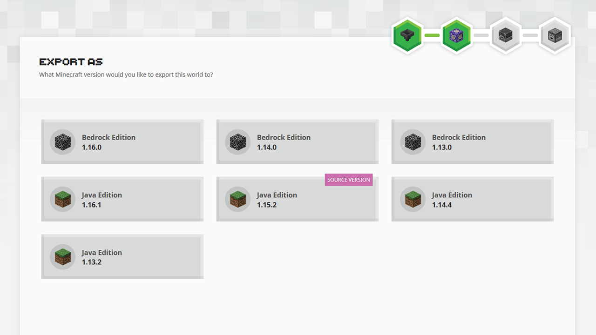
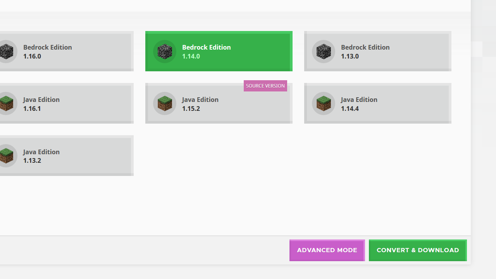
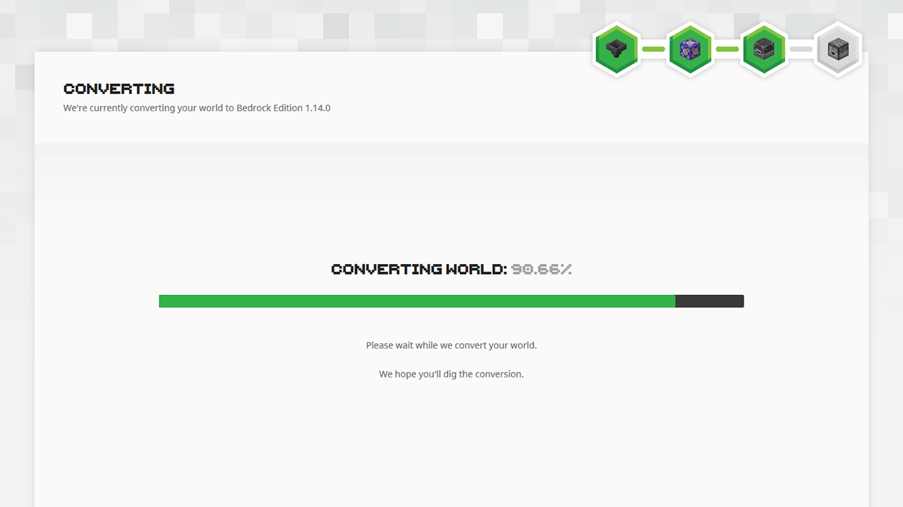

# Chunker - Overview

Many mapmakers like to create maps using Minecraft: Java Edition because of the wide range of community-made tools and plugins. This article introduces you to Chunker and explains how it can be used to convert worlds between different editions and versions of the game.

In this tutorial you will learn the following:

> [!div class="checklist"]
>
> - What Chunker is and how to access it.
> - How to convert a world between Minecraft editions with Chunker.

## Chunker overview

Chunker is a web-based Minecraft world converter. Its goal is to provide an easily accessible interface to convert worlds between Minecraft: Bedrock Edition and Minecraft: Java Edition.

Although advanced options and settings exist, most worlds will not require any changes to successfully convert from one edition to another.

Chunker can currently convert:

- Level settings
- World data (blocks, biomes, and tile entities)
- Multiple dimensions
- Container & items
- In-game maps

Chunker **cannot** currently convert

- Entities
- Player inventories

The feature set of Chunker will expand as it is developed further.

> [!NOTE]
> Chunker will keep entities and player inventories if editing a world (outputting to source world version).

## How to access Chunker

Chunker is accessible via web-browser at https://chunker.app. You don’t need to register and sessions are completely anonymous. Your world is only stored for the duration of the conversion.

## Converting a world with Chunker

It’s simple to convert a world with Chunker. Loading Chunker will present you with the Upload World screen.

### Uploading a world

There are two options to choose from:

- **Choose world folder** allows you to select the root folder of either a Bedrock Edition or Java Edition world. The root folder is where the `level.dat` is located. More information on where you can find where worlds are stored can be found in the [Getting Started with Add-On Development for Bedrock Edition](GettingStarted.md) article.

- **Upload archive** allows you to upload either a zip, or an mcworld. Mcworlds are the files generated by Bedrock Edition when using the “export world” functionality on the edit world screen.

Alternatively, you can also drag and drop a folder, zip, or mcworld, and we’ll automatically detect the right mode to proceed with your upload.

### Selecting a target output

After you have successfully uploaded your world, Chunker will show you all the available output options. Chunker can convert to other editions of the game and different versions of the source worlds format.

Depending on your needs, after selecting an output version, you can either instantly **Convert & Download** or enter **Advanced Mode** to tweak the conversion settings.

More information on “Advanced Mode” and the features within it can be found in the [advanced mode](ChunkerAdvancedMode.md) tutorial.

### Conversion process

Chunker will now process all the data and convert your world to the desired output. If Chunker is under high load, you’ll be entered into a first come first serve queue.

Depending on the size of your world, this may take a while. Most worlds, however, will be done and ready to download within a few minutes.

### Downloading your world

Chunker will tell you when your world is ready to download. If any errors were encountered during conversion, these will also be displayed. You can use these anonymous error identifiers to report issues to the Chunker development team.

Download links are valid for 30 minutes after conversion. After this time, they’re permanently deleted from Chunker's backend servers. Links are tied to your session, and as such, giving the download link to other people will not work. If you want to distribute your converted world, we’d recommend you upload it to a service such as [OneDrive](https://www.microsoft.com/en-us/microsoft-365/onedrive/online-cloud-storage).

You can now enjoy your freshly converted world. If you have converted to a Bedrock Edition format, it’s as simple as opening the mcworld file - Minecraft will do the rest. To open a Java Edition world, you’ll have to copy the folder to the saves directory.

## What's Next?

Chunker can do more than simply convert a world. Read on to the next article which utilizes Advanced Mode.

> [!div class="nextstepaction"]
> [Chunker - Advanced Mode](ChunkerAdvancedMode.md)