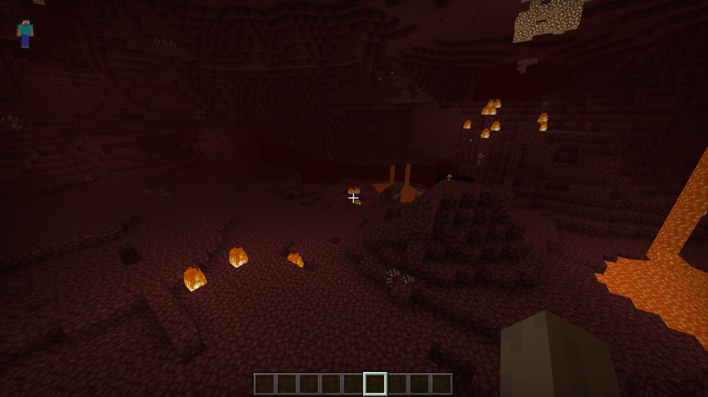
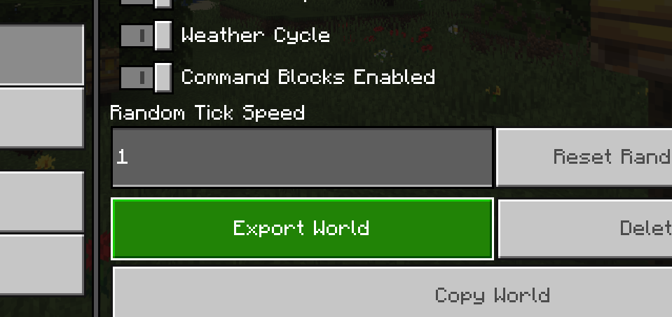
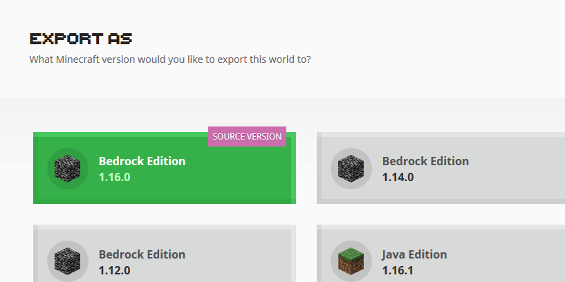
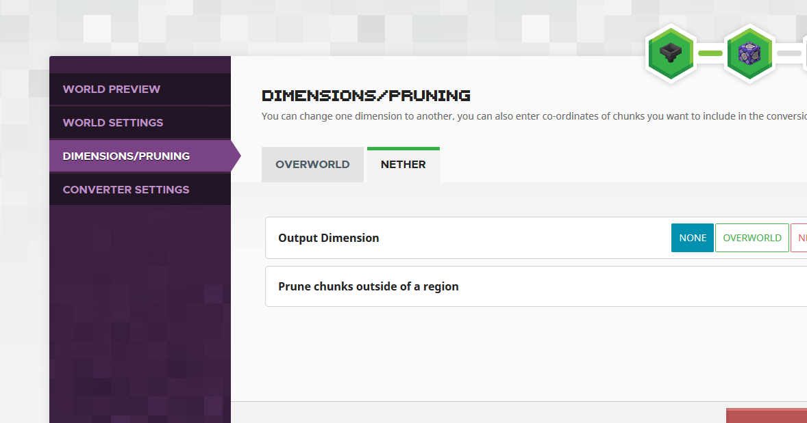
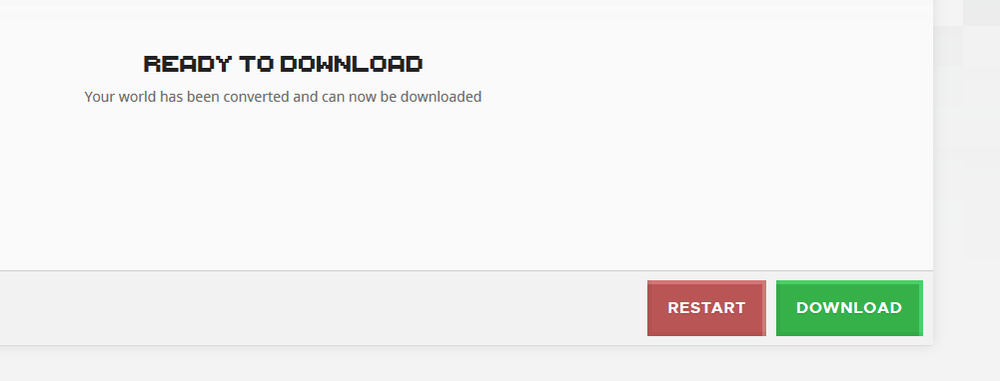
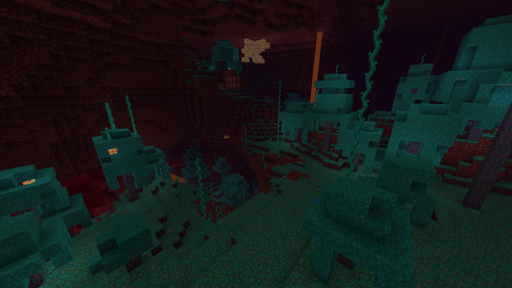

# Chunker - How to Clear The Nether

When Minecraft world generation is updated, only freshly generated chunks will use the updated generator. This tutorial explains how you can use Chunker to reset The Nether in your survival world.

The Nether Update saw The Nether transformed into a world with varying biomes, interesting new blocks, and marvelous new creatures. In this tutorial, we’ll explain how you can bring the new Nether features into your existing survival world.

In this tutorial you will learn the following:

> [!div class="checklist"]
>
> - How to use Chunker to reset The Nether to obtain up-to-date generation features.

### Requirements

It’s recommended that the following be completed before beginning this tutorial.

- [Chunker - Overview](ChunkerOverview.md)
- [Chunker - Advanced Mode](ChunkerAdvancedMode.md)
- [Chunker - World Settings](ChunkerWorldSettings.md)

## Pick the world you want to upgrade

Find the survival world you want to bring up to date with the new Nether. We’ll be using a world from Minecraft: Bedrock Edition.

*Our current Nether, originally generated in Bedrock Edition 1.14.*

## Back up your world
When you are doing anything potentially destructive to a world, it’s highly recommended you make a backup.

Information on how to back up your worlds can be found on the [Mojang support website](https://help.minecraft.net/hc/en-us/articles/360034754912-Backing-up-Minecraft-worlds-).

## Load Chunker

Navigate to https://chunker.app to open Chunker. No login is required, and sessions are fully anonymous.

## Upload your world

As we’re using Bedrock Edition on Windows 10, we’re going to utilize the built-in “Export World” functionality. This can be found at the bottom of the “Edit World” screen. After exporting, you’ll be given a `.mcworld` file that Chunker can understand.

In Chunker, click **Upload Archive**. Navigate to the file you exported and select it. Click **Start Upload** to upload your world to Chunker.

For more information on locating your world on other devices/editions, check out this article on the [Mojang support website](https://help.minecraft.net/hc/en-us/articles/360035131551-Where-are-Minecraft-files-stored-).

## Choosing an export version

As we only want to modify our world, we’ll select the version marked as “Source Version”. Selecting an output different to the source will result in Chunker rebuilding the world.

Once you’ve selected your source version, click the **Advanced Mode** button to continue.

## Tell Chunker to remove The Nether

Chunker Advanced Mode allows you to modify conversion settings. To tell Chunker to remove The Nether, do the following:

1. Select the **Dimensions/Pruning** menu.
2. Select the dimension you want to modify. In this case, **Nether**.
3. Under **Output Dimension**, select **None**.

## Convert

You can now click **Convert**, and Chunker will get to work on preparing your modified world. After a few moments a successful conversion screen should appear.

## Download

Click **Download** to download your newly converted world. Press Download to download your newly converted world. Your download link will be available for 30 minutes before it is purged from Chunker.

## Import World

As we used a Bedrock Edition world, importing is easy. Open the downloaded file, and Minecraft will import the world for you. After a few moments, your new world will appear on your world list ready to be played.

> [!NOTE]
> This does not overwrite your current world. Your newly converted world will appear as a new world with the same name.

## Enjoy your new Nether!

Open your world and jump into The Nether. If you followed all the above steps, The Nether should regenerate using the newest and greatest world generator.

*Our new Nether! Taken from the same position as seen in step 1. Time to explore!*