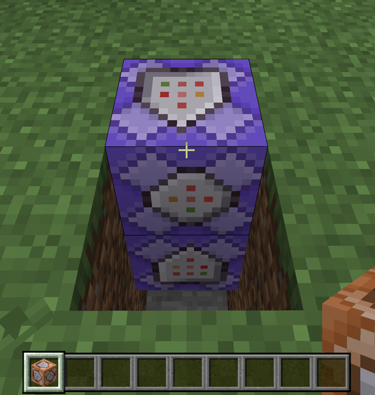
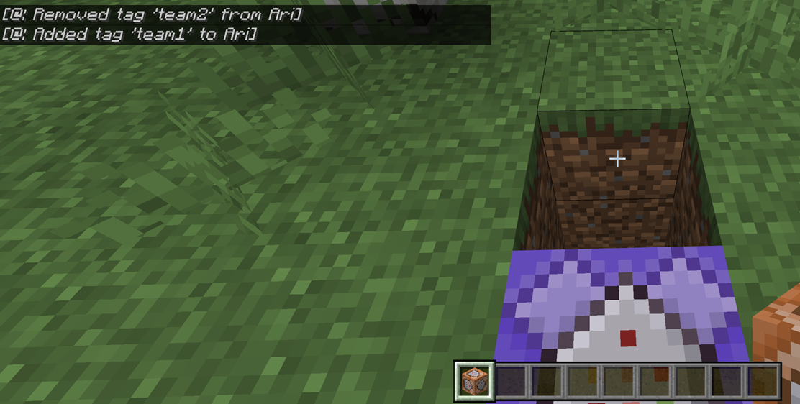
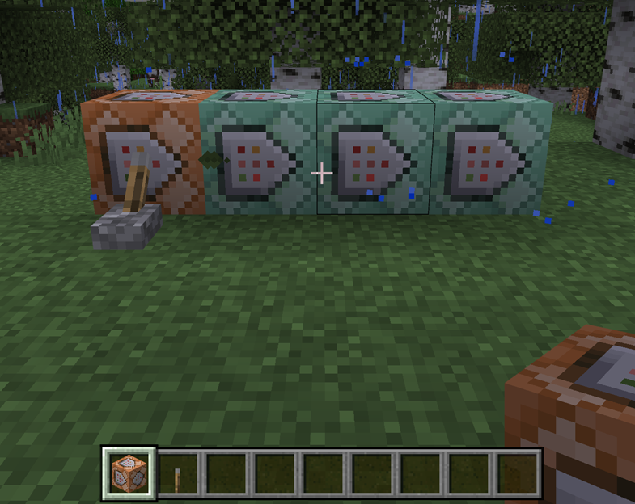
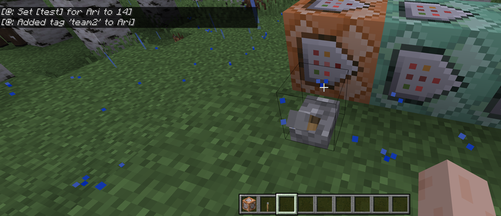

# Use Command Blocks to Have a Snowball Fight

[Command Blocks](CommandBlocks.md) are a tool that you can use to execute commands or even a series of commands in a Minecraft world and give you several advantages, such as giving other players the ability to execute commands without giving them server privileges. But how exactly do we use command blocks to change up the way we play in Minecraft?

Let's take a look at some "cool" command block tricks that we can pull off in order to create a snowball fight game mode in Survival!

## Assign Players to Teams

One of the best things you can do with command blocks is automate processes that would normally take a long time to do by hand. Assigning players to teams in a world is time-consuming because you normally have to assign each player to a team one-by-one. On top of that, you have to know who wants to be on which team and keep track of it for everyone. But it wouldn't be an epic snowball fight if there weren't two sides going all-out across a snowy field so let's look at how command blocks can help you create and assign teams.

### Assign Teams manually

Create two separate staging areas for each team to start in. In the area for Team 1, place two repeating command blocks vertically and make sure they are set to **Always Active**. Make sure to dig two blocks into the ground and place them so that players can walk over the top block to execute the command.

1. Place the first command block on the bottom with the following command:

    `/tag @p[r=2] remove team2`

1. Place the second command block above the first one with the command:

    `/tag @p[r=1] add team1`

    The reason we place the command blocks this way is because we're constantly executing the command, but only in the specified range (`[r=2]`). This way, the bottom command block will still affect the player because its effective range is 2 blocks away from it.

1. Now, for the other team's area, create a similar set of command blocks, but invert the add and remove team commands:

    Bottom command block:

    `tag @p[r=2] remove team1`

    Top command block:

    `tag @p[r=1] add team2`

Now, players can move to their desired team's area and get added to the team. You can create scoreboards to track objectives and points and use these teams for all sorts of custom game modes. 

Obviously you can create more teams, just recreate the same set of command blocks and add an additional team - just note that you will have to create an additional command block to remove any additional team tags, like this:

`tag @p[r=3] remove team3`

### Assign Teams Randomly

Let's say you want to assign the teams randomly. Great news, command blocks can do that, too! Instead of creating areas where players can go to select their teams, let's do things a bit differently.

1. Create an impulse command block and enter the following command:

    `/scoreboard objectives add random test`

1. Chain a command block set to **Always Active** with the following command:

    `/scoreboard players random @p test <min> <max>`

    Replace the `<min>` and `<max>` with your desired maximum number - to make things easy, try using the number of players in your game. This command sets a random "score" for the player to a random number between zero and your maximum number.

1. Chain another command set to **Always Active** block with this command:

    `/execute if score @s test matches <min_score>..<max_score> run tag @s add team1`

    Your `<min_score>` and `<max_score>` is a number range that will divide players based on their randomly assigned score. In our example, for a two team game, make this number the halfway point between 0 and your maximum number. So, what does this look like in game? Let's say we have a game with 2 teams and 16 players.

**Command block 1**

`/scoreboard objectives add random test`

**Command block 2**

`/scoreboard players random @p test 0 16`

**Command block 3**

`/execute if score @p test matches 0..8 run tag @p add team1`

**Command block 4**

`/execute if score @p test matches 9..16 run tag @p add team2`

Now we add a lever in front of our impulse command block and have each player come up and flip the switch in turn. If you want to get fancy, you can add the repeating command blocks from earlier that removed your team tags - just make sure they're not placed where the players will stand to flip the lever, otherwise they will remove the tags we just gave them!

>[!Note]
> If you want to ensure that teams are distributed evenly, you may get better results if you increase the `<NUMBER_RANGE>` value. There is no way to ensure that each player's randomized score will be unique, so creating a much higher number range will often yield more evenly distributed teams. For example, instead of 0 to 16, assign random scores of 0 to 100, making the range for `team1` 0 to 50 and for `team2` 51 to 100.
> As you add more teams, you can further divide your `<min_score>` and `<max_score>` ranges, such as three teams being divided with scores of `0..33`, `34..66`, and `67..99` for `team1`, `team2`, and `team3` respectively.

## Make Lethal Snowballs!

Now it's time to hand out the ammunition for our snowball fight!

Create a repeating command block set to **Always Active** and enter the following command:

`/execute as @e[type=snowball] at @e[family=player, c=1] if entity @e[type=snowball,r=1] at @e[family=player, c=1] run damage @e[family=player, c=1, r=1] 2`

Whew! Okay, let's break that down. We're using the `execute` command in a repeating command block to continuously execute a command everywhere in the world, all the time. The `as @e[type=snowball]` part means that we are executing the command *as any snowball in the world*. The `at @e[family=player, c=1]` means that the snowball will target the **closest** player within one block of itself (c=1) that has the `player` family type. If all of those conditions are met, then it will damage that player for 2 health. You can adjust this final value to increase or decrease the amount of damage dealt by each snowball.

## Snowball Fight!

Now you've got everything you need to create an epic snowball fight! You can [set a scoreboard](ScoreboardIntroduction.md) to track how much damage is scored by each team or how many times players on each team are eliminated. You can also combine the snowball fight mode we've created here with more advanced game mechanics - like a capture the flag or king of the hill scenario! Either way, this is just a taste of what you can do with command blocks. Stay tuned for more fun ideas!