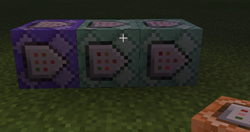
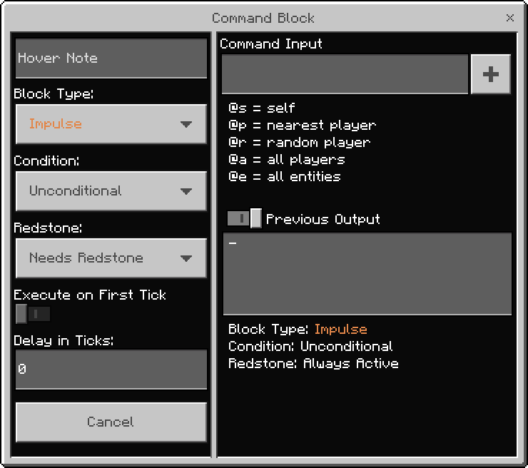

# Getting Started with Command Blocks

Command blocks are a specialized type of block within a Minecraft: Bedrock Edition world that allows the use of console commands in-game. The same commands that players can type from chat can be run automatically by command blocks using redstone power.

In this tutorial, you will learn the following:

> [!div class="checklist"]
>
> - What are command blocks and how to access them in-game.
> - How commands can be used via command blocks.
> - How command block chains work by stringing together multiple command blocks.
> - Create a gameplay loop to reward a player after performing an action.

In this guide, we will set up a command block chain to look for a certain type of block in a set location, and then reward the player for placing a block in the correct place.

### Requirements

- [Introduction to Commands](CommandsIntroduction.md)
- A Minecraft world with cheats enabled.

#### Setting the world up

While command blocks can be used in any Minecraft world, we will be using a flat world for a simple and clean environment.

1. Launch Minecraft: Bedrock Edition.
1. Select **Play**, select **Create New**, then select **Create New World**.
1. In the world settings, set the world type to **Flat**.
1. In the world settings, enable **Show Coordinates**.
1. In the world settings, enable **Activate Cheats**.
1. Select **Create**.

### How to get Command Blocks

Command blocks can only be obtained by running a command.

1. Open up chat.
1. Type the following command: `/give @p command_block`.

You will see a single command block that been added to your inventory.

## How to use Command Blocks

First, place the command block on the ground like any other block. Look at the command block from the side, and you may notice an arrow.

These arrows will always point towards the player when placing down. The arrows show the flow of execution. As shown in the image, the block on the left will execute first, followed by the middle command block, and finally the last block on the right will execute.

Click the **Use** button (right-click on PC) to open up the command block user interface.

## Command Block User Interface

- **Block Type** defines what type of command block this is. There are 3 options:
    - **Impulse** command blocks are activated when they receive a redstone signal.
    - **Chain** command blocks are activated when a command block pointing into it is activated.
    - **Repeat** command blocks are activated once every in-game tick, as long as they have a redstone signal. Minecraft has 20 ticks per second.
-   **Condition** defines when a command block will execute its action. There are 2 options:
    - **Conditional** will only execute if the previous block in a chain was successful.
    - **Unconditional** will execute regardless if the previous block was successful or not.
- **Redstone** defines whether or not a command block requires redstone to activate. There are 2 options:
    - **Needs Redstone** will set the command block to only activate when it has redstone power.
    - **Always Active** will set the command block to always activate with or without redstone. For impulse command blocks, this causes them to only run once, so it isn't very useful. For chain command blocks, this is enabled by default.
- **Execute on First Tick** is only usable for repeating command blocks with a delay. If enabled, the command will execute as soon as the block is powered, and then will wait for the delay before running again. If disabled, the command will not run the first time until the delay has finished.
- **Delay in Ticks** is a value that defines how long a command block waits to execute after the command block receives redstone power.

## Designing a Gameplay Loop

A use case of command blocks is allowing creators to create gameplay loops within Minecraft. A simple gameplay loop would be rewarding a player for completing an action. If the gameplay loop was to give a player an emerald for placing a diamond block in a certain location, you can break down each step needed:

1. Check to see if a diamond block exists at a set location.
1. If it does, check to see if the player has already received the reward.
1. If the player hasn't received the reward, give the player an emerald.
1. After giving the player an emerald, mark that they have received the reward.

### Setting up the first Command Block

Now that we have looked at the settings of a command block, let’s set up the first block to detect a certain type of block in a location.

1. Place a command block on the ground in a location near your player character.
1. Open up the command block interface.
1. Set the **Block Type** to **Repeat**.
1. Set the **Redstone** to **Always Active**.

#### The `/testforblock` Command

The `/testforblock` command looks for a specific block at a specified point in the world.

`/testforblock <position: x y z> <tileName: Block> [dataValue: int]`

- **position** is the coordinates in the world where the command will look for the specific block. Example: `0 4 0`.
- **tileName** is the type of block you are looking for. Example: `diamond_block`.
- **dataValue** is an optional argument used to handle variations of the same block. For this tutorial, we won't be needing to use this.

If you are following this tutorial, you will be in a flat world. As you walk around, you can see your player's position in the top-left of the screen. Let's check for a block near the origin.

1. In the Command Input section, input the following: `/testforblock 0 4 0 diamond_block`.
1. Close the interface.

## Command Block Chains

For the next step, we need to place a chain command block. As mentioned above, chain command blocks execute when a block pointing into them is activated. Make sure you place the block like the image showing the arrows.

### Setting up the `/testforblock` Command Block

1. Place another command block next to the existing block. Make sure that the new block is placed in front of the direction that the arrow is pointing.
1. Open the command block interface.
1. Set the **Block Type** to **Chain**.
1. Set the **Condition** to **Conditional**.
1. Set the **Redstone** to **Always Active**.
1. Set the **Command Input** to  `/testfor @p[tag=!placed_block]`

Since the second block is set to **Conditional**, this new block will only execute if the first command block succeeds, meaning the diamond block was present. This command checks to see if the player hasn't already received the reward.

### Setting up the Reward Command Block

Let’s add a third block to set a command to reward the player for placing a block in the right spot.

1. Place another command block next to the existing block. Make sure that the new block is placed in front of the direction that the arrow is pointing.
1. Open the command block interface.
1. Set the **Block Type** to **Chain**.
1. Set the **Condition** to **Conditional**.
1. Set the **Redstone** to **Always Active**.
1. Set the **Command Input** to `/give @p emerald`.

Once again, this command will only activate if the previous command succeeded, meaning both the diamond block was present and the player hasn't received the reward yet.

### Closing the loop

If we stop now, placing the diamond block at `0 4 0` will give the player 20 emeralds per second! That's because we need to do one last step, marking the player as having received the reward.

1. Place another command block next to the existing block. Make sure that the new block is placed in front of the direction that the arrow is pointing.
1. Open the command block interface.
1. Set the **Block Type** to **Chain**.
1. Set the **Condition** to **Conditional**.
1. Set the **Redstone** to **Always Active**.
1. Set the **Command Input** to  `/tag @p add placed_block`

### Testing the loop

If everything has been set up correctly, you can now place a diamond block on location `0, 4, 0` and you will receive a single emerald in your player inventory.

> [!div class="nextstepaction"]
> [Commands Introduction](CommandsIntroduction.md)
> [Popular Commands](CommandsPopularCommands.md)
