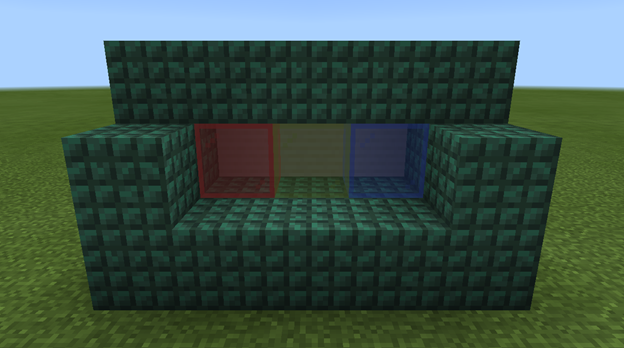
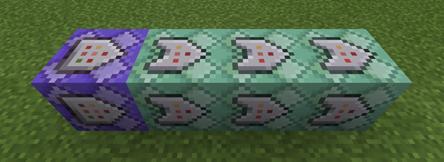
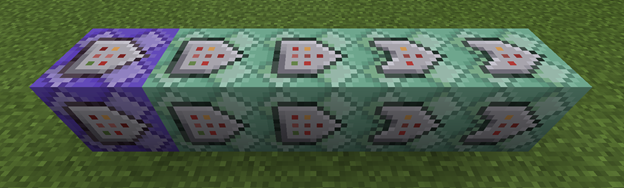

# Commands - How To Make a "Complete the Monument" World

This guide shows you not only how to create a command system that will detect the placement of certain blocks in particular areas of a world, but also how to give visual clues to players about what they need to do to win. The world will give a player one diamond the first time they place each block of wool in the correct spot, to encourage them. However, to discourage players from placing the same color wool in the same spot over and over and getting a diamond each time (not that anyone would do that) we are going to make it where the system only rewards them the first time they place each color of wool block correctly.
When all three blocks are placed correctly, the player gets a diamond block.

In this tutorial you will learn the following:

> [!div class="checklist"]
>
> - How to apply what you've learned about commands and scoreboards to make a simple game mechanic.

### Requirements

It’s recommended that the following be completed before beginning this tutorial.

- [Introduction to Commands](CommandsIntroduction.md)
- [Getting Started with Command Blocks](CommandBlocks.md)
- [Popular Commands](CommandsPopularCommands.md)
- [Introduction to Scoreboards](ScoreboardIntroduction.md)

## The setup

You will want to start with a creative mode world that has its coordinates shown. Build a monument that looks sort of like a dark prismarine couch that has stained glass windows to indicate what colors of wool should be placed in front of them on the "couch cushions." Of course you can build any sort of monument you like - the most important part is that there are spaces where a user can place wool and that you make note of the coordinates where each color of wool should be placed. You will need those coordinates later when you set up the command blocks.



Add a **wool_placed** scoreboard objective to keep track of which colors of wool have been placed. This information must be stored to prevent the player from simply breaking one of the wool blocks and placing it back down to cheat and earn more rewards. You don't have to make this information display anywhere, but you can if you want.

```
/scoreboard objectives add wool_placed dummy
```

Add a **totals** objective to store the total number of wool blocks placed.

```
/scoreboard objectives add totals dummy
```

So, this next part might seem a little weird. Scoreboards track information about about objectives and players, remember? But what if we want to track information about something else, like, whether or not a red wool block has been placed? Well, we can tell the scoreboard that "red wool" is a player and that the scoreboard needs to track information about it - *and it will believe us!*

>[!Note]
> In computer science language, we are using the scoreboard to track when the score for "red wool" goes from 0 to 1, sort of like a Boolean value. This concept might come in handy later when you're building your own worlds.

Anyway, to keep things nice and tidy, we are going to create three fake players so that the scoreboard will track whether red, green, or blue wool is placed. If we name our fake players **#red**, **#green**, and **#blue**, the hash (#) at the start of each name will prevent our fake players from appearing in the list of scores on the sidebar.

Use these commands to create fake players, add them to the `wool_placed` objective, and give each one a score of 0.

```
/scoreboard players set #red wool_placed 0
/scoreboard players set #green wool_placed 0
/scoreboard players set #blue wool_placed 0
```

We are also going to add one more fake player called **#total_wool** to the `totals` objective and give it a score of 0, too. Even though we are using the same command, #total_wool is going to be used to tell when all three of the other wool blocks have been placed.

```
/scoreboard players set #total_wool totals 0
```

Because repeating command blocks are going to be used, the chat is going to be flooded with command block output. This can be disabled using the "commandblockoutput" gamerule.

```
/gamerule commandblockoutput false
```

When the player receives diamonds as a reward, a generic chat message will appear telling them they have been given items. This can be disabled, but be aware that some type of message to convey the reward may be beneficial to the player.

```
/gamerule sendcommandfeedback false
```

## Rewarding individual wool placements

Start by placing five command blocks all next to each other and all pointing in the same direction.

Edit each block's settings and command input like this:

1. Repeat, Unconditional, Always Active - Command Input: `/testforblock X Y Z wool 14`
    >[!Important]
    > Be sure to replace `X Y Z` with the coordinates of where the wool will be placed in your own world.

1. Chain, Conditional, Always Active - Command Input: `/scoreboard players test #red wool_placed 0 0`
1. Chain, Conditional, Always Active - Command Input: `/give @a diamond`
1. Chain, Conditional, Always Active - Command Input: `/scoreboard players set #red wool_placed 1`
1. Chain, Conditional, Always Active - Command Input: `/setblock X Y Z cake`



### What are the command blocks doing?

1. A `/testforblock` command checks for the existence of red wool (indicated by the aux code `wool 14`) at the expected coordinates in the monument.
1. If the previous command successfully found the wool block, a `/scoreboard` command will check the score of the fake #red player. If the score is 0, that means the red wool hasn’t been placed before.
1. Because this is the first time the red wool is being placed, the player will receive one diamond for doing it.
1. The score for "#red" will be set to 1, indicating that the red wool has been placed correctly.
1. The red wool is replaced with cake. Not only is this another way to grant a reward, but it stops the infinite loop of diamonds.

### Detecting green wool

Next, set up five more command blocks just like the ones for red, but change every instance of the word "red" to "green" and make sure the X Y Z is the location where you want to detect green wool. The aux code for green wool is 13.

Here are the command inputs:

```
/testforblock X Y Z wool 13
/scoreboard players test #green wool_placed 0 0
/give @a diamond
/scoreboard players set #green wool_placed 1
/setblock X Y Z cake
```

### Detecting blue wool

Do the same thing again, but change the color to blue (aux code 11) and the X Y Z, etc.

```
/testforblock X Y Z wool 11
/scoreboard players test #blue wool_placed 0 0
/give @a diamond
/scoreboard players set #blue wool_placed 1
/setblock X Y Z cake
```

## Rewarding monument completion

In the final step, we reward the player with a diamond block. To tell when we're done, we use math. Because each of the fake players has a score of 1 after the correct color of wool is detected, if the sum of the scores for all fake players is 3, then all wool blocks have been placed. The "+=" scoreboard operator is used to obtain the sum of scores.

### Set up the command blocks like this



1. Repeat, Unconditional, Always Active - Command Input: `/scoreboard players set #total_wool totals 0`
1. Chain, Unconditional, Always Active - Command Input: `/scoreboard players operation #total_wool totals += * wool_placed`
1. Chain, Unconditional, Always Active - Command Input: `/scoreboard players test #total_wool totals 3 3`
1. Chain, Conditional, Always Active - Command Input: `/give @a diamond_block_`
1. Chain, Conditional, Always Active - Command Input: `/scoreboard players set #red wool_placed 2`

## What are these command blocks doing?

1. The fake player named "#total_wool" first has their score set to 0, and then the `+=` adds one to the score when a wool block is correctly placed.
1. The += operator is used to tally up the scores of all players in the "wool_placed" objective (denoted by the asterisk `*`), and the result is stored as the score of the fake player "#total_wool" in the "totals" objective.
1. The score of "#total_wool" is checked to see if it’s exactly 3. If so, this means all wools have been placed.
1. If the score is 3, all players receive a diamond block.
1. A command is needed to stop the process. Setting the score of any wool color to be anything higher than 1 will cause the sum to be higher than 3, preventing the system from flooding the player’s inventory with diamond blocks. There are plenty of other ways to go about this, including disabling the command block chain in some manner.

## What's Next?

Now that you have the hang of command systems, mixing them in with behavior packs can greatly increase the interaction between your players and your custom content. Learning about Add-Ons and behavior packs is the next step.

> [!div class="nextstepaction"]
> [Getting Started with Minecraft Add-Ons](GettingStarted.md)
> [Introduction to Behavior Packs](BehaviorPack.md)
