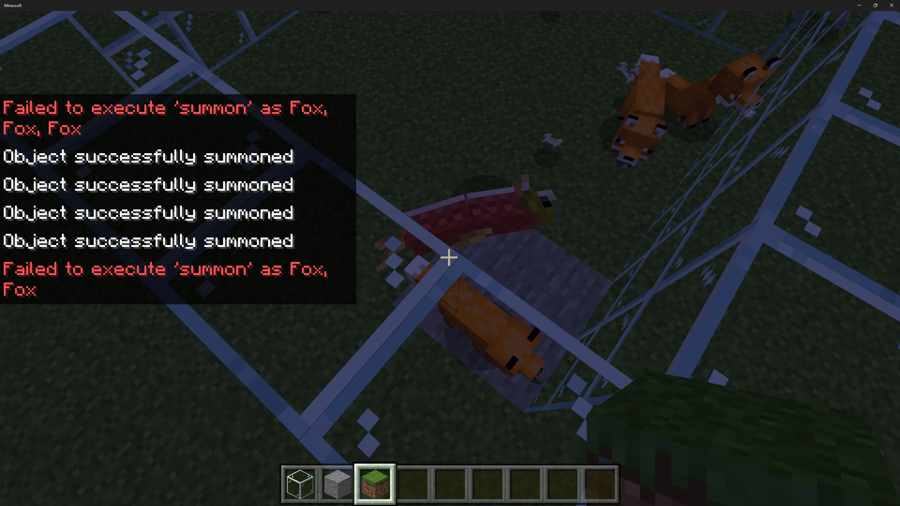
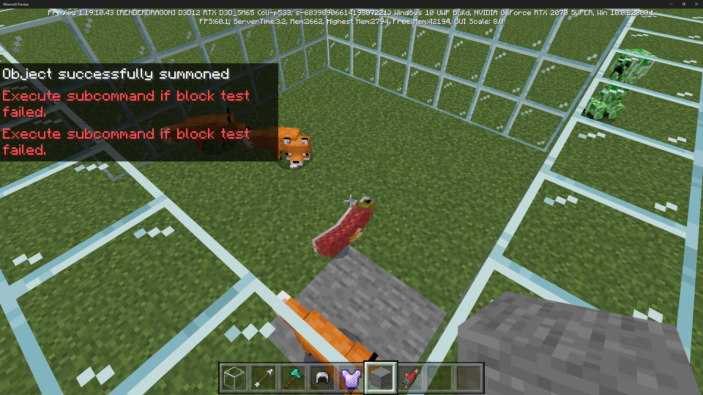

# New execute command support in Minecraft version 1.19.70

We're working on a new, extended version of Minecraft's `/execute` command. Starting with version 1.19.70, we're introducing the next step for the `/execute` command, which moves the command in Minecraft: Bedrock Edition towards parity with Java edition. This move also adds new functionality for creators. In this article, you'll see upcoming changes for the `/execute` command, the new powers it will bring, and how you can get started.

## What the /execute command does today

The /execute command lies at the heart of gameplay for many more advanced add-ons in Minecraft. If you're not familiar with execute, the execute command does three very powerful things:

1. It allows you to run a subcommand from the perspective of multiple entities within the world.  One command becomes many!
For example, run a command for every one of 20 skeletons near to a location.

1. When a command runs as an individual entity, all selectors and relative locations run from the perspective of that entity.  
This means that when you run a command for every nearby skeleton, you can manipulate the world next to every individual skeleton.

1. You can also express additional conditions for whether those commands will execute, such as the state of blocks close to the entity.
For example, you can run a command for skeletons only if a skeleton is standing on dirt.

If you have development experience, it might be helpful to think about the execute command as being somewhat like a `foreach (<criteria of entities to select>) { if (<additional criteria>) run <command> }` loop. It provides a way to run a command across a wide range of entities that you can select and filter.

## How we're updating the execute command

The biggest news is that with the 1.19.70 update, how the command works will fundamentally shift over to adopt Java edition syntax, with new keywords such as `as`, `at`, and `if`.  This also gives the command much more room to add new capabilities moving forward.

With this foundation in place, the new command will have additional capabilities, such as:

* The ability to use score as a conditional for how commands execute.  For example, you can run commands for players based on what their score might be.
* New flexibility on how you can test for the state of blocks nearby to an entity through the use of multiple `if` and `unless` statements.

Note that the `/execute` command does not have full parity with Java Edition's `/execute` command, yet. The new Bedrock Edition `/execute` command does not support storing the results of commands or working with conditions based on the rotation of entities, for example. Stay tuned for more to come with the `/execute` command.

## Getting started with the new execute command

Let's create a world that can use the new /execute syntax and explore some of the new features.

### Use version 1.19.70 or higher

To get started, you'll want to use version 1.19.70 or higher of Minecraft. One of the best ways to get the latest versions of Minecraft is to download Minecraft Preview, which is available from the Xbox store on Windows as well as available on iOS and Xbox. See more on [Minecraft Preview here](https://help.minecraft.net/hc/articles/4423653831821-Minecraft-Preview-FAQ).

**IMPORTANT**: If you have commands in command blocks that were written with the older Bedrock-specific syntax, those commands will continue to work like they always have. However, if you decide to edit those command blocks, you will need to rewrite the command to have the newer syntax.

### Update a Behavior Pack to version 1.19.70

Commands are also very commonly used within Behavior Packs. To opt into the new Command Syntax, you'll need a minimum engine version (min_engine_version) of **1.19.70** expressed within your behavior pack's **manifest.json** file. This will enable the new execute command syntax in your MCFunctions, tick.json files, and more within your behavior pack. 

## Major syntax changes and their equivalents

Let's dig into the updated new command syntax in 1.19.70 and how you can upgrade existing commands to the new syntax.

### Summon a salmon for every fox

In the older Minecraft: Bedrock Edition syntax, commands are expressed in the following form:

(earlier /execute command syntax): `execute @e[type=fox] ^ ^ ^ summon salmon ^ ^1 ^`

This command will select entities of type fox (`@e[type=fox]`), and then, at a position above those respective foxes' heads, (`^ ^1 ^`) will summon salmon for those foxes to consider.

Note that in this screenshot, three salmon were spawned next to the three nearby foxes.

In the new Minecraft execute command syntax, commands are expressed in a more structured form and the command is more readable. The equivalent command is:

(new /execute command syntax): `execute as @e[type=fox] positioned as @s run summon salmon ^ ^1 ^`

Let's break this down:

* The `as @e[type=fox]` segment is where you can select which entities to run the subsequent command as.
* The `positioned as @s` segment helps you determine the positioning of the command. `positioned as @s` means, in this case, run it as the selected entity. This gives you more flexibility in how you position the result of your command.

For example, if you wanted to spawn the salmon close to the nearest player, rather than right next to the fox, you could do that with a `positioned as @p` - in other words, position to the nearest player - segment.

* The `run summon salmon ^ ^1 ^` command is where you can determine the exact command to run.

### Detect blocks around an entity as a conditional

The older Minecraft execute command also supported a very basic conditional functionality for detecting blocks around an entity.

With this command:

(earlier /execute command syntax): `execute @e[type=fox] ^ ^ ^ detect ^ ^-1 ^ stone 0 summon salmon`

This variant of the execute command will only run for foxes (`@e[type=fox]`) that are stepping on stone (`detect ^ ^-1 ^ stone 0`).  `^ ^-1 ^` in this context will check to see if the block at y=-1 (underneath) the fox is a basic variant of type stone (stone 0).

With the newer syntax, the execute command is a bit longer, but also more explanatory with room for expansion in the future:

(newer /execute command syntax): `execute as @e[type=fox] positioned as @s if block ^ ^-1 ^ stone 0 run summon salmon`

This is the same as the command before, but notice the new `if block ^ ^-1 ^ stone 0` subcommand. This new subcommand basically says that if the block underneath (`^ ^-1 ^`) the selected entities (foxes) is the basic variant of stone (stone 0), then only run the command in that condition.

And this gives the same result as before:

Note that the command summoned the salmon for the fox standing on stone, but the block test failed for the other two foxes not standing on stone. So, no salmon for them!

## But wait, there's more

With this new foundation, the execute command is positioned to support more flexible conditional queries.

The new execute syntax supports both an `if` and an `unless` semantic.  The `if` subcommand will only let commands run if a certain criteria is met, as you've seen above with the execute if block example. The `unless` variant is the opposite: commands will run for as long as certain criteria are not met.

Importantly, note that you can add multiple `if` and `unless` statements to a command. For example, you can run a command if a fox is stepping on stone and unless there is a nearby chicken, by adding both an `if` and an `unless` subvariant to your execute command.

There are additional query types, as well:

* `/execute (if/unless) blocks`
This blocks variant of the execute if command will check to see if a volume of blocks matches a source set of blocks.

* `/execute (if/unless) entity`
The entity variant will allow you to exercise an entity selector. In the case of execute if entity, the condition is satisfied if at least one entity matches your criteria.  In the case of execute unless entity, the condition is satisfied for as long as no entities match your criteria. For example, you could give a fox salmon unless there is a nearby chicken.

* `/execute (if/unless) score`
The score variant, typically used in conjunction with player selectors, will only run a command if a score matches a criteria.  For example, `if score @s teamFlags matches 3 run say @s You win!` will only run if a players' score for `teamFlags` matches 3.  With the score command you can also compare the score for multiple entities as well (e.g, between player A and player B, run a command only for a player with the highest score.)

## Summing up

With new flexibility in the /execute command, you can now express more sophisticated game logic across your command blocks, MCFunctions, and more!

Please open any bugs or issues via our [Report a Bug tool](https://www.minecraft.net/bugs), or log an issue in our GitHub repository at https://github.com/MicrosoftDocs/minecraft-creator.  

Thank you for taking a look at new `/execute` command functionality!
