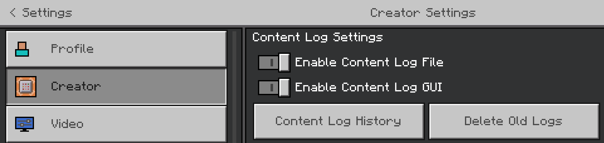
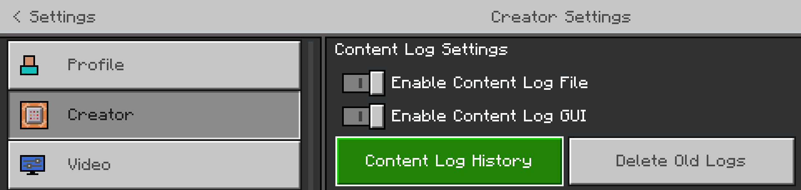
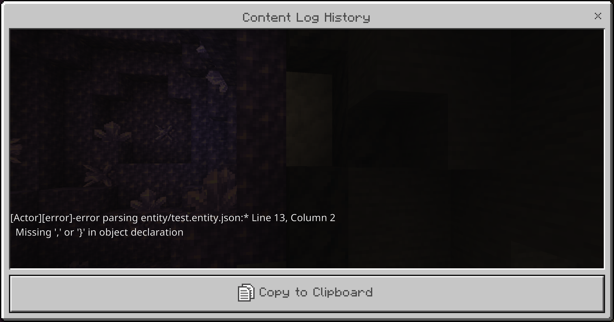

# Content Error Log

While playing Minecraft: Bedrock Edition, the game is constantly processing content to produce the game experience we all know and love. This content can be anything from textures for character skins, configuration files describing how a torch's fire looks, or a behavior for a mob. While this is going on, Minecraft logs information related to this in a separate content specific log. Some of these messages are just noting normal game operations, but some of the messages denote problems detected in content that can either lead to instability or unpredictable behavior.

In this tutorial you will learn the following:

> [!div class="checklist"]
>
> - What sort of messages are logged and how to differentiate between them.
> - How to enable logging in order to access those messages.

The messages in this log are broken into two larger categories outlined below.

## Errors and Warnings

- Show up in both the GUI dialog, content log history screen, and the content log file
- Occur when problematic or concerning content is processed

While loading and processing content generated by our creators, mistakes and unexpected results are bound to happen. These sorts of problems can present themselves in any number of ways, some of which the game can determine as problematic on its own. These can be things like putting a word in a configuration file that was expecting a number or having a reference to a texture file that wasn’t included in the content pack. When Minecraft detects this sort of problem, it will output a message outlining the problem as well as some advice on how to correct it.

## Info and Verbose

- Only show up in the log file
- Occur to show a record of steps taken during the course processing content

These classes of messages are used mostly as a record of what happened. These mostly serve to provide some context around other errors while content is being processed. It can be useful to know what happened right before or right after an error/warning occurs in the log. These messages are not a sign that something is wrong and are safe to ignore.

## How to use the Content Log

In the settings you can enable/disable both the file and GUI reporting from the content log. Turning either on or off will enable/disable the functionality of either reporting methodology. Turning off all the content log reporting methods effectively disables the content log. These options currently live in the "Creator" menu.

### What the Content Log GUI looks like

## Looking at previous Content Log messages

There are two ways to get to the content log history. The first is by clicking the **Content Log History** button in the profile screen:

By pressing this button, you will end up at this screen:

Here you can also copy all messages to the clipboard to save for later.

An alternative to get to this screen is to press **Control + H**, and this will only work if the **Enable Content Log GUI** option is enabled.

## Location of the Content Log file

The content log file is stored in the `logging` folder. You can find the exact location of this log file by looking at the profile screen where the path to the current content log is stored.

### Example Paths

**Windows UWP**

`%LocalAppData%\Packages\Microsoft.MinecraftUWP_8wekyb3d8bbwe`

**Android** *(varies whether the app is installed on the phone or SD card)*

`*root storage location*/games/com.mojang/logs`

**iOS** *(varies based on where the external storage is located for the app)*

`*root storage location*/Minecraft/game/com.mojang/logs`
