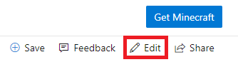

# Contributing to Minecraft Bedrock Documentation

Welcome to the public repo for Minecraft Bedrock documentation! Any articles you create or edit in this repo will be visible to the public.

The Minecraft Bedrock docs are published to Microsoft Learn, which uses GitHub-flavored Markdown with Markdig features. The content you edit in this repo will be formatted into Microsoft Docs stylized pages that are published to [Minecraft Bedrock documentation](/minecraft/creator). Content created by you and other members of the Bedrock Community will be released as a part of our content drops and Minecraft: Bedrock Edition updates.

This page covers the basic steps and guidelines for contributing and links to Markdown basics. Thank you for your contribution!

## Available repos

| Repository name | URL |
|------ | ----- |
| Minecraft Bedrock docs | https://github.com/MicrosoftDocs/minecraft-creator |

## Before you start

If you don't already have one, you'll need to [create a GitHub account.](https://github.com/join)

When setting up your GitHub account, we also recommend these security precautions:

- Create a strong password for your Github account.
- Enable two-factor authentication.
- Save your recovery codes in a safe place.
- Update your public profile settings.
    - Set your name, and consider setting your Public email to Don't show my email address.
    - We recommend you upload a profile picture because a thumbnail is shown on docs pages you contribute to.
- If you plan to use the command line, consider setting up Git Credential Manager for Windows. That way you won't have to enter your password every time you make a contribution.

The publishing system is tied to GitHub, so these steps are important. You'll be listed as either author or contributor to each article using your GitHub alias.

## Editing an existing article

Use the following workflow to make updates to an existing article via GitHub in a web browser:

1. Navigate to the article you wish to edit in the [Minecraft Creator docs](/minecraft/creator).

2. Select the edit button (pencil icon) in the top right, which will automatically fork a disposable branch off the 'main' branch.



3. Edit the content of the article and format according to the [Markdown basics](#markdown-basics).

4. Update the metadata at the top of each article:

    - **title**: Page title that appears in the browser tab when the article is being viewed. Page titles are used for SEO and indexing, so don't change the title unless necessary (though this is less critical before documentation goes public).
    - **description**: Write a brief description of the article's content, which boosts SEO and discovery.
    - **author**: If you're the primary owner of the page, add your GitHub alias here.
    - **ms.author**: If you're the primary owner of the page, add your Microsoft alias here (you don't need @microsoft.com, just the alias).
    - **ms.date**: Update the date if you're adding major content to the page, but not for fixes like clarification, formatting, grammar, or spelling.
    - **keywords**: Keywords aid in SEO (search engine optimization). Add keywords separated by a comma and a space that are specific to your article, but no punctuation after the last keyword in your list. You don't need to add global keywords that apply to all articles, as those are managed elsewhere.

5. When you've completed your article edits, scroll down and select Propose file change.

6. On the next page, select Create pull request to merge your automatically created branch into 'main.'

7. Repeat the steps above for the next article you want to edit.

## Renaming or deleting an existing article

If your change will rename or delete an existing article, be sure to add a redirect. That way, anyone with a link to the existing article will still end up in the right place. Redirects are managed by the .openpublishing.redirection.json file in the root of the repo.

To add a redirect to .openpublishing.redirection.json, add an entry to the `redirections` array:

```json
{
    "redirections": [
        {
            "source_path": "minecraft-creator/creator/old-article.md",
            "redirect_url": "new-article#section-about-old-topic",
            "redirect_document_id": false
        },
        ...
    ]
}
```

- The `source_path` is the relative repository path to the old article that you're removing. Be sure the path starts with `minecraft-creator/creator` and ends with `.md`.
- The `redirect_url` is the relative public URL from the old article to the new article. Be sure that this URL **doesn't** contain `minecraft-creator/creator` or `.md`, as it refers to the public URL and not the repository path. Linking to a section within the new article using #section is allowed. You can also use an absolute path to another site here if necessary.
- `redirect_document_id` indicates whether you would like to keep the document ID from the previous file. The default is false. Use true if you want to preserve the ms.documentid attribute value from the redirected article. If you preserve the document ID, data, such as page views and rankings, will be transferred to the target article. Do this if the redirect is primarily a rename, and not a pointer to different article that only covers some of the same content.

If you add a redirect, be sure to delete the old file as well.

## Creating a new article

Use the following workflow to create new articles in the documentation repo via GitHub in a web browser:

1. Create a fork off the MicrosoftDocs/minecraft-creator 'main' branch (using the Fork button in the top right).


2. In the "creator/Documents" folder, select **Add file** > **Create new file** in the top right.

3. Create a page name for the article (use hyphens instead of spaces and don't use punctuation or apostrophes) and append ".md"

>[!IMPORTANT]
>Make sure you create the new article from within the "creator/Documents" folder. You can confirm this by checking for "/creator/Documents" in the new file name line.

4. At the top of your new page, add the following metadata block:

```Markdown
---
title:
description:
author:
ms.author:
ms.date:
ms.topic: article
keywords:
---
```

5. Fill in the relevant metadata fields per the instructions in the section above.

6. Write article content using Markdown basics.

7. Add a `## See also` section at the bottom of the article with links to other relevant articles.

8. When you are finished writing your article, select **Commit new file**.

9. Select New pull request and merge your fork's 'main' branch into MicrosoftDocs/minecraft-creator 'main' (make sure the arrow is pointing the correct way).


Your pull request will be reviewed by our content team. If it is approved, your changes will go live at our next regular release. If your pull request is not approved, a member of the content team will leave a comment in your pull request letting you know the reason it was not approved.

## Markdown basics

The following resources will help you learn how to edit documentation using the Markdown language:

- [Markdown basics](https://help.github.com/articles/basic-writing-and-formatting-syntax/)
- [Markdown-at-a-glance reference poster](media/ContributorGuide/MarkdownPoster.jpg)
- [Additional resources for writing Markdown for Microsoft Learn content](/contribute/markdown-reference)

### Adding tables

When tables are styled in Microsoft Learn content, they won't have borders or custom styles even if you try using inline CSS. It will appear to work for a short period of time, but eventually the platform will strip the styling out of the table. So plan ahead and keep your tables simple. Here’s a site that makes Markdown tables easy.

The Docs Markdown Extension for Visual Studio Code also makes table generation easy if you're using Visual Studio Code (see below) to edit the documentation.

```markdown
|Title 1 |Title 2| Title 3|
|--------|-------|--------|
|This will |Show a three |column table|
```

### Adding images

You’ll need to upload your images to the "minecraft-creator/creator/images" folder in the repo, and then reference them appropriately in the article. Images will automatically show up at full-size, which means large images will fill the entire width of the article. We recommend pre-sizing your images before uploading them. The recommended width is between 600 and 700 pixels, though you should size up or down if it’s a dense screenshot or a fraction of a screenshot, respectively.

 >[!IMPORTANT]
 >You can only upload images to your forked repo before merging. So if you plan on adding images to an article, you'll need to use Visual Studio Code to add the images to your fork's "images" folder first or make sure you've done the following in a web browser:

1. Forked the MicrosoftDocs/minecraft-creator repo.
2. Edited the article in your fork.
3. Uploaded the images you're referencing in your article to the "minecraft-creator/creator/images" folder in your fork.
4. Created a pull request to merge your fork into the MicrosoftDocs/minecraft-creator 'main' branch.

To learn how to set up your own forked repo, follow the instructions for creating a new article.

## Previewing your work

While editing in GitHub via a web browser, you can select the Preview tab near the top of the page to preview your work before committing.

>[!NOTE]
>Previewing your changes on `review.learn.microsoft.com` is only available to Microsoft employees.

Microsoft employees: once your contributions have been merged into the 'main' branch, you can review the content before it goes public at https://github.com/MicrosoftDocs/minecraft-creator/tree/main/creator. Find your article using the table of contents in the left column.

## Editing in a web browser vs. editing with a desktop client

Editing in the browser is the easiest way to make quick changes, however, there are a few disadvantages:

- You don't get spell-check.
- You don't get any smart-linking to other articles (you have to manually type the article's filename).
- It can be a hassle to upload and reference images.

If you'd rather not deal with these issues, use a desktop client like Visual Studio Code with a couple helpful extensions when contributing.

## Using Visual Studio Code

For the reasons listed above, you may prefer using a desktop client to edit documentation instead of a web browser. We recommend using Visual Studio Code.

### Setup

Follow these steps to configure Visual Studio Code to work with this repo:

1. In a web browser:

    a. Install Git for your PC.

    b. Install Visual Studio Code.

    c. Fork MicrosoftDocs/minecraft-creator if you haven't already.

    d. In your fork, select Clone or download and copy the URL.

2. Create a local clone of your fork in Visual Studio Code:

    a. From the View menu, select Command Palette.

    b. Type "Git: Clone."

    c. Paste the URL you copied.

    d. Choose where to save the clone on your PC.

    e. Select Open repo in the pop-up.

### Editing documentation

Use the following workflow to make changes to the documentation with Visual Studio Code:

 >[!NOTE]
 >All the guidance for editing and creating articles, and the basics of editing Markdown from above applies when using Visual Studio Code as well.

1. Make sure your cloned fork is up to date with the official repo.

    a. In a web browser, create a pull request to sync recent changes from other contributors in MicrosoftDocs/minecraft-creator 'main' to your fork (make sure the arrow is pointing the right way).

    

    b. In Visual Studio Code, select the sync button to sync your freshly updated fork to the local clone.

    

2. Create or edit articles in your cloned repo using Visual Studio Code.

    a. Edit one or more articles (add images to “images” folder, if necessary).

    b. **Save** changes in **Explorer**.

    c. Commit all changes in Source Control (write commit message when prompted).

    

    d. Select the sync button to sync your changes back to origin (your fork on GitHub).

3. In a web browser, create a pull request to sync new changes in your fork back to MicrosoftDocs/minecraft-creator 'main' (make sure the arrow is pointing the correct way).

    

### Useful extensions

The following Visual Studio Code extensions are useful when editing documentation:

- Docs Markdown Extension for Visual Studio Code - Use Alt+M to bring up a menu of docs authoring options such as:
    - Search and reference images you've uploaded.
    - Add formatting like lists, tables, and docs-specific call-outs like >[!NOTE].
    - Search and reference internal links and bookmarks (links to specific sections within a page).
    - Formatting errors are highlighted (hover your mouse over the error to learn more).
- Code Spell Checker - misspelled words will be underlined; right-click on a misspelled word to change it or save it to the dictionary.
