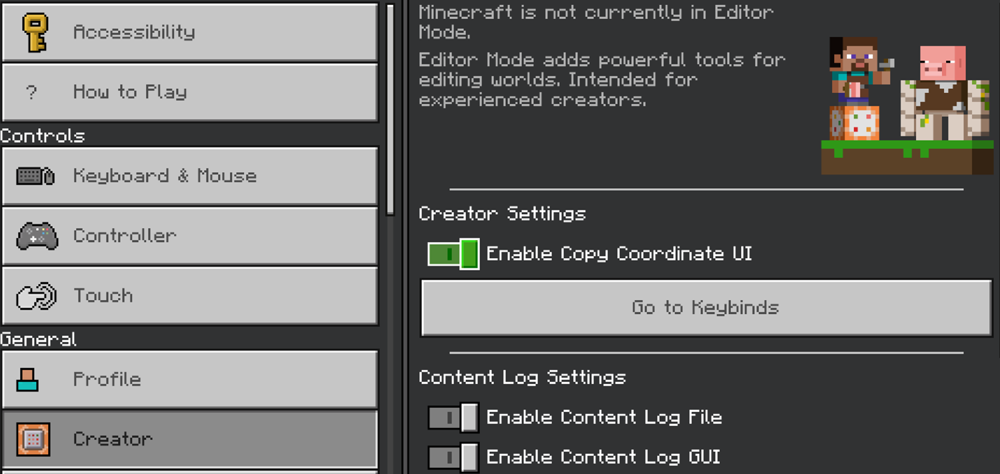
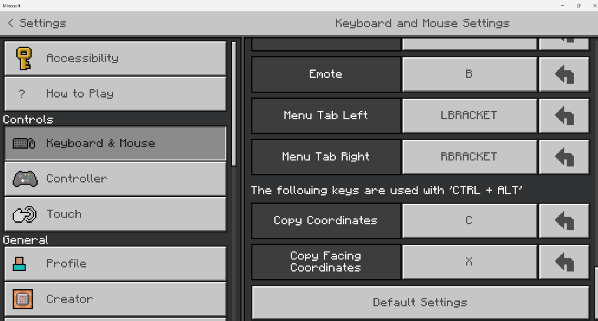
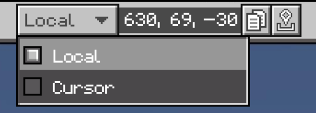
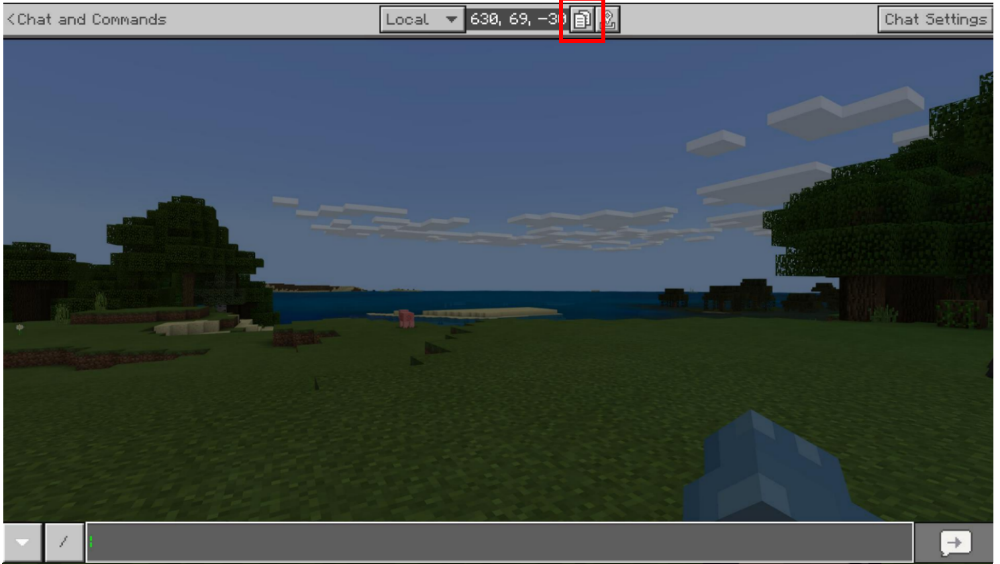
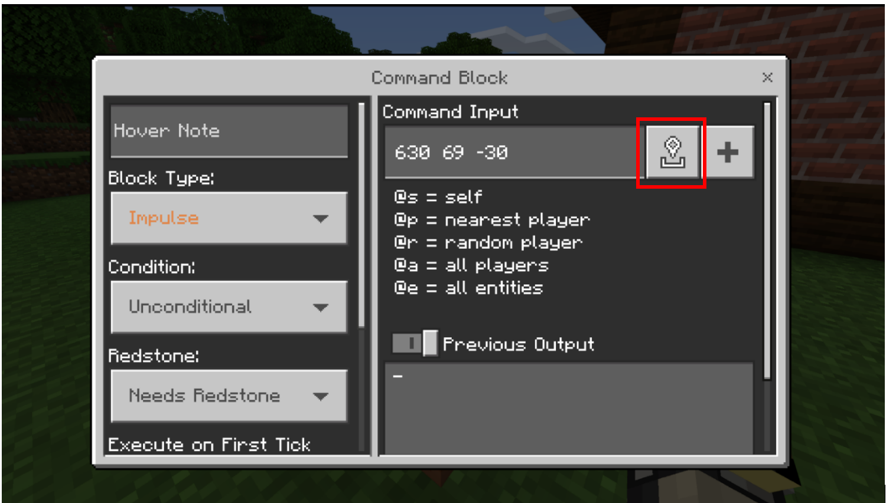

# Introduction to Copying and Pasting Coordinates

Minecraft players and creators frequently share and use coordinates through various areas of gameplay. The ability to capture and paste the players’ relative coordinates on any platform allows for faster content creation, command execution, and communication.

The copy coordinates function focuses on commonly visited screens which often require coordinate information. The chat screen contains the majority of the changes; adding a field, dropdown selector, and copy and paste button for viewing and retrieving relative coordinates. The command block screen has a paste button that allows easy data transfer when creating control scenarios.

> [!div class="checklist"]
>
>- How to enable the copy coordinates functionality
>- How to use the functionality with keyboard shortcuts (and controller actions?)
>- How to target the block where the player is located or the block that the player is focused on

### Requirements

- [Introduction to Commands](CommandsIntroduction.md)
- A Minecraft world

### Enabling the Copy Coordinates Feature

1. Launch Minecraft and go into **Settings**.
1. On the Creator tab, make sure the toggle for **Enable Copy Coordinate UI** is on.

## How to Copy Coordinates

>- **Local** copies the player's location - *Where are my feet?*
>- **Cursor** copies the location of the block selected by the cursor - *What am I looking at?*

### Copying with a keyboard

To copy the local coordinates, press **CTRL + ALT + C**. A dialog will be displayed that reads "Copied current position to clipboard" along with the coordinates.
To copy the cursor coordinates, press **CTRL + ALT + X**. A dialog will be displayed that reads "Copied facing position to clipboard."
If you want to use different keys than C or X, you can change the keybindings on the **Keyboard & Mouse** tab in the Settings.

### Copying with a controller or touchpad

1. Open the chat menu. The Copy Coordinates feature is at the top of the window.
1. Choose **Local** or **Cursor** from the drop-down menu.

3. Press the **copy** button. A pop-up dialog confirms that the coordinates were indeed copied.

## Pasting Coordinates

To paste the coordinates, navigate to the area where you want to put the coordinates, such as a command in the chat window or in a command block. Then, you can either select the paste button or press the ‘Y’ button on a controller.

The coordinates will be pasted in without commas.
On a PC, you can use the usual keyboard shortcut **CTRL+ V** to paste the coordinates into a text document outside of Minecraft.

## What's Next?

Now that you know how to copy coordinates, here are some commands that use them (along with some that don't).

> [!div class="nextstepaction"]
> [Popular Commands](CommandsPopularCommands.md)
