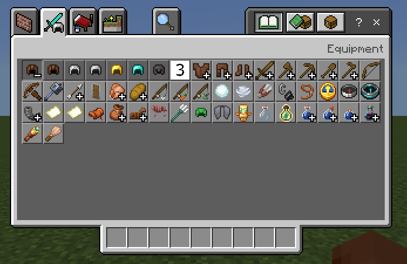

# Crafting Item Catalog - Overview

The crafting item catalog is a file used to define the creative inventory/recipe book. With this, you can define a new collapsible group with an item, add items to an existing group, or simply add the items outside of a group in the order that you determine.

While you get the ability to add new items, you don't get to change the order of existing items. Whether you are adding a new group, an existing group, or as a set of loose items, your additions will be added to the end of the list.

The creative inventory and recipe book both share the same list of items. The creative inventory will show all items, while the recipe book will only show items that are able to be crafted.

This file goes into your behavior pack in the `item_catalog` folder. The file we are reading is called `crafting_item_catalog.json`.

## Categories

You can add new items to the existing categories of `construction`, `nature`, `equipment`, and `items`, but you can't create new categories, or modify the order that the categories show in the UI.

## Adding New Group

If you have a set of new items, you can add them to a new group. This new group will be added to the category you specify at the end of all existing items/groups.

You get a new group if you specify a `group_identifier` field within your group.

## Group Name

The name of the group serves two purposes:

- The first is as an identifier for your group. If there are two groups with the same name within a category, they will merge. 

- The second is that it is the localization string that is display when you hover over your group name. The localization string needs to include the namespace.

### Example 1: item_catalog/crafting_item_catalog.json

This is an example of adding an entirely new group to the construction category

```json
{
  "format_version": "1.21.60",
  "minecraft:crafting_items_catalog": {
    "categories": [
      {
        "category_name": "construction",
        "groups": [
          {
            "group_identifier": {
              "icon": "mynamespace:my_item1",
              "name": "mynamespace:my_group_name"
            },
            "items": [
              "mynamespace:my_item1",
              "mynamespace:my_item2"
            ]
          }
        ]
      }
    ]
  }
}
```

### Localization File

`mynamespace:my_group_name=My Group`

This shows our new group using the item "1". When the user hovers over the group, the localized name is displayed.


This shows our new group expanded and the items inside of it:


## Inserting an Item into an Existing Group

You can also add items to an existing group. You specify this the same way as making a new group, the only difference is that you need to specify a name of an already existing group in a category. When you are inserting into an existing group, like with `minecraft:itemGroup.name.helmet`, your items are added to the end of the group.

At the end of this page, there is the list of all existing groups currently used by Minecraft Bedrock.

### Example 2: item_catalog/crafting_item_catalog.json

```json
{
  "format_version": "1.21.60",
  "minecraft:crafting_items_catalog": {
    "categories": [
      {
        "category_name": "equipment",
        "groups": [
          {
            "group_identifier": {
              "name": "minecraft:itemGroup.name.helmet"
            },
            "items": [
              "mynamespace:my_item3"
            ]
          }
        ]
      }
    ]
  }
}
```



Our new item "3" shows up when expanding the helmet group.

## Adding Loose Items as Loose Groups

You don't need to add your items to a group, you can add them to a loose group. These aren't represented with a collapsible group.

### Example 3: item_catalog/crafting_item_catalog.json

```json
{
  "format_version": "1.21.60",
  "minecraft:crafting_items_catalog": {
    "categories": [
      {
        "category_name": "construction",
        "groups": [
          {
            "items": [
              "mynamespace:my_item4",
              "mynamespace:my_item5",
              "mynamespace:my_item6"
            ]
          }
        ]
      }
    ]
  }
}
```


Items 4, 5, and 6 are all added outside of a group as loose items.

## Multiple Categories and Groups

In all the previous examples we've only done one group and one category at a time. You are able to add multiple groups within a category, as well as add to multiple categories. The order in which groups are added to a category is the order that they will show up in game.

### Example 4: item_catalog/crafting_item_catalog.json

The following is an accumulation of all the above examples.

```json
{
  "format_version": "1.21.60",
  "minecraft:crafting_items_catalog": {
    "categories": [
      {
        "category_name": "construction",
        "groups": [
           {
            "items": [
              "mynamespace:my_item4",
              "mynamespace:my_item5",
              "mynamespace:my_item6"
            ]
          },
          {
            "group_identifier": {
              "icon": "mynamespace:my_item1",
              "name": "mynamespace:my_group_name"
            },
            "items": [
              "mynamespace:my_item1",
              "mynamespace:my_item2"
            ]
          }
        ]
      },
      {
        "category_name": "equipment",
        "groups": [
          {
            "group_identifier": {
              "name": "minecraft:itemGroup.name.helmet"
            },
            "items": [
              "mynamespace:my_item3"
            ]
          }
        ]
      }
    ]
  }
}
```


This shows the new items we added to the Construction tab. The order that we added the loose items and group are what we defined in the file, so the loose items are first and then the group. 

Not pictured is the equipment category and adding to an existing group.

## Defining a Category and Group for Item and Block Definitions

If you do not care about the order for your items and blocks, you can define the category and group in the definition of your items and blocks instead.

If you define a category and/or group for your item/block and you change it with the crafting item catalog feature, you will get a content warning stating that the category and/or group changed. You can leave the category and group blank if you intend to use the crafting item catalog feature to avoid this from happening.

Both the following examples for the item and block will add these to the planks group in construction category.

### Item Example

```json
{
  "format_version": "1.21.60",
  "minecraft:item": {
   "description": {
    "identifier": "mynamespace:my_item1",
    "menu_category": {
      "category": "construction",
      "group": "minecraft:itemGroup.name.planks"
    }
   },
   "components": {
   }
  }
}

```

### Block Example

```json
{
  "format_version": "1.21.60",
  "minecraft:block": {
    "description": {
      "identifier": "mynamespace:my_block",
      "menu_category": {
        "category": "construction",
        "group": "minecraft:itemGroup.name.planks"
      }
    },
    "components": {
    }
  }
}
```

## Item and Block Format Versions Before 1.21.60

For blocks and items if you did not specify `menu_category`, or left the `category` field blank, the category would default to the "Items" category. This means that if you were to add this block or item to a category other than "Items", you will get the warning mentioned above.

### Vanilla Groups

This is a list of all the groups used by Vanilla.

| Group Name |
|:-----------|
| minecraft:itemGroup.name.planks |
| minecraft:itemGroup.name.walls |
| minecraft:itemGroup.name.fence |
| minecraft:itemGroup.name.fenceGate |
| minecraft:itemGroup.name.stairs |
| minecraft:itemGroup.name.door |
| minecraft:itemGroup.name.trapdoor |
| minecraft:itemGroup.name.glass |
| minecraft:itemGroup.name.glassPane |
| minecraft:itemGroup.name.slab |
| minecraft:itemGroup.name.stoneBrick |
| minecraft:itemGroup.name.sandstone |
| minecraft:itemGroup.name.copper |
| minecraft:itemGroup.name.wool |
| minecraft:itemGroup.name.woolCarpet |
| minecraft:itemGroup.name.concretePowder |
| minecraft:itemGroup.name.concrete |
| minecraft:itemGroup.name.stainedClay |
| minecraft:itemGroup.name.glazedTerracotta |
| minecraft:itemGroup.name.ore |
| minecraft:itemGroup.name.stone |
| minecraft:itemGroup.name.log |
| minecraft:itemGroup.name.wood |
| minecraft:itemGroup.name.leaves |
| minecraft:itemGroup.name.sapling |
| minecraft:itemGroup.name.seed |
| minecraft:itemGroup.name.crop |
| minecraft:itemGroup.name.grass |
| minecraft:itemGroup.name.coral_decorations |
| minecraft:itemGroup.name.flower |
| minecraft:itemGroup.name.dye |
| minecraft:itemGroup.name.rawFood |
| minecraft:itemGroup.name.mushroom |
| minecraft:itemGroup.name.monsterStoneEgg |
| minecraft:itemGroup.name.mobEgg |
| minecraft:itemGroup.name.coral |
| minecraft:itemGroup.name.sculk |
| minecraft:itemGroup.name.helmet |
| minecraft:itemGroup.name.chestplate |
| minecraft:itemGroup.name.leggings |
| minecraft:itemGroup.name.boots |
| minecraft:itemGroup.name.sword |
| minecraft:itemGroup.name.axe |
| minecraft:itemGroup.name.pickaxe |
| minecraft:itemGroup.name.shovel |
| minecraft:itemGroup.name.hoe |
| minecraft:itemGroup.name.arrow |
| minecraft:itemGroup.name.cookedFood |
| minecraft:itemGroup.name.miscFood |
| minecraft:itemGroup.name.goatHorn |
| minecraft:itemGroup.name.bundles |
| minecraft:itemGroup.name.horseArmor |
| minecraft:itemGroup.name.potion |
| minecraft:itemGroup.name.splashPotion |
| minecraft:itemGroup.name.lingeringPotion |
| minecraft:itemGroup.name.ominousBottle |
| minecraft:itemGroup.name.bed |
| minecraft:itemGroup.name.candles |
| minecraft:itemGroup.name.anvil |
| minecraft:itemGroup.name.chest |
| minecraft:itemGroup.name.shulkerBox |
| minecraft:itemGroup.name.record |
| minecraft:itemGroup.name.sign |
| minecraft:itemGroup.name.hanging_sign |
| minecraft:itemGroup.name.skull |
| minecraft:itemGroup.name.boat |
| minecraft:itemGroup.name.chestboat |
| minecraft:itemGroup.name.rail |
| minecraft:itemGroup.name.minecart |
| minecraft:itemGroup.name.buttons |
| minecraft:itemGroup.name.pressurePlate |
| minecraft:itemGroup.name.banner_pattern |
| minecraft:itemGroup.name.potterySherds |
| minecraft:itemGroup.name.smithing_templates |
