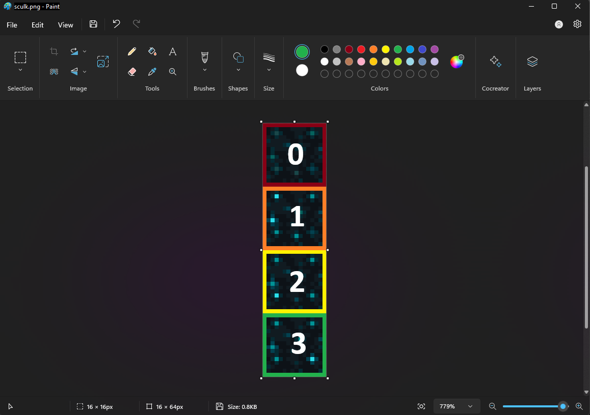
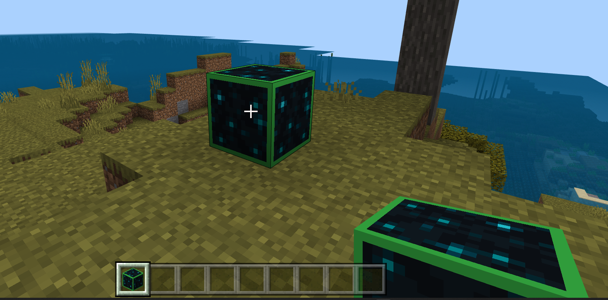
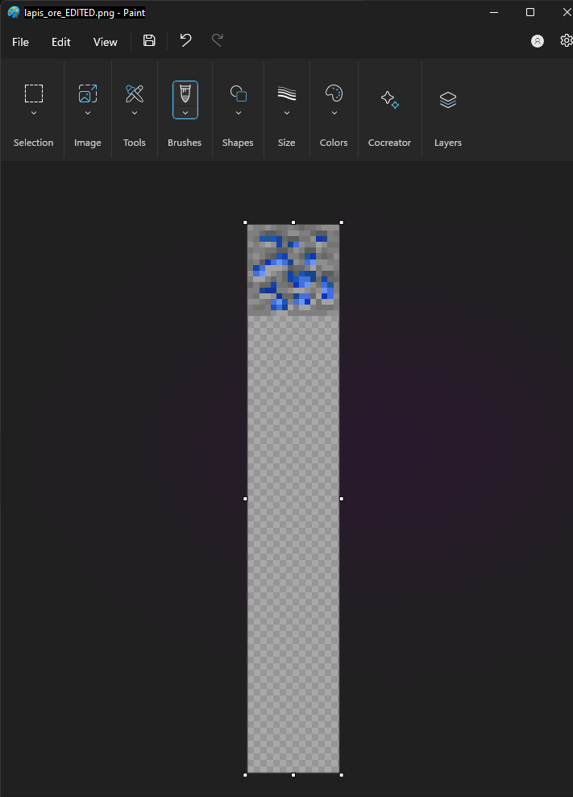
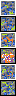
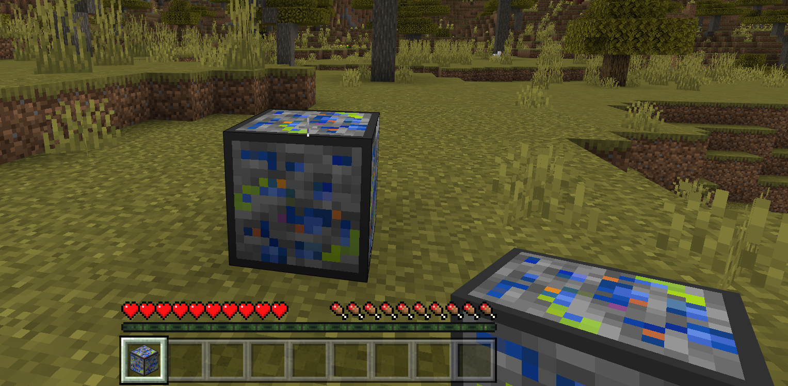
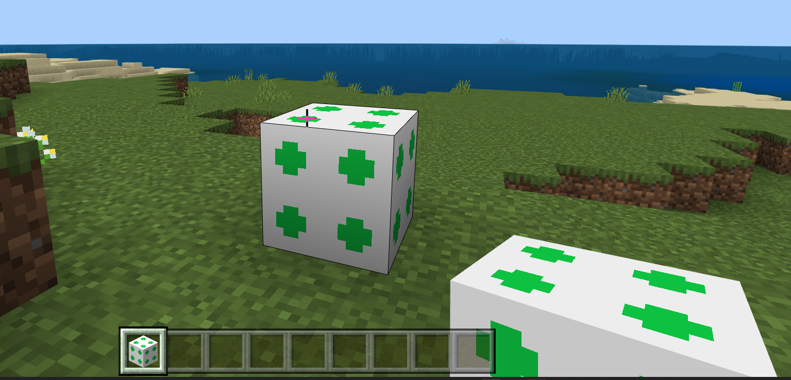
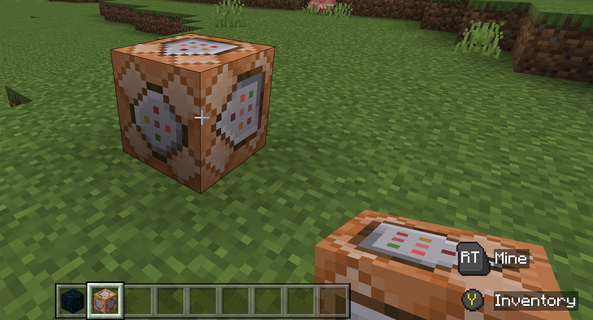
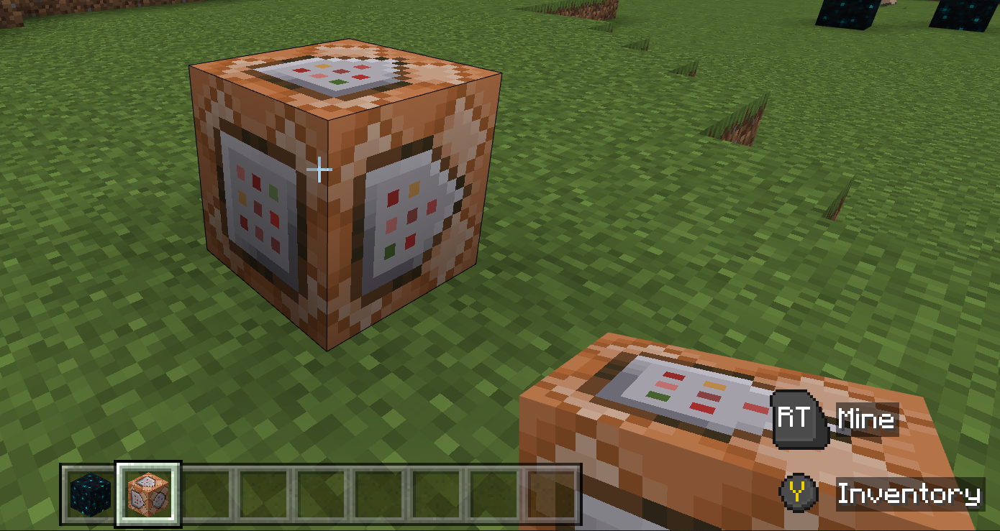
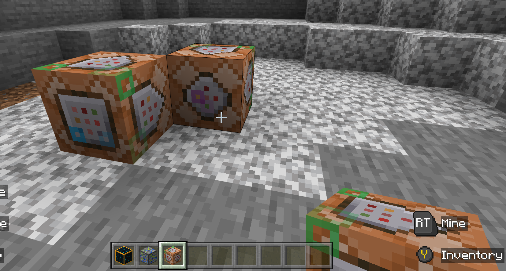

# Create an Animated Block Texture

In this tutorial, you will learn how to create custom block texture animations using a resource pack. You do not need any third-party animation applications.

Flipbook animation is an illusion made by displaying multiple graphics one at a time in the same spot so that the viewer percieves motion. It's called a "flipbook" because animators can get a thick book of drawing paper and make little drawings in the corner and then hold the book just right to make the pages flip by so quickly that it looks like their drawings are moving.

Each page's graphic is called a "frame" and the illusion can be affected by how quickly each frame is replaced by the next one, and whether the changes between each frame are blended together to create a smoother appearance.

One difference between Minecraft flipbook animation and paper flipbook animation is that rather than using individual pages/graphic files for each frame, Minecraft animation frames are stored as one long strip. Each frame is a 16 by 16-pixel square and the animation code inside the Minecraft game assigns each square a number and then displays each one starting at the top with frame 0.



By default, each of the six faces of a Minecraft block show the same frame of animation at the same time. The process to put a different animation on different faces of the block will be covered later.

### Prerequisites

The following actions are recommended before beginning this tutorial:

- Create a resource pack using [the Creating a Resource Pack tutorial](ResourcePack.md), or download the [sample pack collection](https://github.com/microsoft/minecraft-samples/tree/main/resource_pack_sample) and keep it handy on your computer.
- Download and expand the latest [Vanilla Minecraft packs](https://aka.ms/resourcepacktemplate). The code and graphics needed for these tutorials will be provided along the way, but it's a good idea to have the sample pack as a reference.

## A Flipbook Animation Resource Pack

This is the basic structure and content for the animation pack we are creating:

- resource_pack
    - textures
        - blocks
          - **`<block_name>`.png**
    - **flipbook_texture.json**
  - manifest.json

1. Open the resource pack from the [Vanilla Minecraft sample packs](https://aka.ms/resourcepacktemplate).

2. Open the **textures** folder, then open the **blocks** folder. This is where the **.png** graphics files for blocks live.

3. Open the **flipbook_textures.json** file and take a look at the contents. There is a large list of different flipbook textures. Notice how different textures have different properties.

Here are some examples:

**sculk**

```json
  {
    "flipbook_texture": "textures/blocks/sculk",
    "atlas_tile": "sculk",
    "ticks_per_frame": 20
  }
```

**bubble column**

```json
 {
    "flipbook_texture": "textures/blocks/bubble_column_inner_b",
    "atlas_index": 1,
    "atlas_tile_variant": 1,
    "atlas_tile": "bubble_column_mid",
    "ticks_per_frame": 1,
    "frames": [ 31, 30, 29, 28, 27, 26, 25, 24, 23, 22, 21, 20, 19, 18, 17, 16, 15, 14, 13, 12, 11, 10, 9, 8, 7, 6, 5, 4, 3, 2, 1, 0 ],
    "blend_frames": false
  }
```

**respawn anchor top**

```json
{
    "flipbook_texture": "textures/blocks/respawn_anchor_top",
    "atlas_tile": "respawn_anchor_top",
    "atlas_index": 2,
    "atlas_tile_variant": 2,
    "frames": [ 0, 1, 2, 3, 4, 5, 6, 7, 8, 9, 10, 11, 12, 13, 14, 15, 16, 17, 18, 19, 20, 21, 22, 23, 24, 25, 26, 27, 28, 29, 30, 31 ]
  }
```

**Flipbook Texture Properties**

|Name |Description  |
|:----------|:----------|
| flipbook_texture | Path to the graphic file for one or more faces of a block|
| atlas_index | Index of the first frame to display when beginning the animation. If a problem occurrs, then only this frame will be displayed.|
| atlas_tile | Name of the graphic that will be shown on the block if there is a problem with the animation. |
| atlas_tile_variant | An alternate graphic to display as the atlas tile. |
| ticks_per_frame | How many ticks (1/20th of one second) of game time should pass before the next frame is displayed.|
| frames | An array of frame numbers, used to show what order to display the frames. |

## Prepare an Animation Resource Pack

1. Start with the finished "green dirt block" resource pack that you can either [create with the resource pack tutorial](ResourcePack.md) or download from [minecraft pack samples](https://github.com/microsoft/minecraft-samples).

2. Rename the pack's folder **animation_resource_pack**.

3. Make sure there are new UUIDs in the **manifest.json** file.

4. (Optional) Change the name and descriptions to reflect the pack's use for animation.

Okay. Now we're ready to animate!

## Edit an Already Animated Block

To get familiar with how block textures are animated, we are going to start with one that is already animated, make some changes to it, and then observe the changes.

1. Inside the **animation_resource_pack**, open the **textures** folder.

2. Add a text file and name it **flipbook_textures.json**.

3. Add this content, then save and close the file.

```json
[
  {
    "flipbook_texture": "textures/blocks/sculk",
    "atlas_tile": "sculk",
    "frames": [ 0, 1, 2, 3],
    "ticks_per_frame": 20
  }
]
```

4. Open the **blocks** folder.

5. Download this **sculk.png** file and place it in the **blocks** folder of your **animation_resource_pack**.


6. Open **sculk.png** in a graphics program like Paint.net.

7. Edit each frame of the sculk graphic so it looks a little different.

Here is an already edited graphic file, if you would prefer to use it to replace the original one.


When you put it in your resrouce pack, you will need to rename it from **sculk_EDITED.png** to **sculk.png**.

8. After you have the edited **sculk.png** file in place, deploy the resource pack to Minecraft and place a sculk block. It should look something like this:



Now that we have a better idea how flipbook animated textures work on an already animated block, let's see if we can animated a block that is NOT already animated.

## Add Animation to a Non-Animated Block: Lapis Lazuli Ore

Let's build on the existing animation pack by replacing the contents of your animation resource pack's **flipbook_textures.json** file with this:

```json
[
  {
    "flipbook_texture": "textures/blocks/sculk",
    "atlas_tile": "sculk",
    "frames": [ 0, 1, 2, 3],
    "ticks_per_frame": 20
  },
  {
    "flipbook_texture": "textures/blocks/lapis_ore",
    "atlas_tile": "lapis_ore",
    "frames": [ 0, 1, 2, 3, 4, 5],
    "ticks_per_frame": 10
  }
]
```

In the **lapis ore** section, the **`"frames": [ 0, 1, 2, 3, 4, 5]`** line of the code says that we will be adding 5 frames to the existing lapis_ore.png file. 

The **`"ticks_per_frame": 10`** line means that the lapis animation will have a faster frame rate than the one for sculk.

The original Vanilla lapis ore texture file, **lapis_ore.png**, looks like this:


The original file is 16- by 16-pixels. If we want to have a 6-frame animation like it says in the flipbook_textures.json file code (and we do), we need to open the graphic file and change the canvas size to be 96 pixels tall. 

Like this:



Now that the canvas can accommodate a total of 6 frames, add 5 more frames worth of graphics to the file. Here is one way to do it:



Put the edited graphic file in the **textures/blocks** folder of your animation pack, make sure the name is changed from **`lapis_ore_EDITED.png`** to **`lapis_ore.png`**, and you're ready to go take a look at your aninmated block in Minecraft.



## Custom Die Block - Animated

After completing the [Advanced Custom Blocks tutorial](AdvancedCustomBlocks.md) you will have a red block in your hotbar and hand that, when placed, looks like a die block.

In this next example, we are going to animate the block in the player's hand to scroll through the pattern of dots.

Due to how textures are mapped onto blocks in the hotbar, all three visible sides of the die block will have the same pattern as the numbers shift from one through six.

You can download the completed sample [Custom Die block resource pack and behavior pack](https://github.com/microsoft/minecraft-samples/tree/main/custom_blocks). You will need both the behavior pack and the resource pack for it to work.

Navigate to **resource pack** > **textures**, add a **flipbook_texture.json** file, and insert this code:

```json
[
  {
    "flipbook_texture": "textures/blocks/die_red",
    "atlas_tile": "die_red",
    "frames": [ 0, 1, 2, 3, 4, 5 ],
    "ticks_per_frame": 20,
    "blend_frames": false
  }
]
```

Then, replace the **`die_red.png`** graphic in the textures/blocks folder with this one:


In a creative world with the behavior pack and resource pack activated, give yourself a **demo:die** and notice that the red block is now animated.



## A Multi-faceted Animation: the Command Block

For the purpose of this discussion, we are talking only about the basic "Vanilla" command black, not the ones with **conditional** or **chain** or **mipmap** in their names. They are all animated the same way. I'm mentioning this so that if you go digging for the code in the **flipbook_textures.json** file or for the graphics in the blocks folder of the Vanilla sample pack, you'll know to look for the ones whose names match the names on the `"flipbook_texture":` line of the code.

If you take a really close look at a command block, you'll notice that the front, back, and sides of the block have different shapes with animated blinking dots on them.

The front of the block has the circle shape and the four sides have an arrow shape::


The back of the block has the square shape:


The frames are mapped onto the command block with this code:

```json
{
  "flipbook_texture": "textures/blocks/command_block_front",
  "atlas_tile": "command_block_front",
  "ticks_per_frame": 10
},
{
  "flipbook_texture": "textures/blocks/command_block_back",
  "atlas_tile": "command_block_back",
  "ticks_per_frame": 10
},
{
  "flipbook_texture": "textures/blocks/command_block_side",
  "atlas_tile": "command_block_side",
  "ticks_per_frame": 10
}
```

Here are some edited command block texture graphics.

**command_block_front**


**command_block_back**


**command_block_side**


This is the final result:



## Next Steps

Now that you know how to animate block textures, take a look at this page about [Add-on Pack Contents](ComprehensivePackContents.md) to see what else you could do to customize your own Minecraft world.
