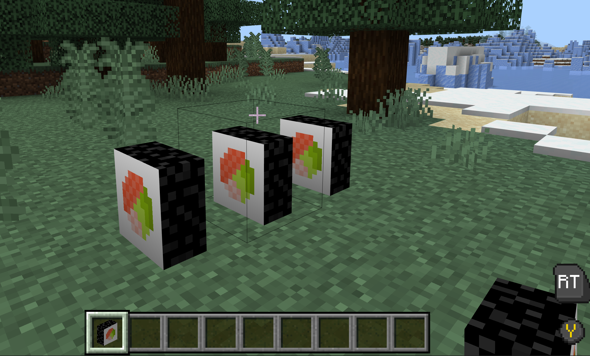

# Advanced Block Visuals: Sizing and Culling

Custom blocks are not constrained to the usual 16x16x16 Minecraft block geometry. Not only can they be larger than 16x16x16 pixels, but since release `1.20.60`, you can use a feature called "culling" to dynamically remove parts of the block when it is placed near blocks that occlude one of the sides.

First, we will cover how to create an over-sized block, then we will use one of the examples from another custom block tuorial (the [Sushi Block](AdvancedCustomBlocks.md) one) to demonstrate culling.

## Prerequisites

It's recommended that the following be completed before beginning this tutorial:

- [Custom Blocks Part One: The Simplest Block](AddCustomDieBlock.md)
- [Custom Blocks Part Two: Geometry and Material Instances](AdvancedCustomBlocks.md)
- [Custom Blocks Part Three: Render and Lighting Options](CustomBlockRenderLighting.md)

:::image type="content" source="Media/CustomOversized/Picture1.png" alt-text="An image showing two bubble blocks containing fish and covered by an umbrella.":::

> [!VIDEO https://www.youtube.com/embed/k9quttGIOJw]
*These blocks can get tricky, but this video takes you through the whole process!*

### Resource Pack

## Create geometry in Blockbench

:::image type="content" source="Media/CustomOversized/Picture2.png" alt-text="An image showing a 30x30x30 pixel block construction.":::

Let's create a 30x30x30 pixel block in Blockbench. First, we have to cover some of the limitations when it comes to creating oversized custom blocks.

## Custom block limitations

1. Your block is limited to 30x30x30 pixels in size.

1. The absolute bounds of the position of your 30x30x30 block are 30 pixels in each direction from the origin. The origin is in the middle at the bottom of the base 16x16x16 block. So the absolute bounds give you 30 pixels in the +x direction, 30 pixels in the –x direction, 30 pixels in the +y direction, 30 pixels in the –y direction, 30 pixels in the +z direction, and 30 pixels in the –z direction. Your block can be placed in any position within these bounds, as long as it adheres to rule #3.

1. At least 1 pixel of your block on each axis must be contained by the base 16x16x16 block.

Here is a visualization of the absolute bounds your block must be contained in, in relation to the base 16x16x16 block:

:::image type="content" source="Media/CustomOversized/Picture3.png" alt-text="The maximum bounds of an oversized block and the correlating base block are displayed.":::

Below you can see some examples of VALID 30x30x30 custom blocks that are contained in the absolute bounds, and have at least ONE CUBE contained in the 16x16x16 base block:

:::image type="content" source="Media/CustomOversized/Picture4.png" alt-text="1 of 2 valid oversized blocks are shown.":::

:::image type="content" source="Media/CustomOversized/Picture5.png" alt-text="2 of 2 valid oversized blocks are shown.":::

Next, we have an example of a 30x30x30 custom block that is contained in the absolute bounds, but is INVALID since no part of it is contained in the base 16x16x16 block:

:::image type="content" source="Media/CustomOversized/Picture6.png" alt-text="An invalid oversized block is displayed.":::

## Implement the Rest of the Giant Umbrella Block

For this last tutorial, you're on your own setting up the rest of the Giant Umbrella block. Remember, you've got this! Here are the steps you've followed each time you've made a custom block:

### Resource Pack Steps

- Export the file in Blockbench
- Add geometry to Resource Packs

```json
{ 
  "format_version": "1.12.0", 
  "minecraft:geometry": [ 
    { 
      "description": { 
        "identifier": "geometry.umbrella", 
        "texture_width": 128, 
        "texture_height": 128, 
        "visible_bounds_width": 3, 
        "visible_bounds_height": 3.5, 
        "visible_bounds_offset": [0, 1.25, 0] 
      }, 
      "bones": [ 
        { 
          "name": "umbrella", 
          "pivot": [0, 13, 0], 
          "cubes": [ 
            {"origin": [-3, 28, -5], "size": [6, 1, 2], "uv": [0, 3]}, 
            {"origin": [-5, 27, -7], "size": [10, 1, 2], "uv": [66, 53]}, 
            {"origin": [-5, 27, 5], "size": [10, 1, 2], "uv": [66, 37]}, 
            {"origin": [5, 27, -5], "size": [2, 1, 10], "uv": [66, 42]}, 
            {"origin": [-7, 27, -5], "size": [2, 1, 10], "uv": [36, 64]}, 
            {"origin": [-9, 26, -7], "size": [2, 1, 14], "uv": [18, 64]}, 
            {"origin": [7, 26, -7], "size": [2, 1, 14], "uv": [0, 63]}, 
            {"origin": [9, 25, -9], "size": [2, 1, 18], "uv": [46, 62]}, 
            {"origin": [11, 24, -10], "size": [1, 1, 20], "uv": [44, 21]}, 
            {"origin": [12, 23, -10], "size": [1, 1, 20], "uv": [0, 42]}, 
            {"origin": [13, 22, -10], "size": [1, 1, 20], "uv": [22, 1]}, 
            {"origin": [14, 21, -10], "size": [1, 1, 20], "uv": [0, 21]}, 
            {"origin": [-12, 24, -10], "size": [1, 1, 20], "uv": [44, 0]}, 
            {"origin": [-13, 23, -10], "size": [1, 1, 20], "uv": [22, 43]}, 
            {"origin": [-14, 22, -10], "size": [1, 1, 20], "uv": [22, 22]}, 
            {"origin": [-15, 21, -10], "size": [1, 1, 20], "uv": [0, 0]}, 
            {"origin": [-11, 25, -9], "size": [2, 1, 18], "uv": [44, 43]}, 
            {"origin": [-9, 25, 9], "size": [18, 1, 2], "uv": [66, 21]}, 
            {"origin": [-9, 25, -11], "size": [18, 1, 2], "uv": [66, 16]}, 
            {"origin": [-10, 24, -12], "size": [20, 1, 1], "uv": [66, 14]}, 
            {"origin": [-10, 23, -13], "size": [20, 1, 1], "uv": [66, 10]}, 
            {"origin": [-10, 22, -14], "size": [20, 1, 1], "uv": [66, 6]}, 
            {"origin": [-10, 21, -15], "size": [20, 1, 1], "uv": [66, 2]}, 
            {"origin": [-10, 23, 12], "size": [20, 1, 1], "uv": [66, 8]}, 
            {"origin": [-10, 22, 13], "size": [20, 1, 1], "uv": [66, 4]}, 
            {"origin": [-10, 21, 14], "size": [20, 1, 1], "uv": [66, 0]}, 
            {"origin": [-10, 24, 11], "size": [20, 1, 1], "uv": [66, 12]}, 
            {"origin": [-7, 26, 7], "size": [14, 1, 2], "uv": [66, 34]}, 
            {"origin": [-7, 26, -9], "size": [14, 1, 2], "uv": [66, 31]}, 
            {"origin": [-7, 26, -7], "size": [2, 1, 2], "uv": [6, 16]}, 
            {"origin": [-9, 25, -9], "size": [2, 1, 2], "uv": [12, 12]}, 
            {"origin": [-9, 25, 7], "size": [2, 1, 2], "uv": [12, 9]}, 
            {"origin": [7, 25, 7], "size": [2, 1, 2], "uv": [12, 6]}, 
            {"origin": [9, 24, 9], "size": [2, 1, 2], "uv": [6, 10]}, 
            {"origin": [9, 24, -11], "size": [2, 1, 2], "uv": [0, 9]}, 
            {"origin": [10, 23, -12], "size": [1, 1, 1], "uv": [25, 27]}, 
            {"origin": [10, 22, -13], "size": [1, 1, 1], "uv": [25, 9]}, 
            {"origin": [10, 21, -14], "size": [1, 1, 1], "uv": [0, 24]}, 
            {"origin": [11, 21, -13], "size": [1, 1, 1], "uv": [15, 23]}, 
            {"origin": [12, 21, -12], "size": [1, 1, 1], "uv": [22, 22]}, 
            {"origin": [13, 21, -11], "size": [1, 1, 1], "uv": [22, 18]}, 
            {"origin": [11, 22, -12], "size": [1, 1, 1], "uv": [25, 7]}, 
            {"origin": [12, 22, -11], "size": [1, 1, 1], "uv": [22, 24]}, 
            {"origin": [11, 23, -11], "size": [1, 1, 1], "uv": [15, 27]}, 
            {"origin": [11, 23, 10], "size": [1, 1, 1], "uv": [22, 26]}, 
            {"origin": [12, 22, 10], "size": [1, 1, 1], "uv": [12, 24]}, 
            {"origin": [13, 21, 10], "size": [1, 1, 1], "uv": [22, 16]}, 
            {"origin": [12, 21, 11], "size": [1, 1, 1], "uv": [22, 14]}, 
            {"origin": [11, 21, 12], "size": [1, 1, 1], "uv": [22, 12]}, 
            {"origin": [10, 21, 13], "size": [1, 1, 1], "uv": [22, 10]}, 
            {"origin": [11, 22, 11], "size": [1, 1, 1], "uv": [8, 24]}, 
            {"origin": [10, 22, 12], "size": [1, 1, 1], "uv": [4, 24]}, 
            {"origin": [10, 23, 11], "size": [1, 1, 1], "uv": [12, 26]}, 
            {"origin": [-11, 23, 11], "size": [1, 1, 1], "uv": [8, 26]}, 
            {"origin": [-11, 22, 12], "size": [1, 1, 1], "uv": [25, 23]}, 
            {"origin": [-11, 21, 13], "size": [1, 1, 1], "uv": [22, 8]}, 
            {"origin": [-12, 21, 12], "size": [1, 1, 1], "uv": [22, 6]}, 
            {"origin": [-13, 21, 11], "size": [1, 1, 1], "uv": [14, 21]}, 
            {"origin": [-14, 21, 10], "size": [1, 1, 1], "uv": [6, 21]}, 
            {"origin": [-12, 22, 11], "size": [1, 1, 1], "uv": [25, 17]}, 
            {"origin": [-13, 22, 10], "size": [1, 1, 1], "uv": [25, 15]}, 
            {"origin": [-12, 23, 10], "size": [1, 1, 1], "uv": [4, 26]}, 
            {"origin": [-12, 23, -11], "size": [1, 1, 1], "uv": [0, 26]}, 
            {"origin": [-13, 22, -11], "size": [1, 1, 1], "uv": [15, 25]}, 
            {"origin": [-14, 21, -11], "size": [1, 1, 1], "uv": [13, 18]}, 
            {"origin": [-13, 21, -12], "size": [1, 1, 1], "uv": [0, 18]}, 
            {"origin": [-12, 21, -13], "size": [1, 1, 1], "uv": [14, 3]}, 
            {"origin": [-11, 21, -14], "size": [1, 1, 1], "uv": [14, 0]}, 
            {"origin": [-12, 22, -12], "size": [1, 1, 1], "uv": [25, 13]}, 
            {"origin": [-11, 22, -13], "size": [1, 1, 1], "uv": [25, 11]}, 
            {"origin": [-11, 23, -12], "size": [1, 1, 1], "uv": [25, 25]}, 
            {"origin": [-11, 24, -11], "size": [2, 1, 2], "uv": [6, 7]}, 
            {"origin": [-11, 24, 9], "size": [2, 1, 2], "uv": [0, 6]}, 
            {"origin": [7, 25, -9], "size": [2, 1, 2], "uv": [0, 12]}, 
            {"origin": [-7, 26, 5], "size": [2, 1, 2], "uv": [12, 15]}, 
            {"origin": [5, 26, 5], "size": [2, 1, 2], "uv": [0, 15]}, 
            {"origin": [5, 26, -7], "size": [2, 1, 2], "uv": [6, 13]}, 
            {"origin": [-5, 27, 3], "size": [2, 1, 2], "uv": [22, 3]}, 
            {"origin": [-5, 27, -5], "size": [2, 1, 2], "uv": [22, 0]}, 
            {"origin": [3, 27, -5], "size": [2, 1, 2], "uv": [8, 21]}, 
            {"origin": [3, 27, 3], "size": [2, 1, 2], "uv": [0, 21]}, 
            {"origin": [-3, 28, 3], "size": [6, 1, 2], "uv": [0, 0]}, 
            {"origin": [-5, 28, -3], "size": [10, 1, 6], "uv": [66, 24]}, 
            {"origin": [-1, 0, -1], "size": [2, 30, 2], "uv": [0, 78]} 
          ]
        }
      ]
    } 
  ]
} 
```

- Add textures for blocks

:::image type="content" source="Media/CustomOversized/Picture7.png" alt-text="Image shows the texture image for the Giant Umbrella block.":::

- Remember to add a friendly name for the texture in the terrain texture file, add a display name for the block in `en_US.lang`, and optionally add an entry for the block in `blocks.json` if you want to give the block a sound.

### Behavior Pack Step

Create `umbrella.json` and fill it in using your knowledge from the previous tutorials. If you get lost, that's totally normal. Here are some troubleshooting tips:

- Refer back to the custom sushi block - the steps are the same!
- Check back on your previous blocks
    - Did you forget a file?
    - Did you copy a file without updating a name?
- Double-check your work in minecraft-samples.

Next up, testing!

## Test the Block

With the giant umbrella block defined in both the behavior pack and resource pack, you can now test it in-game.

1. Open the chat dialogue box (press 'T' or 'Enter' on Windows 10 OS).

1. Type the following command: `/give @p demo:giantumbrella`

Now start dropping those beautiful 'brellas!

:::image type="content" source="Media/CustomOversized/Picture8.png" alt-text="A screenshot of multiple beach chairs and giant umbrellas in Minecraft: Bedrock Edition.":::

![Note] With blocks larger than the 16x16x16 pixel base cube, the parts of the block that are outside of that 16x16x16 range will overlap with other blocks. Be aware of this when creating oversized blocks to assure you are achieving your desired look, especially if your oversized blocks will be placed near other blocks.

## Custom Block Sample Packs

Here is a link to the already-completed [custom block sample packs](https://github.com/microsoft/minecraft-samples).

## Culling

You can make your custom blocks behave like some vanilla blocks do when several of them are placed together by removing unseen, overlapping block faces with "culling."

Culling the unseen, overlapping faces of your blocks can increase performance and decrease instances of graphical glitches.

To use culling, you will need to add a few things to both the behavior pack and the resource pack.

To try this out with the "tuna roll" custom sushi block, add these directories and files to the packs:

**Custom Block Behavior Pack**

Inside the **blocks** folder, open the **tuna_roll.json** file and add "identifier" and "culling" to the `minecraft:geometry:` section:

```json
"components": {
  "minecraft:geometry": {
    "identifier": "geometry.sushi",
    "culling": "test:sushi_cull"
  },
}
```

Here is the whole **tuna_roll.json** file:

```json
{
  "format_version": "1.20.60",
  "minecraft:block_culling_rules": {
    "description": {
      "identifier": "test:sushi_cull"
    },
    "rules": [
      {
        "geometry_part": {
          "bone": "bb_main",
          "cube": 0,
          "face": "north"
        },
        "direction": "north"
      },
      {
        "geometry_part": {
          "bone": "bb_main",
          "cube": 0,
          "face": "south"
        },
        "direction": "south"
      }
    ]
  }
}
```

**Custom Block Resource Pack**

1. On the main level of the resource pack, add a directory called: **block_culling**.

1. Create a file in there and name it **sushi_cull.json**, then add these contents:

```json
{
"format_version": "1.20.60",
"minecraft:block_culling_rules": {
    "description": {
        "identifier": "test:sushi_cull"
    },
    "rules": [
        {
         "geometry_part": { "bone": "bb_main", "cube": 0, "face": "north" },
         "direction": "north"
        },
        {
         "geometry_part": { "bone": "bb_main", "cube": 0, "face": "south" },
         "direction": "south"
        }
    ]
  }
}
```

3. Save the file, and test the culled block.

If you place three culled sushi blocks, they have enough space around them and there is no culling. They will look like normal.



If you swap out the center sushi block for a full-sized block like these acacia planks, only the outer seaweed ring is left!


## Next Steps

Your next step is to take this knowledge and go have some fun! We've learned so much about custom blocks during these tutorials, and we can't wait to see what you come up with using these tools and tips.
