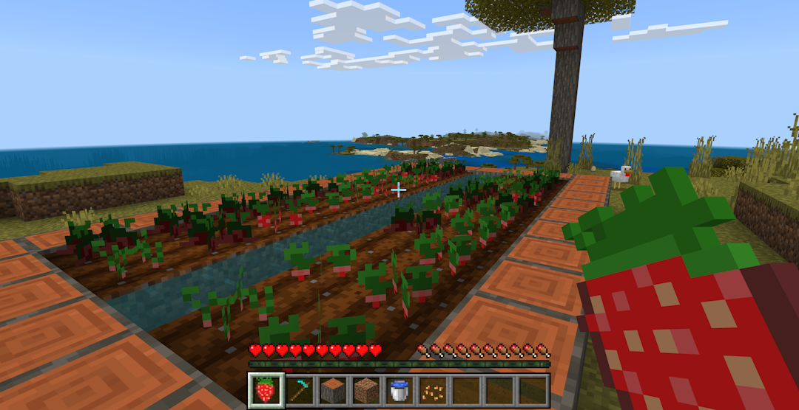

# Building with Custom Components

## Create an Add-On with Custom Components

> [!NOTE]
> The custom components feature is currently in preview and is available via beta APIs, but is targeted to be included with "stable APIs" in a future release of Minecraft - potentially 1.21.10. We recommend you use the latest version of Minecraft Preview as you try out this sample.

Custom blocks and items use various components, declared in their definitions, to augment the behavior of the block or item.

Until now, all components have been built-in to Minecraft, with various parameters used to control the component's behavior. With [custom components](./CustomComponents.md), now in preview and more broadly available in an upcoming version of Minecraft, you can define your own behavior for blocks and items when combined with scripting! In this tutorial we will make a small block and item example using custom components and scripting by adding a new strawberry crop and strawberry item. The strawberry plants will have the behavior that, if they are not picked when they are ripe, can go bad. You'll have to time it just right to get fresh strawberries, and in this sample, you'll see the block components that manage crop growth rates in addition to custom item effects.



You can find the source of this example on the [github.com/microsoft/minecraft-scripting-samples](https://github.com/microsoft/minecraft-scripting-samples/tree/main/custom-components).

### Prerequisites

Before you begin, you should have gone through the Getting Started with Add-Ons tutorial, the Introduction to Behavior Packs tutorial, and the Introduction to Scripting tutorial.

* [Getting Started with Add-On Development](./GettingStarted.md)
* [Introduction to Behavior Packs](./BehaviorPack.md)
* [Introduction to Scripting](./ScriptingIntroduction.md)

You'll want to be comfortable with how add-on folders are structured, what required files the behavior pack should contain, and how to use scripting with your behavior pack.

Some other good resources to know are how to make blocks and items in your add-on:

* [Creating a Custom Die Block](./AddCustomDieBlock.md)

## Item Custom Components

The strawberry item will utilize custom components to give the player that eats it night vision. First lets make the strawberry item itself.  

```json
{
  "format_version": "1.21.10",
  "minecraft:item": {
    "description": {
      "menu_category": {
        "group": "itemGroup.name.crop",
        "category": "nature"
      },
      "identifier": "example:strawberry"
    },
    "components": {
      "minecraft:icon": "strawberry",
      "minecraft:max_stack_size": 64,
      "minecraft:use_modifiers": {
        "use_duration": 1.6,
        "movement_modifier": 0.35
      },
      "minecraft:food": {
        "can_always_eat": true,
        "nutrition": 1,
        "saturation_modifier": 0.5
      },
      "minecraft:use_animation": "eat",
    }
  }
}
```

### Adding Custom Components to Items

To add custom components to an item, add a `minecraft:custom_components` component to the item which has an array of strings.

Within this array, the strings are the name of the component that you are adding. When an event occurs, the components will run some script, and this will run in the order defined in your JSON. This means that one item can run the same components in a different order than another item. For our strawberry, we will need only 1 component, but for your own items you can add more custom components to the array.  

```json
"minecraft:custom_components": [
    "example:add_night_vision_on_consume"
]
```

The name you choose for your custom component requires a namespace before it. In the code above, the namespace is `example` and the component name is `add_night_vision_on_consume`.

### Registering Item Custom Components in Script

Now that our item has been configured to have a custom component, we need to register the behavior for the component in script. The behavior we want is that when you eat the strawberry, the player receives night vision for some time. First, we register our component using the same name  we defined in the JSON component to the `ItemComponentRegistry` and provide a list of events that this component is listening for. In this case we are going to listen to the `onConsume` event for item custom components which will run our code when the item is consumed by a player. We can then add the night vision effect to the player and our custom component is now ready to be used.

```typescript
import { ItemComponentConsumeEvent, world } from "@minecraft/server";

world.beforeEvents.worldInitialize.subscribe(initEvent => {
  initEvent.itemComponentRegistry.registerCustomComponent('example:add_night_vision_on_consume', {
    onConsume(arg: ItemComponentConsumeEvent) {
      arg.source.addEffect('minecraft:night_vision', 600);
    }
  });
});
```

Notice that the component code and name do not reference the strawberry item itself. You can reuse components on multiple items that have similar behavior.

> [!NOTE]
> As of this writing, custom components are still in preview. For this reason you will want to use a -beta scripting module in the dependencies
> section of your behavior pack manifest.json.

```JSON
  "dependencies": [
    {
      "module_name": "@minecraft/server",
      "version": "1.13.0-beta"
    }
  ]
```

## Block Custom Components

Block custom components work very similarly to item custom components. First we need our block definition:

```json
{
  "format_version": "1.21.10",
  "minecraft:block": {
    "description": {
      "identifier": "example:strawberry_crop",
      "states": {
        "starter:crop_age": [ 0, 1, 2, 3, 4 ]
      }
    },
    "permutations": [
      {
        "condition": "query.block_state('starter:crop_age') == 4",
        "components": {
          "minecraft:loot": "loot_tables/strawberry_grown_crop.json"
        }
      }
    ],
    "components": {
      "minecraft:geometry": "geometry.starter_crop_geo",
      "minecraft:loot": "loot_tables/strawberry_seed.json",
      "minecraft:collision_box": false,
      "minecraft:placement_filter": {
        "conditions": [
          {
            "allowed_faces": ["up"],
            "block_filter": ["minecraft:farmland"]
          }
        ]
      },
      "tag:minecraft:crop": {}
    }
  }
}
```

### Adding Custom Components to Blocks

Similar to item custom components, we use the `minecraft:custom_components` component in the block JSON to define what custom components this block has. In this case we are going to add 2 different components definitions: one in the base of the block and one within the permutation. When both a block permutation and base block use the `minecraft:custom_components` component, only the components listed in the permutation will have their script code run. This allows you to reorder, remove, or add new custom components to specific permutations of a block. Since the first 4 permutations (age 0-3) of the strawberry crop all use the same custom components, we can just put this in the base block's component list. The last permutation (age 4) will have some additional functionality so we can harvest the fully grown strawberries, so it will need its own   `minecraft:custom_components` to override the one in the base block.

```json
{
  "format_version": "1.21.10",
  "minecraft:block": {
    "description": {
      "identifier": "example:strawberry_crop",
      "states": {
        "starter:crop_age": [ 0, 1, 2, 3, 4 ]
      }
    },
    "permutations": [
      {
        "condition": "query.block_state('example:crop_age') == 4",
        "components": {
          "minecraft:loot": "loot_tables/strawberry_grown_crop.json"
        },
        "minecraft:custom_components": [
          "example:crop_harvest"
        ]
      }
    ],
    "components": {
      "minecraft:geometry": "geometry.example_crop_geo",
      "minecraft:loot": "loot_tables/strawberry_seed.json",
      "minecraft:collision_box": false,
      "minecraft:placement_filter": {
        "conditions": [
          {
            "allowed_faces": ["up"],
            "block_filter": ["minecraft:farmland"]
          }
        ]
      },
      "tag:minecraft:crop": {},
      "minecraft:custom_components": [
        "example:crop_grow"
      ]
    }
  }
}
```

### Registering Block Custom Components in Script

Similar to items, we register the component in script with a list of events that the component is listening to and the behavior that should be run when the event is raised. For items we used the `ItemComponentRegistry` to do this; for blocks we use the `BlockComponentRegistry` (or `BlockTypeRegistry` in versions of Minecraft 1.21.0 or prior). In this case, we have two components to fill out. The item example above showed how to do this by placing your behavior in the registration statement. These two components will look at two alternate ways you can organize your code.

### "example:crop_grow" Component

This component is designed to grow crops, which we can do by listening to the `onRandomTick` event for block custom components, and changing the block's permutation to the next age. This component is registered by giving the event a function to run where the previous item custom component example had its code.

```typescript
import {
  BlockComponentRandomTickEvent,
  world
} from "@minecraft/server";

function cropGrowRandomTick(event : BlockComponentRandomTickEvent) {
  const age = event.block.permutation.getState('example:crop_age');
  if (age === undefined || typeof age !== 'number') {
    return;
  }
  else if (age === 4) {
    return; // fully grown
  }

  event.block.setPermutation(event.block.permutation.withState('example:crop_age', age + 1));
}

world.beforeEvents.worldInitialize.subscribe(initEvent => {
  initEvent.blockTypeRegistry.registerCustomComponent('example:crop_grow', {
    onRandomTick: cropGrowRandomTick,
  });
});
```

### "example:crop_harvest" Component

The crop grown component exists on only the finished crop when it is ready to be harvested. This component will allow the player to interact with the block to harvest the strawberries without having to break the block. It then "replants" the strawberries by changing the block permutation back to the first growth stage. This component is registered by making a new class that implements the BlockCustomComponet object, giving you a third way to register components. The same can be done with items and the ItemCustomComponent object.

```typescript
import {
  BlockCustomComponent,
  BlockComponentPlayerInteractEvent,
  world
} from "@minecraft/server";

class BlockCropHarvestComponent implements BlockCustomComponent {
  onPlayerInteract(event : BlockComponentPlayerInteractEvent) {
    if (event.player === undefined) {
      return;
    }

    const blockPos = event.block.location;
    event.dimension.runCommand('loot spawn ' +
      blockPos.x + ' ' +
      blockPos.y + ' ' +
      blockPos.z + ' loot strawberry_grown_crop'
    );
    event.block.setPermutation(event.block.permutation.withState('example:crop_age', 0));
  }
};

world.beforeEvents.worldInitialize.subscribe(initEvent => {
  initEvent.blockTypeRegistry.registerCustomComponent('example:crop_harvest', new BlockCropHarvestComponent());
});
```

Congratulations! You now have a block and an item using custom components. Check out our [custom components sample at the Minecraft Scripting Samples repository](https://github.com/microsoft/minecraft-scripting-samples/tree/main/custom-components).
