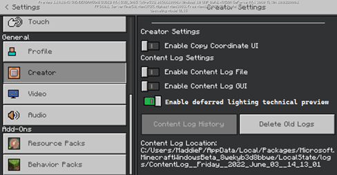

# How Deferred Lighting Relates to PBR

Minecraft supports a Physically Based Rendering (PBR) pipeline that can be used for Deferred Lighting and Ray Tracing. This involves accurately modeling surface details as well as scene illuminators to achieve a lighting model that is coherent across all times of day. By taking advantage of PBR and the new Deferred Lighting pipeline, you unlock new creative control over the mood and lighting conditions of your entire scene.

For example, you can control the intensity and color of the sun & moon, affecting how they contribute to the scene (direct lighting, bloom activation, exposure sensitivity, shadow angle, etc…). Additionally, new properties for describing the atmosphere of your world enables a new level of control over your skies!  All these customization points coupled with the new "key frame" syntax allow you to change any detail of your lighting over the course of the in-game day-night cycle.

All newly added lighting capabilities are opt-in, and appropriate defaults will be used if any parameters aren't supplied by a resource pack. These properties are also designed to complement and extend the existing Texture Set capabilities found in RTX resource packs (Texture Sets are no longer restricted to RTX-only packs). Note however that new capabilities are NOT backwards compatible with the RTX pipeline.

## Opting Into the Deferred Lighting Pipeline

Opting into the Deferred Lighting Pipeline should feel familiar if you have authored an RTX-enabled resource pack before. In fact, any resource pack that was built for use in RTX should "just work" for Deferred Lighting. However, you will likely want to add some additional JSON files (see sections below for more details) to make full use of the pipeline.

## Enabling Deferred Technical Preview in Settings

If you are on a compatible Preview or Beta build supporting the Deferred Lighting Pipeline, you will find a new toggle under the "Creator" tab in the Settings menu:



Once this has been toggled ‘On’, you will see new options in the "Video" settings menu. Under "Graphics Mode," the UI element will change to a dropdown selection in which you can now see an option for the "Deferred Technical Preview."


Selecting this mode will make the pipeline available, however, you will need to provide a PBR-enabled resource pack and new lighting files in order to fully utilize it. 

## Resource Pack - Manifest.json Capabilities

Specifically, the key thing that communicates to the game client that a resource pack is capable of Deferred Lighting is the presence of a certain string(s) in the capabilities array in your pack’s manifest.json. Since the assets required for RTX are a subset of the assets needed for Deferred Lighting, a pack that broadcasts the "raytraced" capability will also be capable of activating Deferred Lighting. However, it is recommended that a new capability string be used going forward for Deferred/PBR Lighting packs as these packs should be expected to run cross-platform, unlike "raytraced" packs which are restricted to RTX-only devices. The new capability string is "pbr":

```json
{
  "format_version": 1,
  "header": {
    ...
  },
  "modules": [
    ...
  ],
  "capabilities": [
    "pbr"
  ]
}
```

### Resource Pack – PBR Textures

As mentioned above, the Deferred Lighting Pipeline uses the same rules for PBR texture sets used for RTX. If you are not familiar with Physically Based Rendering or building texture sets, there is an overview available on our documentation website here and more detail on creating the textures here. For Height Map values, the new pipeline supports both Height Map and Normal inputs.
In the Deferred Lighting mode, however, you are now able to set PBR textures for entities and mobs in addition to blocks. They follow the exact same Texture Set rules, and can be added similarly to the textures/entity folder within your resource pack.

### Hardware Requirements

Note that the resource pack capability is only half of what is necessary for playing a given Minecraft world in Deferred Lighting mode; you must also have appropriate hardware. Thankfully, the Deferred Lighting Pipeline is not as demanding as the RTX Pipeline, and thus supports a much broader range of devices. Most modern GPUs on Windows should support the Deferred Pipeline with more devices to follow. At a minimum, we recommend any DX12 capable NVIDIA or AMD GPU; DX11 and/or Intel-based GPUs are also known to work, but with less reliability currently.

## Deferred Lighting JSONs

Texture Sets are good for defining the surface properties of individual blocks or mobs, but, for more global lighting properties, JSON files provide a simple way to data-drive the renderer. The JSONs described below should be located inside of a "lighting" directory in the root of a given resource pack.

### Global Lighting JSON Schema

File location: lighting/global.json

```json
{
  version "format_version",
  object "directional_lights"
    {
      object "sun"
      {
          float "illuminance" : optkeyframe, // How bright the sun is; measured in lux (lx)
          color "color" : optkeyframe // The RGB color that the sun contributes to direct surface lighting; supports RGB array or HEX string
      },
      object "moon"
      {
          float "illuminance" : optkeyframe,  // How bright the moon is; measured in lux (lx)
          color "color" : optkeyframe // The RGB color that the moon contributes to direct surface lighting; supports RGB array or HEX string
      }
        float "orbital_offset_degrees" : optkeyframe // The rotational offset of the sun and moon from their standard orbital axis; measured in degrees
    }
    object "pbr"
    {
      object "blocks"
      {
        color "global_metalness_emissive_roughness" // The default MER value to use for blocks when not defined via textureset; supports RGB array or HEX string
      },
      object "actors"
      {
        color "global_metalness_emissive_roughness" // The default MER value to use for actors/mobs when not defined via textureset; supports RGB array or HEX string
      }
    }
 }
```

### Directional Lights

The "directional_lights" object is where you can configure properties of the sun and the moon. These properties will affect how strong their respective light contributions are, what colors they contribute to various surfaces they illuminate and the angle at which they cast shadows. It will also greatly influence the color of the sky by way of atmospheric scattering calculations (see lighting/atmospherics.json for more details).

The celestial bodies that are the sun and moon are assumed to be opposite of each other in the sky at all times. When both celestial bodies are visible in the sky, both will contribute opposing light to the scene.

Illuminance values that correspond to “real world" values are suitable for use in our pipeline. For instance, the sun at noon on a clear day measures upwards of 100,000 lux, while the moon only registers < 1 lux. Tone mapping and auto-exposure will appropriately rebalance drastic differences in light intensities.
Color values can either be described as an array of 3 or 4 numerical values from the range 0-255 or as a 6 or 8 hexadecimal digit string.
Any of these values can be individually key framed (see Key Frame Syntax section for more details).

### PBR Uniforms

The "pbr" object is meant to complement the larger Texture Set functionality by acting as a default or fallback value when texture set detail isn't provided for particular blocks or actors. For example, if you provide texture sets for pigs and creepers, but no other actors, then, when a cow is rendered in game, the "global_metalness_emissive_roughness" value defined in global.json will be applied uniformly across the entire surface of the cow. This allows you to quickly provide a general art direction without having to author textures for every single game object initially, and iteratively add more detail to the blocks/actors as you see fit.

Values can either be described as an array of 3 numerical values from the range 0-1 or as a 3 hexadecimal digit string.

## Atmospherics JSON Schema

File location: lighting/ atmospherics.json

```json
{
  object "horizon_blend_stops" // How the atmosphere is divided up
  {
    float "min" : optkeyframe, // The minimum horizon height
    float "start" : optkeyframe, // The height relative to the horizon where the zenith contribution will take over
    float "mie_start" : optkeyframe, // The height relative to the horizon where mie scattering begins
    float "max" : optkeyframe // The maximum horizon height
  }
  float "rayleigh_strength" : optkeyframe, // How strong the atmosphere's rayleigh scattering term is
  float "sun_mie_strength" : optkeyframe, // How strong the sun's mie scattering term is
  float "moon_mie_strength" : optkeyframe, // How strong the moon's mie scattering term is
  float "sun_glare_shape" : optkeyframe, // How the lobe of the mie scattering is shaped
  color "sky_zenith_color" : optkeyframe, // The RGB color of the zenith region of the atmosphere; supports RGB array or HEX string
  color "sky_horizon_color" : optkeyframe // The RGB color of the horizon region of the atmosphere; supports RGB array or HEX string
}
```

Any of these values can be individually key framed (see Key Frame Syntax section for more details).

Note that the colors defined for the sun and moon directional lights in lighting/global.json will also be used in the calculation of the atmosphere and thus will have a significant impact on the final sky color. This is especially true with both the Rayleigh and Mie scattering terms.

### Horizon Blend Stops

The "horizon_blend_stops" object contains 4 values that are used to divide up the atmosphere into various regions. These values are all within the range 0-1. The following diagram can be used to help understand how to use these values.


(1) The primary horizon line is determined by "min" and "max", and divides the sky into two general regions: everything below the horizon and everything above it. This dividing line is calculated as:

**Horizon line = min - max⁡**

A horizon line value of 0 will set the horizon plane level with the player/observer; a positive horizon line will set the plane higher, thus hiding more of the zenith; and a negative horizon line will set the line lower thus exposing more of the zenith.

(2) The altitude range over which the transition between the "sky_horizon_color" and the "sky_zenith_color" occurs relative to the horizon line (1) is controlled by "start". A larger value will cause the blend to be more spread out, while a smaller value will cause it to be tighter. This value should be kept in the range of:

**0 < start ≤ 1** 

(3) A separate altitude range over which the Mie scattering occurs relative to the horizon line (1) is controlled by "mie_start". A larger value will cause the Mie scattering lobe to become more prominent, while a smaller value will cause it to be less distinguished to the point where it will disappear. This term is used in tandem with "sun_glare_shape" to control the overall appearance of the lobe. This value should be kept in the range of:

**0 < mie start ≤ 1**

### Rayleigh Strength

The "rayleigh_strength" parameter controls the intensity of the Rayleigh scattering effect found in the upper atmosphere. This phenomenon is what produces colors such as blue during the daytime hours and purples/reds at sunset. A larger value will make the effect stronger, and thus increase the predominance of the "sky_zenith_color". A smaller value will make the effect weaker, with a value of 0 removing Rayleigh scattering entirely, blending to pure black. While this parameter can theoretically go to infinity, an appropriate range for this value is:
0≤rayleigh strength≤10  

### Sun and Moon Mie Strengths

The "sun_mie_strength" and "moon_mie_strength" parameters give you control over the intensity of the Mie scattering effect on either the sun or the moon. This phenomenon is what produces differing colors in the atmosphere due to large particles in the air, such as water vapor, pollen, or smoke. A larger value will make the effect stronger, while a value of 0 will remove the Mie scattering completely. These values should be kept in the range of:
0≤strength≤1 

### Sun Glare Shape

The "sun_glare_shape" parameter gives you control over the shape of the Mie scattering lobe. A smaller value will cause the lobe to be more spread out, while larger values will cause the lobe to become tighter and tighter. Even though this parameter can theoretically go to infinity, an appropriate range for this value is:

**0 < sun glare shape ≤ 50**  

### Sky Zenith and Horizon Colors

The "sky_zenith_color" parameter defines the color of the zenith region in the atmosphere, while "sky_horizon_color" defines the color of the region below the horizon line. These color values can either be described as an array of 3 or 4 numerical values from the range 0-255 or as a 6 or 8 hexadecimal digit string.

## Key Frame JSON Syntax

Sometimes, in order to make your world more dynamic, you will want to change a particular lighting parameter over time. To do this, you can take advantage of a new "key frame" syntax, which can be substituted for any value in the lighting JSON schemas annotated with "optkeyframe". 
Here's how it works. Take this example of a lighting/global.json file:

```json
{
    "format_version": [1, 0, 0], 
    "directional_lights": {
      "sun": {
        "illuminance": 100000,
        "color": [ 255.0, 255.0, 255.0, 255.0 ]
      },
      "moon": { 
        "illuminance": 0.27,
        "color": [ 255.0, 255.0, 255.0, 255.0 ]
      }, 
    "orbital_offset_degrees": 0.0
    }, 
    "pbr": { 
      "blocks": { 
        "global_metalness_emissive_roughness": [0.0, 0.0, 1.0]  
      },
    }, 
    "actors": { 
        "global_metalness_emissive_roughness": [0.0, 0.0, 1.0]  
    } 
} 
```

While this illuminance parameter of 100,000 lux for our sun looks good at noon, it's far too bright during dawn and dusk. To address this, we can utilize key frames for the sun's illuminance parameter. 

Key frames are simply a collection of pairs of numbers. These pairs are referred to as "key-value" pairs, where the "key" is a number (0-1) representing a particular time of day in game, and the "value" represents whatever parameter is being key framed.

In our example using sun illuminance, the value would be of type "float". When key frames are provided for a supported lighting parameter instead of a single value, the engine will linearly interpolate between these key frames according to the time of day in game.

With all of this in mind, we can adjust our lighting/global.json slightly to alter the sun's illuminance over time:

```json
{
    "format_version": [1, 0, 0], 
    "directional_lights": {
        "sun": {
            "illuminance": {
              "0.0": 1.0,
              "0.25": 400.0, // Sunrise
              "0.35": 39000.0,
              "0.5": 100000.0,  // Noon
              "0.65": 39000.0,
              "0.75": 400.0, // Sunset
              "1.0": 1.0
            },
            "color": [ 255.0, 255.0, 255.0, 255.0 ]
        },
        "moon": { 
            "illuminance": 0.27,
            "color": [ 255.0, 255.0, 255.0, 255.0 ]
        }, 
        "orbital_offset_degrees": 0.0
    }, 
    "pbr": { 
        "blocks": { 
            "global_metalness_emissive_roughness": [0.0, 0.0, 1.0]  
        }, 
        "actors": { 
            "global_metalness_emissive_roughness": [0.0, 0.0, 1.0]  
        } 
    } 
}
```

Similar things can be done with the sun's color or the moon's illuminance or any of the atmospherics parameters!  Experiment to find the right thing for your world.
Key frames currently support floats and colors (both RGB and hexadecimal) and the only supported method of interpolation is linear. There is virtually no limit to the granularity at which you can define key frames.

The following diagram can be used to reference key times of the day:


## Example JSON Files

To get you going, we provide the following example JSON files that will give you sensible starting values for a map based in the Overworld.

### lighting/global.json

```json
{
  "format_version": [1, 0, 0], 
  "directional_lights": {
    "sun": {
      "illuminance": {
        "0.0": 1.0,
        "0.25": 400.0,
        "0.35": 20000.0,
        "0.5": 109880.0,
        "0.65": 20000.0,
        "0.75": 400.0,
        "1.0": 1.0
      },
      "color": [ 255.0, 255.0, 255.0, 255.0 ]
    },
    "moon": { 
        "illuminance": 0.27,
        "color": "#ffffffff"
    }, 
    "orbital_offset_degrees": 3.0
  }, 
  "pbr": { 
      "blocks": { 
        "global_metalness_emissive_roughness": [0.0, 0.0, 1.0]  
      }, 
      "actors": { 
        "global_metalness_emissive_roughness": "#0000ff"
      } 
  } 
}
```

### lighting/atmospherics.json

```json
{  
  "horizon_blend_stops":{
    "min": { 
      "0.0": 0.0, 
      "0.1962499916553497": 0.008, 
      "0.25": 0.0, 
      "0.34": 0.11, 
      "0.6": 0.027, 
      "0.6750000119209290": 0.01332983374595642, 
      "0.7487499713897705": 0.0, 
      "0.8174999952316284": 0.0 
    }, 
    "start": { 
      "0.0": 0.25, 
      "0.1962499916553497": 0.4179066121578217, 
      "0.25": 0.213, 
      "0.34": 0.401, 
      "0.6": 0.23, 
      "0.6750000119209290": 0.2143078744411469, 
      "0.7487499713897705": 0.1990064233541489, 
      "0.8174999952316284": 0.6179999709129333 
    }, 
    "mie_start": { 
      "0.0": 0.5, 
      "0.1962499916553497": 1.172000050544739, 
      "0.25": 0.5, 
      "0.34": 0.5009999871253967, 
      "0.6": 0.167, 
      "0.6750000119209290": 0.15, 
      "0.7487499713897705": 0.55, 
      "0.8174999952316284": 0.79 
    }, 
    "max": { 
      "0.0": 0.25, 
      "0.1962499916553497": 0.137, 
      "0.25": 0.0, 
      "0.34": 0.467, 
      "0.6": 0.2,
      "0.6750000119209290": 0.1919008344411850, 
      "0.7487499713897705": 0.214, 
      "0.8174999952316284": 0.0 
    } 
  }, 
  "rayleigh_strength": { 
    "0.0": 8.208999633789062, 
    "0.25": 1.299998521804810, 
    "0.3": 1.299998521804810, 
    "0.3037499785423279": 1.299998521804810, 
    "0.3249999880790710": 1.299998521804810, 
    "0.6": 4.0, 
    "0.7074999809265137": 1.586028337478638, 
    "0.75": 1.0 
  }, 
  "sun_mie_strength": { 
    "0.0": 1.0, 
    "0.25": 3.0, 
    "0.3": 3.0, 
    "0.3037499785423279": 2.878501892089844, 
    "0.3249999880790710": 1.0, 
    "0.6": 1.0, 
    "0.7074999809265137": 1.0, 
    "0.75": 1.0 
  }, 
  "moon_mie_strength": { 
    "0.0": 0.0, 
    "0.25": 0.0, 
    "0.3": 0.0, 
    "0.3037499785423279": 0.114, 
    "0.3249999880790710": 1.0, 
    "0.6": 1.0, 
    "0.7074999809265137": 0.0, 
    "0.75": 0.0 
  }, 
  "sun_glare_shape": { 
    "0.0": 15.89900016784668, 
    "0.25": 15.89900016784668, 
    "0.3": 15.89900016784668, 
    "0.3037499785423279": 15.84438705444336, 
    "0.3249999880790710": 15.0, 
    "0.6": 4.0, 
    "0.7074999809265137": 4.0, 
    "0.75": 4.0 
  }, 
  "sky_zenith_color": { 
    "0.0": [0, 125, 164], 
    "0.25": [11, 55, 97], 
    "0.5": [7, 10, 36], 
    "0.75": [50, 88, 170] 
  }, 
  "sky_horizon_color": { 
    "0.0": [255, 255, 254],
    "0.171875": [196, 133, 102], 
    "0.25": [255, 85, 85], 
    "0.305": [173, 60, 67], 
    "0.35": [168, 76, 140], 
    "0.4174999892711639": [130, 99, 169], 
    "0.47": [66, 98, 238], 
    "0.6030000448226929": [66, 98, 238], 
    "0.6474999785423279": [168, 99, 162], 
    "0.75": [238, 144, 124], 
    "0.84": [242, 168, 152] 
  } 
}
```
