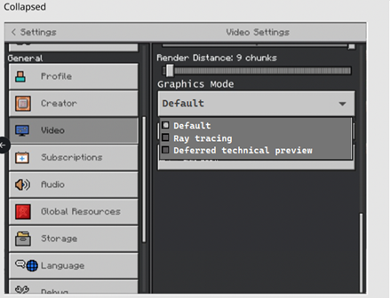
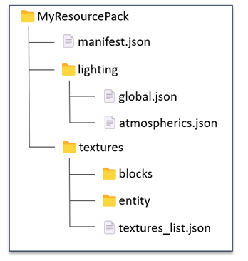
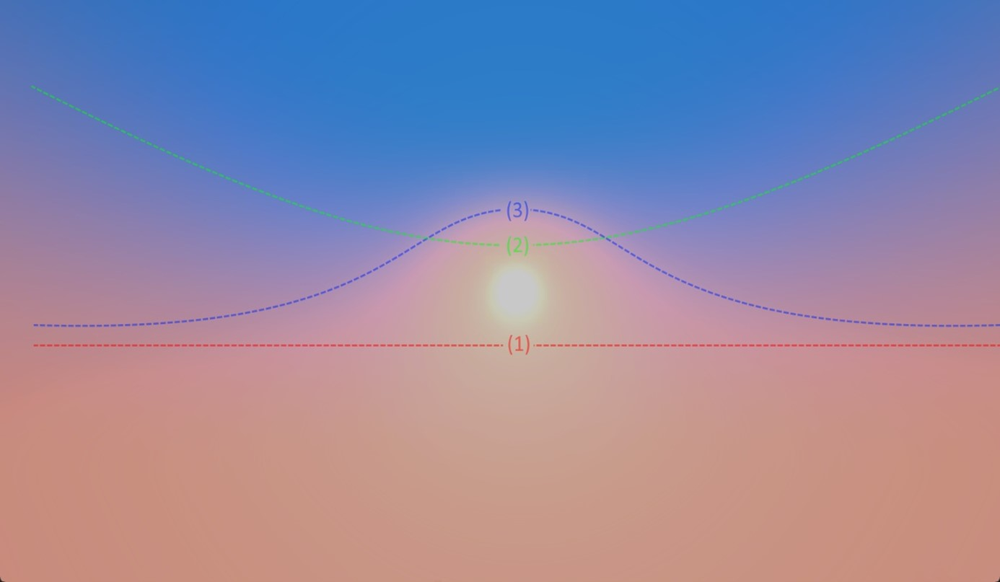
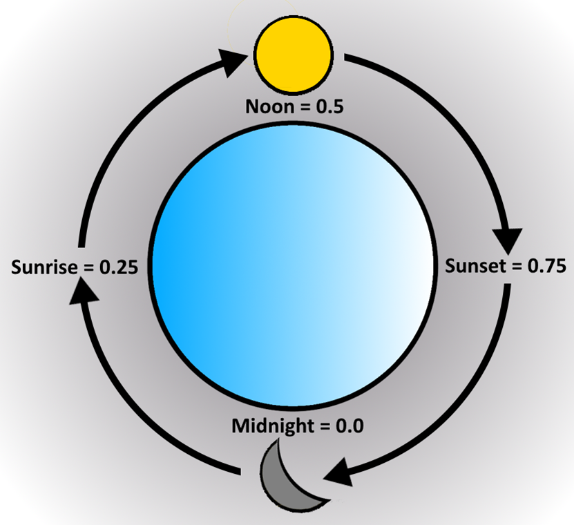

# Getting Started with Deferred Lighting

Minecraft supports a Physically Based Rendering (PBR) pipeline that can be used for Deferred Lighting and Ray Tracing. This involves accurately modeling surface details as well as scene illuminators to achieve a lighting model that is coherent across all times of day. By taking advantage of PBR and the new Deferred Lighting pipeline, you unlock new creative control over the mood and lighting conditions of your entire scene.

For example, you can control the intensity and color of the sun and moon, affecting how they contribute to the scene through aspects like direct lighting, bloom activation, exposure sensitivity, and shadow angle.

Additionally, new properties for describing the atmosphere of your world enable a new level of control over your skies! All these customization points coupled with the new "key frame" syntax allow you to change any detail of your lighting over the course of the in-game day-night cycle.

> [!NOTE]
> Deferred lighting features are experimental. As with all experiments, you may see additions, removals, and changes in functionality in Minecraft versions without significant advanced warning. Check the Minecraft Changelog for details on any changes.
>
>To learn more about Experimental Features, please visit [Experimental Features in Minecraft: Bedrock Edition](ExperimentalFeaturesToggle.md).

All newly added lighting capabilities are opt-in, and appropriate defaults will be used if any parameters aren't supplied by a resource pack. These properties are also designed to complement and extend the existing Texture Set capabilities found in RTX resource packs (Texture Sets are no longer restricted to RTX-only packs).

> [!NOTE]
> New capabilities are **NOT** backwards-compatible with the RTX pipeline.

## Opting Into the Deferred Lighting Pipeline

To opt into the Deferred Lighting Pipeline, you will need to provide a PBR-enabled resource pack and join a world with the "Render Dragon Features for Creators" Experiment enabled. Resource packs built for RTX should work with the new pipeline, but you will likely want to add some JSON files to make full use of the pipeline, as explained in the following sections.

## PBR Resource Packs

The Deferred Lighting Pipeline uses the same rules for PBR texture sets used for RTX. If you are not familiar with Physically Based Rendering or building texture sets, there is an overview available on our documentation website in [Introduction to Physically Based Rendering](RTXPBRIntro.md) and more detail on creating the texture sets in [Introduction to Texture Sets](../Reference/Content/TextureSetsReference/TextureSetsConcepts/TextureSetsIntroduction.md)

For Height Map values, the new pipeline supports both Height Map and Normal inputs. In the Deferred Lighting mode, however, you are now able to set PBR textures for entities and mobs in addition to blocks. They follow the exact same Texture Set rules and can be added similarly to the textures/entity folder within your resource pack. In the Deferred Lighting mode, PBR textures via Texture Sets are supported for blocks, entities, particles and items! They follow the exact same Texture Set rules as blocks and can be added similarly to either the "textures/entity" or "textures/particle" or "textures/items" folder within your resource pack.

The key thing that communicates to the game client that a resource pack is capable of Deferred Lighting is the presence of a certain string(s) in the capabilities array in your pack's **manifest.json**.

Because the assets required for RTX are a subset of the assets needed for Deferred Lighting, a pack that broadcasts the "raytraced" capability will also be capable of activating Deferred Lighting.

However, it is recommended that a new capability string be used going forward for Deferred/PBR Lighting packs as these packs should be expected to run cross-platform, unlike "raytraced" packs which are restricted to RTX-only devices.

The new capability string is "pbr":

```json
{ 
  "format_version": 1,
  "header": {
    ...
  }, 
  "modules": [
    ...
  ], 
  "capabilities": [
    "pbr"
  ]
}
```

## Enabling Deferred Technical Preview in Your World

If you are on a compatible Preview or Beta version of Minecraft, you will find an Experiments toggle named "Render Dragon Features for Creators."
Toggle this Experiment **on**, and ensure that your PBR-enabled resource pack is activated for your world.

Note that if you are hosting a Realm to share worlds in Preview, make sure to require players to download resource packs to join.


After you enter the world, you will see new options in the "Video" settings menu.

Under "Graphics Mode," the UI element will change to a dropdown selection where you can now see an option for the "Deferred Technical Preview." 

Toggle this **on**. Your world will now be rendered with the Deferred Lighting Pipeline!



### Hardware Requirements

You must have appropriate hardware and a Preview-enabled platform to execute the Deferred Lighting Pipeline. A ray tracing capable video card is not required, and most modern GPUs on Windows should support the Deferred Pipeline, with more devices to follow.

On Android, there is a hard requirement at this time that only GLES 3.1 devices running Android OS 9 and above will be able to run the pipeline.

## Deferred Lighting JSON Files

Texture Sets are good for defining the surface properties of individual blocks or mobs, but for more global lighting properties, JSON files provide a simple way to data-drive the renderer. The JSONs described here should be located inside of a "lighting" directory in the root of a given resource pack.



### Global Lighting JSON Schema

File location: lighting/global.json

```json
{
    version "format_version",
    object "directional_lights"
    {
        object "sun"
        {
            float "illuminance" : optkeyframe, // How bright the sun is, measured in lux (lx)
            color "color" : optkeyframe // The RGB color that the sun contributes to direct surface lighting; supports RGB array or HEX string
        },
        object "moon"
        {
            float "illuminance" : optkeyframe,  // How bright the moon is; measured in lux (lx)
            color "color" : optkeyframe // The RGB color that the moon contributes to direct surface lighting; supports RGB array or HEX string
        }
        float "orbital_offset_degrees" : optkeyframe // The rotational offset of the sun and moon from their standard orbital axis; measured in degrees
    },
    object "point_lights"
    { 
        "colors": { // List of key-value pairs where the key is a namespace-qualified block name and the value is a color (supports RGB array or HEX string) 
          string: color, 
           ... 
          string: color 
        } 
    },
    object "pbr"
    {
        object "blocks"
        {
            color "global_metalness_emissive_roughness" // The default MER value to use for blocks when not defined via textureset; supports RGB array or HEX string
        },
        object "actors"
        {
            color "global_metalness_emissive_roughness" // The default MER value to use for actors/mobs when not defined via textureset; supports RGB array or HEX string
        },
        object "particles"
        {
            color "global_metalness_emissive_roughness" // The default MER value to use for particles when not defined via textureset; supports RGB array or HEX string
        },
        object "items"
        {
            color "global_metalness_emissive_roughness" // The default MER value to use for items when not defined via textureset; supports RGB array or HEX string
        }
    }
}
```

### Directional Lights

The "directional_lights" object is where you can configure properties of the sun and the moon. These properties will affect how strong their respective light contributions are, what colors they contribute to various surfaces they illuminate and the angle at which they cast shadows. It will also greatly influence the color of the sky by way of atmospheric scattering calculations (see lighting/atmospherics.json for more details).

The celestial bodies that are the sun and moon are assumed to be opposite of each other in the sky at all times. When both celestial bodies are visible in the sky, both will contribute opposing light to the scene.

Illuminance values that correspond to "real world" values are suitable for use in our pipeline. For instance, the sun at noon on a clear day measures upwards of 100,000 lux, while the moon only registers < 1 lux. Tone mapping and auto-exposure will appropriately rebalance drastic differences in light intensities.

Color values can either be described as an array of 3 or 4 numerical values from the range 0-255 or as a 6 or 8 hexadecimal digit string.
Any of these values can be individually key framed (see Key Frame Syntax section for more details).

### Point Lights

The "point_lights" object allows you to specify which blocks should be considered point lights and what color a given point light should emit.

The difference between a traditional light-emitting block and a point light block is that point lights emit light from a single point at the center of the block, thus the name "point" light. 

Like directional lights, they produce sophisticated lighting effects such as diffuse and specular highlights. This modeling works well for blocks such as torches, but isn't as good for conveying blocks with larger, discrete shapes, such as lava blocks or campfires. Blocks that emit light from a surface "area" rather than a single "point" should use the Emissive properties of Texture Sets and [lightEmission block components](../Reference/Content/BlockReference/Examples/BlockComponents/minecraftBlock_light_emission.md) to control their light levels. You can always combine point lights and Emissive texture data in the same block to achieve your desired look.

Feel free to experiment, but beware that point lights are considerably more resource-intensive than light produced by other means, so it is recommended that they be employed with care. For instance, while you technically can turn lava blocks into point lights, this is not recommended simply because of the sheer amount of point lights that could be generated in common scenes. 

By default, the game will treat the following blocks as point lights. This functionality can't be changed. However, you can override their default color if you include an entry for that block in your pack's **lighting/global.json** file:

>- `minecraft:torch` as `#EFE39D`
>- `minecraft:redstone_torch` as `#FF0000`
>- `minecraft:end_rod` as `#FFFFFF`
>- `minecraft:lantern` as `#CE8133`
>- `minecraft:soul_lantern` as `#00FFFF`
>- `minecraft:soul_torch` as `#00FFFF`

To change the strength of a point light, refer to the [documentation for lightEmission block](../Reference/Content/BlockReference/Examples/BlockComponents/minecraftBlock_light_emission.md) components. Be aware that this lightEmission value is a separate concept from the "Emissive" value described in PBR or Texture Set documentation.

Color values can be described either as an array of 3 numerical values from the range 0-255 or as a 6-digit hexadecimal string.

### PBR Uniforms

The `"pbr"` object is meant to complement the larger Texture Set functionality by acting as a default or fallback value when texture set detail isn't provided for particular blocks, entities, particles, or items. For example, if you provide texture sets for pigs and creepers, but no other actors, then, when a cow is rendered in game, the `"global_metalness_emissive_roughness"` value defined in global.json will be applied uniformly across the entire surface of the cow. This allows you to quickly provide a general art direction without having to author textures for every single game object initially, and iteratively add more detail to the blocks/actors as you see fit.

Values can either be described as an array of 3 numerical values from the range 0-1 or as a 3 hexadecimal digit string.

## Atmospherics JSON Schema

File location: lighting/ atmospherics.json

```json
{
  object "horizon_blend_stops" // How the atmosphere is divided up
  {
    float "min" : optkeyframe, // The minimum horizon height
    float "start" : optkeyframe, // The height relative to the horizon where the zenith contribution will take over
    float "mie_start" : optkeyframe, // The height relative to the horizon where mie scattering begins
    float "max" : optkeyframe // The maximum horizon height
  }
  float "rayleigh_strength" : optkeyframe, // How strong the atmosphere's rayleigh scattering term is
  float "sun_mie_strength" : optkeyframe, // How strong the sun's mie scattering term is
  float "moon_mie_strength" : optkeyframe, // How strong the moon's mie scattering term is
  float "sun_glare_shape" : optkeyframe, // How the lobe of the mie scattering is shaped
  color "sky_zenith_color" : optkeyframe, // The RGB color of the zenith region of the atmosphere; supports RGB array or HEX string
  color "sky_horizon_color" : optkeyframe // The RGB color of the horizon region of the atmosphere; supports RGB array or HEX string
}
```

Any of these values can be individually key framed (see Key Frame Syntax section for more details).

Note that the colors defined for the sun and moon directional lights in lighting/global.json will also be used in the calculation of the atmosphere and thus will have a significant impact on the final sky color. This is especially true with both the Rayleigh and Mie scattering terms.

### Horizon Blend Stops

The "horizon_blend_stops" object contains 4 values that are used to divide up the atmosphere into various regions. These values are all within the range 0-1. The following diagram can be used to help understand how to use these values.



(1) The primary horizon line is determined by "min" and "max", and divides the sky into two general regions: everything below the horizon and everything above it. This dividing line is calculated as:

**Horizon line = min - max⁡**

A horizon line value of 0 will set the horizon plane level with the player/observer; a positive horizon line will set the plane higher, thus hiding more of the zenith; and a negative horizon line will set the line lower thus exposing more of the zenith.

(2) The altitude range over which the transition between the "sky_horizon_color" and the "sky_zenith_color" occurs relative to the horizon line (1) is controlled by "start". A larger value will cause the blend to be more spread out, while a smaller value will cause it to be tighter. This value should be kept in the range of:

**0 < start ≤ 1** 

(3) A separate altitude range over which the Mie scattering occurs relative to the horizon line (1) is controlled by "mie_start". A larger value will cause the Mie scattering lobe to become more prominent, while a smaller value will cause it to be less distinguished to the point where it will disappear. This term is used in tandem with "sun_glare_shape" to control the overall appearance of the lobe. This value should be kept in the range of:

**0 < mie start ≤ 1**

### Rayleigh Strength

The "rayleigh_strength" parameter controls the intensity of the Rayleigh scattering effect found in the upper atmosphere. This phenomenon is what produces colors such as blue during the daytime hours and purples/reds at sunset. A larger value will make the effect stronger, and thus increase the predominance of the "sky_zenith_color". A smaller value will make the effect weaker, with a value of 0 removing Rayleigh scattering entirely, blending to pure black. While this parameter can theoretically go to infinity, an appropriate range for this value is:
0≤rayleigh strength≤10  

### Sun and Moon Mie Strengths

The "sun_mie_strength" and "moon_mie_strength" parameters give you control over the intensity of the Mie scattering effect on either the sun or the moon. This phenomenon is what produces differing colors in the atmosphere due to large particles in the air, such as water vapor, pollen, or smoke. A larger value will make the effect stronger, while a value of 0 will remove the Mie scattering completely. These values should be kept in the range of:
0≤strength≤1 

### Sun Glare Shape

The "sun_glare_shape" parameter gives you control over the shape of the Mie scattering lobe. A smaller value will cause the lobe to be more spread out, while larger values will cause the lobe to become tighter and tighter. Even though this parameter can theoretically go to infinity, an appropriate range for this value is:

**0 < sun glare shape ≤ 50**  

### Sky Zenith and Horizon Colors

The "sky_zenith_color" parameter defines the color of the zenith region in the atmosphere, while "sky_horizon_color" defines the color of the region below the horizon line. These color values can either be described as an array of 3 or 4 numerical values from the range 0-255 or as a 6 or 8 hexadecimal digit string.

## Key Frame JSON Syntax

Sometimes, in order to make your world more dynamic, you will want to change a particular lighting parameter over time. To do this, you can take advantage of a new "key frame" syntax, which can be substituted for any value in the lighting JSON schemas annotated with "optkeyframe".

Here's how it works:

Take this example of a **lighting/global.json** file:

```json
{
    "format_version": [1, 0, 0], 
    "directional_lights": {
        "sun": {
            "illuminance": 100000,
            "color": [ 255.0, 255.0, 255.0, 255.0 ]
        },
        "moon": { 
            "illuminance": 0.27,
            "color": [ 255.0, 255.0, 255.0, 255.0 ]
        }, 
        "orbital_offset_degrees": 0.0
    },
    "point_lights": { 
        "colors": { 
            "minecraft:soul_torch": "#FFFFFF"
        } 
    },
    "pbr": { 
        "blocks": { 
            "global_metalness_emissive_roughness": [0.0, 0.0, 255.0]  
        },
        "actors": { 
            "global_metalness_emissive_roughness": [0.0, 0.0, 255.0]  
        },
        "particles": { 
            "global_metalness_emissive_roughness": [0.0, 0.0, 255.0]  
        },
        "items": { 
            "global_metalness_emissive_roughness": [0.0, 0.0, 255.0]  
        }
    }
} 
```

While this illuminance parameter of 100,000 lux for our sun looks good at noon, it's far too bright during dawn and dusk. To address this, we can use key frames for the sun's illuminance parameter.

Key frames are simply a collection of pairs of numbers. These pairs are referred to as "key-value" pairs, where the "key" is a number (0-1) representing a particular time of day in game, and the "value" represents whatever parameter is being key framed.

In our example using sun illuminance, the value would be of type "float". When key frames are provided for a supported lighting parameter instead of a single value, the engine will linearly interpolate between these key frames according to the time of day in game.

With all of this in mind, we can adjust our lighting/global.json slightly to alter the sun's illuminance over time:

```json
{
    "format_version": [1, 0, 0], 
    "directional_lights": {
        "sun": {
            "illuminance": {
              "0.0": 1.0,  // Noon
              "0.25": 400.0, // Sunset
              "0.35": 39000.0,
              "0.5": 100000.0,  // Midnight
              "0.65": 39000.0,
              "0.75": 400.0, // Sunrise
              "1.0": 1.0
            },
            "color": [ 255.0, 255.0, 255.0, 255.0 ]
        },
        "moon": { 
            "illuminance": 0.27,
            "color": [ 255.0, 255.0, 255.0, 255.0 ]
        }, 
        "orbital_offset_degrees": 0.0
    },
    "point_lights": { 
        "colors": { 
            "minecraft:soul_torch": "#FFFFFF"
        } 
    },
    "pbr": { 
        "blocks": { 
            "global_metalness_emissive_roughness": [0.0, 0.0, 255.0]
        }, 
        "actors": { 
            "global_metalness_emissive_roughness": [0.0, 0.0, 255.0]  
        },
        "particles": { 
            "global_metalness_emissive_roughness": [0.0, 0.0, 255.0]  
        },
        "items": { 
            "global_metalness_emissive_roughness": [0.0, 0.0, 255.0]  
        }
    }
}
```

Similar things can be done with the sun's color or the moon's illuminance or any of the atmospherics parameters!  Experiment to find the right thing for your world.
Key frames currently support floats and colors (both RGB and hexadecimal) and the only supported method of interpolation is linear. There is virtually no limit to the granularity at which you can define key frames.

The following diagram can be used to reference key times of the day:



## Example JSON Files

To get you going, we provide the following example JSON files that will give you sensible starting values for a map based in the Overworld.

### lighting/global.json

```json
{
    "format_version": [1, 0, 0], 
    "directional_lights": {
        "sun": {
            "illuminance": {
                "0.0": 1.0,
                "0.25": 400.0,
                "0.35": 20000.0,
                "0.5": 109880.0,
                "0.65": 20000.0,
                "0.75": 400.0,
                "1.0": 1.0
            },
            "color": [ 255.0, 255.0, 255.0, 255.0 ]
        },
        "moon": { 
            "illuminance": 0.27,
            "color": "#ffffffff"
        }, 
        "orbital_offset_degrees": 3.0
    },
    "point_lights": { 
        "colors": { 
           "minecraft:soul_torch": "#FFFFFF"
        } 
    },
    "pbr": { 
        "blocks": { 
            "global_metalness_emissive_roughness": [0.0, 0.0, 255.0]  
        }, 
        "actors": { 
            "global_metalness_emissive_roughness": [0.0, 0.0, 255.0]  
        },
        "particles": { 
            "global_metalness_emissive_roughness": [0.0, 0.0, 255.0]  
        },
        "items": { 
            "global_metalness_emissive_roughness": [0.0, 0.0, 255.0]  
        }
    } 
}
```

### lighting/atmospherics.json

```json
{  
  "horizon_blend_stops":{
    "min": { 
      "0.0": 0.0, 
      "0.1962499916553497": 0.008, 
      "0.25": 0.0, 
      "0.34": 0.11, 
      "0.6": 0.027, 
      "0.6750000119209290": 0.01332983374595642, 
      "0.7487499713897705": 0.0, 
      "0.8174999952316284": 0.0 
    }, 
    "start": { 
      "0.0": 0.25, 
      "0.1962499916553497": 0.4179066121578217, 
      "0.25": 0.213, 
      "0.34": 0.401, 
      "0.6": 0.23, 
      "0.6750000119209290": 0.2143078744411469, 
      "0.7487499713897705": 0.1990064233541489, 
      "0.8174999952316284": 0.6179999709129333 
    }, 
    "mie_start": {
      "0.0": 0.5,
      "0.1962499916553497": 1.172000050544739,
      "0.25": 0.5,
      "0.34": 0.5009999871253967,
      "0.6": 0.167,
      "0.6750000119209290": 0.15,
      "0.7487499713897705": 0.55,
      "0.8174999952316284": 0.79
    }, 
    "max": { 
      "0.0": 0.25, 
      "0.1962499916553497": 0.137, 
      "0.25": 0.0, 
      "0.34": 0.467, 
      "0.6": 0.2,
      "0.6750000119209290": 0.1919008344411850, 
      "0.7487499713897705": 0.214, 
      "0.8174999952316284": 0.0 
    } 
  }, 
  "rayleigh_strength": { 
    "0.0": 1.026124954, 
    "0.25": 0.1624998152, 
    "0.3": 0.1624998152, 
    "0.3037499785423279": 0.1624998152, 
    "0.3249999880790710": 0.1624998152, 
    "0.6": 0.5, 
    "0.7074999809265137": 0.1982535422, 
    "0.75": 0.125
  }, 
  "sun_mie_strength": { 
    "0.0": 1.0, 
    "0.25": 3.0, 
    "0.3": 3.0, 
    "0.3037499785423279": 2.878501892089844, 
    "0.3249999880790710": 1.0, 
    "0.6": 1.0, 
    "0.7074999809265137": 1.0, 
    "0.75": 1.0 
  }, 
  "moon_mie_strength": { 
    "0.0": 0.0, 
    "0.25": 0.0, 
    "0.3": 0.0, 
    "0.3037499785423279": 0.114, 
    "0.3249999880790710": 1.0, 
    "0.6": 1.0, 
    "0.7074999809265137": 0.0, 
    "0.75": 0.0 
  }, 
  "sun_glare_shape": { 
    "0.0": 15.89900016784668, 
    "0.25": 15.89900016784668, 
    "0.3": 15.89900016784668, 
    "0.3037499785423279": 15.84438705444336, 
    "0.3249999880790710": 15.0, 
    "0.6": 4.0, 
    "0.7074999809265137": 4.0, 
    "0.75": 4.0 
  }, 
  "sky_zenith_color": { 
    "0.0": [0, 125, 164], 
    "0.25": [11, 55, 97], 
    "0.5": [7, 10, 36], 
    "0.75": [50, 88, 170] 
  }, 
  "sky_horizon_color": { 
    "0.0": [255, 255, 254],
    "0.171875": [196, 133, 102], 
    "0.25": [255, 85, 85], 
    "0.305": [173, 60, 67], 
    "0.35": [168, 76, 140], 
    "0.4174999892711639": [130, 99, 169], 
    "0.47": [66, 98, 238], 
    "0.6030000448226929": [66, 98, 238], 
    "0.6474999785423279": [168, 99, 162], 
    "0.75": [238, 144, 124], 
    "0.84": [242, 168, 152] 
  } 
}
```

## Volumetric Fog and Light Shafts 

Minecraft Bedrock Preview version `1.20.60.21` adds a visual effect to the Deferred Technical Preview: volumetric fog and light shafts! This effect relies on a terrain-aware volumetric representation of the world, allowing for complex fog that changes depending on the environment.

Rather than defining new JSON files, this effect takes advantage of existing resource pack capabilities for Fog and Volumes. You can define fog properties for specific biomes, discrete regions in your world, whether the player is under water or above water, and much more.

Please refer to the following articles to get started with these systems: 

>- [Fog in Resource Packs](FogInResourcePacks.md)

Note that the Deferred Technical Preview does not fully support tinted absorption as described in the `"media_coefficients"` section of **Fog in Resource Packs**. The JSON format takes an RGB triplet for this value to describe how much light the fog will absorb on a per-channel granularity. This is the behavior for RTX Resource Packs, but volumes in the Deferred Technical Preview only operate at a single-channel of granularity. Therefore, our engine will calculate the standard luminance of the RGB triplet specified for absorption and use it instead of the RGB triplet itself when in "Deferred Technical Preview" mode.

Luminance is calculated as follows: 

`Luminance=RGB∙[0.2126, 0.7152, 0.0722]`

Another way to write that is:

`Luminance = 0.2126*R + 0.7152*G + 0.0722*B`

The following example is a good place to start: 

### fogs/default_fog_settings.json

```json
{
  "format_version": "1.16.100", 
  "minecraft:fog_settings": { 
    "description": { 
        "identifier": "pbr:fog_default" 
    },
    "volumetric": { 
        "density": { 
          "water": { 
            "max_density": 0.25, 
            "uniform": true 
          }, 
          "air": { 
            "max_density": 0.01, 
            "zero_density_height": 150.0, 
            "max_density_height": 50.0 
          }
        }, 
        "media_coefficients": { 
          "water": { 
            "scattering": [0.01811, 0.02126, 0.027953], 
            "absorption": [0.2, 0.07874, 0.083465] 
          }, 
          "air": { 
            "scattering": [0.02, 0.02, 0.02], 
            "absorption": [0.0, 0.0, 0.0] 
          }
        }
      }
  }
}
```

## Reflections

Minecraft Bedrock **1.21.20.22+** Previews further enhance the reflections available in Deferred Technical Preview worlds by adding Screen-Space Reflections (SSR). Between IBL-based Sky Reflections and SSR, the majority of surfaces will be able to convey convincing reflections, whether under ground, above ground, in the Nether, etc... Note that certain scenarios, such as reflecting off-screen objects or first-person mirrors are still not possible. Furthermore, with the exception of water, transparent geometry, such as glass, will not receive SSR.

SSR currently provides only mirror-like reflections. In order to preserve the look of rougher materials, the application of SSR begins to fade at roughness values greater than 0.3 (i.e., ~76/255), and SSR is not applied at all for roughness values greater than or equal to 0.4 (i.e., 102/255).

Creators can make use of the Roughness and Metalness parameters in Texture Sets to control how different materials elicit reflections. Default PBR values for blocks, actors and particles defined in the global lighting JSON will also impact this property for blocks/actors/particles with no Texture Set.

## Color Grading and Tone Mapping

New data-driving capabilities for Color Grading and Tone Mapping are available in Minecraft Bedrock **1.21.0.22** Previews and newer. These new tools allow resource packs to convey unique moods and themes through industry standard color correction controls.

### Color Grading

Minecraft's color grading system allows for many degrees of customization of the final image. You can control the saturation, contrast, gain, and offset of pixels per RGB channel. This can be done on a global scale regardless of pixel luminance, or it can be done on a more fine-grained scale with unique sets of parameters for shadows, midtones and highlights. The highlight parameters are applied to the brightest pixels, the shadow parameters applied to the darkest pixels, and the midtone parameters applied to the pixels with luminance close to the average luminance of the scene.

For convenience, when data-driving, midtones will be applied to all pixels unless highlights or shadows are specified. Think of midtones as your global settings, whereas highlights and shadows further refine the bright or dark regions of the image.

- **Saturation** - Determines the hue intensity of colors. A value of `1.0` results in no change in saturation to the original image. A value of `0.0` results in a grayscale image. Values `> 1.0` will increase the purity of colors.

- **Contrast** - Describes the difference in luminance between the bright and dark pixels in an image, otherwise known as the tonal range. An image with high contrast will have pixels with a wide range of luminance values, whereas an image with low contrast will have pixels of a relatively small luminance range. A value of `1.0` results in no change in contrast to the original image. A value of `0.0` results in a completely washed-out, gray image. Values `> 1.0` will increase brightness of highlights while darkening the shadows in the final image.

- **Gain** - A multiplication factor applied to each color channel to adjust the overall luminance intensity of the image. A value of `1.0` results in no change to the original image. Values `< 1.0` will darken the image while values `> 1.0` will brighten it. A value of `0.0` will cancel out that color channel completely. Gain is multiplicative and therefore has a stronger affect on brighter pixels than darker pixels.

- **Gamma** - An exponential factor applied to the final color after both color grading and tone mapping to adjust the overall luminance intensity of the image. A sensible value for this parameter is typically `2.2`. Lower values will darken the final image, whereas higher values will cause the final image to appear washed-out.

- **Offset** - An additive factor that is multiplied by the average luminance of the scene and then added to a given color channel to adjust the overall luminance intensity of the image. A value of `0.0` results in no change to the original image. Values `> 0.0` will brighten the image, while values `< 0.0` will darken it. Offset is additive and therefore has a stronger effect on darker pixels than brighter pixels. 

- **Shadow Max** - A factor multiplied by the average luminance of the scene to determine which pixels are considered shadows. Pixels with luminance less than `ShadowMax * AverageLuminance` will have the shadows set of color grading values applied. A value of `1.0` indicates shadows occupy the entire range of values including and up to the average luminance. Lower values will cause the maximum required luminance value for a pixel to be considered a shadow to drop. This value should not be equal to Highlight Min.

- **Highlight Min** - A factor multiplied by the average luminance of the scene to determine which pixels are considered highlights. Pixels with luminance greater than `HighlightMin * AverageLuminance` will have the highlights set of color grading values applied. A value of `1.0` indicates highlights occupy the entire range of values including and above the average luminance. Higher values will cause the minimum required luminance value for a pixel to be considered a highlight to rise. This value should not be equal to Shadow Max.

### Tone Mapping

Tone mapping determines how a color is remapped from HDR-space to SDR-space for display on modern televisions and monitors. For tone mapping, you can choose from the following operators:

| Tone Map | Description |
|----------|-------|
| Reinhard | A low-cost tone mapping operator [[3](#ref_reinhard), eq. 3] that remaps HDR color values in the range `[0, ∞)` to `[0, 1)`. This operator looks especially good when applied to low-contrast scenes whose values are already within the range of `[0, 1)`, but tends to mute higher luminance values. |
| Reinhard Luma | An extended version of the Reinhard operator [[3](#ref_reinhard), eq. 4] that comes at a slightly higher cost, but it preserves details in low dynamic range regions of an image that would otherwise be lost by the standard Reinhard operator. |
| Reinhard Luminance | A version of the extended Reinhard operator [[3](#ref_reinhard), eq. 4] modified to adjust the luminance of the input colors. It comes at a slightly higher cost, but it preserves colors in high luminance regions of an image that would otherwise be washed out by the standard Reinhard operator. |
| Hable | A filmic tone mapping operator meant to emulate the behaviors of real-life film, developed and shared by John Hable at a GDC talk from 2010 titled "Uncharted 2: HDR Lighting". [[1](#ref_hable)] |
| Academy Color Encoding System (ACES) | A filmic tone mapping operator meant to emulate the behaviors of real-life film, specifically following the ACES standard used in television and film. [[2](#ref_hill)] |

### Filmic tone mapping operators

Because filmic tone mapping operators are designed to emulate real-life film, they tend to look best when remapping HDR scene values that were themselves produced from other real-life, physically accurate values, such as the intensity of the sun or the strength of Rayleigh scattering in the atmosphere.

For instance, the relative difference in luminous power between a torch and an Earth-based sun is orders of magnitudes different at noon. Filmic operators are designed to preserve subtle differences in extremely dark and extremely bright areas (like low luminance and high luminance) for this reason, but they come at a higher performance cost compared to the non-filmic variants. There is currently no way for creators to alter the properties of the filmic curves.

### Schema

Color grading configurations are JSON files located in the "color_grading" directory in a resource pack. They must have the filename "color_grading.json", and adhere to the following format:

```json
{
  object "minecraft:color_grading_settings"
  {
    object "description"
    {
      string "identifier" // The identifier for these color grading settings. The identifier must include a namespace.
    }
    object "color_grading" : opt
    {
      object "midtones" // Color grading parameters for midtones, and for when highlights or shadows are not specified.
      {
        float[3] "contrast" <0.0-4.0> : opt
        float[3] "gain" <0.0-10.0> : opt
        float[3] "gamma" <0.0-4.0> : opt
        float[3] "offset" <-1.0-1.0> : opt
        float[3] "saturation" <0.0-10.0> : opt
      }
      object "highlights" : opt // Optional color grading parameters for highlights.
      {
        float "highlightsMin" <1.0 - 4.0> : opt
        float[3] "contrast" <0.0-4.0> : opt
        float[3] "gain" <0.0-10.0> : opt
        float[3] "gamma" <0.0-4.0> : opt
        float[3] "offset" <-1.0-1.0> : opt
        float[3] "saturation" <0.0-10.0> : opt
      }
      object "shadows" : opt // Optional color grading parameters for shadows.
      {
        float "shadowsMax" <0.1 - 1.0> : opt
        float[3] "contrast" <0.0-4.0> : opt
        float[3] "gain" <0.0-10.0> : opt
        float[3] "gamma" <0.0-4.0> : opt
        float[3] "offset" <-1.0-1.0> : opt
        float[3] "saturation" <0.0-10.0> : opt
      }
    }
    object "tone_mapping" : opt
    {
      string "operator" <"reinhard"|"reinhard_luma"|"reinhard_luminance"|"hable"|"aces">
    }
  }
}
```

The following example JSON can be used as a starting point:

**color_grading/color_grading.json**

```json
{
  "minecraft:color_grading_settings"
  {
    "description"
    {
      "identifier": "my_pack:default_color_grading"
    },
    "color_grading"
    {
      "midtones"
        {
          "contrast": [1.3, 1.3, 1.3],
          "gain": [1.0, 1.0, 1.0],
          "gamma": [2.2, 2.2, 2.2],
          "offset": [0.0, 0.0, 0.0],
          "saturation": [1.05, 1.05, 1.05]
        }
    },
    "tone_mapping"
    {
      "operator": "reinhard_luminance"
    }
  }
}
```

## References
<a name="ref_hable"></a>[1] Hable, John. 2010. Uncharted 2: HDR Lighting. GDC 2010. Naughty Dog. https://www.gdcvault.com/play/1012351/Uncharted-2-HDR

<a name="ref_hill"></a>[2] Hill, Stephen & Narkowicz, Krzysztof & MJP. https://github.com/ampas/aces-dev & https://knarkowicz.wordpress.com/2016/01/06/aces-filmic-tone-mapping-curve/ & https://github.com/TheRealMJP/BakingLab

<a name="ref_reinhard"></a>[3] Reinhard, Erik & Stark, Michael & Shirley, Peter & Ferwerda, James. 2002. Photographic Tone Reproduction for Digital Images. ACM Transactions on Graphics. Vol 21. https://www-old.cs.utah.edu/docs/techreports/2002/pdf/UUCS-02-001.pdf
