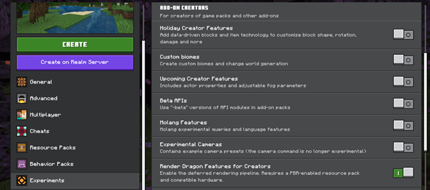
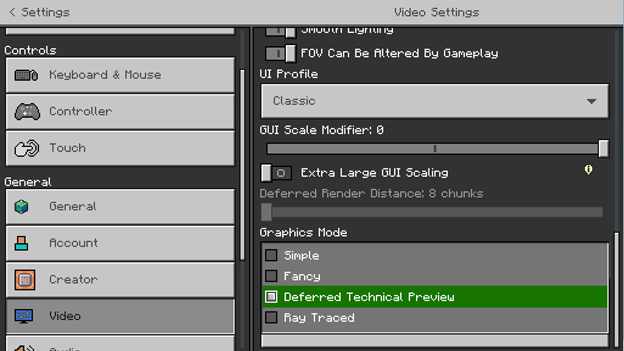

# Enabling Deferred Technical Preview in Your World

If you are on a compatible Preview or Beta version of Minecraft, you will find an Experiments toggle named "Render Dragon Features for Creators."
Toggle this Experiment **on**, and ensure that your PBR-enabled resource pack is activated for your world.

Note that if you are hosting a Realm to share worlds in Preview, make sure to require players to download resource packs to join.

After you enter the world, you will see new options in the "Video" settings menu.

Under "Graphics Mode," the UI element will change to a dropdown selection where you can now see an option for the "Deferred Technical Preview." 

Toggle this **on**. Your world will now be rendered with the Deferred Lighting Pipeline!

### Hardware Requirements

You must have appropriate hardware and a Preview-enabled platform to execute the Deferred Lighting Pipeline. A ray tracing capable video card is not required, and most modern GPUs on Windows should support the Deferred Pipeline, with more devices to follow.

On Android, there is a hard requirement at this time that only GLES 3.1 devices running Android OS 9 and above will be able to run the pipeline.
