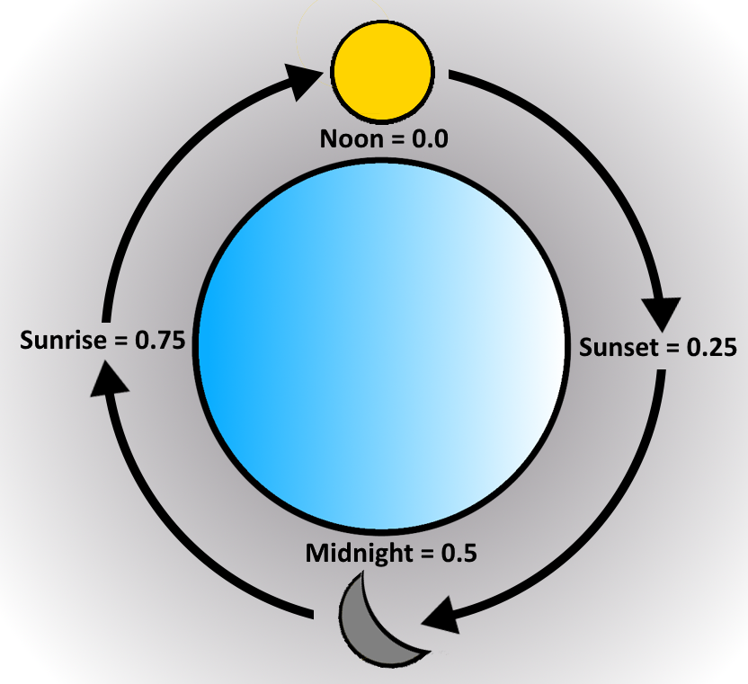

# Key Frame JSON Syntax

Sometimes, in order to make your world more dynamic, you will want to change a particular lighting parameter over time. To do this, you can take advantage of a new "key frame" syntax, which can be substituted for any value in the lighting JSON schemas annotated with "optkeyframe".

Here's how it works:

Take this example of a **lighting/global.json** file:

```json
{
    "format_version": [1, 0, 0], 
    "directional_lights": {
        "sun": {
            "illuminance": 100000,
            "color": [ 255.0, 255.0, 255.0, 255.0 ]
        },
        "moon": { 
            "illuminance": 0.27,
            "color": [ 255.0, 255.0, 255.0, 255.0 ]
        }, 
        "orbital_offset_degrees": 0.0
    },
    "point_lights": { 
        "colors": { 
            "minecraft:soul_torch": "#FFFFFF"
        } 
    },
    "pbr": { 
        "blocks": { 
            "global_metalness_emissive_roughness_subsurface": [0.0, 0.0, 255.0, 0.0]  
        },
        "actors": { 
            "global_metalness_emissive_roughness_subsurface": [0.0, 0.0, 255.0, 0.0]  
        },
        "particles": { 
            "global_metalness_emissive_roughness_subsurface": [0.0, 0.0, 255.0, 0.0]  
        },
        "items": { 
            "global_metalness_emissive_roughness_subsurface": [0.0, 0.0, 255.0, 0.0]  
        }
    },
    "emissive": {
        "desaturation": 0.1
    }
} 
```

While this illuminance parameter of 100,000 lux for our sun looks good at noon, it's far too bright during dawn and dusk. To address this, we can use key frames for the sun's illuminance parameter.

Key frames are simply a collection of pairs of numbers. These pairs are referred to as "key-value" pairs, where the "key" is a number (0-1) representing a particular time of day in game, and the "value" represents whatever parameter is being key framed.

In our example using sun illuminance, the value would be of type "float". When key frames are provided for a supported lighting parameter instead of a single value, the engine will linearly interpolate between these key frames according to the time of day in game.

With all of this in mind, we can adjust our lighting/global.json slightly to alter the sun's illuminance over time:

```json
{
    "format_version": [1, 0, 0], 
    "directional_lights": {
        "sun": {
            "illuminance": {
              "0.0": 100000.0,  // Noon
              "0.25": 20000.0, // Sunset
              "0.35": 400.0,
              "0.5": 1.0,  // Midnight
              "0.65": 400.0,
              "0.75": 20000.0, // Sunrise
              "1.0": 100000.0   // Noon
            },
            "color": [ 255.0, 255.0, 255.0, 255.0 ]
        },
        "moon": { 
            "illuminance": 0.27,
            "color": [ 255.0, 255.0, 255.0, 255.0 ]
        }, 
        "orbital_offset_degrees": 0.0
    },
    "point_lights": { 
        "colors": { 
            "minecraft:soul_torch": "#FFFFFF"
        } 
    },
    "pbr": { 
        "blocks": { 
            "global_metalness_emissive_roughness_subsurface": [0.0, 0.0, 255.0, 0.0]
        }, 
        "actors": { 
            "global_metalness_emissive_roughness_subsurface": [0.0, 0.0, 255.0, 0.0]  
        },
        "particles": { 
            "global_metalness_emissive_roughness_subsurface": [0.0, 0.0, 255.0, 0.0]  
        },
        "items": { 
            "global_metalness_emissive_roughness_subsurface": [0.0, 0.0, 255.0, 0.0]  
        }
    },
    "emissive": {
        "desaturation": 0.1
    }
}
```

Similar things can be done with the sun's color or the moon's illuminance or any of the atmospherics parameters!  Experiment to find the right thing for your world.
Key frames currently support floats and colors (both RGB and hexadecimal) and the only supported method of interpolation is linear. There is virtually no limit to the granularity at which you can define key frames.

The following diagram can be used to reference key times of the day:


