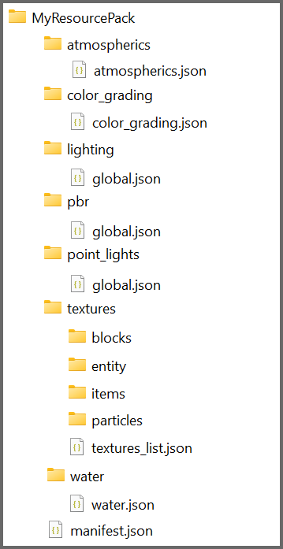

# PBR Resource Packs

The Deferred Lighting Pipeline uses the same rules for PBR texture sets used for RTX. If you are not familiar with Physically Based Rendering or building texture sets, there is an overview available on our documentation website in [Introduction to Physically Based Rendering](../RTXPBRIntro.md) and more detail on creating the texture sets in [Introduction to Texture Sets](../../Reference/Content/TextureSetsReference/TextureSetsConcepts/TextureSetsIntroduction.md)

For Height Map values, the new pipeline supports both Height Map and Normal inputs. In the Deferred Lighting mode, however, you are now able to set PBR textures for entities and mobs in addition to blocks. They follow the exact same Texture Set rules and can be added similarly to the textures/entity folder within your resource pack. In the Deferred Lighting mode, PBR textures via Texture Sets are supported for blocks, entities, particles and items! They follow the exact same Texture Set rules as blocks and can be added similarly to either the "textures/entity" or "textures/particle" or "textures/items" folder within your resource pack.

Deferred Lighting also supports a new Texture Set property that describes a surface's Sub Surface Scattering properties in addition to Metalness, Emissive and Roughness. See the dedicated [Sub Surface Scattering](SubSurfaceScatteringCustomization.md
) page or the updated [Texture Sets documentation](../../Reference/Content/TextureSetsReference/TextureSetsConcepts/TextureSetsIntroduction.md) for more details.

The key thing that communicates to the game client that a resource pack is capable of Deferred Lighting is the presence of a certain string(s) in the capabilities array in your pack's **manifest.json**.

Because the assets required for RTX are a subset of the assets needed for Deferred Lighting, a pack that broadcasts the "raytraced" capability will also be capable of activating Deferred Lighting.

However, it is recommended that a new capability string be used going forward for Deferred/PBR Lighting packs as these packs should be expected to run cross-platform, unlike "raytraced" packs which are restricted to RTX-only devices.

The new capability string is "pbr":

```json
{ 
  "format_version": 1,
  "header": {
    ...
  }, 
  "modules": [
    ...
  ], 
  "capabilities": [
    "pbr"
  ]
}
```

## Deferred Lighting JSON Files

Texture Sets are good for defining the surface properties of individual blocks or mobs, but for more global lighting properties, JSON files provide a simple way to data-drive the renderer. The JSONs described here should be located inside of a "lighting" directory in the root of a given resource pack.



