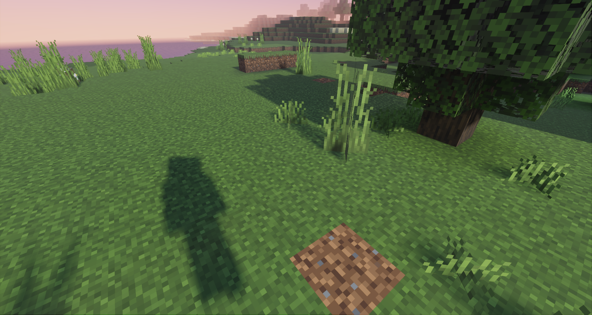

# Shadow Customization

Minecraft Bedrock 1.21.80.25+ Previews give creators control over the stylization of shadows in Deferred Technical Preview resource packs. Packs can choose between either blocky or soft shadows depending on the desired artistic style.

## Compare shadow stylization images

This is a comparison of a simple scene with blocky shadows vs soft shadows.

# [Shadow Stylization - Blocky](#tab/ShadowStylizationBlocky)


# [Shadow Stylization - Soft](#tab/ShadowStylizationSoft)



---

## Shadows

Shadows can be styled in one of two ways: **blocky** or **soft**. If a pack does not customize the shadow stylization, then soft shadows will be used by default. This stylization is controlled via the `"shadow_style"` field where valid options are `"blocky_shadows"` or `"soft_shadows"`.

When using blocky shadows it is recommended to also specify a `"texel_size"` value, which represents the resolution in texels (e.g., texture units) to which shadows will be quantized. For this effect to look consistent across all blocks in the world, creators should first ensure that all of their block textures are of the same resolution (e.g., 16x16px or 32x32px) and then specify the shadow texel size to be the pixel dimension of said textures (i.e., 16 or 32). If textures are composed of different resolutions, then shadows will not snap consistently. If not provided, this value will default to the resolution of Minecraft's core assets, which is 16.

## Schema

Shadow configurations are JSON files located in the **shadows** directory in a resource pack. They must have the filename **global.json**, and adhere to the following format:

```json
{
    string "format_version", // The 3-part schema version for parsing these shadow settings.
    object "minecraft:shadow_settings"
    {
        string "shadow_style", // The type of shadows to use, either "blocky_shadows" or "soft_shadows"
        integer "texel_size" // The resolution to snap shadow texels to; recommended to use the same resolution as block texture assets in the accompanying pack
    }
}
```

For example, a pack wanting to make use of blocky shadows whose block texture assets have a common resolution of 16x16px would use the following JSON:

**shadows/global.json**
```json
{
    "format_version": "1.21.80",
    "minecraft:shadow_settings": {
        "shadow_style": "blocky_shadows",
        "texel_size": 16
    }
}
```
