# Use Blockbench to Create Models with MERS and other textures

You can use Blockbench to create models that include MERS and other textures, compatible with deferred lighting technical preview. Blockbench includes several tools to make working with these additional textures easy. In this tutorial, we'll use these tools to create a shiny panda.

## Create our starter mob using the Minecraft Entity Wizard

To get started, download and use Blockbench on your local device. Add the Entity Wizard plugin, if you haven't already.

1. Use File > Plugins, and install the Minecraft Entity Wizard plugin.

Next, we'll use the Minecraft Entity Wizard to create our starter Panda. On the first step of the wizard, give your mob a name like Shiny Panda. Important: make sure to select Bedrock Preview in the upper right dropdown. This is because Deferrered Lighting Preview only works in Minecraft Preview, currently.

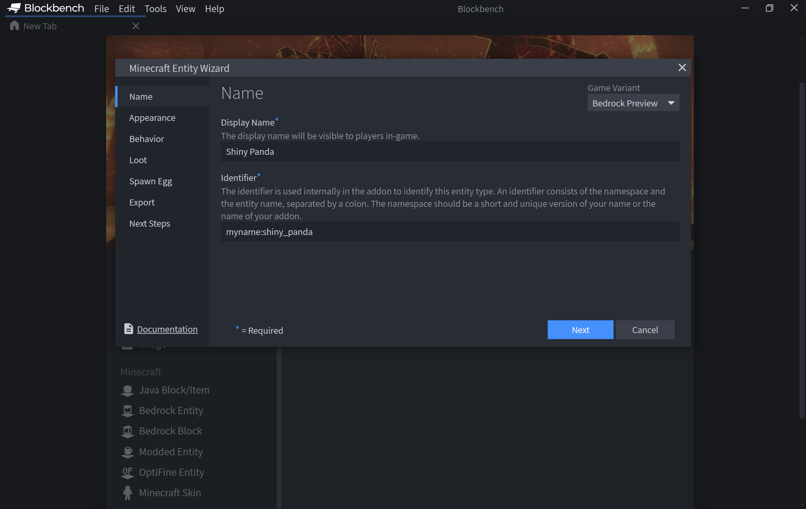

Throughout the rest of the wizard, select the defaults. For your mob, pick the panda.

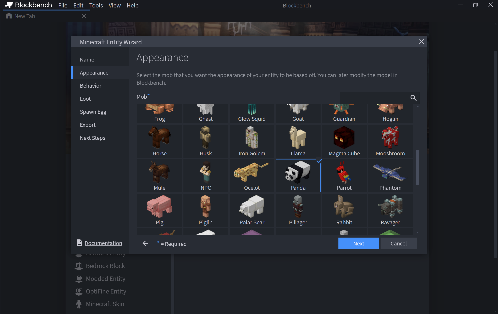

At the last step of the Blockbench Wizard, give your pack a name of ShinyPanda, and select `Export to Folder`.  This will place the pack in your Minecraft Preview `development_resource_packs` and `development_behavior_packs` folders.


## Add a MER texture to your Panda

To get started and add custom Metalness, Emissive, and Roughness texture to your panda, we're first going to create a material out of your texture. 

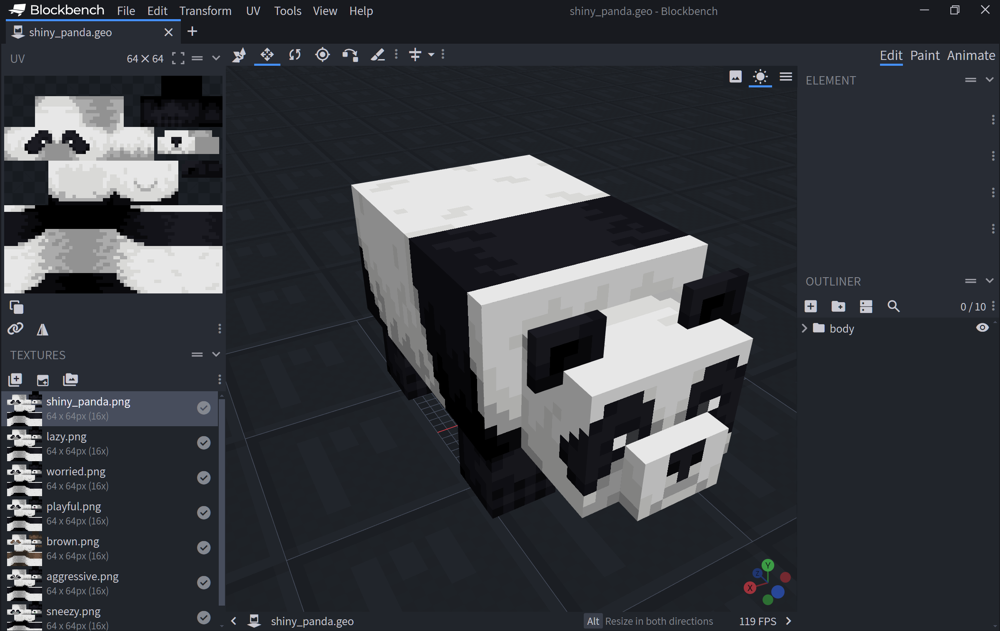

In the Blockbench Textures list, right-click on shiny_panda, and select Create Material. This will create a texture_set.json file for your texture with metadata on how MERS, height, and normal map textures are specified.

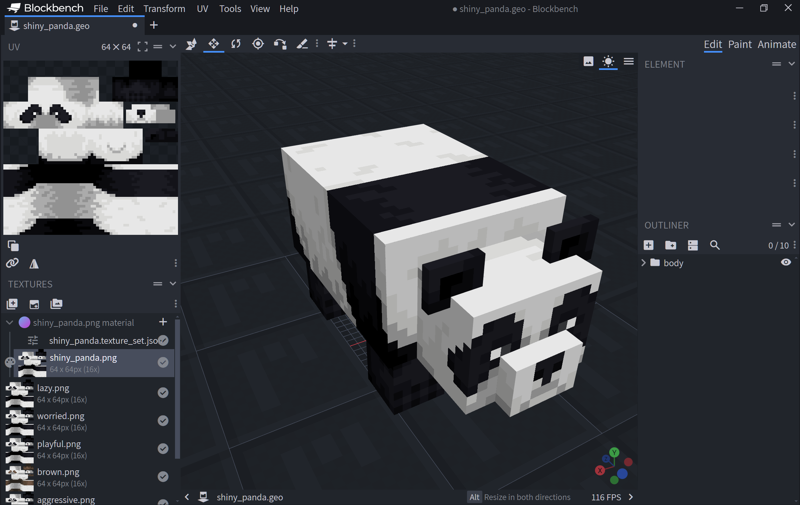

Right click on the texture set header (it should read: shiny_panda), and select Generate PBR map...

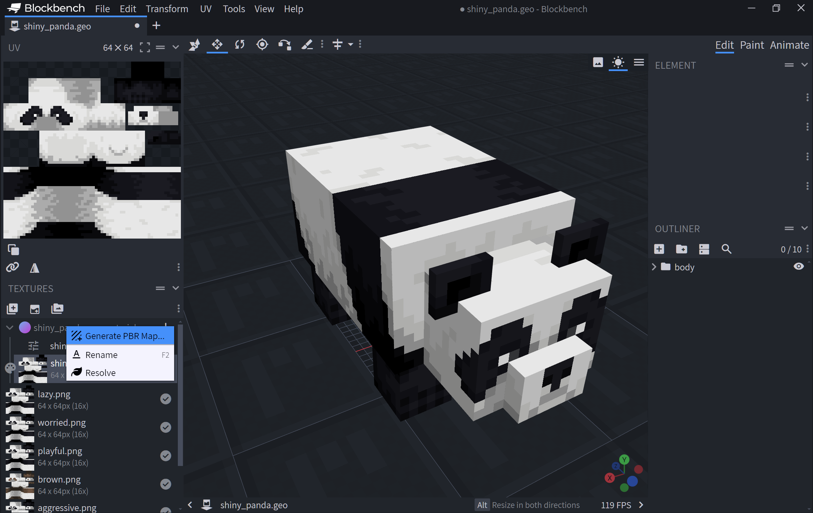

In the popup dialog, select Metalness.

Note that this results in creating your MER texture.

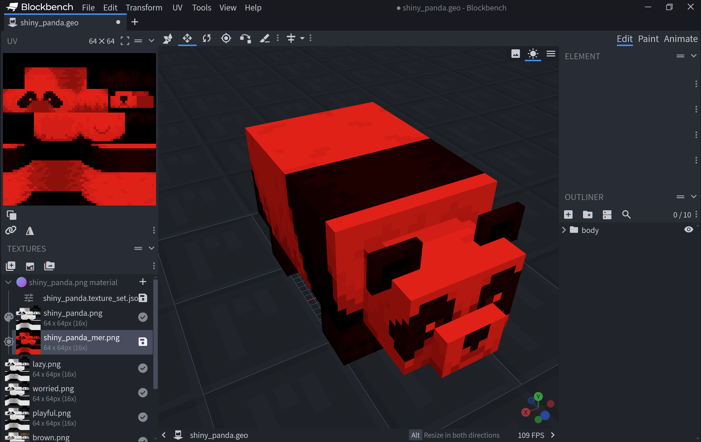

Repeat the above steps to generate an Emissive and Roughness map. Note that this will result in adding additional colored layers into your MER texture.

While we're here, select the Material Preview View so you can see a preview of your shiny panda as you work. In the upper right hand corner, select the View button and select Material Preview.

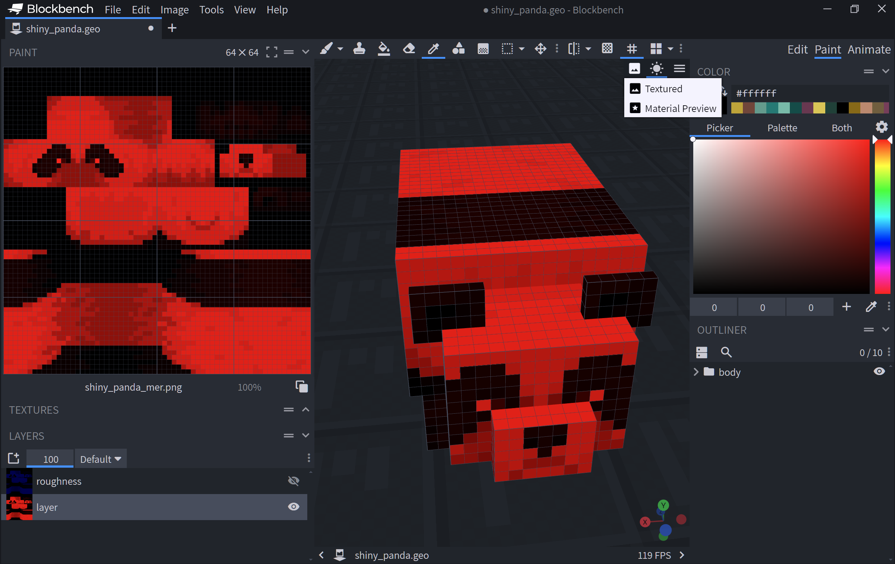

Now you should have all three colors as layers in your MER texture. 
Note that in an MER texture, Metalness (M) has the red channel, Emissive (E) has the green channel, and Roughness (R) has the blue channel. Select the Paint "mode" tab, and notice the three different color textures.

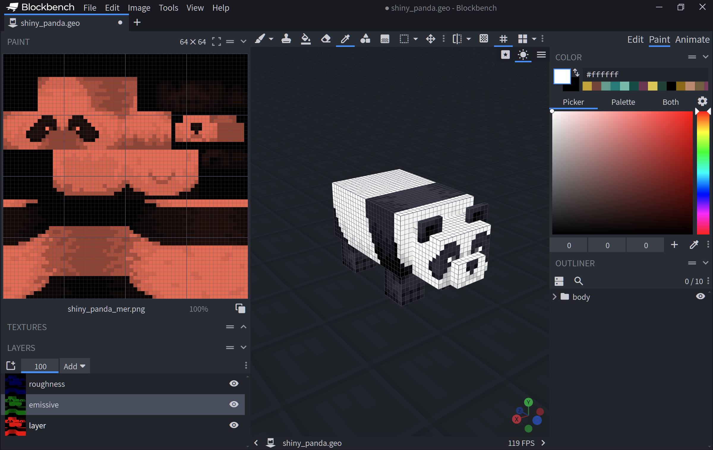

In our case, because we want to make the panda "shiny", we want to give it a lot of metalness. To do that, we'll focus on the metal layer (and hide the roughness and emissive layers.) Using a red-only color, we'll fill in all the darker portiions of the panda texture with this bright red color. That should mean that those portions of the texture are high in metalness.

Make sure you now save out your textures! Hit Ctrl S - you'll be given the option to save out your new PNG as a separate file (shiny_panda_mer), which you should save.

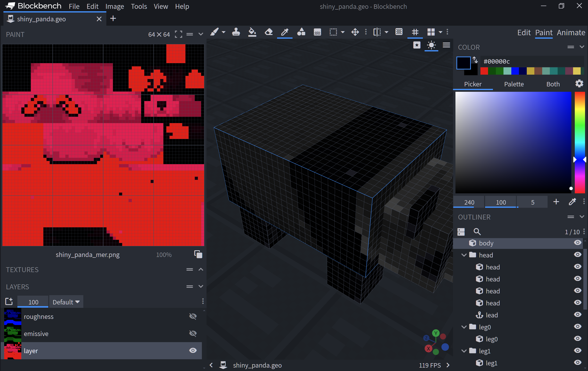

## Get Minecraft Preview Ready

1. First, we need to mark the resource pack that BLockbench generated as being compatible with Deferred Lighting technical preview

Change to the `%localappdata%\packages\Microsoft.MinecraftWindowsBeta_8wekyb3d8bbwe\LocalState\games\com.mojang\development_resource_packs` folder. 

1. Inside of your ShinyPanda folder, open manifest.json, and add 

```json
"capabilities": [ "pbr" ]
```

At the bottom of the manifest.

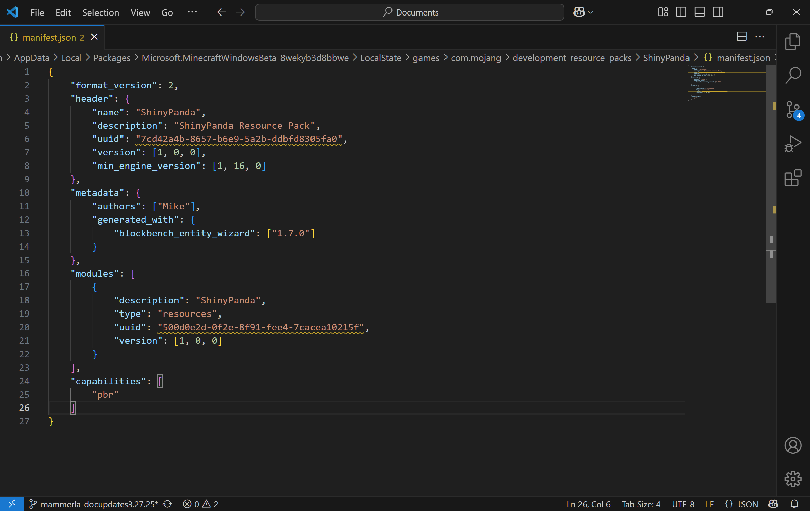

1. Next, we need to apply a basic resource pack with fundamental basic settings of Deferred Technical Preview.  To do this, get the deferred lighting sample settings from [https://github.com/microsoft/minecraft-samples/tree/main/deferred_lighting_starter](https://github.com/microsoft/minecraft-samples/tree/main/deferred_lighting_starter). Follow the instructions in that README to deploy the settings to Minecraft as a resource pack (you'll want to download the folder, run `npm i` to install dependencies, and then `npm run local-deploy` to deploy it to Minecraft)

2. Finally, create your world. Select the Experiments tab, and ensure the Deferred Lighting Experiment is turned on.

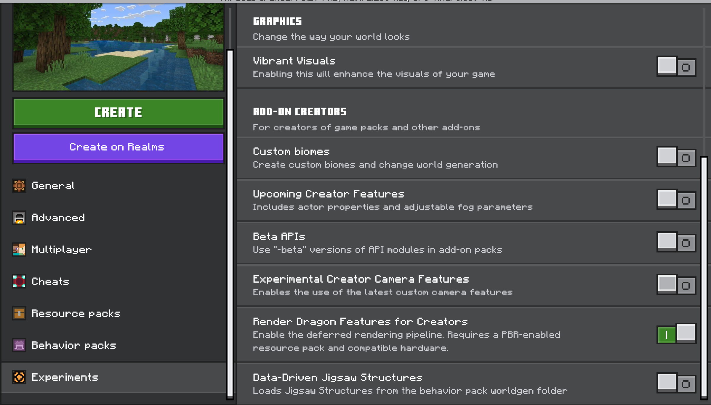

3. Also, under resource packs, ensure that your Shiny Panda pack is selected, as is the Deferred Lighting Starter Settings that you deployed, above. 

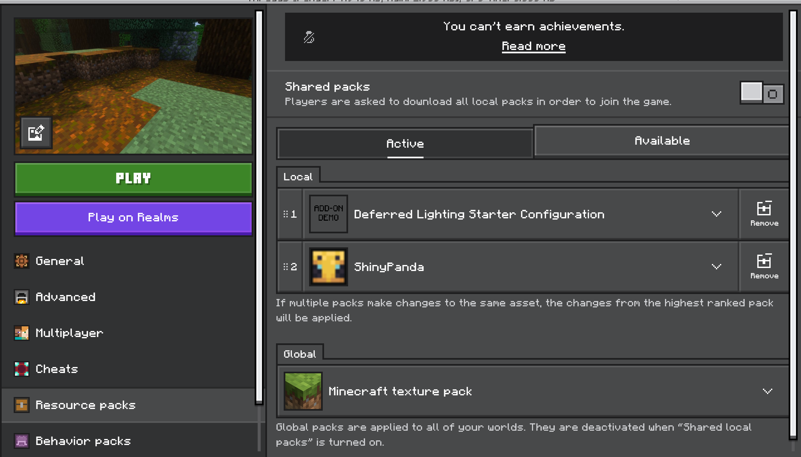

Also make sure to go into Behavior Packs, and select your Shiny Panda.

Now create your world, and summon a panda. Note how the reflections and shadows off the trees will now reflect off certain portions of your now-shiny panda. 

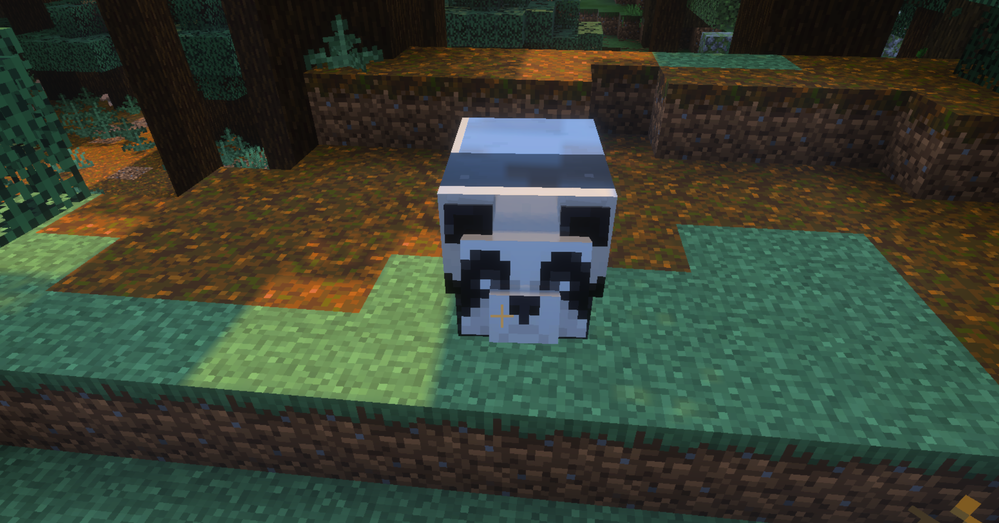

It's hard to see in the image above, but you can see the reflections of the trees on our shiny panda! Amazing. New deferred lighting preview capabilities open up a number of options to creatively make more vibrant mobs and scenes.


