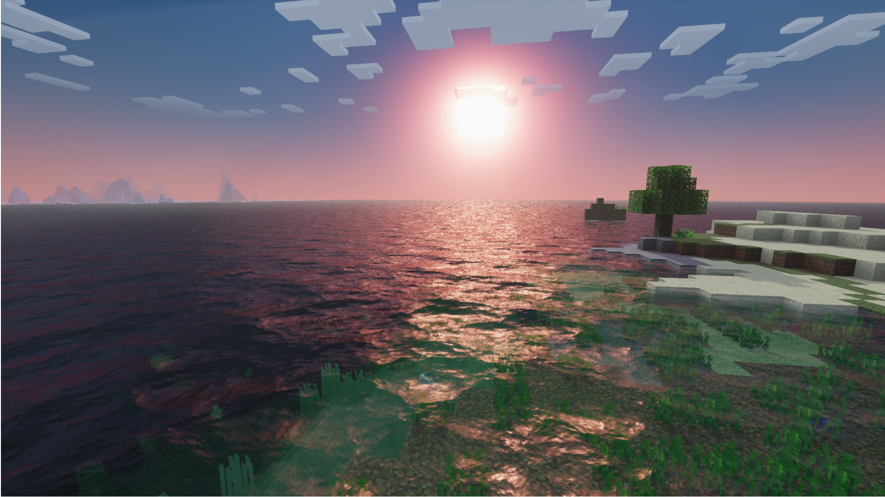

# Water Customization

A variety of new features for Water are available in Minecraft Bedrock **1.21.30.22** Previews and newer. By default, water will behave differently from other blocks in the Deferred preview, but can be even further customized by resource packs. Use the Editor to experiment with different water characteristics and help build your JSON schemas.



## Particle Concentrations

The composition of particles in a body of water is what determines its color and how light behaves as it travels through the water, and we've boiled them down to 3 concentrations in mg/L. Use these values to convey different types of water, such as crystal clear lakes, deep oceans or muddy rivers:
- CDOM (Chromophoric Dissolved Organic Matter): High concentrations produce yellow to yellow-brown colors, due to CDOM strongly absorbing blue wavelengths. Open oceans typically have little to no CDOM, and thus retain a blue appearance, whereas fresh water sources, like rivers, tend to have higher concentrations.
- Chlorophyll: High concentrations produce green colors, due to chlorophyll strongly absorbing blue and red wavelengths. Sources of chlorophyll, such as phytoplankton, exist in practically every type of body of water, though concentrations widely vary.
- Suspended Sediment: High concentrations produce red to red-brown colors, due to suspended sediment strongly absorbing blue and green wavelengths. Suspended sediment, like clay and silt, tend to be concentrated in rivers and can indicate recent floods or sources of pollution.

## Waves

Waves are an optional effect that can be used to complement water surface animations to make your water appear more realistic. They can be configured to blend with existing water texture animations or replace them entirely. The waves in the Deferred Technical Preview are purely an image-based effect meaning that the waves don't actually move the vertices of the water surface; the water surface geometry will remain unchanged.

There are a variety of ways to customize waves to convey different types of water:
- Depth: Determines how much waves displace the water surface. Larger values will result in deeper waves, whereas smaller values will produce shallower waves.
- Frequency: Determines how many waves there are per water block. Can also be thought of as the size of the waves. Larger values will create more tightly packed waves, whereas smaller values will spread waves out over a wider area.
- Frequency Scaling: Specifies how much wave frequency changes between octaves. A value of 1 will result in no change between octaves. Values higher than 1 will cause frequencies to increase while values less than 1 will cause frequencies to decrease.
- Mix: Controls how much each octave is blended into the neighboring octave.
- Octaves: Determines how many different layers of waves to simulate. Larger values will produce more complex waves.
- Pull: Controls how much smaller waves are pulled into larger waves. A value of 0 results in no pull. Values larger than 0 will pull waves in a standard concave fashion, whereas values less than 0 will pull waves in a convex fashion, resulting in more pillowing waves as opposed to cresting waves.
- Sample Width: Controls the overall resolution of the fractal effect. A value of 1 represents the lowest resolution, resulting in smoother waves, while values less than 1 produce more chaotic waves.
- Shape: Adjusts the core shape of waves. A value of 1 results in a pure sine wave, whereas values larger than 1 will produce sharper waves.
- Speed: Determines the movement speed of the first wave and the starting value of the Speed Scaling parameter.
- Speed Scaling: Controls how much faster each subsequent octave moves. A value of 1 will result in no change between octaves. Values higher than 1 will cause speeds to increase while values less than 1 will cause speeds to decrease.

### Schema

Water configurations are JSON files located in the "water" directory in a resource pack. They must have the filename "water.json", and adhere to the following format:

```json
{
    object "minecraft:water_settings"
    {
        object "description"
        {
            string "identifier" // The identifier for these water settings. The identifier must include a namespace.
        },
        object "particle_concentrations" : opt
        {
            float "cdom" <0.0 - 15.0> : opt, // Concentration of chromophoric dissolved organic matter in mg/L; higher concentrations produce more yellow/yellow-brown colors
            float "chlorophyll" <0.0 - 10.0> : opt, // Concentration of chlorophyll in mg/L; higher concentrations produce more green colors
            float "suspended_sediment" <0.0 - 300.0> : opt // Concentration of suspended sediment in mg/L; higher concentrations produce more red/red-brown colors
        },
        object "waves" : opt
        {
            bool "enabled" : opt, // Whether or not waves are on or off
            float "depth" <0.0 - 3.0> : opt, // Controls the amount of wave displacement
            float "frequency" <0.01 - 3.0> : opt, // Controls the size of individual waves; higher values create more tightly packed waves
            float "frequency_scaling" <0.0 - 2.0> : opt, // Controls how much frequencies change in subsequent octaves
            float "mix" <0.0 - 1.0> : opt, // Controls how much each octave will blend into the neighboring octave
            int "octaves" <1 - 30> : opt, // Determines how many layers of waves to simulate; high values result in more complex waves
            float "pull" <-1.0 - 1.0> : opt, // Controls how much smaller waves are pulled into larger ones
            float "sampleWidth" <0.01 - 1.0> : opt, // Controls the resolutions of the fractal effect; higher values result in smoother waves
            float "shape" <1.0 - 10.0> : opt, // Adjusts the shape of the wave
            float "speed" <0.01 - 10.0> : opt, // Controls the starting speed of the first waves
            float "speed_scaling" <0.0 - 2.0> : opt // Controls how much faster/slower subsequent octaves move
        }
    }
}
```

The following example JSON can be used as a starting point for an ocean:

**water/water.json**
```json
{
    "minecraft:water_settings": {
        "description": {
            "identifier": "my_pack:default_water"
        },
        "particle_concentrations": {
            "chlorophyll": 0.5,
            "suspended_sediment": 0.5,
            "cdom": 1
        },
        "waves": {
            "enabled": true,
            "depth": 1,
            "frequency": 1,
            "frequency_scaling": 1.2000000476837158,
            "mix": 0.20000000298023224,
            "octaves": 28,
            "pull": 0.3799999952316284,
            "sampleWidth": 0.009999999776482582,
            "shape": 1.5,
            "speed": 2,
            "speed_scaling": 1.0299999713897705
        }
    }
}
```
