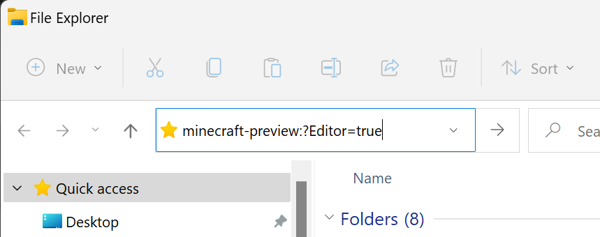

# How to get Minecraft Editor

Minecraft's Bedrock Editor is a multiblock editing experience that helps you easily craft high-quality worlds in Minecraft Bedrock. The Editor is available in the Preview edition of Minecraft Bedrock, and you get to the user interface through a shortcut you create on your computer desktop.

> [!IMPORTANT]
> The Editor is in early preview and we're working to add more capabilities.
> It will change significantly as we get feedback from creators like you.
> Also, the images of Editor in this document might vary a little from what you have on your screen.

First, we are going to install Minecraft Preview. Then, we will create the shortcut that launches Editor. After that, we will open Editor and make sure it works.

--------

In this tutorial, you will learn the following:

> [!div class="checklist"]
>
> - How to install Minecraft Preview.
> - How to create the shortcut that launches Editor.
> - How to tell if everything is working correctly.

--------

## Requirements

To get started, you need the following:

- A Windows 10 (or higher) computer
- Keyboard and mouse

> [!IMPORTANT]
> Editor is not available on mobile.

## Install Minecraft Preview

You will need the latest installation of Minecraft Preview. To learn more about what it is and where to get it, here is an [article about Preview on Minecraft.net](https://aka.ms/PreviewFAQ).

If you have the Minecraft Launcher installed, it is also possible to install Preview from there.

You can get Minecraft Launcher from the Microsoft Store.

After you install Preview, launch it normally to make sure everything is successfully installed.

Looks good? Great. Close Preview and move on to the next step.

## Make a Shortcut

1. Right-click on your desktop, select **New** from the dropdown, and choose to create a new **Shortcut**.  

2. For the location of the item, enter the following:

    **`minecraft-preview:?Editor=true`**

    This is case-sensitive and needs to match exactly.

3. Click **Next** and give your shortcut a name like **Minecraft Editor**.

4. Click **Finish**. Your Editor shortcut has been created!

You should see the shortcut created on your desktop and it should automatically have the Minecraft icon if you set it up correctly. If the icon does not populate, don't worry.

5. Double-click the shortcut to launch the Editor.

You should see Editor launch and display the "Create New Project" screen.

Great job! You're ready to create a project!

> [!NOTE]
> If you uninstall Preview, but you plan on installing a newer version of Preview later, you can leave the Editor shortcut on your desktop and it should work with the new version.

## Troubleshooting

### I can't get into the Editor when I open Minecraft

You can only access the Editor through the desktop shortcut and only if you have Preview installed. If you are attempting to access the Editor through Bedrock Preview or regular Minecraft directly, it will not work.

### I added the desktop shortcut, but it won't open the Editor. What's going on?  

Three things to check:  

- Is the desktop shortcut set up correctly? Remember it is case-sensitive and needs to match exactly. Ensure it says the following: **`minecraft-preview:?Editor=true`**. 

- Did you install Bedrock Preview? If not, you need to do that. 

- Do you have both Bedrock Preview and Bedrock (Retail) installed? You may have selected a checkbox that says "Always open" for Bedrock (Retail). To fix this, perform the following steps:

    1. Press **Windows + I** to open the Settings app.

    1. Select **Apps** and click **Default apps**.

    1. Scroll down to **Minecraft** and select it.

    1. Scroll down and find the **MINECRAFT** entry (it should also say Minecraft | URL:minecraft) and click it.

    1. In the pop-up, select **Minecraft** and click **OK**.

- If you would like to open Editor a different way, you can open a file explorer window and enter **`minecraft-preview:?Editor=true`** into the path:

## What's Next?

Now that you have Minecraft Bedrock Editor, you can learn more about the different parts (recommended)...

> [!div class="nextstepaction"]
> [Editor Overview](EditorOverview.md)

... or, you can jump right into the tutorial.

> [!div class="nextstepaction"]
> [Editor Tutorial](EditorTutorial.md)
