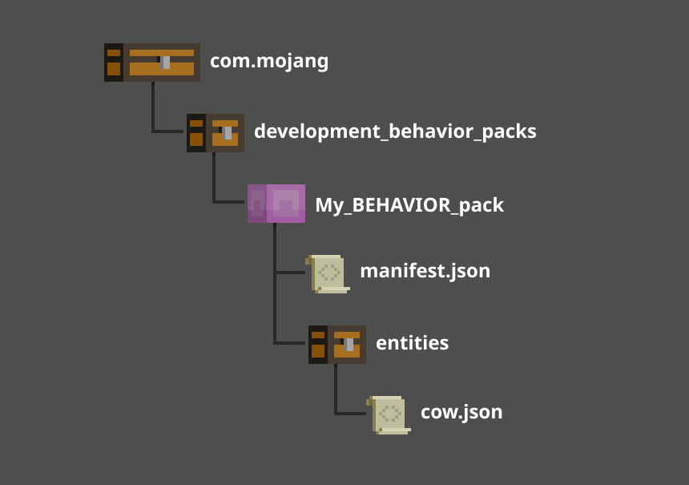

# Entity Behavior (AI) Components

Now that we know how to use entity components to create a behavior pack, let's take a look at one of the specific ways we can use those components to get our custom entities to behave a certain way. Behavior AI components determine how entities act in the game by controlling how they move, interact with objects or other entities, or respond to certain events. Here are some key points to keep in mind:

- Behavior components are defined in `.json` files as part of a behavior pack.
- Behavior components are defined under the `minecraft:behavior` property in the entity's `.json` file.
- Behavior components are included under an entity's `behavior` or `goals` section to define specific actions or responses to events.
- Minecraft Bedrock edition includes many built-in behavior components. For a full list, see [Entity Documentation - AI Goal Component List](../Reference/Content/EntityReference/Examples/AIGoalList.md).
- Many behavior components accept parameters to fine-tune an entity's actions or responses to events, such as `speed_multiplier` or `target_distance`.

## Behavior Components Structure

As part of a behavior pack, behavior components are defined within an entity's `.json` file inside the behavior pack folder. Here is an example of the structure of a behavior pack:



Let's use the `cow.json` file shown in this example to learn more about adjusting the cow entity's behavior in game.

### Components vs Goals

Behavior components will work whether they are included in the `components` section or the `goals` section of an entity's `.json` file. The main difference between components and goals is that goals operate using a priority system.

When used as `components`, entity behaviors are evaluated independently and that different behaviors might be evaluated simultaneously. This can either help to create a seamless behavior, where two harmonious actions are performed at the same time, or it can cause two incompatible behaviors to compete. In the case where incompatible behaviors compete, you may see errors or notice that your entity's behaviors don't work, at all.

When behaviors are used as `goals`, they work on a priority system. Goals with a lower priority value are executed first - so a goal with a `priority` of `1` would execute *before* a goal with a `priority` of `2`. Goals also **resolve** on the same prioirty, meaning that, even if a goal with a higher `priority` value meets the conditions for execution, the goal with the lower `priority` value would resolve first before the next goal is allowed to start. This helps to create a sequence of behaviors and seamless switching between goals.

Components and goals are both effective uses for behavior components - neither one is better than the other, but the most important thing to remember is how the difference in execution and resolution can affect an entity's behavior in game. With this knowledge, let's try working with behavior components.

## Adding Custom Behavior

By default, the cow is a pretty passive mob. It doesn't move very fast and really only reacts when it is attacked. What should we do if we want to make the cow a bit more wary of its surroundings? Let's try making a cow that gets suspicious of entities that come within a certain distance of it and keep a watchful eye on the target.

```json
"minecraft:entity": {
    "components": {
        "minecraft:type_family": {
            "family: ["cow"]
        }
    },

    "goals": [
        {
            "goal": "minecraft:behavior.nearest_attackable_target",
            "priority": 1,
            "entity_types": [
                {
                    "filters":{
                        "all_of": [
                            {
                                "test": "is_family",
                                "subject": "other",
                                "operator": "!=",
                                "value": "cow"
                            }
                        ]
                    },
                    "max_dist": 25,
                    "must_see": true,
                    "must_reach": false
                }
            ]
        }
        {
            "goal": "minecraft:behavior.look_at_target",
            "priority": 2,
            "look_distance": 25
        }
    ]
}
```

By adding the following goal to the `cow.json` file, we have created a suspicious cow. Let's break it down:

- `"goal": "minecraft:behavior.nearest_attackable_target"` - This goal and its parameters tell the cow to target the nearest entity within 25 blocks that is not a cow. 
    - We use the `entity_types` parameter and `filters` to test any entities within 25 blocks to see if their entity family type is anything other than `cow`.
    - We use the `goals` section's ability to prioritize this action so that the cow will focus on finding a target first, using the `priority` parameter and setting it to `1`.
- `"goal": "minecraft:behavior.look_at_target"` - This goal tells the cow to look at its current target. 
    - Because we don't set any parameters besides `priority` and `look_distance`, the cow will continue to look at its selected target.

Because we set the `priority` of the second goal to `2` (a higher value than the `priority` of the previous goal), the cow will select a new target if a different entity (that is not a cow) gets closer than its current target. If we had reversed these priorities, then the cow would continue to look at the first target until it either died or moved outside the 25 block range. By paying close attention to the nuances of behavior components, we can create specific types of entity behaviors and tailor the circumstances that cause entities to execute those behaviors.