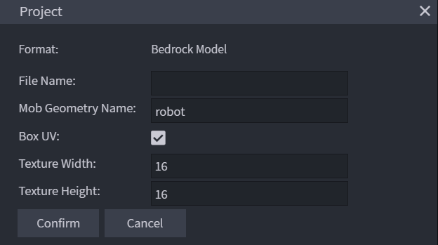
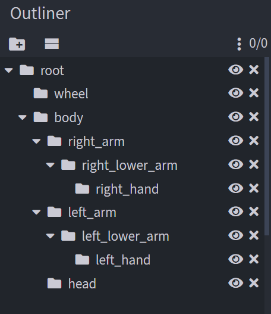
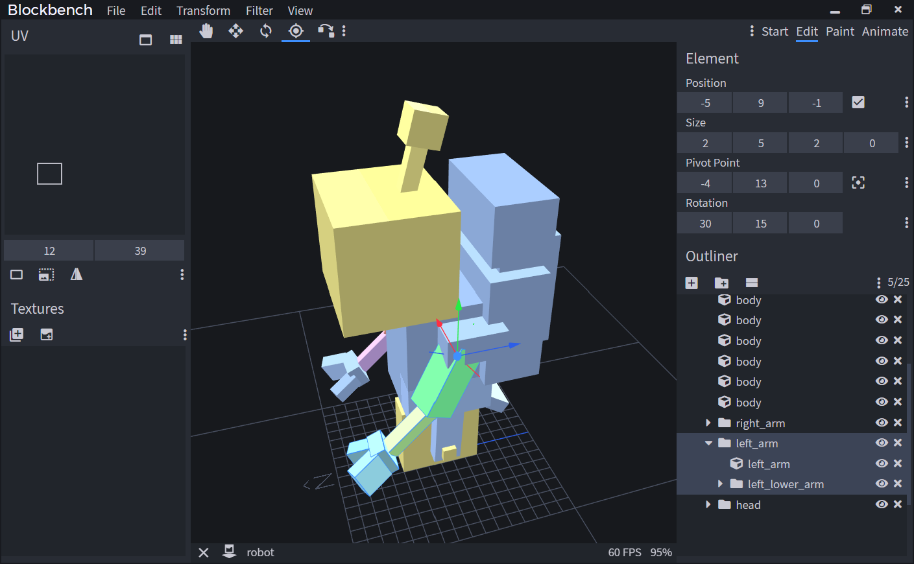
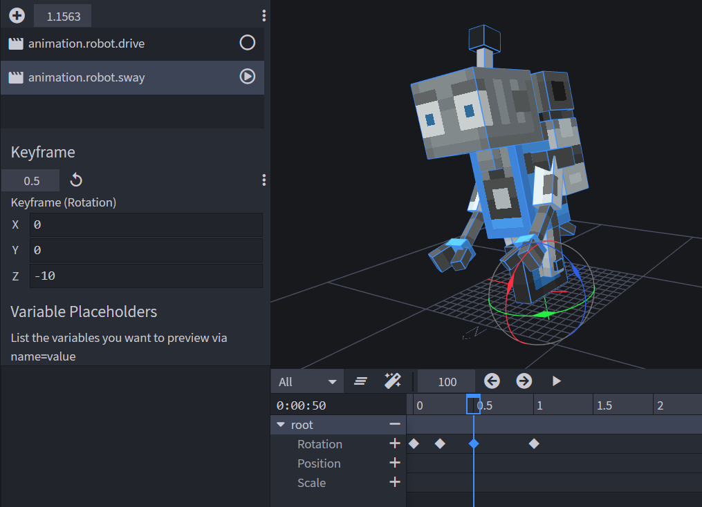

# Entity Modeling and Animation

In this guide, we'll go through the basics of creating a model and creating animations for Minecraft: Bedrock Edition. As an example, we'll model and animate a small robot, which was started in the [Introduction to Add Entity](IntroductionToAddEntity.md) article.

In this tutorial you will learn the following:

> [!div class="checklist"]
>
> - How to create a model for an entity using [Blockbench](https://blockbench.net/).
> - How to apply textures and animations to a model.

### Requirements

It’s recommended that the following be completed before beginning this tutorial.

- [Introduction to Add Entity](IntroductionToAddEntity.md)

## Model

Models in Minecraft use a specific format that uses JSON to define the shape. Each model uses a texture that can be assigned through render controllers.

To create the model and texture, we're going to use [Blockbench](https://blockbench.net/), a 3D modeling program that can create models for the Bedrock Edition of Minecraft.

### Setting Up the Model

When you first open Blockbench, you'll see a list of available model formats. Select **Bedrock Model**. You'll see a dialog about the basic settings for the project.



The important part is **Mob Geometry Name**. Here, we'll enter a unique name for the model. The best practice is to use snake_case — so only lower case letters, numbers and underscores as well as dots. Spaces and other special characters aren't supported. For our model, we'll just input `robot`.

We can leave the field for the file name empty for now as we'll later define it when we export the model. The Box UV setting and the texture size can also be left at default because we'll change them later. The confirm button will save these settings.

### Bone Structure

The first thing to consider when making a model is the bone structure. Bones are the part of the model that can be animated, and they can be arranged in an arbitrarily deep hierarchy. Each bone itself is invisible but can contain cubes that will shape the model.



A good practice is to use a root bone for each model and put everything else inside it. This means that you'll later be able to animate the entire model at once, as well as specific parts of it. Create a new group in Blockbench. “Groups” and “Bones” are essentially the same in this context.

You can right-click the group or press **F2** to rename it. The name for a bone should be `snake_case` (so only including lower case letters, numbers, and underscores). Each bone name has to be unique for future reference through animations.

While we build up the model in the following steps, make sure the structure is set up correctly. You can drag around groups to change the order or drop them into other groups. This screenshot shows the correct bone structure of the finished model.

### Shape

You can now start to create the shape of the model. Create new cubes and use the move, resize, and rotation tools to adjust it. A trick to add cubes faster is to select an already positioned cube and press **Ctrl + D** (duplicate) to get a copy.



You can move cubes more precisely by holding either shift, control, or both at the same time. Depending on the modeling style, it can make sense to completely stick to the grid or only move the cubes in half or quarter increments.

Bedrock Edition models use Box UV mapping by default. That means that the texture mapping will only use full numbers and will round down to a smaller number if necessary. To avoid stretched or invisible faces, make sure the size of cubes sticks to full numbers.

If you're working on symmetrical parts like limbs, create them on the right-hand side first and mirror them to the left later. You can either mirror them before or after creating the texture depending on whether you want the same texture on both sides.

When you're creating bones for moving parts of the model, always think about which point the part should rotate around. Select a bone and press **P** to get the Pivot tool. This tool allows you to move the pivot point of the bone. You can also use this tool on cubes if you want to rotate those around a specific point.

## Texturing

### Templates

Once the shape of the model is done, you can create a texture template. The template is a texture that has a unique space for every cube and every face of the model. You can also UV map cubes manually, but creating a template does the work for you and finds the most space-efficient layout. Remember that Minecraft doesn’t like high-resolution images.

When creating a texture, enter `robot` as the texture name and check the Template option. In the template dialog, select your resolution. 16x is the default resolution of Minecraft, but you can go higher if you want.

### Base Color

Once the template is created, you can move to the Paint tab in Blockbench. This will reveal all the tools you have to modify the texture. Select the Paint Bucket tool and set the fill mode next to the tool to Cube. Select a color in the color panel on the right side. Now you can go over your cubes and color them in individual base colors.

### Details

You can now start to work on the texture. If you're more comfortable with texturing in your image editing program, you can now save the texture by clicking on the save icon next to the texture. Then, you can open it in your image editor. Any changes will appear in Blockbench as soon as you save the texture. But, if you prefer to work directly on the model, you can use the built-in paint tools in Blockbench.

There are a few tricks to use the paintbrush in Blockbench more efficiently:

- To paint larger areas, you can increase the brush size.
- You can paint directly in the 3D preview, or you can paint it in the UV editor on the left side.
- If you want to create a straight line, click on the beginning of the line, then hold shift on the end of the line.
- To make sure you don’t miss covered spots that might be revealed through animations, you can hide cubes. Just click on the eye icon in the outliner.

## Animations

Animations can animate the shape of your model, but they can also play sounds and particle effects. In the following section, we'll take a look at how to add an animation to your entity, how to create your own animation in Blockbench, and finally, how to use animation controllers.

### Using Default Animations

The vanilla resource pack contains generic animations that you can reference in your own pack without actually copying the files. These animations can be a good starting point for vanilla-like entities, but of course, custom animations are a lot more powerful. You can find all vanilla animations in the vanilla resource pack [here](https://aka.ms/resourcepacktemplate).

In this example, we'll be using the *look at* animation. This animation will rotate the “head” bone. That’s why it's important that the head of the model uses the exact same name.

Also, the entity will need a *look at* component in its behavior file. These are the looking components from the cow. You can play around with the numbers if you like.

```json
            "minecraft:behavior.look_at_player": {
                "priority": 7,
                "look_distance": 6,
                "probability": 0.02
            },
            "minecraft:behavior.random_look_around": {
                "priority": 9
            }
```

Now that the behavior is set up, we'll head to the client entity file. Make sure that the format version for this file is set to 1.10.0 or higher for this to work.

First, let’s link the animation. This is done in the animations section in the description tag of the entity. The second part here (`animation.common.look_at_target`) is the **global identifier** of the animation. This name is defined in the animation file and is valid anywhere in this pack or any other pack. The first part (`look_at_target`) is the **short name**. This is how we reference the animation within the entity file, and it's only valid in the scope of this entity.

```json
            "animations": {
                "look_at_target": "animation.common.look_at_target"
            }
```

Now, we need to play the animation. For simple animations that are always active while the entity exists, this is as simple as listing the short name in the scripts/animate array in the client entity file.

```json
            "scripts": {
                "animate": ["look_at_target"]
            }
```

If you now test the robot in-game, you'll see that it will turn its head and look around.

### Creating an Animation

In the [add entity guide](IntroductionToAddEntity.md), we created a small driving animation for the robot. Let’s now create an animation that plays when the robot loses the ground under its feet (wheel). Before creating an animation, always check if there's a way to trigger it. We can easily trigger a lose-balance animation for this because we can just use the Molang query `query.is_on_ground` to test when the robot no longer touches the ground.



Simple animations can be created in the text editor, but for more complex, keyframe-based animations, Blockbench makes this easier. Open the model and switch to the **Animate** tab in the top-right corner. Create a new animation in the **Animations** panel on the left side and name it `animation.robot.sway`. You can also choose a longer name or include a namespace to ensure compatibility with other addons. But please keep in mind that animation identifiers only support snake_case, strings and dots, but not colons or dashes.

Once you have set up the animation, you can start animating. Select the root bone of your entity. Move your time cursor in the timeline to 0 seconds and click the plus icon next to Rotation. This will create a new keyframe at the new position. Now move the cursor to about 0.2 seconds. Select the rotate tool and rotate the whole robot to the left slightly. This will automatically generate a new keyframe. On the left side of the screen, you can see the values. Rotate it to about 10 degrees.

Now move forward in time to about half a second and rotate the root bone to the other side. Finally, move to 1 second and rotate it back to 0.

If you now move the cursor to the beginning and press play, you'll see a short sway animation. Now that you know how to animate, you can refine the animation and, for example, let the antenna swing a bit.

Finally, press **Ctrl + S** to save the model and **animation**. Save the animation in the `animations` folder of the resource pack as `robot.animation.json`.

Now reference and play the animation in the client entity file as we've done with the *look at* animation. But now we'll only play the sway animation under the condition that the robot isn't on ground. This will look something like this:

```json
            "animations": {
                "look_at_target": "animation.common.look_at_target",
                "sway": "animation.robot.sway"
            },
            "scripts": {
                "animate": [
                    "look_at_target",
                    {"sway":"!query.is_on_ground"}
                ]
            }
```

If you now spawn a robot and push it down an edge, the animation will play. But it will only play once.

The reason for that is the fact that the query in the scripts section is only a blend value for the animation. It defines “how much” the animation plays, not when it plays and when it doesn't. That’s why the animation will start playing once `!query.is_on_ground` is `true/1`, but it will never stop playing. It will just fade out once the value is `false/0` again, and the next time it will fade into the animation again. It won’t play from the start again.

We can use this behavior quite well for static or looping animations that have no beginning and no end. But if we want to start the animation every time the query changes, we need a different approach. This is where animation controllers come in.

### Animation Controllers

Animation controllers work with states. An animation controller can have an unlimited number of states. Only one of these states is active at a time. The controller can transition to other states through Molang expressions. Each state can play a distinct set of animations, sounds, and particle effects.

Each time the entity is loaded by the client, for example, when joining a world, the animation controller starts in an initial state. This state is called `default` by default.

To set up the animation controller, create a new folder in the resource pack called `animation_controllers`. Inside the folder, create a new file called `robot.animation_controllers.json`. Create an animation controller like this:

```json
{
    "format_version": "1.10.0",
    "animation_controllers": {
        "controller.animation.robot.ground": {}
    }
}
```

Now, we need to create an initial state. This state is called `default` by default. The animation controller will always start in this state when the entity is loaded. For example, after rejoining the world.

The only job of this state is to transition to the swaying state once the entity is no longer on the ground. We'll use a transition for this. The controller will switch to that state as soon as the `query.is_on_ground` query is no longer true.

```json
{
    "format_version": "1.10.0",
    "animation_controllers": {
        "controller.animation.robot.ground": {
            "states": {
                "default": {
                    "transitions":[
                        {"swaying": "!query.is_on_ground"}
                    ]
                }
            }
        }
    }
}
```

Now, we’ll add the swaying state. This state will play the swaying animation and after that, reset the controller by going back to the default state. We can use the query `query.all_animations_finished` to only transition after the animation has played. This query will only return true once all animations of the current state have finished playing. In addition, we will test if the entity is on the ground again.

```json
{
    "format_version": "1.10.0",
    "animation_controllers": {
        "controller.animation.robot.ground": {
            "states": {
                "default": {
                    "transitions":[
                        {"swaying": "!query.is_on_ground"}
                    ]
                },
                "swaying": {
                    "animations":[
                        "sway"
                    ],
                    "transitions":[
                        {"default": "query.all_animations_finished && query.is_on_ground"}
                    ]
                }
            }
        }
    }
}
```

Now we need to link the animation controller to our entity. Animation controllers can be linked the same way as animations in the client entity file. The controller is linked in the animations section and played in scripts.

```json
            "animations": {
                "look_at_target": "animation.common.look_at_target",
                "sway": "animation.robot.sway",
                "ground": "controller.animation.robot.ground"
            },
            "scripts": {
                "animate": [
                    "look_at_target",
                    "ground"
                ]
            }
```

If you test this in-game, the animation now works more than once. But, depending on the length of your animation, you might notice that if the robot loses the ground two times with a short interval, the second time it won’t play the animation. That’s because the first animation hasn’t finished yet, so the controller hasn’t been reset to the default state.

We'll take a look at a different solution that would solve this problem. By removing the `all_animations_finished` query, we'll quit the swaying state as soon as the entity lands again. If we test this again, the animation will stop very abruptly.

To prevent this, we can use the option `blend_transition`, which allows us to smoothly transition out of the animation in a set time. This is one of the most important properties of animation controllers and even allows us to create a simple transition between two fixed poses of an entity.

Ultimately, which solution is best depends on the use case. In this example, the animation fades out smoothly once the robot lands on the ground again.

```json
                "swaying": {
                    "animations":[
                        "sway"
                    ],
                    "transitions":[
                        {"default": "query.is_on_ground"}
                    ],
                    "blend_transition":0.5
                }
```

## What's Next?

We've now learned how to create a model that's ready for animations and how to texture it. We've also linked an existing animation to the model and created our own animation in Blockbench.

If you want to add more functionality beyond the looks of the entity, then check out the tutorial on entity behaviors.

> [!div class="nextstepaction"]
> [Entity Behavior Introduction](EntityBehaviorIntroduction.md)
