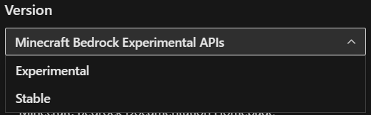
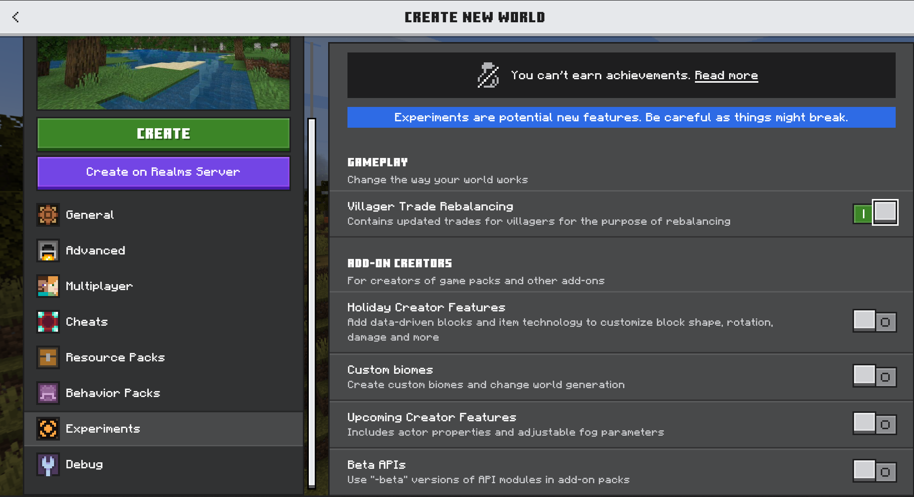
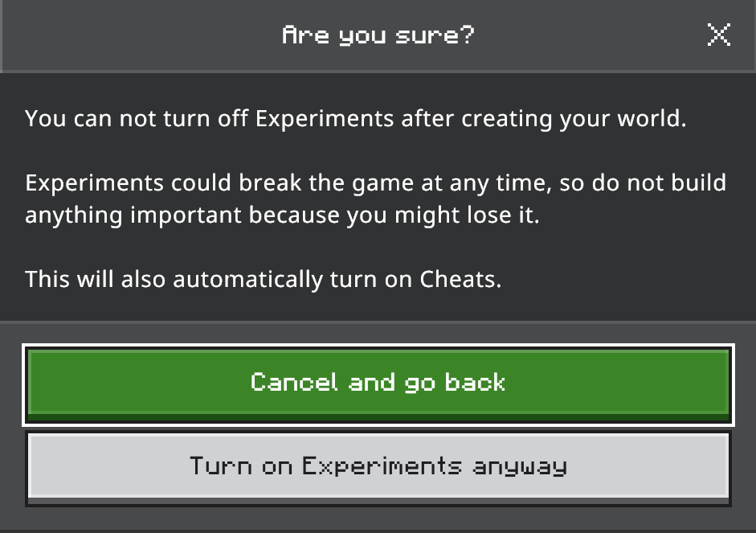
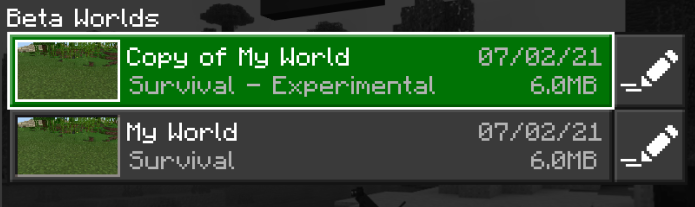
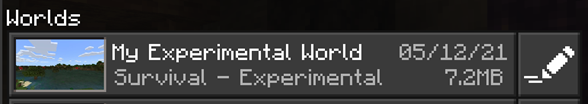

# Experimental Features in Minecraft: Bedrock Edition

> [!NOTE]
> To see full documentation about experimental features and APIs, select the **Minecraft Bedrock Experimental APIs** option or use [this link](/minecraft/creator/documents/experimentalfeaturestoggle?view=minecraft-bedrock-experimental).

With each retail version of Minecraft: Bedrock Edition, there are a few features that are currently in an experimental state. Experimental Features can be toggled on for creators who are interested in testing the latest features offered in the preview, and retail versions of Minecraft.

> [!NOTE]
> The Experiments toggle list is subject to frequent changes and could have entirely different options from the ones in your own version of Minecraft. Also, the screen shots shown here might look different.

## Experimental Features available in Minecraft: Bedrock Edition

There are two sets of experimental features available, depending on whether you are using a retail version of Minecraft or the latest version of Minecraft Preview.

### Retail

These are the currently available Experimental toggles in the **1.21.20** retail build at the time of this writing.

GAMEPLAY - Change the way your world works

| Experimental Toggle | Description |
|:------|:------|
|Villager Trade Rebalancing |Contains updated trades for villages for the purpose of rebalancing|

ADD-ON CREATORS - For creators of game packs and other add-ons

| Experimental Toggle | Description |
|:------|:------|
|Holiday Creator Features | Add data-driven block and item technology to customize block shape, rotation, damage and more |
|Custom Biomes| Create custom biomes and change world generation |
|Upcoming Creator Features | Includes adjustable fog parameters |
|Beta APIs| Use "-beta" versions of API modules in add-on packs |
|Creator Cameras: New Third Person Presets | Contains new third person over the shoulder follow-orbit camera preset |
|Render Dragon Features for Creators | Enable the deferred rendering pipeline. Requires a PBR-enabled resource pack and compatible hardware. |

### Preview

These are the currently available Experimental toggles in the **1.21.20.23** preview build at the time of this writing.

GAMEPLAY - Change the way your world works

| Experimental Toggle | Description |
|:------|:------|
|Villager Trade Rebalancing |Contains updated trades for villages for the purpose of rebalancing|

ADD-ON CREATORS - For creators of game packs and other add-ons

| Experimental Toggle |Features |
|:------|:------|
|Custom Biomes| Create custom biomes and change world generation |
|Upcoming Creator Features | Includes adjustable fog parameters |
|Beta APIs| Use "-beta" versions of API modules in add-on packs |
|Creator Cameras: New Third Person Presets | Contains new third person over the shoulder follow_orbit camera preset|
|Creator Cameras: Focus Target Camera | Enables behavior for the existing free camera to target an entity|
|Render Dragon Features for Creators | Enable the deferred rendering pipeline. Requires a PBR-enables resource pack and compatible hardware.|

## How do I activate an Experimental Features toggle for my world?

You can activate an experimental toggle for any of your new or existing worlds.

> [!WARNING]
> Activating experimental features that are still under development means that your world might crash, break, or not work with future updates.

If you're planning to build content that you want to share with the community, it would be best to do it in a non-experimental world.

### Toggle Experimental Features in a New World

If you are building a new world from scratch to test experimental features, you can toggle which features you want enabled in the **Game** Settings.

1. Under **Game** settings, navigate down to **Experiments** and select a toggle to enable the feature.

   

2. When you get the popup asking if you're sure, select **Turn on Experiments anyway**.

   

### Toggle Experimental Features in an Existing World

If you want to add experimental features to an existing world, open that world's game settings and activate the toggles just like you would for a new world.

> [!NOTE]
> A copy of your world will be generated automatically after you activate an experimental feature toggle. You can also manually create copies of your world as an extra precaution, in case something goes wrong.

After you select **Activate Experiments**, a copy of your existing world will be created. The copy will have the same name as the original world with "Copy of..." added in front of it.

### Verify that the World has Experimental Features Enabled

After you've created a world that has an experimental feature toggle enabled, your world will get a **tag** next to the game mode in your Worlds list that says **Experimental**.

Another way to identify if your world is using experimental toggles is to visit the settings for your world. In the **Game** world settings, scroll down to the **Experiments** section to see which experiments are enabled.

> [!IMPORTANT]
> Worlds that use experimental features cannot be restored to a non-experimental state.

## What's Next?

If you like experimenting and testing things in Minecraft, you could learn more about the GameTest Framework.

> [!div class="nextstepaction"]
> [Introduction to the GameTest Framework](GameTestGettingStarted.md)
