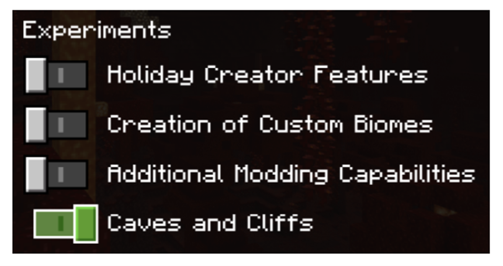
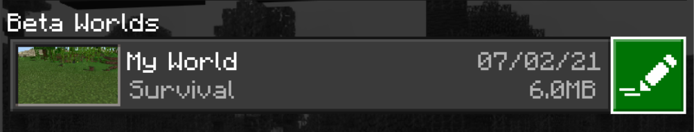

# Experimental Features in Minecraft: Bedrock Edition

With each retail versions of Minecraft: Bedrock Edition, there are a few features that are currently in an experimental state. Experimental Features can be toggled on for creators who are interested in testing the latest features offered in both the beta and retail versions of Minecraft.

## Experimental Features available in Minecraft Bedrock Edition

There are two sets of experimental features available to use depending on if you are using a stable (retail) version of Minecraft, or a beta version of Minecraft.

### Retail

Listed below are the currently available Experimental Features in the latest retail build.

| Experimental Toggle |Features |
|:------|:------|
|Caves & Cliffs Experimental |Features that are under development and intended to release in Caves & Cliffs Part 2.|
|Holiday Creator Features |Data-driven block and item features. We are receiving feedback on these features from Marketplace creators and map-makers.|
|Creation of Custom Biomes|Exposing parameters for biome generation to creators, enabling them to create their own unique biome configurations. |
|Additional Modding Capabilities |Enables an early version of an API for creators. A newer version is in development. This toggle remains to support those who are currently using it. |
|Upcoming Creator Features |Experimental features including actor properties and fog volumes. We are receiving feedback on these features from Marketplace creators and map-makers.|
|Enable GameTest Framework |Provides capabilities for creators to validate their worlds and add-ons in Minecraft through a series of contained tests. |

### Beta

Listed below are the currently available Experimental Features in the latest beta build.

> [!NOTE]
> Difference between available features are marked in **Bold**.

| Experimental Toggle |Features |
|:------|:------|
|Caves & Cliffs Experimental |Features that are under development and intended to release in Caves & Cliffs Part 2, **including new and improved terrain generation and 3D biomes.**|
|Holiday Creator Features |Data-driven block and item features. We are receiving feedback on these features from Marketplace creators and map-makers.|
|Creation of Custom Biomes|Exposing parameters for biome generation to creators, enabling them to create their own unique biome configurations. |
|Additional Modding Capabilities |Enables an early version of an API for creators. A newer version is in development. This toggle remains to support those who are currently using it. |
|Upcoming Creator Features |Experimental features including actor properties and fog volumes. We are receiving feedback on these features from Marketplace creators and map-makers.|
|Enable GameTest Framework |Provides capabilities for creators to validate their worlds and add-ons in Minecraft through a series of contained tests. |
|**Experimental Molang Features** |**New container for Molang experimental queries and language features that aren't tied to other experimental toggles.** |

## How do I activate an Experimental Features toggle for my world?

You can activate an experimental toggle for any new world you create and for existing worlds.

> [!WARNING]
> Activating experimental features that are still under development means that your world might crash, break, or not work with future updates.

If you're planning to build content that you want to share with the community, it would be best to do it in a non-experimental world.

### Toggle Experimental Features in a New World

If you are building a new world from scratch to test experimental features, you can toggle which features you want enabled in the **Game** Settings.

1. Under **Game** settings, navigate down to **Experiments** and select a toggle to enable the feature.

   

2. When you get the popup asking **Activate Experimental Gameplay?**, select **Activate Experiments**.

   

### Toggle Experimental Features in an Existing World

If you want to add experimental features to an existing world, you can edit the game settings to similarly to the steps taken when adding experimental features in a new world.

> [!NOTE]
> While a copy of your world is generated automatically when activating an experimental feature toggle, in the event of something going wrong, you're also able to create copies of your world manually as an extra precaution.

1. Select the world you want to add experimental features to and select the **Edit** button.

   

2. Under **Game** settings, navigate down to **Experiments** and select a toggle to enable the feature.

   

3. When you get the popup asking **Activate Experimental Gameplay?**, select **Activate Experiments**.

   

Once you select **Activate Experiments**, A copy of your existing world will be created that will get the same name as the original world with “Copy of...” added in front of it.

:::image type="content" source="Media/ExperimentalFeatures/CopyOfWorld.png" alt-text="Image showing a duplicated world":::

### Verify that the World has Experimental Features Enabled

Once you’ve created a world that has an experimental feature toggle enabled, your world will get a **tag** next to the game mode in your Worlds list that says **Experimental**.

:::image type="content" source="Media/ExperimentalFeatures/SurvivalExperimental.png" alt-text="image showcasing a survival world that has the Experimental tag applied":::

Another way to identify if your world is using experimental toggles is to visit the settings for your world. On the **Game** world settings, scroll down to the **Experiments** section to see which experiments are enabled.

> [!IMPORTANT]
> Worlds that use the experimental features toggle cannot be restored to a non-experimental state.

## What's Next?

Now that you have learned about experimental features within Minecraft, you can learn how to build content utilizing Holiday Creator Features such as a custom block.

> [!div class="nextstepaction"]
> [How to add a Custom Block](CustomBlock.md)

To learn more about the GameTest Framework and how to get started, you can select the link below to run various GameTests in-game.

> [!div class="nextstepaction"]
> [Introduction to the GameTest Framework](GameTestGettingStarted.md)
