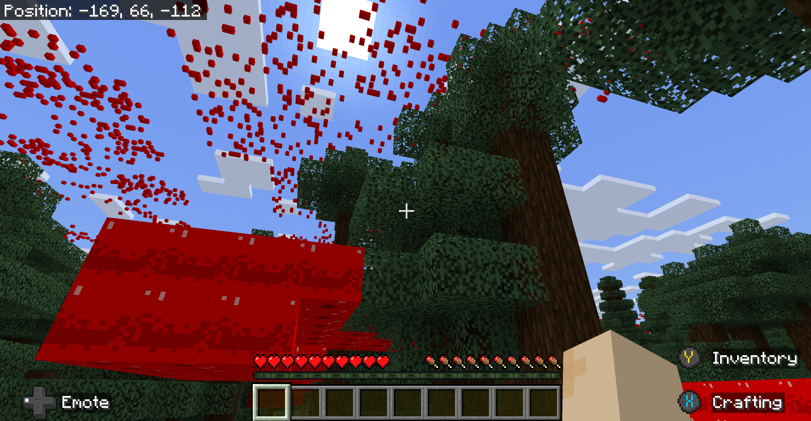

# Features Types

When thinking about features, it may be helpful to consider grouping them according to what each one has in common, how they are used, and how they are different from other features.

This list is taken from the [Feature List](../Reference/Content/FeaturesReference/Examples/FeatureList.md) and is arranged with the categories sorted from the (arguably) least to most complex.

| Category | Features | Use |
|:-----------|:-----------|:--------|
| Natural Features | [fossil](../Reference/Content/FeaturesReference/Examples/Features/minecraftFossil_feature.md)  [geode](../Reference/Content/FeaturesReference/Examples/Features/minecraftGeode_feature.md)  [growing plant](../Reference/Content/FeaturesReference/Examples/Features/minecraftGrowing_plant_feature.md)  [ore](../Reference/Content/FeaturesReference/Examples/Features/minecraftOre_feature.md) [partially exposed blob](../Reference/Content/FeaturesReference/Examples/Features/minecraftPartially_Exposed_blob_feature.md) [tree](../Reference/Content/FeaturesReference/Examples/Features/minecraftTree_feature.md) [vegetation patch](../Reference/Content/FeaturesReference/Examples/Features/minecraftVegetation_patch_feature.md)  | Adds a feature similar to a vanilla feature to the world. |
| Terrain Features | [cave carver](../Reference/Content/FeaturesReference/Examples/Features/minecraftCave_carver_feature.md)  [nether cave carver](../Reference/Content/FeaturesReference/Examples/Features/minecraftNether_cave_carver_feature.md)  [underwater cave carver](../Reference/Content/FeaturesReference/Examples/Features/minecraftUnderwater_cave_carver_feature.md)  | Cuts holes into underground terrain. |
| Block Placers | [multiface](../Reference/Content/FeaturesReference/Examples/Features/minecraftMultiface_feature.md)  [single block](../Reference/Content/FeaturesReference/Examples/Features/minecraftSingle_block_feature.md)  [structure template](../Reference/Content/FeaturesReference/Examples/Features/minecraftStructure_template_feature.md)  | Places a feature relative to the surface of a block. |
| Conditional Placement | [scatter](../Reference/Content/FeaturesReference/Examples/Features/minecraftScatter_feature.md)  [search](../Reference/Content/FeaturesReference/Examples/Features/minecraftSearch_feature.md)  [snap to surface](../Reference/Content/FeaturesReference/Examples/Features/minecraftSnap_to_surface_feature.md)  [surface relative threshold](../Reference/Content/FeaturesReference/Examples/Features/minecraftSurface_Relative_threshold_feature.md)  [weighted random](../Reference/Content/FeaturesReference/Examples/Features/minecraftWeighted_random_feature.md)  | Places features according to a given criteria for placement. |
| Grouping | [aggregate](../Reference/Content/FeaturesReference/Examples/Features/minecraftAggregate_feature.md)  [sequence](../Reference/Content/FeaturesReference/Examples/Features/minecraftSequence_feature.md)  | Provides a way to place features relative to other features. |

## Natural Features

The features in the 'Natural Features' category are things a player can see when playing a vanilla Minecraft world. Trees, and growing plants are common and easily visible from the moment a player spawns in, although the schema for trees is richly complex. If a creator wants to add a new type of ore or a new kind of geode, this is where they should start. 

Aside from trees, growing plants, and vegetation patches, this is the category to start if you want to put your own ore, geodes, fossils, and even something similar to the partially exposed blocks of magma rock that bubble on the ocean floor.

The names of these features immediately evoke their use for someone beginning a journey to work with features.

This is just a typical image from Minecraft. As a creator, you can create your own versions of these features: trees, flowers, growing plants, and a pumpkin.

## Terrain Features

The three cave carver features (cave, underwater cave, and nether cave) obviously belong together, they're just intended for different parts of Minecraft and the resulting caves are filled with air or water source blocks, accordingly.

Helpful hint: before you start working with cave carvers, take a look at the [structure block tutorial](../Documents/Structures/IntroductionToStructureBlocks.md). One of the ways to use a structure block is take a "core sample" of the world. You could do this to see if the sample has your intended cave in it. 

You could also change the replacement blocks from "air" to something like "diamond blocks" so you can tell your caves from the naturally occurring ones.

## Block Placers

Using single block, multiface, and structure template features make sense for placing a single block (like a carved pumpkin) or something like glow lichen on multiple surface of a block. 

After you make it through the [structure block tutorial](../Documents/Structures/IntroductionToStructureBlocks.md), using the **structure_template** feature to put copies of your structure into a world is a logical next step. In fact, if you don't mind a bit of obviously "cut and paste" appearance, you could put your naturally occurring features into a structure and place it in the world like that.

## Conditional Placement

If you do not want a "copy and paste" appearance to your features, this is the category for you. These are the features that handle the complexity of placing your simpler features in a world. After you create your own tree, flower, vine, or whatever, you can search for scatter them in a world or snap them to the ceiling of a cave according to how you want them placed.

In fact, you can search for the perfect place for them to go, place them relative to the surface of the ground, and control the chances they will be spawned in and thus control their density.

Different placement features can search according to criteria (such as viable block type) and calculate the chance that the placement will occur. If you want glow lichen to appear on the 5 percent of the walls or ceiling of a cave, then conditional placement features, such as **weighted_random** handle that for you.

It depends on the effect you're going for.

## Grouping

Finally, the **aggregate_feature** and **sequence_feature** functionality comes in when you want to control how custom features are placed relative to other custom features. 

Although the code for these two looks very similar, they are basically just lists of the features to be placed, they work quite differently.

Features being placed in a sequence rely on the successful placement of the feature listed in the code before it. For example, if a creator wants to celebrate the science of grafting trees by making an oak tree grow apples, it's going to take a bit of consideration about the timing. The oak trees will need to exist so that Minecraft can find them. After an oak tree is successfully found, an apple block is attached to it. 

The key is: in a **sequence_feature**, the position of the successfully placed feature is used as the input position for where the next successful feature will be placed.

If you change the sequence feature in the behavior pack to be an aggregate, the placement of apple blocks no longer relies on finding a tree. They just *happen.*

The features listed in the aggregate_feature all use the same starting position and they do not rely on each other. Each feature in the aggregated list has its own placement criteria, so certain features may be placed and others will not.

For example, an aggregate list containing sugar cane and bamboo would place these plants differently according to their placement criteria. Sugar cane requires placement on sand or grass or dirt next to water. Bamboo can be placed on sand or grass or dirt, but it does not need water next to it. Neither plant relies on the successful placement of each other.

## Thinking about Features

So, each feature has its appearance and use. For example, a typical tree is made of logs and leaves. 
Trees also have their own conditional placement criteria, like oak trees can't grow on gravel or upside down or under water. Trees also have criteria about being spaced out from one another and certain ones grow in some biomes but not others. 

This is one of those subjects that, after you work with it for a while, you look at a Minecraft world a bit differently, as a player. You may wander through a cave and see the placement of glow lichen and ore and you wonder *how did they do that?* 

And then maybe your next thought it *how can I do that?* ... and now you know where to start.
