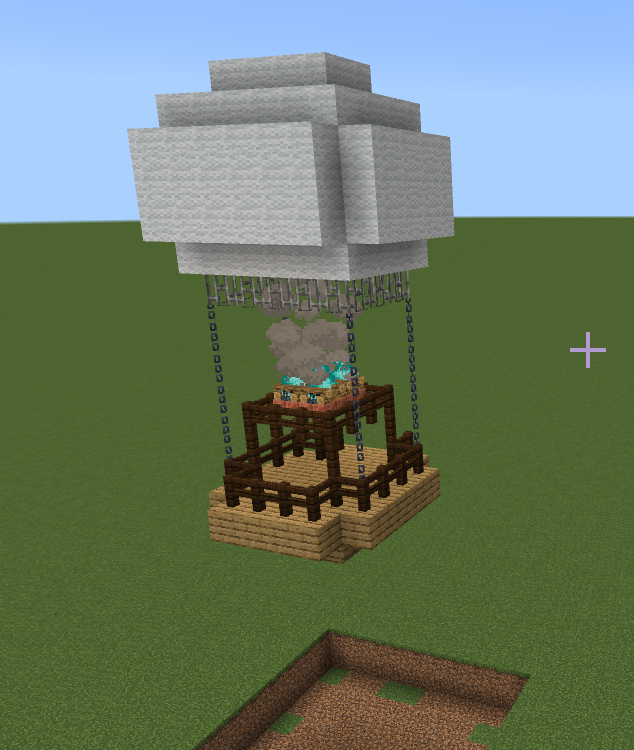
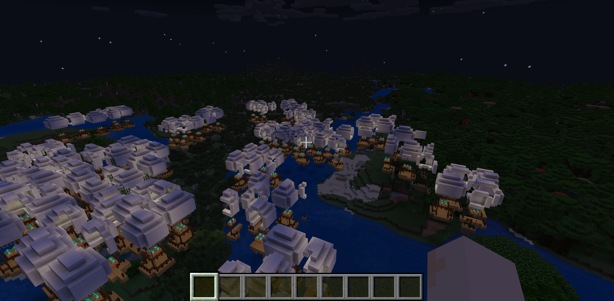

# Features Tutorial - a Simple Feature

This tutorial explains how to create and test a features behavior pack using the **hot_air_balloon** sample feature from the [Minecraft Custom Features Project sample pack](https://github.com/microsoft/minecraft-samples/tree/main/custom_features).

This is the simplest tutorial because it uses only one pack, three subfolders, and four files.

## More Information

For a more in-depth explanation of the parts, take a look at the [Introduction to Features](../Reference/Content/FeaturesReference/Examples/FeaturesIntroduction.md) reference page.

There's even a [Change the World with Features video](https://www.youtube.com/watch?v=kzWSItyz5Pk&t=1s) showing how to save a structure and then put it into the world as a feature.

If you are new to the world of creating, exporting, and importing structures, we have an [Introduction to Structure Blocks tutorial](Structures/IntroductionToStructureBlocks.md)

## Start with the Minecraft Custom Feature Project

1. Go to the [minecraft-samples](https://github.com/microsoft/minecraft-samples/tree/main) page and download the .zip file of the code.

1. Expand the folder. It will be called **mineraft-samples-main**.

1. Take a look at all the delightful Minecraft sample projects and find **custom_features**.

1. Inside custom_features, find the **example_feature_set** folder, we want only the **behavior_packs** folder and the **resource_packs** folder right now.

## hot_air_balloon - Behavior Pack Structure

This example uses only a behavior pack, so [create one of those](BehaviorPack.md) and call it something like **hot_air_balloon_BP**.

The pack should have this structure:

```
- hot_air_balloon_BP (main behavior pack folder)
  - feature_rules (folder)
    - hot_air_balloon_feature_rules.json
  - features (folder)
    - hot_air_balloon_feature.json
  - structures (folder)
    - example (folder)
      - hot_air_balloon.mcstructure
  - manifest.json
```

Go ahead and put the manifest.json file in there.

The path and contents for the other files are next.

### feature_rules/hot_air_balloon_feature_rules.json

Original example from the sample pack:

```json
{
  "format_version": "1.13.0",
  "minecraft:feature_rules": {
    "description": {
      "identifier": "example:hot_air_balloon_feature_rules",
      "places_feature": "example:hot_air_balloon_feature"
    },
    "conditions": {
      "placement_pass": "surface_pass",
      "minecraft:biome_filter": [
        {
          "test": "has_biome_tag",
          "operator": "==",
          "value": "the_end"
        }
      ]
    },
    "distribution": {
      "iterations": 10,
      "coordinate_eval_order": "zxy",
      "x": 0,
      "y": "query.heightmap(variable.worldx, variable.worldz)",
      "z": 0
    }
  }
}
```

The `"minecraft:biome_filter"` section will place the balloons only in the End. If you want to have the balloons overhead as soon as you enter the world with your behavior back activated, then you'll need to create a world and make a note of what biome you spawn into.

Changing the biome to "forest" is a pretty good bet. Forest is the most common biome. 

```json
"minecraft:biome_filter": [
        {
          "test": "has_biome_tag",
          "operator": "==",
          "value": "forest"
        }
      ]
```

Take a look at the [`/locate` command](../Commands/commands/locate.md) page for the latest list of biomes. (This is also a hint for you to use the `locate` command if you can't find your hot air balloons. Also, try looking at night. The balloon glow!)

Also, see that `"operator"` line? That means you can play with this value like a Boolean. If you want a world simply *covered* in hot air balloons (except for the End), try this:

```json
"minecraft:biome_filter": [
        {
          "test": "has_biome_tag",
          "operator": "!=",
          "value": "the_end"
        }
      ]
```

Beware: this will be pretty resource-intensive.

The sample has the iteration setting cranked up to 10 so you will get a noticeable number of balloons when you try it. 
You might want to change the `"iterations"` setting from 10 to a more reasonable 1.

This is the edited file to use for your **hot_air_balloon** feature behavior pack:

```json
{
  "format_version": "1.13.0",
  "minecraft:feature_rules": {
    "description": {
      "identifier": "example:hot_air_balloon_feature_rules",
      "places_feature": "example:hot_air_balloon_feature"
    },
    "conditions": {
      "placement_pass": "surface_pass",
      "minecraft:biome_filter": [
        {
          "test": "has_biome_tag",
          "operator": "==",
          "value": "forest"
        }
      ]
    },
    "distribution": {
      "iterations": 1,
      "coordinate_eval_order": "zxy",
      "x": 0,
      "y": "query.heightmap(variable.worldx, variable.worldz)",
      "z": 0
    }
  }
}
```

What this code is "saying"... "Hey Minecraft... use the feature rule whose name is "example:hot_air_balloon_feature_rules" to place a feature named "example:hot_air_balloon_feature" during the phase when Minecraft is loading in the surface if the world. But only place the feature in a forest biome, and only place (iterate) one feature per chunk (a chunk is 16 X 16 blocks, remember?), and position each feature relative to the 'y' coordinate of the world."

### features/hot_air_balloon_feature.json

```json
{
  "format_version": "1.13.0",
  "minecraft:structure_template_feature": {
    "description": {
      "identifier": "example:hot_air_balloon_feature"
    },
    "structure_name": "example:hot_air_balloon",
    "adjustment_radius": 8,
    "facing_direction": "random",
    "constraints": {
      "unburied": {},
      "block_intersection": {
        "block_allowlist": [
          "minecraft:air"
        ]
      }
    }
  }
}
```

This code is saying: "Hey Minecraft! This is the template named "example:hot_air_balloon_feature" that uses a structure named "example:hot_air_balloon". Each placed structure can face a random direction (well, any one of the four directions a block can face in Minecraft) and you have to make sure the balloon is only allowed to be placed in the air. (Yes, Minecraft air is in blocks, too...)

### structures/example/hot_air_balloon.mcstructure

This is the .mcstructure exported and saved from Minecraft:



The .mcstructure itself includes the air between the ground and the balloon, creating the floating effect.

This graphic shows how the feature is distributed in relation to the surface area.


## What Success Looks Like...

This feature has its own light source (blue soul flames!) so it's easier to find your feature at night.




## What's Next?

Want to work with a more complicated feature? 

> [!div class="nextstepaction"]
> [Features Tutorial Advanced](FeaturesTutorial_2.md)
