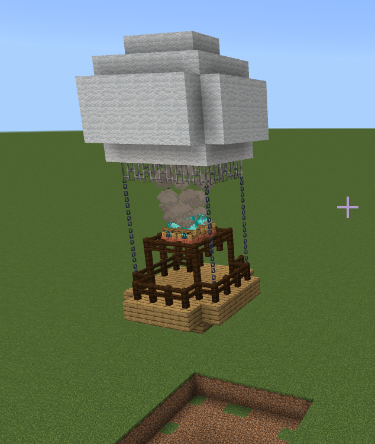
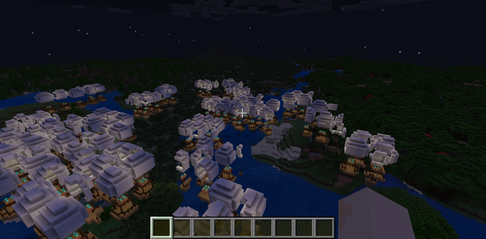

# Features Tutorial - a Simple Feature

This tutorial explains how to create and test a features behavior pack using the **hot_air_balloon** sample feature from the [Minecraft Custom Features Project sample pack](https://github.com/microsoft/minecraft-samples/tree/main/custom_features).

## More Information

If this is your first time working with Features, take a look at the [Introduction to Features](../Reference/Content/FeaturesReference/Examples/FeaturesIntroduction.md) reference page for a more in-depth overview of the parts before you continue.

We also have an [Introduction to Structure Blocks](Structures/IntroductionToStructureBlocks.md) article to get you started with everything you need if you are new to the world of creating, exporting, and importing structures.

Finally, check out the video below for an example of how to save a structure and place it into your world as a feature.

> [!VIDEO https://www.youtube.com/embed/kzWSItyz5Pk]

## Set up the Features

1. Go to the [minecraft-samples](https://github.com/microsoft/minecraft-samples/tree/main) page and download the .zip file of the code.

2. Expand/unzip the folder (it should be called **minecraft-samples-main**).

3. Take a look at all the delightful Minecraft sample projects, then find and open **custom_features**.

4. Open the **example_feature_set** folder, then open the **behavior_packs** folder inside it.

5. Inside **behavior_packs**, find the second folder named **example_feature_set** where you'll find the folders and files of the project we are using as a starting point for our tutorial.
    > [!TIP]
    > The only file we will actually *need* to copy and paste from this sample is **hot_air_balloon.mcstructure**.

## hot_air_balloon - Behavior Pack Structure

1. Create the main folder for your behavior pack and call it something like **hot_air_balloon_BP**.

2. Create a **manifest.json** file in there, like the one below.

```json
{
  "format_version": 2,
  "header": {
    "description": "Feature: Hot Air Balloon Feature (BP)",
    "name": "TFeature: Hot Air Balloon",
    "uuid":"<PUT A UUID HERE>",
    "version": [1, 0, 0],
    "min_engine_version": [1, 20, 20]
    },
  "modules":
    [
      {
        "description": "Feature: Hot Air Balloon",
        "type": "data",
        "uuid": "<PUT A DIFFERENT UUID HERE>",
        "version": [1, 0, 0]
      }
    ]
}
```

3. Next, create the folders and subfolders, according to the pack structure. The finished behavior pack should have the following structure:
    - hot_air_balloon_BP (main behavior pack folder)
      - feature_rules (folder)
        - hot_air_balloon_feature_rules.json
      - features (folder)
        - hot_air_balloon_feature.json
      - structures (folder)
        - example (folder)
          - hot_air_balloon.mcstructure
      - manifest.json

### feature_rules/hot_air_balloon_feature_rules.json

Next, use the following content from the original sample pack file as a structure for the balloon's feature rules and refer to the description below about what you should change and why.

Original example from the sample pack:

```json
{
  "format_version": "1.13.0",
  "minecraft:feature_rules": {
    "description": {
      "identifier": "example:hot_air_balloon_feature_rules",
      "places_feature": "example:hot_air_balloon_feature"
    },
    "conditions": {
      "placement_pass": "surface_pass",
      "minecraft:biome_filter": [
        {
          "test": "has_biome_tag",
          "operator": "==",
          "value": "the_end"
        }
      ]
    },
    "distribution": {
      "iterations": 10,
      "coordinate_eval_order": "zxy",
      "x": 0,
      "y": "query.heightmap(variable.worldx, variable.worldz)",
      "z": 0
    }
  }
}
```

The `"minecraft:biome_filter"` section currently places the balloons only in the End. Change the `"value"` to make balloons spawn in your biome(s) of choice. If you want the balloons overhead as soon as players enter the world with your behavior back activated, you'll need to create a world, take note of what biome you spawn into, then change the value to match that biome.

```json
"minecraft:biome_filter": [
        {
          "test": "has_biome_tag",
          "operator": "==",
          "value": "[insert biome(s) here]"
        }
      ]
```

Take a look at the [`/locate` command](../Commands/commands/locate.md) page for the latest list of biomes. You can also try using the `locate` command if you can't find your hot air balloons.
> [!TIP]
> Changing the biome to "forest" is a pretty good bet, since forest is the most common biome in Minecraft. Also, try looking at night to see the balloons glow!

You can also use the `"operator"` line like a Boolean to simply *cover* the world in hot air balloons (except for the specified `"value"` biome(s)).

```json
"minecraft:biome_filter": [
        {
          "test": "has_biome_tag",
          "operator": "!=",
          "value": "the_end"
        }
      ]
```

> [!NOTE]
> Doing this is very resource-intensive and may slow things down.

The sample has the iteration setting cranked up to 10 so you will get a noticeable number of balloons when you try it, but you might want to change the `"iterations"` setting from 10 to a more reasonable 1.

The finished file for your **hot_air_balloon** feature behavior pack should look something like this:

#### hot_air_balloon_feature_rules.json

```json
{
  "format_version": "1.13.0",
  "minecraft:feature_rules": {
    "description": {
      "identifier": "example:hot_air_balloon_feature_rules",
      "places_feature": "example:hot_air_balloon_feature"
    },
    "conditions": {
      "placement_pass": "surface_pass",
      "minecraft:biome_filter": [
        {
          "test": "has_biome_tag",
          "operator": "==",
          "value": "forest"
        }
      ]
    },
    "distribution": {
      "iterations": 1,
      "coordinate_eval_order": "zxy",
      "x": 0,
      "y": "query.heightmap(variable.worldx, variable.worldz)",
      "z": 0
    }
  }
}
```

> [!TIP]
> This code says:
> "Hey Minecraft, use the feature rule whose name is `"example:hot_air_balloon_feature_rules"` to place a feature named `"sample:hot_air_balloon_feature"` during the phase when Minecraft is loading in the surface of the world. Only place the feature in forest biomes, and only iterate (place) one feature per chunk (a chunk is a 16 X 16 block section of the world), and position each feature relative to the 'y' coordinate of the world."

### features/hot_air_balloon_feature.json

There are features that are used to place other features, like `"minecraft:structure_template_feature"`.

```json
{
  "format_version": "1.13.0",
  "minecraft:structure_template_feature": {
    "description": {
      "identifier": "example:hot_air_balloon_feature"
    },
    "structure_name": "example:hot_air_balloon",
    "adjustment_radius": 8,
    "facing_direction": "random",
    "constraints": {
      "unburied": {},
      "block_intersection": {
        "block_allowlist": [
          "minecraft:air"
        ]
      }
    }
  }
}
```

> [!TIP]
> This code says: "Hey Minecraft! This is the template named `"example:hot_air_balloon_feature"` that places a structure named `"example:hot_air_balloon"`. Each placed structure can face a random direction as long as the balloon is placed somewhere in the air."

### structures/example/hot_air_balloon.mcstructure

The .mcstructure itself includes the air between the ground and the balloon, creating the floating effect. This graphic shows how the feature is distributed in relation to the surface area.



`"hot_air_balloon.mcstructure"` is the only file we actually needed from the sample pack. If you don't have it, you can make your own structure and export it to this folder using [structure blocks](../Documents/Structures/IntroductionToStructureBlocks.md).

## What does success look like?

This feature has its own light source (blue soul flames!) so it's easier to find your feature at night.



Now that you have a working feature, this is a good time to experiment with some of the settings in the files.

You could try changing the **iteration** parameter in the **feature_rules/hot_air_balloon_feature_rules.json** file from 1.0 to 0.1. Then change it to 10.0 and see how the results change.

## What's next?

Want to work with a more complicated feature? Try the advanced Features tutorial next!

> [!div class="nextstepaction"]
> [Features Tutorial Advanced](FeaturesTutorial_2.md)
