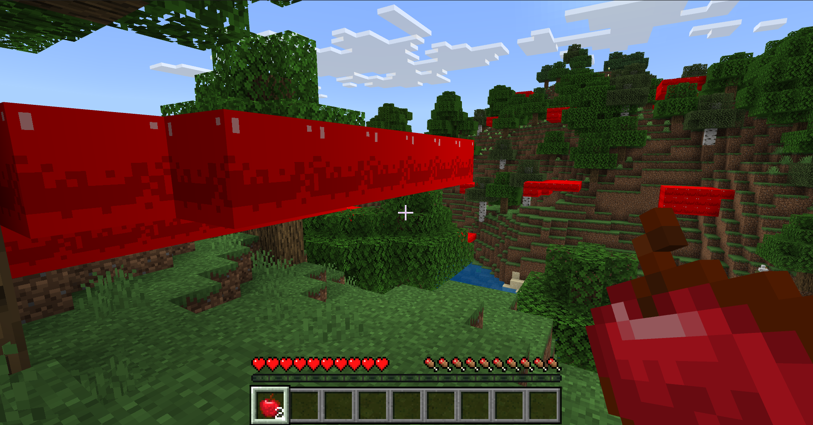

# Features Tutorial - A More Complex Feature

This tutorial covers a fairly complex feature. It uses both a behavior pack and a resource pack. 

The completed feature searches a world for oak trees, then it adds blocks that reward you with 1 to 4 apples as loot when you break them.

So, a pretty good name for this project is: **oak_apple**.

## More Information

For a more in-depth explanation about features, take a look at the [Introduction to Features](../Reference/Content/FeaturesReference/Examples/FeaturesIntroduction.md) reference page.

## Start with the Minecraft Custom Feature Project

If you already did the [simple feature tutorial](FeaturesTutorial_1.md), this next part will look very familiar...

1. Go to the [minecraft-samples](https://github.com/microsoft/minecraft-samples/tree/main) page and download the .zip file of the code.

1. Expand the folder. It will be called **mineraft-samples-main**.

1. Take a look at all the delightful Minecraft sample projects and find **custom_features**.

1. Inside custom_features, find the **example_feature_set** folder, we want only the **behavior_packs** folder and the **resource_packs** folder right now.

## oak_apple - Behavior Pack Structure

This example uses a behavior pack, so [create one of those](BehaviorPack.md) and call it something like **oak_apple_BP**.

The finished behavior pack should have this structure:

```
- oak_apple_BP (main behavior pack folder)
  - blocks (folder)
    - apple_block.json
  - feature_rules
    - find_valid_apples_feature_rules.json
    - oak_tree_then_apples_feature_rules.json
  - features (folder)
    - apple_feature.json
    - find_valid_apples_feature.json
    - oak_tree_feature.json
    - oak_tree_then_apples_feature.json
    - scatter_apples_feature.json
  - loot_tables (folder)
    - blocks (folder)
      - apple_block.json
  - manifest.json
```

Go ahead and put the manifest.json file in there.

The path and contents for the other files are next. The content given next in this section might look different from what you find in the sample pack because the features we are not using right now have been removed, for clarity.

Also, remember we're changing the pack names from **example_feature_set** to **oak_apple_BP**, wherever we need to.

### oak_apple_BP/blocks/apple_block.json

This file specifies information about how the apple_block can be viewed and affected in the world. One such piece of information is the name and location of the loot file.

```json
{
  "format_version": "1.20.20",
  "minecraft:block": {
    "description": {
      "identifier": "example:apple_block",
      "menu_category": {
        "category": "nature"
      },
      "traits": {
        "minecraft:placement_direction": {
          "enabled_states": ["minecraft:facing_direction"]
        }
      }
    },
    "components": {
      "minecraft:collision_box": true,
      "minecraft:selection_box": true,
      "minecraft:destructible_by_mining": {
        "seconds_to_destroy": 0.4
      },
      "minecraft:destructible_by_explosion": {
        "explosion_resistance": 2.9
      },
      "minecraft:flammable": {
        "destroy_chance_modifier": 20,
        "catch_chance_modifier": 5
      },
      "minecraft:geometry": "geometry.apple_block",
      "minecraft:material_instances": {
        "*": {
          "texture": "apple_block",
          "render_method": "opaque"
        }
      },
      "minecraft:map_color": "#f30000",
      "minecraft:loot": "loot_tables/blocks/apple_block.json"
    },
    "permutations": [
      {
        "condition": "q.block_state('minecraft:facing_direction') == 'up' || q.block_state('minecraft:facing_direction') == 'down' ",
        "components": {
          "minecraft:transformation": {
            "rotation": [0, 0, 0]
          }
        }
      },
      {
        "condition": "q.block_state('minecraft:facing_direction') == 'east' || q.block_state('minecraft:facing_direction') == 'west' ",
        "components": {
          "minecraft:transformation": {
            "rotation": [0, 0, 90]
          }
        }
      },
      {
        "condition": "q.block_state('minecraft:facing_direction') == 'north' || q.block_state('minecraft:facing_direction') == 'south' ",
        "components": {
          "minecraft:transformation": {
            "rotation": [90, 0, 0]
          }
        }
      }
    ]
  }
}
```


### oak_apple_BP/feature_rules/find_valid_apples_feature_rules.json

This code tells Minecraft to scan the surface of the world to find a forest, but **not** one that is mutated, or jungle, or rare, and to place the feature found in the find_valid_apples_feature.

```json
{
  "format_version": "1.13.0",
  "minecraft:feature_rules": {
      "description": {
        "identifier": "example:find_valid_apples_feature_rules",
        "places_feature": "example:find_valid_apples_feature"
      },
      "conditions": {
        "placement_pass": "surface_pass",
        "minecraft:biome_filter": [
          {
            "test": "has_biome_tag",
            "operator": "==",
            "value": "forest"
          },
          {
            "all_of": [
              {
                "test": "has_biome_tag",
                "operator": "!=",
                "value": "mutated"
              },
              {
                "test": "has_biome_tag",
                "operator": "!=",
                "value": "jungle"
              },
              {
                "test": "has_biome_tag",
                "operator": "!=",
                "value": "rare"
              }
            ]
          }
      ]
    },
    "distribution": {
      "iterations": 20,
      "coordinate_eval_order": "zxy",
      "x": 0,
      "y": "query.heightmap(variable.worldx, variable.worldz)",
      "z": 0
      }
  }
}
```


### oak_apple_BP/feature_rules/oak_tree_then_apples_feature_rules.json

This code tells Minecraft to scan the surface of the world to find a forest, but **not** one that is mutated, or jungle, or rare, and to place the feature found in the oak_tree_then_apples_feature.

```json
{
  "format_version": "1.13.0",
    "minecraft:feature_rules": {
      "description": {
        "identifier": "example:oak_tree_then_apples_feature_rules",
        "places_feature": "example:oak_tree_then_apples_feature"
      },
      "conditions": {
        "placement_pass": "surface_pass",
        "minecraft:biome_filter": [
          {
            "test": "has_biome_tag",
            "operator": "==",
            "value": "forest"
          },
          {
            "all_of": [
              {
                "test": "has_biome_tag",
                "operator": "!=",
                "value": "mutated"
              },
              {
                "test": "has_biome_tag",
                "operator": "!=",
                "value": "jungle"
              },
              {
                "test": "has_biome_tag",
                "operator": "!=",
                "value": "rare"
              }
            ]
          }
        ]
      },
      "distribution": {
        "iterations": 5,
        "coordinate_eval_order": "zxy",
        "x": 0,
        "y": "query.heightmap(variable.worldx, variable.worldz)",
        "z": 0
      }
    }
}
```

### oak_apple_BP/features/apple_feature.json

This feature places a single block, the apple_block, and states that the placement will adhere to the rules in the feature rules that call this file. The **may_replace** line makes sure that apple_blocks can only replace **minecraft:air**, so it cannot "dig" into wood or leaves when it is placed.

```json
{
  "format_version": "1.13.0",
  "minecraft:single_block_feature": {
    "description": {
      "identifier": "example:apple_feature"
    },
    "places_block": "example:apple_block",
    "enforce_placement_rules": true,
    "enforce_survivability_rules": true,
    "may_replace": [
      "minecraft:air"
    ]
  }
}
```

### oak_apple_BP/features/find_valid_apples_feature.json

After the feature rule finds a valid block, the apple_feature is called. apple_feature will place the apple_block.

```json
{
  "format_version": "1.13.0",
    "minecraft:search_feature": {
      "description": {
        "identifier": "example:find_valid_apples_feature"
      },
      "places_feature": "example:apple_feature",
      "search_volume": {
        "min": [ -3, -3, -3 ],
        "max": [ 3, 3, 3 ]
      },
      "search_axis": "-y",
      "required_successes": 3
  }
}
```
### oak_apple_BP/features/oak_tree_feature.json

This file tells Minecraft how to identify an oak tree. Players can tell an oak tree just by looking at it, but the game has to formally look at each block and determine if that block is an oak log or oak_leaves. It also tells Minecraft which blocks the apple_block can replace or grow on. 

```json
{
  "format_version": "1.13.0",
    "minecraft:tree_feature": {
      "description": {
        "identifier": "example:oak_tree_feature"
      },
      "acacia_trunk": {
        "trunk_width": 1,
        "trunk_height": {
          "base": 4,
          "intervals": [ 2 ],
          "min_height_for_canopy": 3
        },
        "trunk_block": {
          "name": "minecraft:log",
          "states": {
            "old_log_type": "oak"
          }
        },
        "trunk_lean": {
          "allow_diagonal_growth": true,
          "lean_height": {
            "range_min": 2,
            "range_max": 3
          },
          "lean_steps": {
            "range_min": 3,
            "range_max": 4
          },
          "lean_length": {
            "range_min": 1,
            "range_max": 2
          }
        }
      },
      "random_spread_canopy": {
        "canopy_height": 2,
        "canopy_radius": 3,
        "leaf_placement_attempts": 50,
        "leaf_blocks": [
          ["minecraft:oak_leaves", 3]
        ]
      },
      "base_block": [
        "minecraft:dirt_with_roots"
      ],
      "may_grow_on": [
        "minecraft:dirt",
        "minecraft:grass",
        "minecraft:podzol",
        "minecraft:dirt",
        "minecraft:farmland",
        "minecraft:dirt_with_roots",
        "minecraft:moss_block",
        "minecraft:clay",
        "minecraft:mycelium",
        "minecraft:mud",
        "minecraft:muddy_mangrove_roots"
      ],
      "may_replace": [
        "minecraft:oak_leaves",
        "minecraft:acacia_leaves",
        "minecraft:azalea",
        "minecraft:flowering_azalea",
        "minecraft:azalea_leaves",
        "minecraft:azalea_leaves_flowered",
        "minecraft:mangrove_leaves",
        "minecraft:water",
        "minecraft:flowing_water",
        "minecraft:moss_carpet",
        "minecraft:tallgrass",
        "minecraft:grass",
        "minecraft:air",
        "minecraft:double_plant"
      ],
      "may_grow_through": [
        "minecraft:dirt",
        "minecraft:grass",
        "minecraft:moss_carpet",
        "minecraft:tallgrass",
        "minecraft:double_plant"
      ]
    }
}
```


### oak_apple_BP/features/oak_tree_then_apples_feature.json

This features calls two other features in the specified order: first the **oak_tree_feature**, then the **scatter_apples_feature**.

```json
{
  "format_version": "1.13.0",
  "minecraft:sequence_feature": {
    "description": {
      "identifier": "example:oak_tree_then_apples_feature"
    },
    "features": [
      "example:oak_tree_feature",
      "example:scatter_apples_feature"
    ]
  }
}
```

### oak_apple_BP/features/scatter_apples_feature.json

This feature determines how and where to use the apple_feature.

```json
{
  "format_version": "1.13.0",
  "minecraft:scatter_feature": {
    "description": {
      "identifier": "example:scatter_apples_feature"
    },
    "places_feature": "example:apple_feature",
    "iterations": 10,
    "scatter_chance": 50.0,
    "x": {
      "distribution": "uniform",
      "extent": [ 0, 15 ]
    },
    "y": 64,
    "z": {
      "distribution": "uniform",
      "extent": [ 0, 15 ]
    }
  }
}
```

### oak_apple_BP/loot_tables/blocks/apple_block.json

This may be the most important aspect of the apple_block feature... what wonderful loot can you drop to your players! This code specifies that you get at least one but no more than four apples when you break the block. 

```json
{
  "pools": [
    {
      "rolls": 1,
      "entries": [
        {
          "type": "item",
          "name": "apple",
          "weight": 1,
          "functions": [
            {
              "function": "set_count",
              "count": {
                "min": 1,
                "max": 4
              }
            }
          ]
        }
      ]
    }
  ]
}
```

If you want to learn more about how to make your feature's loot drop more varied, read [Loot Table Conditions](LootTableConditions.md).

## oak_apple_RP - Resource Pack Structure

```
- oak_apple_RP (main resource pack folder)
  - models (folder)
    - blocks (folder)
      - apple_block_geo.json
  - texts (folder)
    - en_US.lang
  - textures (folder)
    - blocks (folder)
      - apple_block.png
    - terrain_texture.json
  - manifest.json
```

Just like for the behavior pack, go ahead and put the manifest.json file in there.

The path and contents for the other files are next. Again, the content given next in this section might look different from what you find in the sample pack because the features we are not using right now have been removed, for clarity. 

Also, remember we're changing the pack names from **example_feature_set** to **oak_apple_RP**.

### oak_apple_RP/models/blocks/apple_block_geo.json

This is the geometry file for the custom apple block itself. To learn more about Minecraft custom block geometry, and about custom blocks in general, here is a link to the [Add Custom Die Block tutorial](AddCustomDieBlock.md).

```json
{
  "format_version": "1.19.0",
  "minecraft:geometry": [
    {
      "description": {
        "identifier": "geometry.apple_block",
        "texture_width": 64,
        "texture_height": 64,
        "visible_bounds_width": 2,
        "visible_bounds_height": 2.5,
        "visible_bounds_offset": [0, 0.75, 0]
      },
      "bones": [
        {
          "name": "root",
          "pivot": [0, 0, 0],
          "cubes": [
            {
              "origin": [-8, 0, -8],
              "size": [16, 16, 16],
              "uv": {
                "north": {"uv": [0, 32], "uv_size": [32, 32]},
                "east": {"uv": [0, 32], "uv_size": [32, 32]},
                "south": {"uv": [0, 32], "uv_size": [32, 32]},
                "west": {"uv": [0, 32], "uv_size": [32, 32]},
                "up": {"uv": [0, 0], "uv_size": [32, 32]},
                "down": {"uv": [0, 32], "uv_size": [32, -32]}
              }
            }
          ]
        }
      ]
    }
  ]
}
```

### oak_apple_RP/texts/en_US.lang

This is the name to use when you want to give yourself apple blocks.

```
title.example:apple_block.name="Apple Block"
```

### oak_apple_RP/textures/blocks/apple_block.png

You can right-click this image and save it where it needs to go.


### oak_apple_RP/textures/terrain_texture.json

This is the path to the texture for the custom apple_block.

```json
{ 
  "resource_pack_name": "oak_apple_RP", 
  "texture_name": "atlas.terrain", 
  "padding": 8, 
  "num_mip_levels": 4, 
  "texture_data": { 
    "apple_block": {
      "textures": "textures/blocks/apple_block.png"
    }
  }
}
```

## What Success Looks Like...

This is a forest with apple blocks appended to the trees. 



