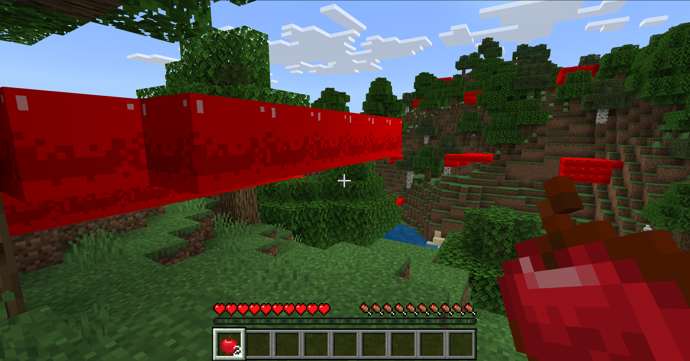

# Features Tutorial - A More Complex Feature

So you're ready for something a bit more challenging, huh? Well, this tutorial uses both a behavior pack *and* a resource pack and covers a fairly complex feature.

You'll walk through the behavior and resource pack structures to compile a custom feature project that generates a unique type of oak tree. The completed feature (**oak_apple**) searches your world for oak trees, then adds blocks that reward you with 1 to 4 apples as loot when broken.

## More information

For a more in-depth explanation about features, take a look at the [Introduction to Features](../Reference/Content/FeaturesReference/Examples/FeaturesIntroduction.md) reference page.

## Create a custom feature project

If you already did the [simple feature tutorial](FeaturesTutorial_1.md), this next part should seem very familiar.

1. Go to the [minecraft-samples](https://github.com/microsoft/minecraft-samples/tree/main) page and download the .zip file of the code.

2. Unzip the folder, then expand the folder called **mineraft-samples-main**.

3. Find and open the folder called **custom_features**.

4. Inside custom_features, find the **example_feature_set** folder, we want both the **behavior_packs** folder and the **resource_packs** folder right now.

## Behavior pack structure

1. Create a [behavior pack folder](BehaviorPack.md) and call it something like **oak_apple_BP**.

2. Create a manifest.json file inside your new behavior pack like the one below:

    ```
    {
      "format_version": 2,
      "header": {
        "description": "Feature: Oak trees can grow apples! (BP)",
        "name": "Oak Apple",
        "uuid":"<PUT A UNIQUE UUID HERE>",
        "version": [1, 0, 0],
        "min_engine_version": [1, 20, 20]
      },
      "modules":
        [
          {
            "description": "Features Samples",
              "type": "data",
              "uuid": "<PUT A UNIQUE UUID HERE>",
              "version": [1, 0, 0]
          }
        ],
        "dependencies": [ 
          { 
            "uuid": "<PUT A UUID HERE>", 
            "version": [ 1, 0, 0 ] 
          } 
        ] 
    }
    ```

    > [!IMPORTANT]
    > Remember that the UUID in the dependencies section should match the UUID for the resource pack if you want them to load each other automatically. For more information, review [Creating a Behavior Pack from Scratch](BehaviorPackFromScratch.md#create-the-dependency).

3. The final behavior pack structure should be:
    
    - oak_apple_BP (main behavior pack folder)
      - blocks (folder)
        - apple_block.json
      - feature_rules
        - find_valid_apples_feature_rules.json
        - oak_tree_then_apples_feature_rules.json
      - features (folder)
        - apple_feature.json
        - find_valid_apples_feature.json
        - oak_tree_feature.json
        - oak_tree_then_apples_feature.json
        - scatter_apples_feature.json
      - loot_tables (folder)
        - blocks (folder)
          - apple_block.json
      - manifest.json

The path and contents for the other files are next.
> [!NOTE]
> The content given next in structrue above section probably looks different from what you see in the sample pack&mdash;don't panic! The features we're not using right now have been removed for clarity. We also changed the pack names from **example_feature_set** to **oak_apple_BP** to match our new behavior pack theme.

### oak_apple_BP/blocks/apple_block.json

This file specifies information about how the apple_block can be viewed and affected in the world. One such piece of information is the name and location of the loot file.

```json
{
  "format_version": "1.20.20",
  "minecraft:block": {
    "description": {
      "identifier": "example:apple_block",
      "menu_category": {
        "category": "nature"
      },
      "traits": {
        "minecraft:placement_direction": {
          "enabled_states": ["minecraft:facing_direction"]
        }
      }
    },
    "components": {
      "minecraft:collision_box": true,
      "minecraft:selection_box": true,
      "minecraft:destructible_by_mining": {
        "seconds_to_destroy": 0.4
      },
      "minecraft:destructible_by_explosion": {
        "explosion_resistance": 2.9
      },
      "minecraft:flammable": {
        "destroy_chance_modifier": 20,
        "catch_chance_modifier": 5
      },
      "minecraft:geometry": "geometry.apple_block",
      "minecraft:material_instances": {
        "*": {
          "texture": "apple_block",
          "render_method": "opaque"
        }
      },
      "minecraft:map_color": "#f30000",
      "minecraft:loot": "loot_tables/blocks/apple_block.json"
    },
    "permutations": [
      {
        "condition": "q.block_state('minecraft:facing_direction') == 'up' || q.block_state('minecraft:facing_direction') == 'down' ",
        "components": {
          "minecraft:transformation": {
            "rotation": [0, 0, 0]
          }
        }
      },
      {
        "condition": "q.block_state('minecraft:facing_direction') == 'east' || q.block_state('minecraft:facing_direction') == 'west' ",
        "components": {
          "minecraft:transformation": {
            "rotation": [0, 0, 90]
          }
        }
      },
      {
        "condition": "q.block_state('minecraft:facing_direction') == 'north' || q.block_state('minecraft:facing_direction') == 'south' ",
        "components": {
          "minecraft:transformation": {
            "rotation": [90, 0, 0]
          }
        }
      }
    ]
  }
}
```

### oak_apple_BP/feature_rules/find_valid_apples_feature_rules.json

This code tells Minecraft to scan the surface of the world and place the feature found in `"find_valid_apples_feature"` in **unmutated** forests that are neither jungles nor rare.

```json
{
  "format_version": "1.13.0",
  "minecraft:feature_rules": {
      "description": {
        "identifier": "example:find_valid_apples_feature_rules",
        "places_feature": "example:find_valid_apples_feature"
      },
      "conditions": {
        "placement_pass": "surface_pass",
        "minecraft:biome_filter": [
          {
            "test": "has_biome_tag",
            "operator": "==",
            "value": "forest"
          },
          {
            "all_of": [
              {
                "test": "has_biome_tag",
                "operator": "!=",
                "value": "mutated"
              },
              {
                "test": "has_biome_tag",
                "operator": "!=",
                "value": "jungle"
              },
              {
                "test": "has_biome_tag",
                "operator": "!=",
                "value": "rare"
              }
            ]
          }
      ]
    },
    "distribution": {
      "iterations": 20,
      "coordinate_eval_order": "zxy",
      "x": 0,
      "y": "query.heightmap(variable.worldx, variable.worldz)",
      "z": 0
      }
  }
}
```

### oak_apple_BP/feature_rules/oak_tree_then_apples_feature_rules.json

This code tells Minecraft to scan the surface of the world and place the feature found in `"oak_tree_then_apples_feature"` in **unmutated** forests that are neither jungles nor rare.

```json
{
  "format_version": "1.13.0",
    "minecraft:feature_rules": {
      "description": {
        "identifier": "example:oak_tree_then_apples_feature_rules",
        "places_feature": "example:oak_tree_then_apples_feature"
      },
      "conditions": {
        "placement_pass": "surface_pass",
        "minecraft:biome_filter": [
          {
            "test": "has_biome_tag",
            "operator": "==",
            "value": "forest"
          },
          {
            "all_of": [
              {
                "test": "has_biome_tag",
                "operator": "!=",
                "value": "mutated"
              },
              {
                "test": "has_biome_tag",
                "operator": "!=",
                "value": "jungle"
              },
              {
                "test": "has_biome_tag",
                "operator": "!=",
                "value": "rare"
              }
            ]
          }
        ]
      },
      "distribution": {
        "iterations": 5,
        "coordinate_eval_order": "zxy",
        "x": 0,
        "y": "query.heightmap(variable.worldx, variable.worldz)",
        "z": 0
      }
    }
}
```

### oak_apple_BP/features/apple_feature.json

This feature places a single block&mdash;the apple_block&mdash;that adheres to the specifications outlined in the feature rules that call this file. The **may_replace** line makes sure that apple_blocks can only replace **minecraft:air**, so it cannot "dig" into wood or leaves when it's placed.

```json
{
  "format_version": "1.13.0",
  "minecraft:single_block_feature": {
    "description": {
      "identifier": "example:apple_feature"
    },
    "places_block": "example:apple_block",
    "enforce_placement_rules": true,
    "enforce_survivability_rules": true,
    "may_replace": [
      "minecraft:air"
    ]
  }
}
```

### oak_apple_BP/features/find_valid_apples_feature.json

After the feature rule finds a valid block, the apple_feature is called. apple_feature will place the apple_block.

```json
{
  "format_version": "1.13.0",
    "minecraft:search_feature": {
      "description": {
        "identifier": "example:find_valid_apples_feature"
      },
      "places_feature": "example:apple_feature",
      "search_volume": {
        "min": [ -3, -3, -3 ],
        "max": [ 3, 3, 3 ]
      },
      "search_axis": "-y",
      "required_successes": 3
  }
}
```

### oak_apple_BP/features/oak_tree_feature.json

This file tells Minecraft how to identify an oak tree. You can probably recognize an oak tree just by looking at it, but the game has to formally look at each block and determine if that block is an oak log or oak_leaves. It also tells Minecraft which blocks the apple_block can replace or grow on.

```json
{
  "format_version": "1.13.0",
    "minecraft:tree_feature": {
      "description": {
        "identifier": "example:oak_tree_feature"
      },
      "acacia_trunk": {
        "trunk_width": 1,
        "trunk_height": {
          "base": 4,
          "intervals": [ 2 ],
          "min_height_for_canopy": 3
        },
        "trunk_block": {
          "name": "minecraft:log",
          "states": {
            "old_log_type": "oak"
          }
        },
        "trunk_lean": {
          "allow_diagonal_growth": true,
          "lean_height": {
            "range_min": 2,
            "range_max": 3
          },
          "lean_steps": {
            "range_min": 3,
            "range_max": 4
          },
          "lean_length": {
            "range_min": 1,
            "range_max": 2
          }
        }
      },
      "random_spread_canopy": {
        "canopy_height": 2,
        "canopy_radius": 3,
        "leaf_placement_attempts": 50,
        "leaf_blocks": [
          ["minecraft:oak_leaves", 3]
        ]
      },
      "base_block": [
        "minecraft:dirt_with_roots"
      ],
      "may_grow_on": [
        "minecraft:dirt",
        "minecraft:grass",
        "minecraft:podzol",
        "minecraft:dirt",
        "minecraft:farmland",
        "minecraft:dirt_with_roots",
        "minecraft:moss_block",
        "minecraft:clay",
        "minecraft:mycelium",
        "minecraft:mud",
        "minecraft:muddy_mangrove_roots"
      ],
      "may_replace": [
        "minecraft:oak_leaves",
        "minecraft:acacia_leaves",
        "minecraft:azalea",
        "minecraft:flowering_azalea",
        "minecraft:azalea_leaves",
        "minecraft:azalea_leaves_flowered",
        "minecraft:mangrove_leaves",
        "minecraft:water",
        "minecraft:flowing_water",
        "minecraft:moss_carpet",
        "minecraft:tallgrass",
        "minecraft:grass",
        "minecraft:air",
        "minecraft:double_plant"
      ],
      "may_grow_through": [
        "minecraft:dirt",
        "minecraft:grass",
        "minecraft:moss_carpet",
        "minecraft:tallgrass",
        "minecraft:double_plant"
      ]
    }
}
```

### oak_apple_BP/features/oak_tree_then_apples_feature.json

This features calls two other features in the specified order: first the **oak_tree_feature**, then the **scatter_apples_feature**.

```json
{
  "format_version": "1.13.0",
  "minecraft:sequence_feature": {
    "description": {
      "identifier": "example:oak_tree_then_apples_feature"
    },
    "features": [
      "example:oak_tree_feature",
      "example:scatter_apples_feature"
    ]
  }
}
```

### oak_apple_BP/features/scatter_apples_feature.json

This feature determines how and where to use the apple_feature.

```json
{
  "format_version": "1.13.0",
  "minecraft:scatter_feature": {
    "description": {
      "identifier": "example:scatter_apples_feature"
    },
    "places_feature": "example:apple_feature",
    "iterations": 10,
    "scatter_chance": 50.0,
    "x": {
      "distribution": "uniform",
      "extent": [ 0, 15 ]
    },
    "y": 64,
    "z": {
      "distribution": "uniform",
      "extent": [ 0, 15 ]
    }
  }
}
```

### oak_apple_BP/loot_tables/blocks/apple_block.json

This may be the most important aspect of the apple_block feature because it specifies that you get at least one but no more than four apples when you break the block.

```json
{
  "pools": [
    {
      "rolls": 1,
      "entries": [
        {
          "type": "item",
          "name": "apple",
          "weight": 1,
          "functions": [
            {
              "function": "set_count",
              "count": {
                "min": 1,
                "max": 4
              }
            }
          ]
        }
      ]
    }
  ]
}
```

If you want to learn more about how to make your feature's loot drop more varied, read [Loot Table Conditions](LootTableConditions.md).

## Resource pack structure

Just like you did for the behavior pack, start by creating a manifest.json file inside your resource pack:

```
{
  "format_version": 2,
  "header": {
    "description": "Feature: Oak trees can grow apples! (RP)",
    "name": "Oak Apple",
    "uuid":"<PUT A UNIQUE UUID HERE>",
    "version": [1, 0, 0],
    "min_engine_version": [1, 20, 20]
  },
  "modules":
    [
      {
        "description": "Features Samples",
          "type": "resources",
          "uuid": "<PUT A UNIQUE UUID HERE>",
          "version": [1, 0, 0]
      }
    ],
    "dependencies": [ 
      { 
        "uuid": "<PUT A UUID HERE>", 
        "version": [ 1, 0, 0 ] 
      } 
    ] 
}
```

> [!IMPORTANT]
> Remember that the UUID in the dependencies section should match the UUID for the resource pack if you want them to load each other automatically.

The resource pack structure should look like this:

- oak_apple_RP (main resource pack folder)
  - models (folder)
    - blocks (folder)
      - apple_block_geo.json
  - texts (folder)
    - en_US.lang
  - textures (folder)
    - blocks (folder)
      - apple_block.png
    - terrain_texture.json
  - manifest.json

The path and contents for the other files are next.

> [!TIP]
> Remember, the content given next in this section might look different from what you find in the sample pack because we removed the features we are not using, for clarity. We also changed the pack names from **example_feature_set** to **oak_apple_RP**.

### oak_apple_RP/models/blocks/apple_block_geo.json

This is the geometry file for the custom apple block itself. Check out our   [Custom Die Block tutorial](AddCustomDieBlock.md) to learn more about Minecraft custom block geometry.

```json
{
  "format_version": "1.19.0",
  "minecraft:geometry": [
    {
      "description": {
        "identifier": "geometry.apple_block",
        "texture_width": 64,
        "texture_height": 64,
        "visible_bounds_width": 2,
        "visible_bounds_height": 2.5,
        "visible_bounds_offset": [0, 0.75, 0]
      },
      "bones": [
        {
          "name": "root",
          "pivot": [0, 0, 0],
          "cubes": [
            {
              "origin": [-8, 0, -8],
              "size": [16, 16, 16],
              "uv": {
                "north": {"uv": [0, 32], "uv_size": [32, 32]},
                "east": {"uv": [0, 32], "uv_size": [32, 32]},
                "south": {"uv": [0, 32], "uv_size": [32, 32]},
                "west": {"uv": [0, 32], "uv_size": [32, 32]},
                "up": {"uv": [0, 0], "uv_size": [32, 32]},
                "down": {"uv": [0, 32], "uv_size": [32, -32]}
              }
            }
          ]
        }
      ]
    }
  ]
}
```

### oak_apple_RP/texts/en_US.lang

This is the name to use when you want to give yourself apple blocks with a / command.

```
title.example:apple_block.name="Apple Block"
```

### oak_apple_RP/textures/blocks/apple_block.png

You can right-click the image below and save it in the **blocks** folder inside the **textures** folder.


### oak_apple_RP/textures/terrain_texture.json

This is the path to the texture for the custom apple_block.

```json
{ 
  "resource_pack_name": "oak_apple_RP", 
  "texture_name": "atlas.terrain", 
  "padding": 8, 
  "num_mip_levels": 4, 
  "texture_data": { 
    "apple_block": {
      "textures": "textures/blocks/apple_block.png"
    }
  }
}
```

## What to expect



This is a forest with apple blocks attached to the trees. After you activate the packs and find your apple trees, take a moment to break an apple block and munch on some apples&mdash;you earned it!
