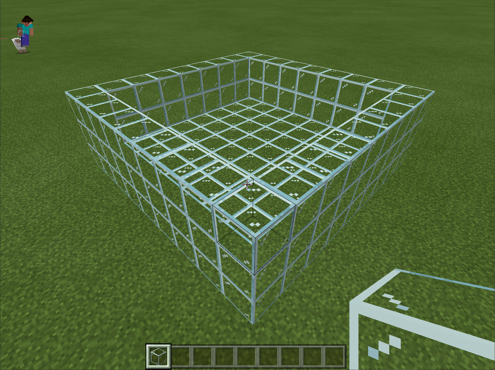
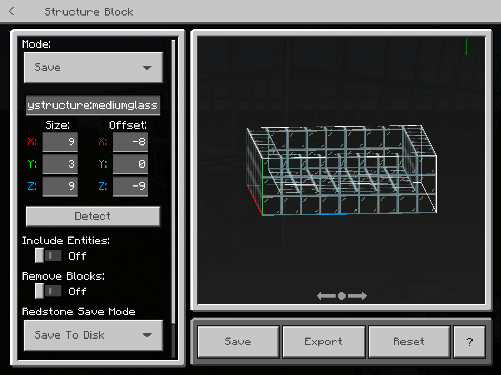
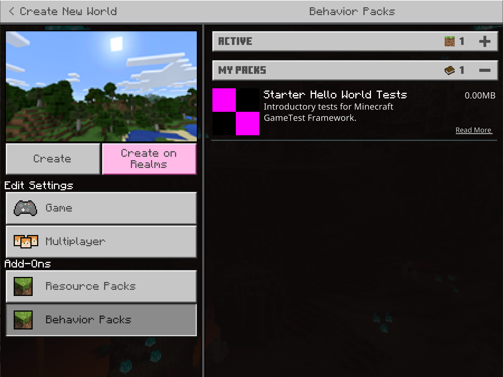

# Building your first GameTest

## What's in a GameTest?

A GameTest is a miniature environment along with a set of starting conditions, such as a set of mobs or items. After that environment plays out in the Minecraft world for a little while, you can run conditional code to evaluate that your expectations were met.

Building sets of GameTests requires building out your GameTests via a behavior Pack, and writing some simple JavaScript code.

>[!IMPORTANT]
>GameTest Framework is still experimental. As with all experiments, you may see additions, removals, and changes in functionality in Minecraft versions without significant advanced warning.  Check the Minecraft Changelog for details on any changes to GameTest Framework.
>
>To learn more about Experimental Features, please visit [Experimental Features in Minecraft: Bedrock Edition](ExperimentalFeaturesToggle.md).

>[!Caution]
>Because GameTest Framework is adding and updating functionality frequently, we recommend using the latest Beta versions of Minecraft. See [Minecraft Betas](https://aka.ms/mcbeta) for more information. The syntax of this sample is intended to be compatible with the latest beta versions.

### Requirements

It’s recommended that the following be completed before beginning this tutorial.

> [!div class="checklist"]
>
> - [Introduction to Behavior Packs](BehaviorPack.md)

### GameTest Elements

Within a behavior pack, every GameTest consists of a few elements:

- **A structure** which defines the physical environment for the test as well as any starting entities.  Within Minecraft, you can create new structures by designing them out (typically in Creative Mode) and then placing a structure block nearby. You can then use the structure block to save out the results to disk. This creates a .mcstructure file which you can add to your test.

When GameTests are run in Minecraft, your structure will be loaded and expanded into Minecraft. You should note that this structure will be created and run in a generally flat, broader world, so you'll want to ensure that any mobs are penned into the structures you create.

GameTests then use JavaScript code to define the test, including:

- **Test registration**: a small amount of code to establish a test in the environment.

- **Test setup**: additional code that sets up conditions within the Structure environment that has been created. Typically, this will be the creation of additional mobs.

- **Test validation**: additional code snippets written in JavaScript that evaluates whether a test has completed successfully or has failed.

With this simple foundation, GameTests can be created with a few lines of JavaScript code plus a Minecraft structure.

## Start building your own tests

To get started, you'll want to begin with your own behavior pack. To begin your behavior pack, create a new folder in the `development_behavior_packs` folder called `startertests`.

>[!IMPORTANT]
>To build and run your own GameTests, you must use the latest Beta versions of Minecraft (version 1.16.230+). See [Minecraft Betas](https://aka.ms/mcbeta) for more information.

Within the `startertests` folder, you'll also want to include two subfolders:

- `structures` for holding MCStructure files
- `scripts` for holding JavaScript files

### Update your manifest

You can start a behavior pack manifest with a manifest.json file within your startertests folder, as follows:

``` JSON
{
    "format_version": 2,
    "header": {
        "description": "Introductory tests for Minecraft GameTest Framework.",
        "name": "Starter Hello World Tests",
        "uuid": "1a2f42bd-98d4-4e0d-8e3f-934ab8a0c05e",
        "version": [0, 0, 1],
        "min_engine_version": [ 1, 19, 0 ]
    }
}
```

A behavior pack manifest needs to have additional elements to support GameTests.  The `modules` section needs one module, added beneath the header section, that registers your JavaScript code entry point, as follows:

``` JSON
    "modules": [
        {
            "description": "Script that implements basic starter tests.",
            "type": "script",
            "language": "javascript",
            "uuid": "1a1b53fc-5653-4a75-91b7-9cdF027674ae",
            "version": [0, 0, 1],
            "entry": "scripts/StarterTests.js"
        }
    ]
```

>[!Caution]
>This sample now represents the manifest format for registering JavaScript for version 1.19. Prior to version 1.19, the `type` attribute should be set to "javascript", and the language attribute should be omittted.
> Also note that this sample uses the new `dependencies` format and versioning introduced in version 1.19.30, where you can use `module_name` to reference built-in script modules. `version` now uses a string, and the targeted module versions should be `1.0.0-beta.`

Note several facets of this `module`:

- This module is of type `script`.
- The `uuid` needs to be unique and generated for your project.  See the [Introduction To Behavior Packs](BehaviorPack.md) topic for tools for generating new UUIDs.
- The `entry` attribute points to a JavaScript file that contains your GameTest code.

In addition, you will need to establish dependencies on Minecraft APIs and GameTest Framework.  You can do this with additional dependencies added beneath the modules section below:

``` JSON
    "dependencies": [
      {
        "module_name": "mojang-minecraft",
        "version": "1.0.0-beta"
      },
      {
        "module_name": "mojang-gametest",
        "version": "1.0.0-beta"
      }
    ]
```

>[!IMPORTANT]
>As you can see, GameTest Framework tests dependent on versions "1.0.0-beta" of Minecraft APIs and GameTest Framework. Beta versions indicate that these features are still **experimental**. As with all experiments, we are improving their capabilities over time, and API signatures may change build over build without advanced notice.  Check the Minecraft Changelog for more changes over time.

A full manifest file for a Behavior Pack with a GameTest looks like:

``` JSON
{
    "format_version": 2,
    "header": {
        "description": "Introductory tests for Minecraft GameTest Framework.",
        "name": "Starter Hello World Tests",
        "uuid": "1a2f42bd-98d4-4e0d-8e3f-934ab8a0c05e",
        "version": [0, 0, 1],
        "min_engine_version": [ 1, 19, 0 ]
    },
    "modules": [
        {
            "description": "Script that implements basic starter tests.",
            "type": "script",
            "language": "javascript",
            "uuid": "1a1b53fc-5653-4a75-91b7-9cdF027674ae",
            "version": [0, 0, 1],
            "entry": "scripts/StarterTests.js"
        }
    ],
    "dependencies": [
      {
        "module_name": "mojang-minecraft",
        "version": "1.0.0-beta"
      },
      {
        "module_name": "mojang-gametest",
        "version": "1.0.0-beta"
      }
    ]
}
```

>[!Caution]
> This sample now represents the manifest format for registering JavaScript for version 1.19.30. Prior to version 1.19, the `type` attribute should be set to "javascript", and the language attribute should be omittted.
> Also note that this sample uses the new `dependencies` format and versioning introduced in version 1.19.30, where you can use `module_name` to reference built-in script modules. `version` now uses a string, and the targeted module versions should be `1.0.0-beta.`

### GameTest Registration

Every GameTest needs a script file. As you saw in the previous section, we added a module with an `entry` attribute that points at a JavaScript file:

```json
        "entry": "scripts/StarterTests.js"
```

When a GameTest Framework-enabled world opens with this file registered, your GameTest JavaScript file will load and execute. Here, the main role for your code is to register downstream GameTests.

Note that as you make changes to your scripts or structures, you will need to exit out of your world and reload it. If there are any script errors, you will see them displayed as the world is loaded.

To register your GameTest scripts, you'll want to use the RegistrationBuilder class. You can see more information on the Registration Builder class at [Registration Builder](../ScriptAPI/mojang-gametest/RegistrationBuilder.md).

An example line of JavaScript that uses RegistrationBuilder looks like:

```javascript
// Registration Code for our test
GameTest.register("StarterTests", "simpleMobTest", simpleMobTest)
        .maxTicks(410)
        .structureName("startertests:mediumglass"); /* use the mediumglass.mcstructure file */
```

This line of code establishes a new test called `simpleMobTest` within the `StarterTests` test group.
It adds an additional parameter (`maxTicks`) that expresses this test may take 410 ticks (20.5 seconds) to run.
Finally, the GameTest specifies a MCStructure (`startertests:mediumglass`). By convention, this causes Minecraft to use an MCStructure file at `/structures/startertests/mediumglass.mcstructure` within your behavior pack folder.

The rest of the JavaScript uses the GameTest Helper class to actually express the test within a `simpleMobTest` function.

### Test Functions

Test functions are where the actual execution of a test happens.  The test function both sets up initial conditions for a test to run, and returns an additional test function where criteria is evaluated.

Sample Test:

```javascript
import * as GameTest from "mojang-gametest";
import { BlockLocation } from "mojang-minecraft";

function simpleMobTest(test) {
  const attackerId = "fox";
  const victimId = "chicken";

  test.spawn(attackerId, new BlockLocation(5, 2, 5));
  test.spawn(victimId, new BlockLocation(2, 2, 2));

  test.assertEntityPresentInArea(victimId, true);

  // Succeed when the victim dies
  test.succeedWhen(() => {
    test.assertEntityPresentInArea(victimId, false);
  });
};
```

Some things to observe in this test function:

- You can use the `spawn` method to create new mobs in your test.
- Coordinates used in APIs like spawn are relative to the structure block of your .MCStructure.
- `assert` functions cause code execution to stop if the conditions described in the method are not true.  Here, this code asserts that a chicken entity is no longer in the structure (the `false` in the method assertEntityPresentInArea tells the function to assert that the entity is no longer there). If one is found within any of the blocks in the structure, the `assert` code will throw an error.  However, if no chicken is found, we make our way to the test.succeed line of code, and the test passes.

The full JavaScript StarterTests.js file looks like:

```javascript
import * as GameTest from "mojang-gametest";
import { BlockLocation } from "mojang-minecraft";

function simpleMobTest(test) {
  const attackerId = "fox";
  const victimId = "chicken";

  test.spawn(attackerId, new BlockLocation(5, 2, 5));
  test.spawn(victimId, new BlockLocation(2, 2, 2));

  test.assertEntityPresentInArea(victimId, true);

  // Succeed when the victim dies
  test.succeedWhen(() => {
    test.assertEntityPresentInArea(victimId, false);
  });
};

// Registration Code for our test
GameTest.register("StarterTests", "simpleMobTest", simpleMobTest)
        .maxTicks(410)
        .structureName("startertests:mediumglass"); /* use the mediumglass.mcstructure file */
```

To finish the sample, you will want to use a structure block to define the test.

To do this, open up Minecraft and start a new world in Creative mode to build your environment.  This is a simple glass pen that was built for our GameTest, made from glass blocks:



Next, you will want to export this as a structure.  Run the following command in Minecraft:

`/give @s structure_block`

This will give you a structure block to work with.  Place a structure block next to your creation, and use the Structure Block popup to frame your creation.  Export this as `mediumglass.mcstructure`.



In your behavior pack, go to your structures folder and create a subfolder called startertests.

Place this mediumglass.mcstructure file within a subfolder called startertests. Make sure that you match the casing you specified in your JavaScript code, so make it all lower-case. Copy the mediumglass.mcstructure file to that folder. Your folder should look like this:


## Running your tests within the game

Once you have completed your GameTest behavior pack, you'll want to try it out within Minecraft. To do this, create a new Minecraft world. For this new world, you'll want to start in Creative mode and turn the GameTest Framework experiment on. You'll want to add the GameTeset Behavior Packs in your world.  If everything is correct, you should see the Start Hello World GameTest behavior pack when you create your world:



Click on the Starter Hello World behavior packs tile to activate it.

>[!IMPORTANT]
>You’ll also likely want to specify some additional changes in your environment:
>- Selecting a Flat world
>- Retain Normal difficulty (mobs work differently in completely Peaceful worlds)

Once the world is loaded, use the `/gametest` command to run tests.

To run a specific test, use `/gametest run <classname>:<testName>`, like:

`/gametest run startertests:simpleMobTest`

## What's Next

You've created your first GameTest Framework test. GameTests allow you as a Creator to stretch your content, exercise your entities, and validate your gameplay mechanics. You can view the GameTest API below to learn more about what is included in the GameTest Framework.

> [!div class="nextstepaction"]
> [GameTest API](../ScriptAPI/mojang-gametest/mojang-gametest.md)
