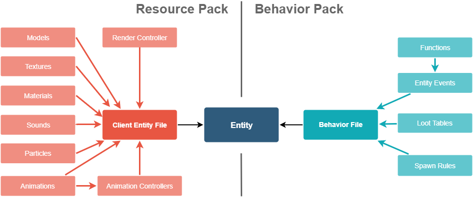

# Introduction to Add Entity

Add Entity refers to a set of features inside Minecraft: Bedrock Edition that allow addons to add custom entities to the game. The behavior of entities can be changed with a behavior pack and the appearance with a resource pack. Both are required to add a working entity to the game. This guide will go through the basic steps to create a working entity. In the second part, it will show you how to breathe life into the entity by using behavior components, animations, etc.

In this tutorial you will learn the following:

> [!div class="checklist"]
>
> - How to create a new custom entity using behavior and resource packs.
> - How to apply various features to the entity, including components and animations.
> - Make use of translations for entity names.

You can download the complete resource and behavior packs created in this article [here](https://drive.google.com/drive/folders/1UMANLzCnGmAMdaosnLkXyJoM6pcbsS5J?usp=sharing).

### Requirements

It’s recommended that the following be completed before beginning this tutorial.

- [Introduction to Behavior Packs](BehaviorPack.md)
- [Introduction to Resource Packs](ResourcePack.md)

Knowledge of the following is also recommended to help better understand this article.

- Familiarity with how the [JSON](https://www.w3schools.com/whatis/whatis_json.asp) format works.
- Some kind of code editor ([VSCode](https://code.visualstudio.com/download), [Notepad++](https://notepad-plus-plus.org/downloads/), [Sublime](https://www.sublimetext.com/), etc)

## File Structure

In the behavior pack, an entity file is responsible for defining the entity server side. In the resource pack, a client entity file is responsible to tell the game how the entity will look. The following graphic shows how different files can interact to create a custom entity:



## Naming

Server and client entity are synced using the entity ID. This ID consists of a namespace and a name separated by a colon. For the namespace, you can use a short version of your team name or product name. The ID should only include lower case letters, digits, and underscores. Do not use "minecraft" as the namespace for custom content as it is meant for vanilla resources. You should only use "minecraft" if you are overwriting vanilla content.

Most files that define the entity will be JSON files. To avoid confusion between these files, it's recommended to use an extended file extension. The game ignores file names in most cases, but while working on an addon, messy file names can be confusing. The extensions are:

|File Type|File Name|
|-|-|
|Client Entity Files|*entity_name*.entity.json|
|Model Files|*entity_name*.geo.json
|Animation Files|*entity_name*.animation.json
|Animation Controllers|*entity_name*.animation_controllers.json|
|Render Controllers|*entity_name*.render_controllers.json|

...where `entity_name` is replaced by the name of your entity, **not** including the namespace.

## Format Versions

Each JSON file should have a format_version tag. This tag is important for the game to correctly read the file. It's important to know that files made in older formats will still work in newer versions of the game, but only if the format version is set correctly. Incorrect format versions are a **frequent** source of errors.

## Behavior Pack Definition

For this example, we will add a little robot into the game. Let’s start in the behavior pack. We create a new file in the "entities" folder of the behavior pack named `robot.json`.

```json
{
    "format_version": "1.12.0",
    "minecraft:entity": {
        "description": {
            "identifier": "compass:robot",
            "is_spawnable": true,
            "is_summonable": true
        },
        "components": {}
    }
}
```

Inside the description tag, we define basic attributes of the entity. "identifier" sets the ID for the entity. "is spawnable" will later add a spawn egg into the game that allows the player to spawn this mob. "is_summonable" will make the entity work with the `/summon` command.

Inside components, we can add components to change the behavior of the entity. For now, we'll only add one component: the physics component. This will give the entity gravity and regular collision behavior.

```json
"components": {
    "minecraft:physics": {}
}
```

## Client Entity Definition

Now, we need to add the entity to the resource pack to give it a visual appearance. In the "entity" folder of the resource pack, we'll create a new JSON file called `robot.entity.json`.

```json
{
    "format_version": "1.10.0",
    "minecraft:client_entity": {
        "description": {
            "identifier": "compass:robot",
            "spawn_egg": {
                "base_color": "#505152",
                "overlay_color": "#3b9dff"
            }
        }
    }
}
```

This is the basic structure of the file. So far, it's similar to the behavior-side file. Note that we now use client_entity instead of just entity. At the time of writing this article, 1.10.0 is the latest format version for this file.

The spawn egg tag defines how the spawn egg will look in the inventory. Using this method, it will look like a vanilla spawn egg, but with customized colors.

## Visuals

Before we can add the entity into the game, we need to create a model. [This article](EntityModelingAndAnimation.md) explains how to create a custom model and texture. When you are done, save the model inside the folder `models/entity` as `robot.geo.json` and save the texture in `textures/entity` as `robot.png`.

Now we need to add a render controller. Render controllers link the model, texture, and material that's used for the entity. For most entities, we can use the default render controller that's provided by the game.

In the following code, geometry, texture, and material are all referenced by a key-value-pair. The key is used by the render controller to reference those resources correctly. Note that all keys are `default` so that the `default` render controller can find them.

```json
{
    "format_version": "1.10.0",
    "minecraft:client_entity": {
        "description": {
            "identifier": "compass:robot",
            "materials": {
                "default": "entity"
            },
            "textures": {
                "default": "textures/entity/robot"
            },
            "geometry": {
                "default": "geometry.robot"
            },
            "render_controllers": [
                "controller.render.default"
            ],
            "spawn_egg": {
                "base_color": "#505152",
                "overlay_color": "#3b9dff"
            }
        }
    }
}
```

The model is referenced by the geometry name. If you create a model in [Blockbench](https://www.blockbench.net/), make sure the geometry name in the project settings is set to your entity name. In this case, "robot".

Unlike geometries, textures are linked by their path in the resource pack, minus the file extension, as shown in the example.

In most cases, a custom material is not required. Instead, you can use a default material. In this example, we use `entity`. If the texture has transparent parts, you can use `entity_alphatest`, or if your texture is translucent (like stained glass), you can use `entity_alphablend`.

## Translation Strings

Right now, neither the entity itself nor the spawn egg have a proper name in game. To define a name, we need a language file. Create a new folder called "texts" inside your resource pack and create a new file called `en_US.lang`. For custom entities, we only need to change this language file, as all other languages will default to American English. Inside this file, add these two lines:

```
entity.compass:robot.name=Robot
item.spawn_egg.entity.compass:robot.name=Spawn Robot
```

The first line defines the name of the entity. This will be visible in death messages, in the output of some commands, etc. Key and value are always separated by an equals sign. The first line can be broken down into:

> **entity.**`<identifier>`**.name=**`<Name>`

The second line defines the item name of the spawn egg:

> **item.spawn_egg.entity.**`<identifier>`**.name=**`<Name>`

## Testing

Make sure to test early and often. Encountering an issue early on helps to simplify tracking it down, which can make it easier to fix. Testing often will reveal issues soon after making changes, which helps to narrow down the cause to those recent changes.

You should now be able to spawn your entity in game using the spawn egg or the summon command. If you just want a static entity, you're good to go. But if you want to customize the entity even more, keep on reading.

## Components

Components tell the entity how to act in game. Let’s add a few components and I'll explain in detail what they do.

```json
   "components": {
        "minecraft:physics": {},
        "minecraft:nameable": {},
        "minecraft:movement": {
            "value": 0.25
        },
        "minecraft:movement.basic": {},
        "minecraft:jump.static": {},
        "minecraft:navigation.walk": {
            "avoid_water": true
        },
        "minecraft:behavior.tempt": {
            "priority": 1,
            "speed_multiplier": 1.4,
            "items": ["diamond"],
            "within_radius": 7.0
        },
        "minecraft:behavior.random_stroll":
        {
            "priority": 3,
            "speed_multiplier": 0.8
        },
        "minecraft:experience_reward": {
            "on_death": 8
        }
   }
```

|Component Name|Description|
|-|-|
|`minecraft:nameable`|Allows the player to name the entity with a name tag.|
|`minecraft:movement`|Tells the entity how fast to move. 0.25 is the regular speed of most animals in Minecraft.|
|`minecraft:movement.basic`|Gives the entity the ability to move on the ground.|
|`minecraft:jump.static`|Allows the entity to jump in order to walk up blocks.|
|`minecraft:navigation.walk`|Allows the entity to navigate through the world. Avoid water is one of the options that this component comes with.|
|`minecraft:behavior.tempt`|Makes the entity follow players who hold diamonds in their hand. We are giving this behavior a higher priority so it will prioritize this action (lower number = higher priority).|
|`minecraft:behavior.random_stroll`|Will make the entity randomly walk around the place. We're setting the priority to a higher number so the entity will only do this when it has nothing else to do. The speed multiplier will decrease the speed while using this walk behavior.|
|`minecraft:experience_reward`|Lets the entity drop experience when killed by a player.|

## Animations

In this section, we'll just add a simple wheel animation to the robot. If you want to learn more about animations, how to use animation controllers, and how to create animations in [Blockbench](https://www.blockbench.net/), read [this guide](EntityModelingAndAnimation.md).

Animations are stored in animation files. So the first thing we need to do is create a folder called `animations` in the resource pack and create a file called `robot.animation.json` inside it. In that file, we'll create a new animation called `animation.robot.drive`. We also want to set `loop` to `true` so the animation will keep playing. The file should look like this:

```json
{
    "format_version": "1.8.0",
    "animations": {
        "animation.robot.drive": {
            "loop": true
        }
    }
}
```

Animations allow us to animate the position, rotation, and scale of each bone. Animations can be done with keyframes or MoLang expressions. In some cases, a combination of both. In this example, we'll just use MoLang expressions.

MoLang is a language just for resource and behavior packs. It allows us to get various numbers from the entity using a **query** and calculate a result out of these numbers using math expressions. For example, the query `query.modified_distance_moved` will return the distance the entity has moved. We can use it to calculate the rotation of the robot wheel on the X-axis, which will result in an animation that makes the robot look like it is driving. You have to play around with the numbers, but for this model 60 worked quite well.

```json
{
    "format_version": "1.8.0",
    "animations": {
        "animation.robot.drive": {
            "loop": true,
            "bones": {
                "wheel": {
                    "rotation":["query.modified_distance_moved*60", 0, 0]
                }
            }
        }
    }
}
```

Now that the animation is created, we need to link it in the client entity file. The `animations` tag links all animations and animation controllers that are used by the entity. Each animation gets a short name that can be used to play the animation in an animation controller or directly in the file, in this case `drive`.

The `scripts` and `animate` sections can be used to directly play animations:

```json
        "animations": {
            "drive": "animation.robot.drive"
        },
        "scripts": {
            "animate": ["drive"]
        }
```

With these two tags added in the description tag of the client entity file, the drive animation will always be active and advance the wheel rotation while the entity is moving.

## Render Controllers

Render controllers allow us to change the geometry, textures, and materials of the entity using MoLang. The following example shows how to use the geometry, material, and texture that have been linked in the client entity file as `default`:

```json
{
    "format_version": "1.8.0",
    "render_controllers": {
        "controller.render.robot": {
            "geometry": "Geometry.default",
            "materials": [ { "*": "Material.default" }],
            "textures": [ "Texture.default" ]
        }
    }
}
```

If we just want to use one default geometry, material, and texture, we can just leave it to point to the default render controller as we did before. But in this example, I want to add random textures, so let’s break down how render controllers work first.

### Breakdown

You will notice that the base tag is called `render_controllers`. This means that we can specify multiple render controllers in one file.

Our render controller is named using the following scheme: `controller.render.<entity_name>`. For a multi-purpose render controller, we can also use another keyword instead of the entity name.

Inside the render controller tag, the different resources are specified, but you'll notice each one uses a different JSON formatting.

### Geometry

One render controller can only display one geometry at a time. That’s why it is linked directly as one string. This string can be a MoLang expression and should always return a geometry. In this case, it's calling `Geometry.default`, which means that it'll return the geometry that's linked as `default` by whatever entity using the render controller.

You can render multiple geometries on one entity by using multiple render controllers. This can be tricky though, and can lead to unexpected behavior. Therefore, it's only recommended for experienced creators.

### Materials

Unlike geometry, materials is written as an array of objects. The purpose being that we can assign each bone a separate material. Each object in the array can have one key-value pair. The key selects a set of bones. An asterisk is used as a wildcard. This means that all bones, no matter the name, will have the default material assigned. Note that materials are assigned in order, meaning that materials further down in the list can overwrite previous materials.

```json
        "materials": [
            { "*": "Material.default" },
            { "*_arm": "Material.transparent" }
        ],
```


In this example, we first apply the default material to all bones. Then, we overwrite the material with the transparent material on all bones that end in `_arm`. That way, all arm bones would support transparency.

### Textures

Textures are specified in an array. In most cases, only one texture will be linked here since entities don’t support separate textures. There is one exception though: materials can support multiple textures layered on top of each other, such as the material `entity_multitexture`. For example, this is used by llamas to overlay the décor.

### Arrays

When working with multiple resources of one type, it can be useful to use an array. An array is a list of resource links that are defined in the render controller, and that you can pick one resource from using MoLang.

We can define an array for the robot like this:

```json
        "controller.render.robot": {
            "arrays": {
                "textures": {
                    "Array.variant":[
                        "Texture.default",
                        "Texture.variant_b",
                        "Texture.variant_c"
                    ]
                }
            },
```

In the arrays section we can define arrays for each of the three categories: `textures`, `materials`, and `geometries`. Inside the category, you can define arrays using `Array.<array name>` as the name. Each line inside the array links one texture that's defined in the client entity file.

You can access the array using MoLang. Arrays are 0-based, so the first texture in this array can be accessed through `Array.variant[0]`.

In this example, we're using the variant query to pick a texture from the array. The variant of a mob can be changed through the `minecraft:variant` component in the behavior file.

```json
"textures": [ "Array.variant[ query.variant ]" ]
```

Now we need to link the additional textures in the client entity file. The regular, blue robot texture is already linked as `default`, and we will now create two copies of the robot texture file, edit the color, and link them as `variant_b` and `variant_c`.

```json
            "textures": {
                "default": "textures/entity/robot",
                "variant_b": "textures/entity/robot_b",
                "variant_c": "textures/entity/robot_c"
            },
```

Now, the textures are linked. The last step is to randomize the variant in the behavior file. We'll use component groups for this. Those are a way to add and remove a set of components from the entity at any time. We'll also use an event that randomizes which component group to add.

```json
        "description": {
            ...
        },
        "components": {
            ...
        },
        "component_groups": {
            "compass:color_0": {
                "minecraft:variant": {"value": 0}
            },
            "compass:color_1": {
                "minecraft:variant": {"value": 1}
            },
            "compass:color_2": {
                "minecraft:variant": {"value": 2}
            }
        },
        "events": {
            "minecraft:entity_spawned": {
                "randomize": [
                    {
                        "add": {
                            "component_groups": ["compass:color_0"]
                        }
                    }, {
                        "add": {
                            "component_groups": ["compass:color_1"]
                        }
                    }, {
                        "add": {
                            "component_groups": ["compass:color_2"]
                        }
                    }
                ]
            }
        }
```

Now, when we first spawn the entity, it'll randomly choose a component group and therefore a variant. This is a very common technique to randomize the appearance of an entity.

## Spawning

Spawn rules define how entities randomly spawn in the world. We’ll create a spawn rules file for our robot. First, create a folder called `spawn_rules` in your behavior pack. Inside the folder, create a new text file called `robot.json`. The content of the file should look like this:

```json
{
    "format_version": "1.8.0",
    "minecraft:spawn_rules": {
        "description": {
            "identifier": "compass:robot",
            "population_control": "animal"
        },
        "conditions": []
    }
}
```

Inside `minecraft:spawn_rules`, there are two tags that we need to consider. `description` defines the basic properties of the file. The identifier should match the identifier of our entity.

`population_control` defines how the game knows how many mobs to spawn.

### Population Control

There are different pools of entities. Once the pool defined here is considered full, the game will no longer spawn mobs of this pool. There are three different options:

- **"animal"** - Passive mobs such as cows and pigs
- **"water_animal"** - Water-based mobs such as tropical fish and dolphins
- **"monster"** - Hostile mobs such as skeletons and zombies

For the robot, we're using the animal pool.

### Conditions

`conditions` is an array of possible conditions that would allow a mob to spawn in the world. Each of the conditions separately tries to spawn mobs into the world. Each consists of a group of components that define when and when not to spawn the mob.

For a basic spawn rule, one condition is enough. For the robot, we will use this configuration:

```json
{
    "format_version": "1.8.0",
    "minecraft:spawn_rules": {
        "description": {
            "identifier": "compass:robot",
            "population_control": "animal"
        },
        "conditions": [
            {
                "minecraft:spawns_on_surface": {},
                "minecraft:brightness_filter": {
                    "min": 12,
                    "max": 15,
                    "adjust_for_weather": false
                },
                "minecraft:weight": {
                    "default": 40
                },
                "minecraft:biome_filter": {
                    "test": "has_biome_tag",
                    "value": "animal"
                }
            }
        ]
    }
}
```


|Component Name|Description|
|-|-|
|`minecraft:spawns_on_surface`|The mob spawns on the surface|
|`minecraft:brightness_filter`|Only spawn the entity at a certain brightness. Accepts three options, min, max, and adjust_for_weather.<br><br>Light levels range from 0 to 15.<br><br>If adjust_for_weather is set to true, the light level decrease due to rain and thunderstorms will be taken into account.|
|`minecraft:weight`|The weight of the entity in spawning. The higher the number, the more often the mob will spawn.|
|`minecraft:biome_filter`|Filters the biome the mob is allowed to spawn in. Biome filters work similarly to filters in behavior, which means that operators like all_of and any_of are allowed. Biomes have different tags that indicate the biome type, variant, dimension, and features like monster and animal.|

Robots will now spawn anywhere on the surface where animals can spawn and where there is sufficient light. With a weight of 40, they'll also spawn quite frequently.

## Behavior Animations

Behavior animations work similarly to regular animations but run in the behavior pack. While regular animations animate the movement of the model as well as sounds and particles, behavior animations can run regular commands, trigger entity events, or run MoLang expressions. Behavior animations are also often referred to as "Entity Events"; although, that name tends to be a bit confusing.

Since robots don’t like water, we'll add a mechanic to damage robots in water or rain. First, we're going to create an animation controller to test when the entity is in water using a MoLang query. Create a new folder in the behavior pack called `animation_controllers` and create the file `robot.animation_controllers.json` inside it:

```json
{
    "format_version": "1.10.0",
    "animation_controllers": {
        "controller.animation.robot.in_water": {
            "states": {
                "default": {
                    "transitions": [
                        {"in_water": "query.is_in_water_or_rain"}
                    ]
                },
                "in_water": {
                    "transitions": [
                       {"default": "query.is_in_water_or_rain == 0"}
                    ]
                }
            }
        }
    }
}
```

The animation controller looks very similar to regular client-side animation controllers. It has two states that get toggled depending on whether the robot is in water or not.

Now, let’s add an animation to give a poison effect to the robot. Create the folder `animations` inside the behavior pack and create a file called `robot.animation.json`:

```json
{
    "format_version": "1.8.0",
    "animations": {
        "animation.robot.poison": {
            "loop": true,
            "animation_length": 1,
            "timeline": {
                "0.0": [
                    "/effect @s poison 2 0 true"
                ]
            }
        }
    }
}
```

Instead of using the bone tag here to animate bones, we're using the timeline tag. In resource packs, timelines can only be used to run MoLang code. In behavior animations, you can use this to run MoLang code, commands, or trigger entity events. Note that all these are provided as a string. The game will figure out the type of the string from its content. If the string starts with a slash, it will run as a command. If it fits this scheme: `@s namespace:event`, it will run as an entity event. If it looks like MoLang, it will run as MoLang.

For that reason, it's important to start commands with a slash in behavior animations. Also, note that we're applying poison for two seconds because one would not be enough to actually apply damage. The `true` at the end of the command will make the status effect ambient, meaning that there won’t be any particles.

As with animations in resource packs, we need to link all of our animations and animation controllers in the description tag of our entity. This will look like this:

```json
        "description": {
            "identifier": "compass:robot",
            "is_spawnable": true,
            "is_summonable": true,
            "animations": {
                "poison": "animation.robot.poison",
                "in_water": "controller.animation.robot.in_water"
            },
            "scripts": {
                "animate": [
                    "in_water"
                ]
            }
        },
```

The animations section lists all animations and animation controllers that the entity uses and gives them a short name. In the scripts/animate section, we list the animations that should always run. We want the controller to detect the state to always run, but not the poison effect.

Now, we need to go back to the animation controller and add the poison effect. We’ll also add a little regeneration mechanic along with a sound effect, so the robot won’t die as easily.

```json
            "states": {
                "default": {
                    "transitions": [
                        {"in_water": "query.is_in_water_or_rain"}
                    ]
                },
                "in_water": {
                    "animations": [
                        "poison"
                    ],
                    "on_exit": [
                        "/effect @s regeneration 2 4 true",
                        "/playsound random.fizz @a[r=16]"
                    ],
                    "transitions": [
                        {"default": "query.is_in_water_or_rain == 0"}
                    ]
                }
            }
```

In the `animations` array, we list all the animations that should be running in this state, which is just `poison` in our case.

In the `on_exit` tag, we are adding two commands that'll run when the robot exits the water. The first command will give the robot a regeneration effect level four for two seconds. The second command will play a fizzing sound effect.

Note that we could have also run the command in the `on_entry` array of the default state, but that would've also played the effects when spawning the robot or reloading the world because the game will always first transition into the `default` state.

To summarize the relationship between controllers and animations: an animation controller is used to control when an animation plays, while an animation itself is what occurs as a result of transitioning to the animation as determined by the controller. Animations and animation controllers are supplied to the entity behavior file.

## What's Next?

In this guide we have added a complete custom entity to the game. The robot spawns randomly in the world, has three random textures, a wheel animation, various components, and a custom water mechanic. If you want to play around with the addon created in this article, you can download the packs [here](https://drive.google.com/file/d/14w3UCJ4sA9IwvY3fBiP2L5uQJDmbC6A9/view?usp=sharing). If you want to learn more about custom entities, you can read on about modeling and animating for the client or read further about entity behavior for the server.

> [!div class="nextstepaction"]
> [Entity Modeling and Animation](EntityModelingAndAnimation.md)
> [Entity Behavior Introduction](EntityBehaviorIntroduction.md)