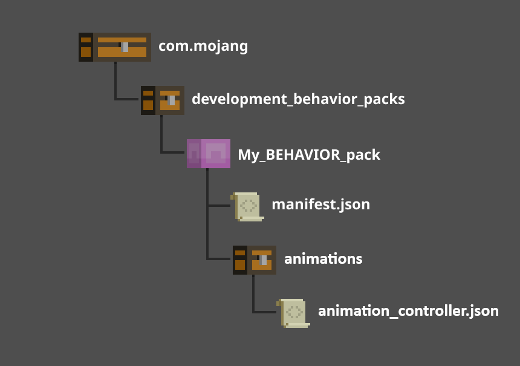

# Introduction to Animation Controllers

In Minecraft, animation controllers do pretty much what they say: manage animations for blocks and entities. Animation controllers allow you to define when different animations play based on an entity's condition and current state. Animation controllers are very important because they help define the gameplay experience. Not only can you use them for basic things, such as making sure an entity plays the walking animation while they move (instead of hovering over the ground in a T-pose!), but you can also use animation controllers to create customized experiences based on your world and the things that happen in it. For example, you could create a custom werewolf entity that transforms during the full moon, or a block that glows in the dark!

In this guide, we will cover what animation controllers are and what they do and how to use them effectively. For specific information, such as code samples and in-depth definitions, we'll refer to the [Animation Controllers Reference Doc](../Reference/Content/AnimationsReference/Examples/AnimationController.md)

> [!NOTE]
This guide will not cover how to create custom animations. You can use programs like **Blockbench** to create custom animations to add flavor to your custom blocks and entities, but for this guide, we will only cover how to use animation controllers and how to transition between animations. For more information on creating animations, see [Animation Documentation - Getting Started](../Reference/Content/AnimationsReference/Examples/AnimationGettingStarted.md).

## Key Concepts

Let's define some key concepts for animation controllers:

- **States**: States are the modes that an entity or block can be in at any given time. States can change based on player input (ex.: moving your character), behavior, or changes to the environment. Animations are typicallly tied to a state and we use transitions between states to change an entity's animations. Some example states are `default` (idle), `attacking`, and `transforming`. Blocks can also have states - such as `waterlogged` - that can affect their animations and appearance.
- **Transitions**: When an entity moves from one state to another. For example, when an entity changes from an idle state to a walking state or from a walking state to a running state. Transitions are typically when animations will change.
- **Conditions**: A set of criteria that determine whether a transition can occur. Conditions can check an entity's speed, health, player inputs, or other attributes to decide if it should transition and which state it should move to.
- **Triggers**: Specific events that cause transitions. For example, pressing the `W` key could cause the player entity to transition from the `default` state to the `walking` state.

## Creating an Animation Controller

Next let's look at the parts of an animation controller and learn how to create one. We'll use this sample animation controller and break it down so that we can understand what each part is and how it affects the sheep entity's animation.

```json
{
  "format_version": "1.17.30",
  "animation_controllers": {
    "controller.animation.sheep.move": {
      "states": {
        "default": {
          "animations": [
            { "walk": "query.modified_move_speed" }
          ],
          "transitions": [
            { "grazing": "query.is_grazing" }
          ]
        },
        "grazing": {
          "animations": [ "grazing" ],
          "transitions": [
            { "default": "query.all_animations_finished" }
          ]
        }
      }
    }
  }
}
```

1. `animation_controllers` - This is the main section where all of our animation controllers will be defined. Each animation controller will be defined by a unique name.
1. `controller.animation.sheep.move` - This is a unique animation controller related to the movement of the sheep entity.
1. `states` - This section defines the different states that the sheep can be in. Each state can have its own animations and transitions.

So these are the basics of an animation controller. Now, let's look at the various states for our custom sheep and how they affect its animation:

1. `default` - This is a state for the sheep. In this case, it is the primary, or "idle", state that is active when no other state conditions are met.
1. `animations` - The list of animations that should play when the sheep is in this state. In this example, the `walk` animation is triggered when `query.modified_move_speed` returns `true`, meaning that the sheep is moving.
1. `transitions` - This section defines the conditions that can cause the sheep to move to a different state. In this case, if `query.is_grazing` returns `true`, the sheep will move to the `grazing` state.

Great! We've defined a great base state for our sheep and we've even given it the ability to walk and start grazing! Now, let's look at the `grazing` state to see how we can give our sheep even more flavor:

1. `animations` - Like the `default` state, the `grazing` state gets its own animations. In this case, the `grazing` animation.
1. `transitions` - Here, we use `"default": "query.all_animations_finished"` to check if the sheep has completed any animations that are played by its current state. In this case, once the `grazing` animation has played once, it will transition the sheep back to the `default` state.

So we've now created a nice little animation loop that takes the sheep from an idle state (`default`) to a `grazing` state that adds flavor to the entity. This helps create a better environment and atmosphere by allowing the sheep to do more than just stand or walk around. You can bet creative and use animation controllers to move entities and blocks through many different states, creating customized experiences or better ambiance for your world.

## Deploy an Animation Controller



To use your new animation controller, create a folder in your Behavior Pack called `animations`. Place your new animation controller file in this folder.

> [!IMPORTANT]
Make sure you define your animation controller under the `modules` section of your `manifest.json` file. See [Introduction to Behavior Packs (from Scratch)](BehaviorPackFromScratch.md#create-the-manifest-file) for more information.

## Conclusion

Now that you know how to create and deploy an animation controller, try playing around with states and conditions to create customized experiences in your world. Animation controllers can create simple effects for ambiance, such as making a villager yawn when they're tired, or world-changing events, such as an incubator that turns on when four magic gems are inserted and hatches a whole brood of ender dragons! If you manage them correctly, you can tell a whole story through animation controllers and the effects they have on the entities and blocks in your world.

For more information on Animations and Animation controllers, including detailed information on states and other concepts, check out our reference documentation.
