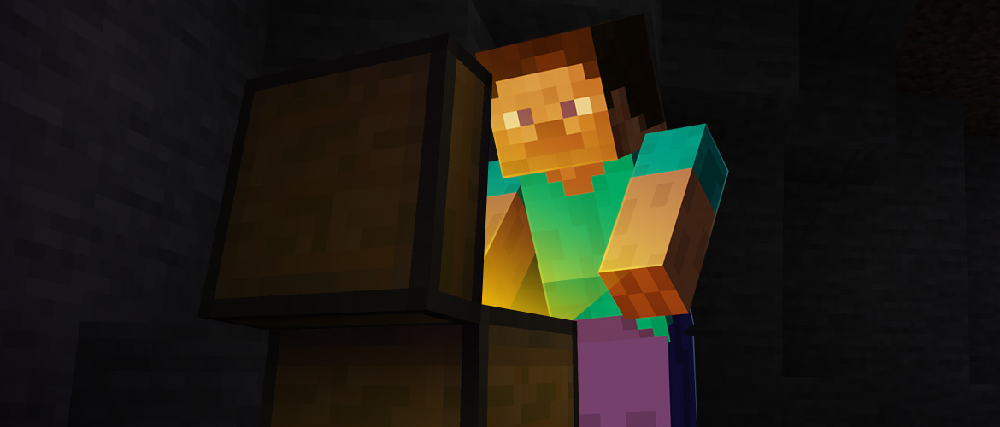
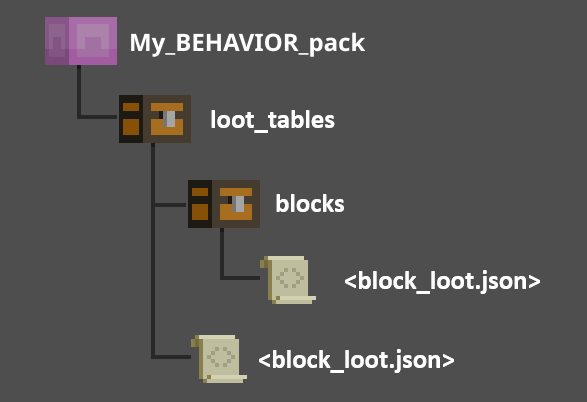

# Introduction to Loot Tables

When you do something fun and get rewarded with loot in Minecraft, a loot table was involved. 

With just a few lines of JSON, loot tables control what you find when you break a block, open a newly discovered chest, interact with an entity, and use differently enchanted items in typical gameplay.



Loot table files live in a directory (cleverly named `loot_tables`) at the root level of a behavior pack.

The five categories of loot tables in Vanilla Minecraft are blocks, chests, entities, equipment, and gameplay (such as fishing, milking a mooshroom, or watching your sniffer find seeds). 

If you have more than one type of loot table in your behavior pack, it would be a good idea to put each type in its own subfolder. But this is not required.



A loot table file generally consists of three main sections collectively known as a "pool." As a creator, you might want to have different pools so you can drop different loot to your players if they satisfy different [loot table conditions](../Documents/LootTableConditions.md).

- **Rolls**
  - Rolls dictate how many times the pool will be rolled to select an entry. This could be either an integer which will result in a set amount of rolls or a min/max range from which the number of rolls can be chosen.
- [Loot Table Conditions](LootTableConditions.md)
  - These are optional requirements that must be met for the pool to be rolled. Some of the more interesting [functions](../Documents/LootAndTradeTableFunctions.md) you might want in your gameplay include setting the lore on an item (`set_lore`) and putting your own content into a book (`set_book_contents`).
- **Entries**
  - This is a list of objects the game will select from in this roll. It can be an `item`, a `loot_table`, or `empty` if you want a chance of nothing happening this roll.

As an example, here is the loot table for when you have a pet cat and it brings you a gift in the morning:

```json
{
  "pools": [
    {
      "rolls": 1,
      "entries": [
        {
          "type": "item",
          "name": "minecraft:rabbit_hide",
          "weight": 10
        },
        {
          "type": "item",
          "name": "minecraft:rabbit_foot",
          "weight": 10
        },
        {
          "type": "item",
          "name": "minecraft:chicken",
          "weight": 10
        },
        {
          "type": "item",
          "name": "minecraft:feather",
          "weight": 10
        },
        {
          "type": "item",
          "name": "minecraft:rotten_flesh",
          "weight": 10
        },
        {
          "type": "item",
          "name": "minecraft:string",
          "weight": 10
        },
        {
          "type": "item",
          "name": "minecraft:phantom_membrane",
          "weight": 2
        }
      ]
    }
  ]
}
```

As you can see, getting a phantom membrane is rarer than getting a bit of string or a chicken. Imagine a cat bringing down a phantom! Now you know why they avoid cats...

## What's Next?

We suggest taking a look at loot table functions next, followed by conditions, then loot overloads. Once you've gotten comfortable with all of the intricacies of those topics, jump into the tutorial and create your own loot table!

> [!div class="nextstepaction"]
> [Loot and Trade Table Functions](LootandTradeTableFunctions.md)
> [Loot Table Conditions](LootTableConditions.md)
> [Loot Table Overloads](LootOverloads.md)
> [Creating a Loot Table](CreateLootTable.md)