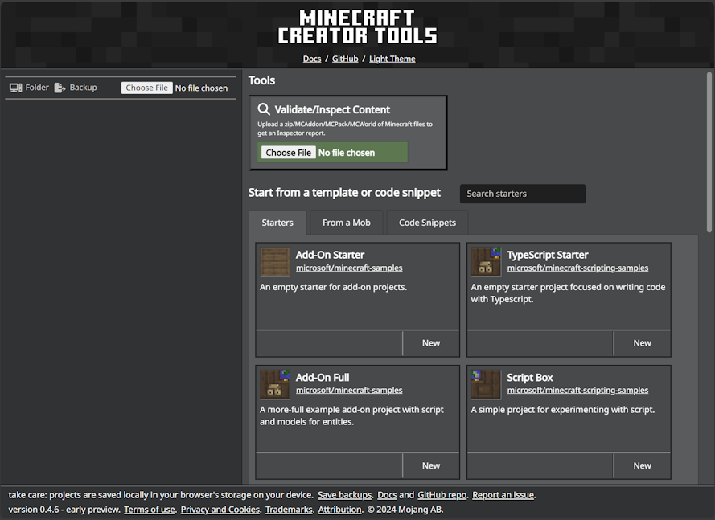
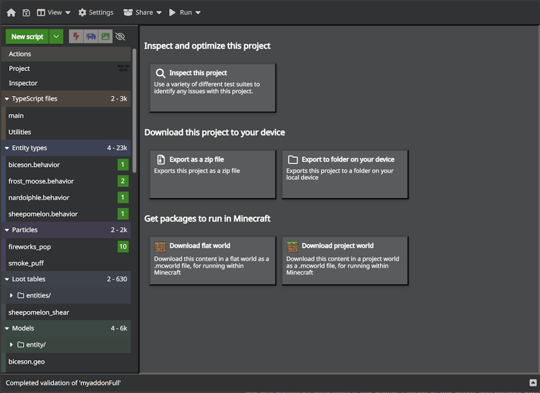

# Minecraft Creator Tools (mctools.dev) - Overview

Minecraft Creator Tools is produced by Mojang as an open source toolset that can improve your productivity as a creator. It comes in two forms: a website, located at [https://mctools.dev](https://mctools.dev), and a command line tool that you can install via [nodejs tools](https://nodejs.org).

## https://mctools.dev website

The [creator tools site](https://mctools.dev) is the easiest way to get started - simply navigate to [https://mctools.dev](https://mctools.dev). On the home page, you'll see a number of new project starters, code samples, and start-from-mob starters. From the website, and in Google Chrome and Microsoft Edge browsers, Minecraft Creator Tools can also open folders on your device and work directly against them. 

Once you've started your project, you'll see an editor that shows top-level files that you can edit, including TypeScript, JSON files, and more. You can test certain facets of your creations by downloading .MCWorld and .MCProject files, which when run will open inside of Minecraft and import your custom code.

>[!IMPORTANT]
> mctools.dev stores your projects and edits within the storage confines of your browser. Sometimes, this storage can get cleared by your browser. For any projects you'd like to keep, ensure that you regularly backup and download projects. 

## Command Line Tools

Command line tools let you access the power of creator tools from a command line. You can also integrate this into broader processes or project-level tasks.

Command line tools are available via the [@minecraft/creator-tools](https://aka.ms/mctnpm) page on NPM. To install via NPM, install [nodejs tools](https://nodejs.org/) and then run `npm -i @minecraft/creator-tools` from a command line. See the [NPM page](https://aka.ms/mctnpm) for more documentation and sample command lines.

## Minecraft Creator Tools - what it does

### New Project Starters

Start and extend your Minecraft projects from a growing set of GitHub-hosted sources of samples and content. Start on the [MC Tools website](https://mctools.dev) and select from the gallery of projects. Add new items from the set of Minecraft samples. With command line tools, use the `create` command to start a new project, and `add` to add additional elements.

### Project Editor

Minecraft Creator Tools includes editors for various files including JavaScript and JSON: editing JavaScript or TypeScript, the Project Editor includes a modern editor with autocomplete and built-in support for Minecraft types, plus a rich array of code snippets.

#### Accessibility Support

Where possible, additional capabilities are provided to help make Minecraft Creator Tools accessible to all users. This section discusses using some of these tools and features.
            
#### Tab Trapping

By default, pressing Tab in the JavaScript/JSON editor inserts the Tab character and does not navigate to the next focusable element on the page. You can toggle the trapping of Tab with Ctrl+M on Windows and Linux and with Ctrl+Shift+M on OSX, and subsequent Tab keys will move focus out of the editor.

### Validation and Analytics

Minecraft Creator Tools includes a suite of tests and analytics that can be used to build reports across projects. It can output reports as an HTML file, in addition to being displayed within the site. Validation/analytics is available on both the website and the NPM command line tools.

To use the validator, use "Choose file" in the Validate/Inspect Tool to select a zip file from your local device that contains project files. This can be any typical zip of a Minecraft project: an MCAddon file, an MCPack file, or a ZIP file where you have behavior packs under `behavior_packs` and resource packs under `resource_packs`. Note that these ZIP files are temporarily stored and locally processed within your browser.

Validation results are displayed in the "Inspector" section of the application. Note that there are different suites of tests that you can use. You can also opt to download the results in comma-separated-value (CSV) format or web page (HTML) format.

## What's Next?

MCTools.dev is one of many tools you can use to work on facets of your project. See the other major Minecraft tools [listed here](./CommonlyUsedTools.md).

> [!div class="nextstepaction"]
> [CommonlyUsedTools](CommonlyUsedTools.md)
