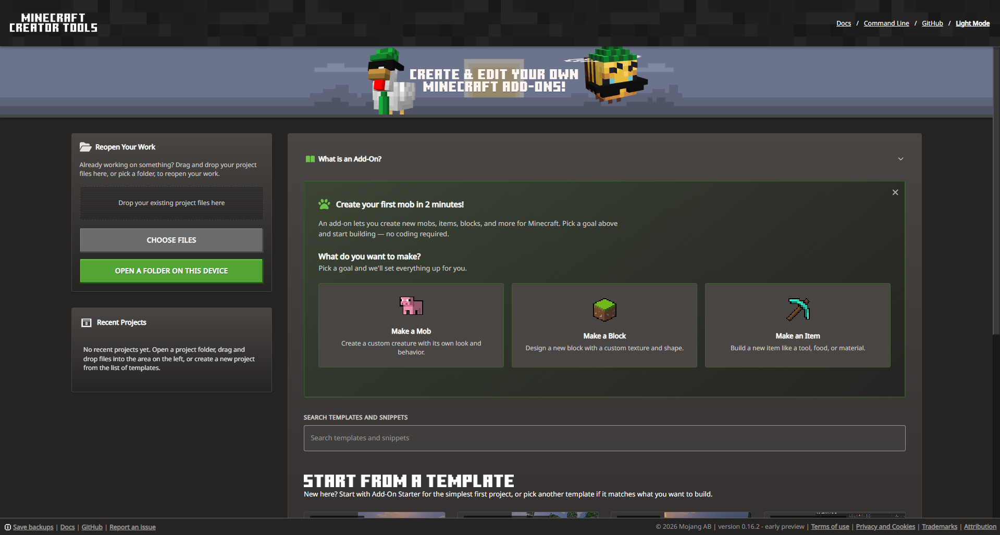
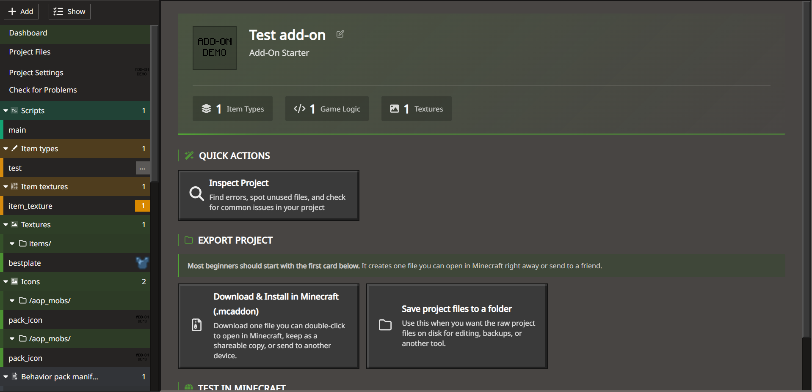
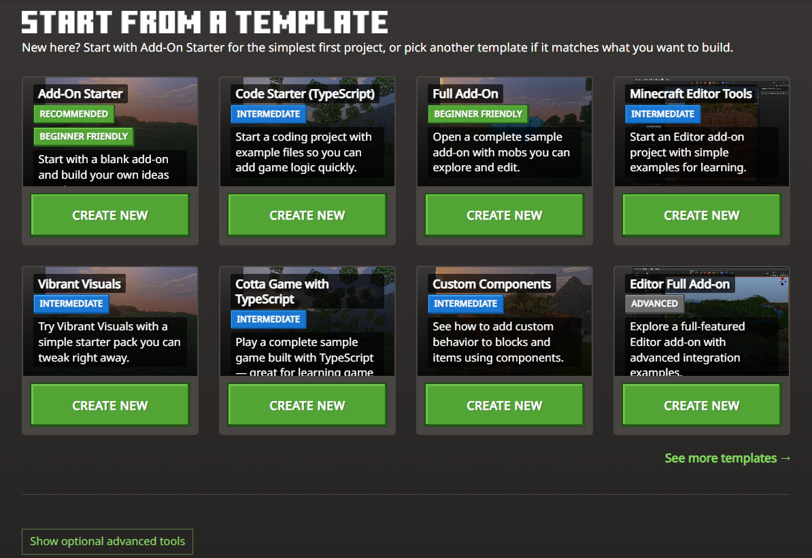

# Minecraft Creator Tools (mctools.dev) Overview

Minecraft Creator Tools is produced by Mojang as an open source toolset built to make your life as a creator a lot easier. Whether you're jumping in for the first time or you're deep in a complex add-on project, the Creator Tools are designed to meet you where you are. The toolset comes in two forms: a website (<https://mctools.dev>) and a command line tool you can install through [Node.js](https://nodejs.org). These two paths are interchangeable, so you can work however fits your workflow best.

## Website interface

The [Creator Tools website](https://mctools.dev) is the fastest way to get started, and it's designed to support you at every stage of a project. The current experience is built around four main entry points that work together to keep your creative momentum going.

- **Start from a goal** if you're just getting started but already have an idea of what you want to create (like a mob, a block, or an item). Once you pick, the tool sets up a project structure tailored to that goal so you're not overwhelmed by staring at a blank slate.

- **Start from a template** if you want more control over your starting point to create a curated project that matches a specific use case or difficulty level (more on those in the next section).

- **Reopen existing work** by dragging your project files into the browser window or by opening a folder directly on your device. The editor picks up right where you left off.

- **Recent projects** are available right from the home page, so you can jump back in without digging through files.

These entry points aren't mutually exclusive&mdash;they're meant to interconnect! You might start from a goal-based setup, build out your first mob, then reopen that same project later as a foundation for something more complex. The flow is designed to grow with you, so it works just as well for a quick prototype as it does for a long-running creative project.

In Google Chrome and Microsoft Edge browsers, Minecraft Creator Tools can also open folders directly on your device (even mobile ones) and work against them in place&mdash;no need to package or upload anything.

> [!NOTE]
> The images below may differ slightly from the current UI following recent updates.



Once you've started your project, you'll see an editor that shows top-level files that you can edit, including TypeScript, JSON files, and more. You can test certain facets of your creations by downloading **.mcworld** and **.mcproject** files, which will open inside of Minecraft and import your custom code when they're run.



>[!IMPORTANT]
> mctools.dev stores your projects and edits within the storage confines of your browser. Sometimes, this storage can get cleared by your browser. Ensure that you regularly backup and download any projects you'd like to keep!

## Templates

Templates are one of the best ways to get a head start on a new project. Each one gives you a working project structure you can explore, edit, and build on right away. Instead of wiring everything up from scratch, you're already in the file tree doing the interesting stuff from the very beginning.



Templates on mctools.dev are grouped by experience level, so you can find the right starting point whether you're brand new to add-ons or already comfortable with behavior packs and scripting.

> [!NOTE]
> Template offerings will continue to evolve as the tool grows. Head to [mctools.dev](https://mctools.dev) for the most up-to-date list.

### Beginner templates

- **Add-On Starter**: A clean, minimal add-on structure you can build on step-by-step. The starter is great for hands-on learners because you can add things at your own pace without other distracting content in the way.

- **Full Add-On**: A complete sample add-on with working mobs already in place. If you learn better by deconstructing things to understand how they fit together, this is the starting point for you.

### Intermediate templates

- **Code Starter (TypeScript)**: Starts a scripting-focused project with example TypeScript files already in place. Skip the boilerplate stuff and get straight to adding game logic.

- **Minecraft Editor Tools**: A starter for building Editor add-ons that leverages simple examples to show how Editor extensions work.

- **Vibrant Visuals**: A resource pack starter for experimenting with the Vibrant Visuals rendering system. Good for creators interested in lighting, visuals, and environmental customization.

- **Cotta Game with TypeScript**: A fully playable sample game built with TypeScript. Solid reference material if you want to experiment with how scripts, entities, and game logic interconnect in a real project.

- **Custom Components**: Shows how to add custom behavior to blocks and items using components. A useful bridge between content-only work and scripting, especially if you're ready to go beyond JSON-only configuration.

### Advanced templates

- **Editor Full Add-on**: A fully realized Editor add-on with advanced integration examples. This template is designed for creators who are developing production-grade Editor extensions and want a thorough, real-world reference point.

## Project editor

The project editor gives you a full editing environment for your add-on files. It handles JavaScript, TypeScript, and JSON with autocomplete and built-in support for Minecraft types; so, you're getting relevant suggestions as you work rather than manually cross-referencing the docs for every field. It also ships with a set of code snippets to speed up common patterns&mdash;handy once you've got a handle on the structure and want to move faster.

## Validation and analytics

Minecraft Creator Tools includes a built-in validation suite that checks your project against a range of rules and surfaces issues before you're discovering them in-game. Validation is available on both the website and through the command line tools, and results can be exported as a CSV or HTML report&mdash;useful for tracking down issues across a larger project or sharing findings with collaborators.

To run validation in the website, select your project as a zip file using the validation tool. Supported formats include MCAddon, MCPack, and ZIP files that contain **behavior_packs** and **resource_packs** folders. Your files are processed locally in the browser and aren't sent anywhere.

You can choose from different rule suites depending on what you're validating — whether it's a full add-on, a specific content type, or the current platform target. Results show up in the inspector area where you can iterate from there.

> [!NOTE]
> Check out [the validation rules index](./../Reference/Content/MCToolsValReference/ValidationRulesIndex.md) for a full list of rules and guidance on common fixes.

## Command line interface (CLI)

The command line tools bring the full power of Creator Tools into PowerShell or Terminal, and they're worth getting familiar with&mdash;even if the website covers most of your day-to-day needs. They're especially useful when you want to automate steps, run validation as part of a build process, or manage projects at a larger scale. To set up the CLI:

1. Install the package from the [@minecraft/creator-tools](https://aka.ms/mctnpm) page on NPM. You'll need [Node.js](https://nodejs.org/) 22 or later.

    If you're new to the CLI, here's a basic workflow to get you oriented:

    ```powershell
    # Install the tools globally
    npm install -g @minecraft/creator-tools
    
    # Create a new project (interactive prompts walk you through setup)
    npx mct create
    
    # Add a new entity to an existing project
    npx mct add entity d:\mycontent\myproject
    
    # Validate your project against the default rule suite
    npx mct validate d:\mycontent\myproject
    ```

2. Swap out the paths for wherever your project lives on your machine.

3. Run `npx mct --help` to see the full list of available commands.

## Advanced capabilities

The following features go a bit deeper and are geared toward creators working on more complex pipelines or specialized use cases. They're worth knowing about even if you don't need them right now.


### Server and deployment workflows

Advanced CLI workflows include spinning up a local web server, deploying your project to different Minecraft targets, and configuring test worlds. These are especially useful when you're iterating quickly across multiple devices or want a more automated path from edit to in-game testing without manual file copying.

### Rendering and project automation workflows

The CLI also includes commands for rendering model geometry, vanilla blocks, mobs, and items to PNG images, along with tools for managing world settings and packaging projects into distributable formats like `.mcaddon`. These fit best into larger or more automated pipelines where manual export steps would slow you down.

### MCP and AI-assisted workflows

Minecraft Creator Tools can run as a local [Model Context Protocol (MCP)](https://modelcontextprotocol.io/) server, which lets AI tools interact directly with your project through structured tool calls. This opens up workflows where an AI assistant can help you inspect content, generate add-on files, or validate your project&mdash;all working against your actual project folder on your machine. For setup instructions and configuration details, see the [@minecraft/creator-tools NPM page](https://aka.ms/mctnpm).

## Accessibility support

Where possible, additional capabilities are provided to help make Minecraft Creator Tools accessible to all creators:

### Tab trapping

By default, pressing the Tab key in the JavaScript or JSON editor inserts a tab character and does not navigate to the next focusable element on the page. You can toggle this with Ctrl+M on Windows and Linux, or Ctrl+Shift+M on macOS. When enabled, the Tab key moves focus out of the editor normally.

## What's next?

MCTools.dev is one of many tools you can use to work on facets of your project. See the other major Minecraft tools [listed here](./CommonlyUsedTools.md).

> [!div class="nextstepaction"]
> [CommonlyUsedTools](CommonlyUsedTools.md)
