# Getting Started with the Minecraft Item Wizard

The Minecraft Item Wizard is a plugin for Blockbench. It allows you to add a custom item to Minecraft without any coding experience or knowledge of the addon system. It does this by generating an addon on your computer, which you can add to your world.

After you have created a custom item with the Wizard, you can use Blockbench to design a custom 3D model for it.

The plugin works similarly to the [Minecraft Entity Wizard](MinecraftEntityWizard.md) and the [Minecraft Block Wizard](MinecraftBlockWizard.md).

## Demonstration: How to Make a Custom Item

> [!VIDEO https://www.youtube.com/embed/5gUTZoTSPgE]

This video shows how to make a custom item with Minecraft Item Wizard.

--------

In this tutorial, you will learn how to:

> [!div class="checklist"]
>
> - Add the Minecraft Item Wizard plugin to Blockbench
> - Create a custom item with the Wizard
> - Export the item for use within Minecraft: Bedrock Edition

--------

### Requirements

To get started, you need the following:

- An installation of [Blockbench](https://blockbench.net/)
- Minecraft Bedrock Edition
- A Windows computer (or an Android device)

>[!IMPORTANT]
>Blockbench is provided by external, third-party contributors and is not a Mojang/Microsoft offering. Users should use at their own discretion.

## Getting Started

The first step is to install the Item Wizard plugin.

1. In Blockbench, go to **File** > **Plugins...**, switch to the **Available** tab, and enter **"Minecraft Item Wizard"** into the search bar.
1. Find the Item Wizard plugin and select **Install**.
1. Close the **Plugins** dialog.
1. After it has installed, you will find the **Minecraft Item Wizard** in the left sidebar of your start screen. Select it, then press **Create an Item!**

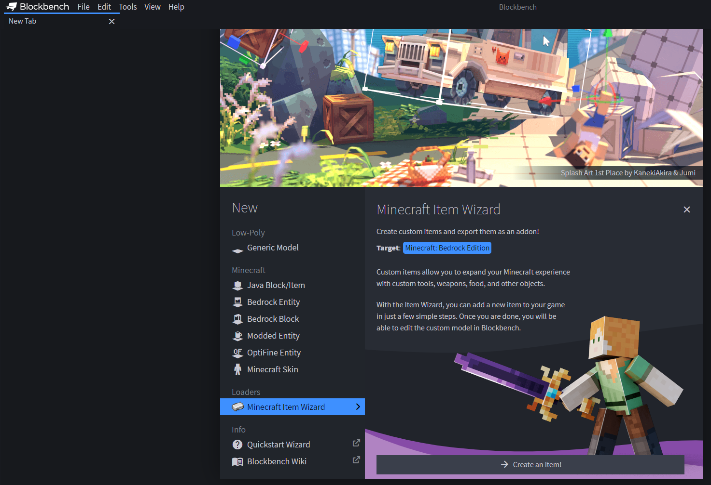

Next time you want to use it, you can open the Item Wizard from the menu via **Tools** > **Minecraft Item Wizard** or from the center of the start screen.

## Tutorial: Making a Glass Sword

This tutorial starts with something familiar, but nonexistant in vanilla Minecraft: a sword made of glass!

### Preset

On the first page of the Item Wizard, you can select a preset item to use as starting point for your own custom item.

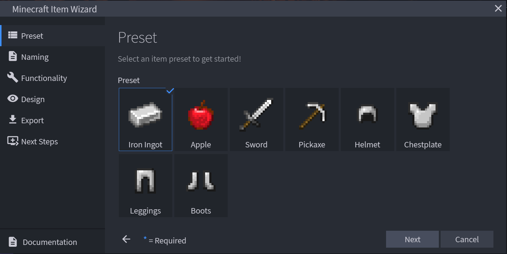

1. Select the **Sword** preset item and click **Next**.

### Naming

This is where we enter the meta data for the item. The required fields are Display Name, Identifier, and Creative Category. Stack Size is also on this page, but it is not required.

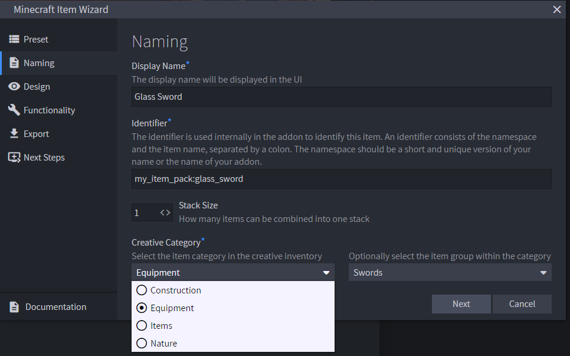

**Display Name**: The item's name that will be displayed in the inventory and in other places within the interface.

2. To keep things simple, let's name it **Glass Sword**.

**Identifier**: The identifier of the item will be used internally, like with the `/give` command. The identifier needs to start with a namespace such as your own name or the name of your project or addon packs. All items that Minecraft comes with by default have the namespace `minecraft:`, so you can't use that one. That namespace is reserved for vanilla Minecraft entities. 

3. Enter an identifier like this: `myname:glass_sword`.

**Stack Size**: How many items can fit in one stack.

4. To keep this sword like other swords in Minecraft, Stack Size should be set to **1**.

**Creative Category**: Select the tab of the creative inventory where you want your item to appear. You can also select a sub-group to add your item to in one of the foldable groups within an inventory tab.

5. Swords are **Equipment** (by default) so let's leave it there and select **Swords** as the sub-group.

6. Click **Next**.

### Functionality

Different preset items have different Functionality settings.

This is the page for the Sword preset, with some options already selected for you.

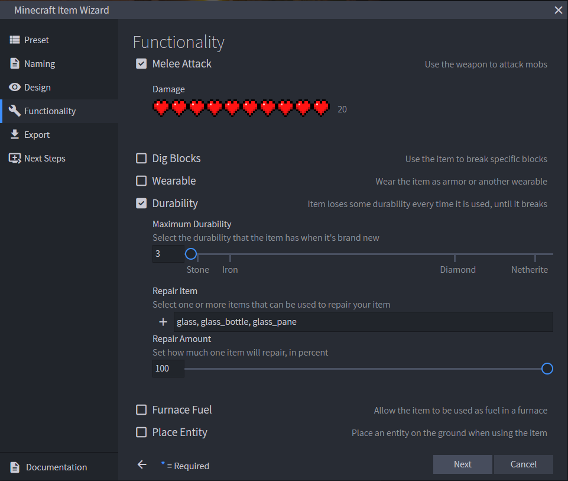

**Melee Attack**: Use the weapon to attack mobs.

7. Yes. Because we want to use this like any other sword, **Melee Attack** should be checked.

**Damage**: If the item can be used to damage mobs, set that level here. 

8. For the glass sword, set the Damage level all the way up to 20.

**Break Blocks**: Check this box if the item is intended to be used to break specific blocks.

**Wearable**: Check this box if the item is intended to be worn by the player.

9. Leave **Break Blocks** and **Wearable** unchecked.

**Durability**: Item loses some durability every time it is used, until it breaks. 

10. To make our glass sword act like a sword made out of fragile glass, let's set the durability to 3.

**Repair Item**: If you want to be able to repair your sword, this is where you set which material should be used.

11. Click the drop-down menu and enter "glass" in the search field. 
12. Select "Glass."

>[!Note]
>If you want to make your item repairable with more than one material, you can add items in the `repair_items` section of the **glass_sword.item.json** file in the behavior pack like this:
>
>```json
>"minecraft:repairable": {
>  "repair_items": [
>    {
>      "items": ["glass", "sand"],
>        "repair_amount": 3
>    }
>  ]
>}
>```

**Repair Amount**: Set the precentage of how much one unit of material will repair your item.

13. Let's encourage players to re-use glass by setting this to 100%.

**Food**: Allow players to eat the item.

**Furnace Fuel**: Check this if you want to be able to burn the item in a furnace like wood or coal.

**Place Entity**: Check this if you want to be able to place an entity on the ground. 

14. **Leave Food**, **Furnace Fuel**, and **Place Entity** unchecked.

15. Click **Next**.

### Design

On this page, you have the Handheld Item Model option and the option to add an Icon Glint.

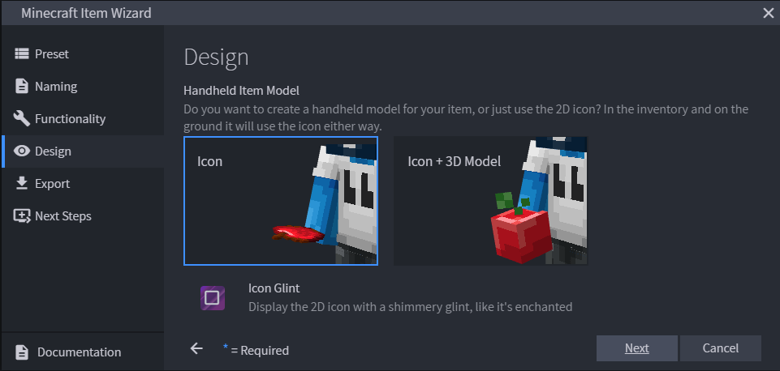

**Handheld Item Model**: Do you want to create a handheld model for your item, or just use the 2D icon? In the inventory and on the ground it will use the icon either way.

16. Select **Icon + 3D Model**.

**Icon Glint**: Select this option if you want to display the 2D icon with a shimmery glint, like it's enchanted.

17. Leave **Icon Glint** unchecked so you can see the model you create without any enchantments on it.

18. Click **Next**.

## Export

We're almost there! 

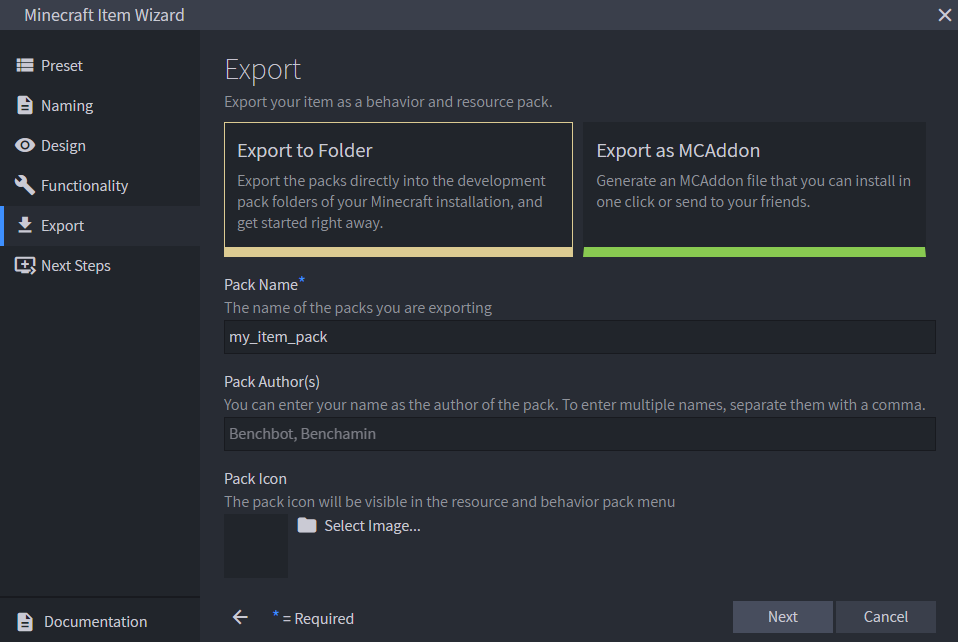

You can choose **Export to Folder**, to export the packs directly into the development pack folders of your Minecraft installation, or **Export as MCAddon** to generate an MCAddon file that you can install in one click or send to your friends.

19. Choose **Export to Folder**.

**Pack Name**: (Required) The name of the packs you are exporting. This name will be used both for the generated file, as well as for the name in the pack menu in Minecraft.

20. Enter a Pack Name. You can use the identifier from the **Naming** screen.

**Pack Author(s)**: You can enter your name as the author of the pack. To enter multiple names, separate them with a comma.

**Pack Icon**: You can upload an image as an icon to represent your pack in the pack menu. The image should be a .png file and the recommended resolution is 64 by 64 pixels.

21. Enter author names and give your pack an icon if you want to.

22. Click **Next**.

### Next Steps

Blockbench creates your packs and saves them in your com.mojang folder, in the **development_behavior_packs** and **development_resource_packs**, respectively.

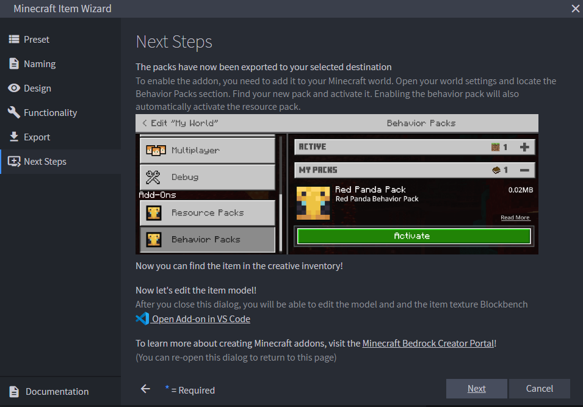

You should see an "Export Successful" message from Blockbench.

23. Click **Next**.

## Editing the 3D Model

Because you are already in Blockbench, you can continue to use the program to edit the model and texture.

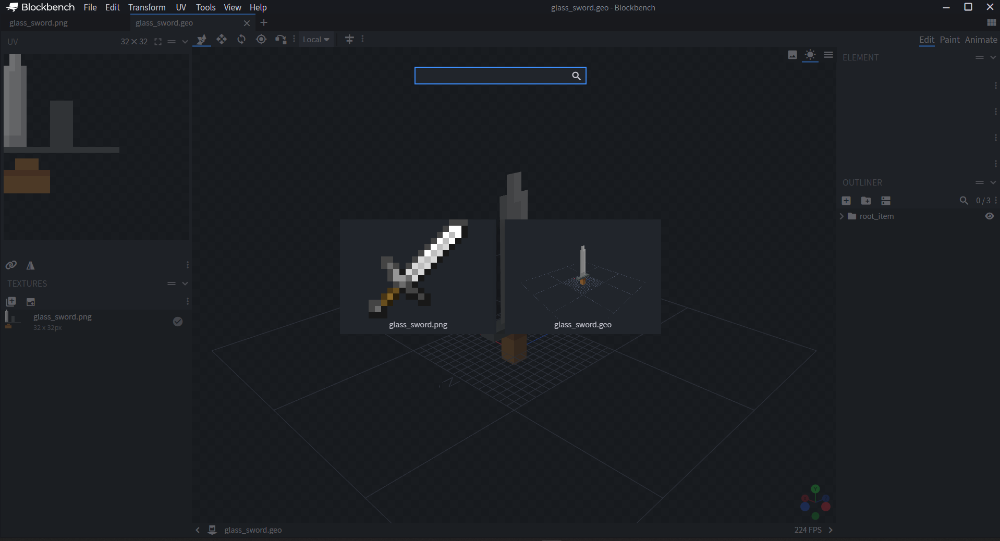

> [!CAUTION]
> This option is not available if you have exported your addon as an `.mcaddon` file.

You can learn how to create a model in this tutorial playlist: [ArtsByKev Blockbench Tutorials](https://www.youtube.com/watch?v=U9FLteWmFzg&list=PLvULVkjBtg2SezfUA8kHcPUGpxIS26uJR)

More information on Blockbench can be found on the [Blockbench Wiki](https://www.blockbench.net/wiki/).

Starting with the familiar sword model...

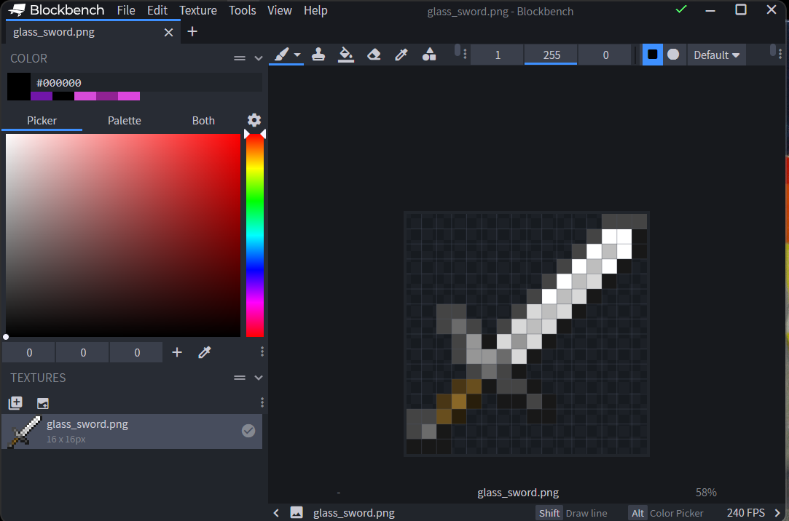

... let's give it rainbow colors, like a prism!

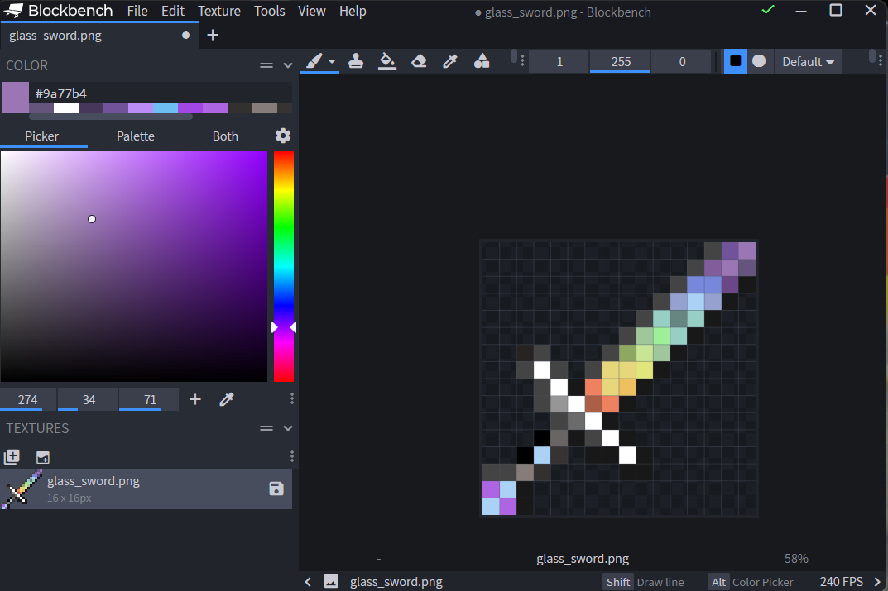

24. Go to **File** > **Save Model**.

### Editing the 2D Icon

Starting with the sword icon...

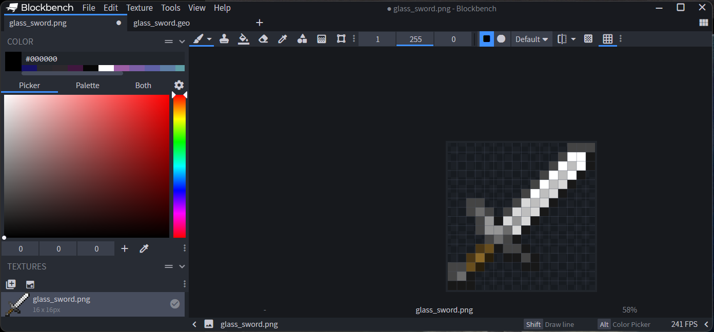

... let's make it look more like the glass sword model!

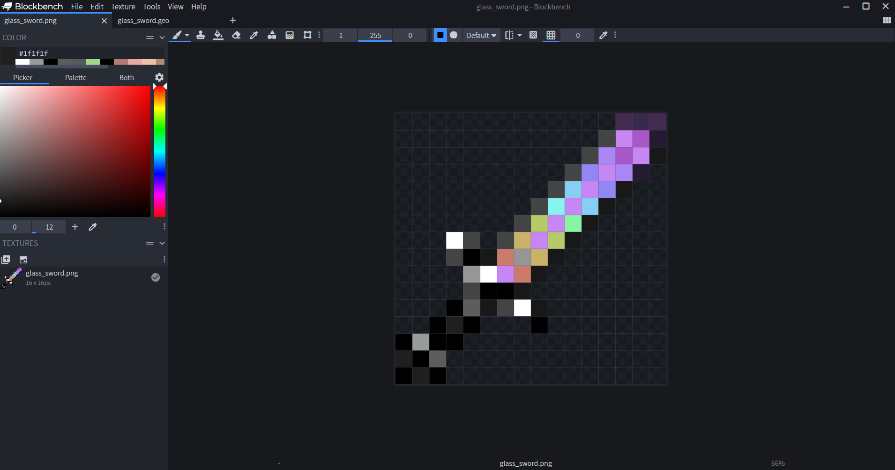

25. Go to **File** > **Save Model**.

## Installing the pack

To enable your packs for the first time, you need to add the behavior pack to your Minecraft world. Open the world settings and locate the behavior packs section. Find your new pack and activate it. Activating the behavior pack will also automatically activate the connected resource pack. This means that you now have the full addon installed into your world.

> [!TIP]
> You can view a detailed step-by-step walkthrough on how to enable tutorial in the [Behavior Pack](BehaviorPack.md#testing-the-pack) tutorial.

Enter the world and locate the custom item in your creative inventory. Alternatively, if you didn't choose to add your item to a creative inventory tab, you can get it using the `/give` command.

> [!NOTE]
> Alternatively, if you have exported your addon as a `.mcaddon` file, you can open this file in order to automatically add the packs into Minecraft.

## Let's Try it Out!

Launch Minecraft and go a Survival world with cheats toggled on.

Give yourself a sword. You will need to enter the whole name, like "myname:glass_sword".

`/give @s myname:glass_sword`

Try it out! Remember, we made it high damage and low durability.

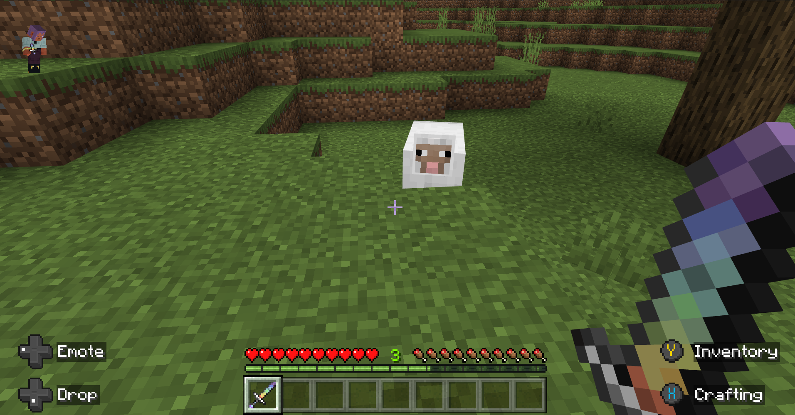

>[!Note]
>Using items in creative mode does not consume durability, so make sure you are in survival mode to test this.

Try repairing it, too!

## What's Next?

Want to learn more about building with Blockbench? The Blockbench Wiki has step by step guides and reference documentation for modeling, texturing, and animating any custom creation you can imagine.

> [!div class="nextstepaction"]
> [Blockbench Wiki](https://www.blockbench.net/wiki/)

The Blockbench Quick Start guide can help lead you to the specific document that you're looking for and is a great way to discover relevant external guides and videos.

> [!div class="nextstepaction"]
> [Blockbench Quick Start](https://www.blockbench.net/quickstart)
