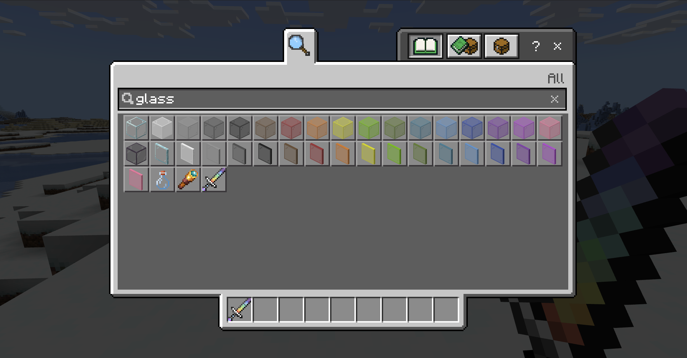

# Getting Started with the Minecraft Item Wizard

The Minecraft Item Wizard is a plugin for Blockbench. It allows you to add a custom item to Minecraft without any coding experience or knowledge of the addon system. It does this by generating an addon on your computer, which you can add to your world.

After you have created a custom item with the Wizard, you can use Blockbench to design a custom 3D model for it.

The plugin works similarly to the [Minecraft Entity Wizard](MinecraftEntityWizard.md) and the [Minecraft Block Wizard](MinecraftBlockWizard.md).

--------

In this tutorial, you will learn the following:

> [!div class="checklist"]
>
> - How to add the Minecraft Item Wizard plugin to Blockbench.
> - Understand the steps to create a custom item with the Wizard.
> - Export the item for use within Minecraft: Bedrock Edition.

--------

### Requirements

To get started, you need the following:

- An installation of [Blockbench](https://blockbench.net/)
- Minecraft Bedrock Edition
- A Windows computer (or an Android device)

>[!IMPORTANT]
>Blockbench is provided by external, third-party contributors and is not a Mojang/Microsoft offering. Users should use at their own discretion.

## Getting Started

The first step is to install the Block Wizard plugin.

1. In Blockbench, go to **File** > **Plugins...**, switch to the **Available** tab, and enter **"Minecraft Item Wizard"** into the search bar.
1. Find the Item Wizard plugin and select **Install**.
1. Close the **Plugins** dialog.
1. After it has installed, you will find the **Minecraft Item Wizard** in the left sidebar of your start screen. Select it, then press **Create an Item!**

Next time you want to use it, you can open the Item Wizard from the menu via **Tools** > **Minecraft Item Wizard**.

## Glass Sword

This tutorial starts with something familiar, but nonexistant in vanilla Minecraft: a glass sword.

### Preset

On the first page of the Item Wizard, you can select a preset item to use as starting point for your own custom item.

For this tutorial, we are going to start with something simple: a glass sword.

Select the **Sword** preset item and click **Next**.

### Naming

Enter the meta data for the item. The required fields are Display Name, Identifier, and Creative Category.

- **Display Name**: The item's name that will be displayed in the inventory and in other places within the interface.

To keep things simple, let's name it ***Glass Sword**.

- **Identifier**: The identifier of the item that will be used internally, like with the `/give` command. The identifier needs to start with a namespace, which is a short identifier of your or your project. All items that Minecraft comes with by default have the namespace `minecraft:`. That namespace is reserved for vanilla blocks. 

Your identifier may look like this: `my_item_pack:glass_sword`.

- **Creative Category**: Select the tab of the creative inventory where you want your item to appear. You can also select a sub-group to add your item to in one of the foldable groups within an inventory tab.

Swords are Equipment (by default) so let's put it there, in the Sword sub-group.

### Design

On this page, you can select whether to add a, Item Model or an Icon Glint.

- **Item Model**: Select this option if you want to create a handheld model for your item in addition to the 2D icon.

- **Icon Glint**: Select this option if you want to display the 2D icon with a shimmery glint, like it's enchanted.

For now, let's keep it as simple as possible and leave the boxes unchecked.

Click Next.

### Functionality

Blockbench automatically checks some options for us because we chose the Sword preset item.

- **Melee Attack**: Use the weapon to attack mobs.

- **Damage**: If the item can be used to damage mobs, set that level here. 

For the glass sword, set the Damage level all the way up to 20.

- **Dig Blocks**: Check this box if the item is intended to be used for digging blocks.

- **Wearable**: Check this box if the item is intended to be worn by the player.

Leave Dig Blocks and Wearable unchecked.

- **Durability**: Item loses some durability every time it is used, until it breaks. 

To make our glass sword act like, well, a sword made out of fragile glass, let's set the durability to 3.

- **Repair Item**: If you want to be able to repair your item, this is where you set what materials should be used and the percentage your item will be repaired.

Click the **+** next to the repair materials field. A serach field will be displayed. Enter "glass".
Select the "Glass" entry.
Because glass is a recycleable material, let's also add "glass_bottle" and "glass_pane" to the list.
Set the Repair Amount to 100 percent.

- **Furnace Fuel**: Check this if you want to be able to burn the item in a furnace like wood or coal. 
- **Place Entity**: Check this if you want to be able to place the entity on the ground. 

Leave Furnace Fuel and Place Entity unchecked.

## Export

We're almost there! 

You can choose **Export to Folder**, to export the packs directly into Minecraft, or **Export as MCAddon**.

- **Export Packs:** Select this option if you just want to create a new pack with your custom item on your computer.
- **Integrate into Pack:** If you have an existing addon on your computer and you want to add this item to it, you can select this option and then select your addon from the list to integrate your new custom item into the existing pack.
- **Export as MCAddon:** This option will generate a .mcaddon file and save it to your computer. You can open this file to load your addon into Minecraft or you can share this file with anyone at all. If you select this option, you will not be able to directly edit your model in Blockbench after exporting the addon.

Choose **Export to Folder**.

- **Pack Name**: (Required) The name of each pack. This name will be used both for the generated file, as well as for the name in the pack menu in Minecraft.

Enter a Pack Name. You can use the identifier from the Naming screen.

- **Pack Author(s)**: You can enter your name as the author of the pack. To enter multiple names, separate them with a comma.

- **Pack Icon**: The pack icon is optional. You can upload an image as an icon to represent your pack in the pack menu. The image should be a PNG file, the recommended resolution is 64 by 64 pixels.

Enter author names and give your pack an icon if you want. It's optional.

Click **Next**.

### Next Steps

Blockbench creates your packs and saves them in your com.mojang folder, in the **development_behavior_packs** and **development_resource_packs**, respectively.

You should see a little "Export Successful" message from Blockbench.

## Installing the pack

To enable your packs for the first time, you need to add the behavior pack to your Minecraft world. Open the world settings and locate the Behavior Packs section. Find your new pack and activate it. Activating the behavior pack will also automatically activate the connected resource pack. This means that you now have the full addon installed into your world.

> [!TIP]
> You can view a detailed step-by-step walkthrough on how to enable tutorial in the [Behavior Pack](BehaviorPack.md#testing-the-pack) tutorial.

Enter the world and locate the custom block in your creative inventory. Alternatively, if you didn't choose to add your block to a creative inventory tab, you can get it using the `/setblock` and `/give` commands.

> [!NOTE]
> Alternatively, if you have exported your addon as a `.mcaddon` file, you can open this file in order to automatically add the packs into Minecraft.

## Modifying your Item

### Model Editing

Because you are already in Blockbench, you can continue to use the program to edit the model and texture. To do that, click **Next**.

> [!CAUTION]
> This option is not available if you have exported your addon as an `.mcaddon` file.

You can learn how to create a model in this tutorial playlist: [ArtsByKev Blockbench Tutorials](https://www.youtube.com/watch?v=U9FLteWmFzg&list=PLvULVkjBtg2SezfUA8kHcPUGpxIS26uJR)

More information on Blockbench can be found on the [Blockbench Wiki](https://www.blockbench.net/wiki/).

Starting with the familiar sword model...

... let's give it rainbow colors, like a prism!

Go to File > Save Model.

### Let's Try it Out!

Launch Minecraft and go a Survival world with cheats toggled on. 

Give yourself a sword. You will need to enter the whole name, like "my_item_pack:glass_sword".

Try it out! Remember, we made it high damage and low durability.

If you use your sword in a Creative Mode world, the durability won't work as intended, but it will look pretty neat in the inventory:

Try repairing it, too!

Next: Go back to the Item Wizard, start over what you can create! You are not limited to things that would make sense in vanilla Minecraft - or the real world, for that matter.
You might find some limitations and unexpected results, but that's a big part of the fun, isn't it?

## What's Next?

Want to learn more about building with Blockbench? The Blockbench Wiki has step by step guides and reference documentation for modeling, texturing, and animating any custom creation you can imagine.

> [!div class="nextstepaction"]
> [Blockbench Wiki](https://www.blockbench.net/wiki/)

The Blockbench Quick Start guide can help lead you to the specific document that you're looking for and is a great way to discover relevant external guides and videos.

> [!div class="nextstepaction"]
> [Blockbench Quick Start](https://www.blockbench.net/quickstart)
