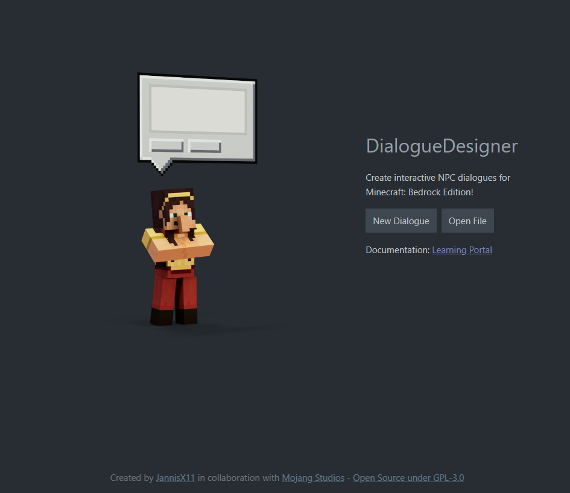
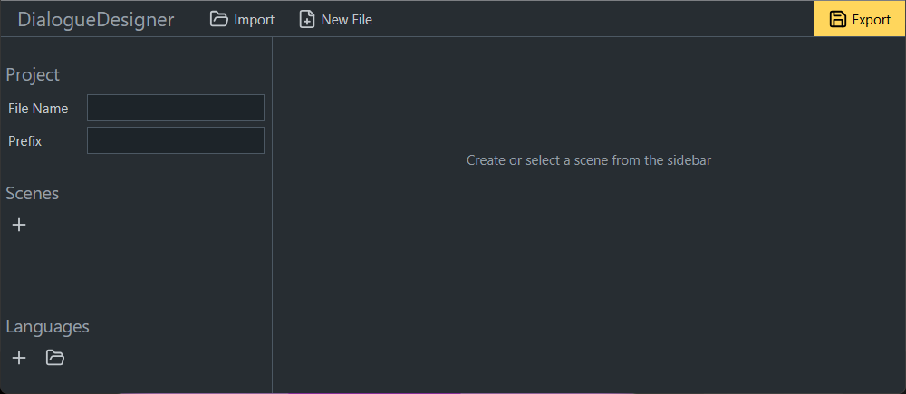
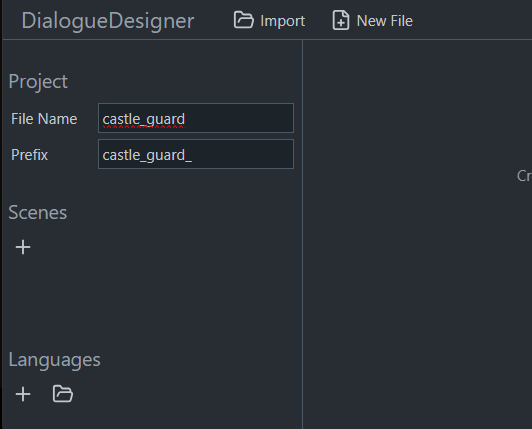
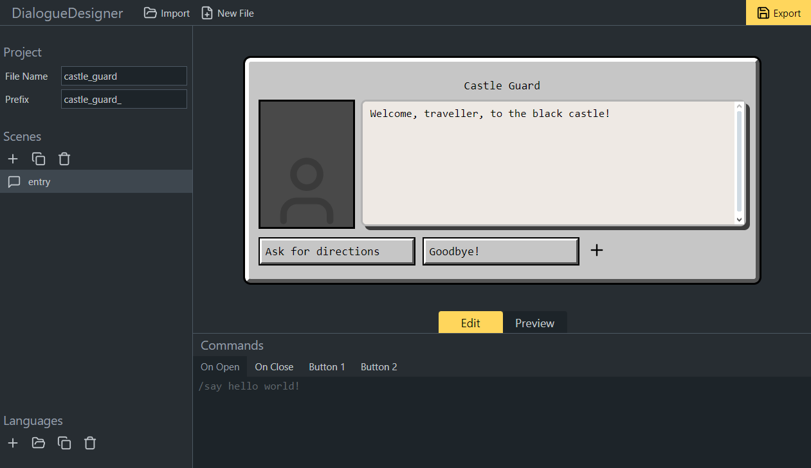
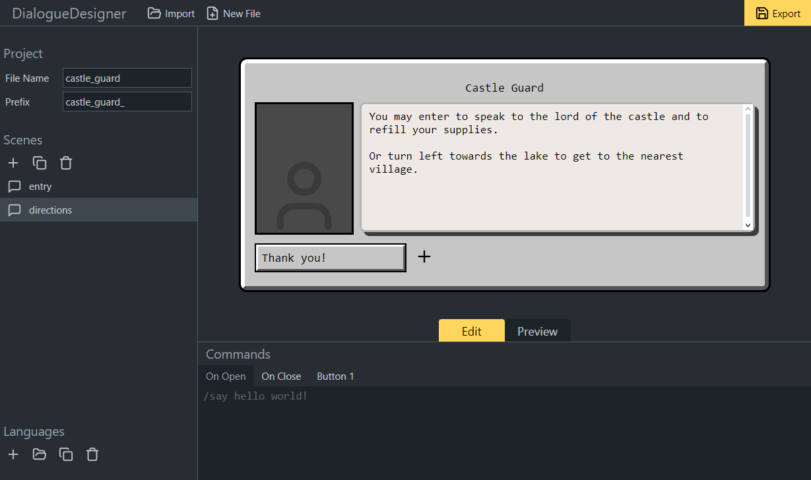
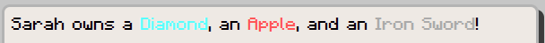

# Create NPC Dialogues with DialogueDesigner

This tutorial shows how to create NPC entities with dialogue windows, using the community [DialogueDesigner](https://jannisx11.github.io/dialogue-designer/) tool (jannisx11.github.io/dialogue-designer).

NPC dialogues are a great way to add stories to your custom map. They can be used for anything from a simple text to provide information to the player, to complex multi page conversations with different reply options to choose from.

### Requirements

Before learning how to create NPC dialogues, it is recommended that you understand the basics of creating resource and behavior packs.

- [Introduction to Behavior Packs](BehaviorPack.md)
- [Introduction to Resource Packs](ResourcePack.md)
- [NPC Dialogue Command](NPCDialogue.md)
- [Creating New Entity Types](IntroductionToAddEntity.md)

An NPC entity is required to use the dialogue. For simple applications, the built-in Minecraft NPC entity can be used and it comes with a list of texture presets for a lot of situations. But for custom designs, it is required to create a new entity.

The [Minecraft Entity Wizard](MinecraftEntityWizard.md) can be used to make this easier.

## Set-up

Before getting started with the dialogue, we should set up our NPC entity.

If you are using the Entity Wizard, proceed by creating an entity with the "NPC" behavior preset.
If you are creating the NPC from scratch, make sure to include the `"minecraft:npc"` component and a type family called `"npc"`.

You can also use the NPC entity that is included with Minecraft and comes with a list of preset skins. You can use it by searching for the "NPC Spawn Egg" in the creative inventory, and using that spawn egg.

## Creating a Dialogue

Open the DialogueDesigner web app in your web browser by navigating to [jannisx11.github.io/dialogue-designer](https://jannisx11.github.io/dialogue-designer/).



On the start screen, press **New Dialogue** to create a new project. This will bring you into the workspace.



On the left side of the screen, you can see the sidebar. This is where you can manage your project and your different scenes.

In the sidebar, under File Name, enter the name of your dialogue file. You should use snake case here (each letter is lower-case, instead of spaces between words we use underscore characters). Let's call it `castle_guard`.



Right below, we can enter the common prefix of all scenes in the project. This is usually the project name, plus an additional underscore at the end: `castle_guard_`.

### Scenes

Each dialogue file can contain any number of scenes. Scenes are individual dialogue pages in a conversation.
You can create individual scenes, or create more complex conversations by linking different scenes together via buttons that the player can press.

Let's add our first scene by pressing the plus button in the sidebar under **Scenes**. This will create a scene.
You can rename the scene by double-clicking its name in the sidebar. We'll call it `entry` because it will be the entry point to our conversation.

The main workspace of the screen will now be split into two sections.
At the top, you can see a preview of the dialogue pop-up in-game.
At the bottom, you can configure custom commands that run when the dialogue is opened, closed, or later on when a button is pressed.

Using the two buttons between the preview and the commands selection, you can switch between Edit and Preview mode. In Edit mode, you can edit the dialogue, while Preview mode allows you to see how it will look and behave in-game.

The dialogue has three separate sections that you can edit: the **title**, the **body**, and the **button row**.

Let's enter our text into the title and body text field.

We'll also press the plus sign in the button row two times to create two buttons.



Let's also create a second page, named `directions`, that looks like this:



### Linking scenes

We can now go back to the entry scene, select the "Directions" button, and change the navigation option to `directions`.
This will tell the button to open the "directions" scene when clicked.

Use the mode selector and switch to Preview mode to test this. Clicking the button should now navigate to the Directions scene.
Clicking the "Goodbye!" button will close the dialog. That is the default behavior for buttons.

### Commands

Commands allow us to customize the NPC dialogue further. As an example, let's add a sound that plays when a player starts talking to an NPC.

Switch to the "entry" scene, locate the "On Open" tab in the Commands section at the bottom, and enter this command:

```
playsound mob.villager.haggle @initiator
```

Here we are using the playsound command to play the villager haggle sound. The `@initiator` targets the player who has opened the dialogue. `@s` in this case would select the NPC entity.
You can learn more about commands here: [Introduction to Commands](CommandsIntroduction.md)

## Export

We are now ready to export the dialogue into Minecraft.
To export the project, click the yellow "Export" button in the top right corner. This opens the Export window, which gives you all the instructions on how to implement your project into Minecraft.

First, create a folder called `dialogue` inside your behavior pack. Download the dialogue file and place it into that folder.

If you are using language files later on, you will also need to save them. More on that in the **Advanced features** section.

Now open your Minecraft world with the behavior pack applied, and use the provided command to apply the dialogue to your NPC entity. The command will apply the dialogue to the closest NPC-type entity that's in an 8-block radius around you.

After that, you can test your dialogue. Make sure you are in adventure or survival mode, then right-click the NPC. This should open the entry dialogue scene while playing the villager sound.

You have now successfully created and implemented an NPC dialogue!

## Advanced features

For more experienced users, DialogueDesigner offers some advanced features to support all capabilities that the dialogue format provides.

### Formatting

You can use Minecraft's [Formatting codes](../Reference/Content/RawMessageJson.md#formatting-codes) to add formatting to your text, including making your text bold, italic, or changing the color.

Simply enter the section sign (`§`), followed by a [specific number or letter](../Reference/Content/RawMessageJson.md#formatting-codes), into the text field, ahead of the word that you want to format. After the word, you can put `§r` to reset the formatting.

Formatting codes can be used directly in text fields, in translations, or in raw JSON text.
You can test formatting by switching to Preview mode.

For example, the following code will render like this:

```Sarah owns a §bDiamond§r, an §cApple§r, and an §7Iron Sword§r!```



### Translations

Using translations, the dialogue can be made available in more than one language.

Translations are saved in text files in the `texts` folder of the resource pack. They are saved as key-value pairs, where the key identifies the translation string, and the value provides the value in a specific language.

You can get started by creating a Language in DialogueDesigner. In the bottom left, under Languages, press the Plus icon to create a language file. The first file that is created will be called `en_US`. This file is intended for American English, and it's also the fallback for when no translation is provided in the language that a player selects in Minecraft.

You can now enter translations into the file:

```
dialogue.castle_guard.npc_name=Castle Guard
```

Each line provides a translation string. The part before the `=` sign is the key, the part after is the value that will be displayed to the player.

Let's now create a second language file. The name defaults to `de_DE`, which is the code for German. But you can edit the code at the top of your screen to something like `it_IT` for Italian. There is a list of [Add-On Pack Languages](../Documents/ComprehensivePackContents.md#textslanguagesjson). We'll also add our translation string into this file, but translated into the respective language:

```
dialogue.castle_guard.npc_name=Burgwache
```

Now, let's switch back to our dialogue file. Make sure you are in edit mode, then click into any text field to edit it. A black box saying "Text" will appear in the corner of the input. Switch this option to "Translate". Now you can enter the translation key into the text field:

```
dialogue.castle_guard.npc_name
```

Switch to Preview mode, and you will see that the name from the language file is used.

You can click on any of the language files that you have created in the left sidebar to preview your dialogue in that language. Double-click (or long-press) the language file to edit it again.


### Raw JSON

Another powerful way to customize your text is to use JSON Rawtext. This allows you to mix and match text with translations, and you can even include dynamic data such as scoreboard values in your text.

To edit raw JSON, select a text field, and set the text type selector to "Raw JSON". This will open a pop-up, in which you can edit the raw JSON.

When you are done, press the **Confirm** button. If there are JSON syntax errors, a red error message will show up and prevent you from saving your changes. Fix any JSON errors to proceed.

You can learn more about the rawtext format here: [Raw Message JSON](../../creator/Reference/Content/RawMessageJson.md).
