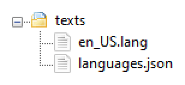

# Packaging a Skin Pack

In this tutorial you will learn the following:

> [!div class="checklist"]
>
> - The folder and file structure for skin packs in Minecraft: Bedrock Edition.
> - How to construct the necessary metadata files for a skin pack and how to define skins using them.

### Skin Pack Folder Structure


## manifest.json

A manifest tells Minecraft general information about your skin pack. Create a JSON file named `manifest.json` at the root of the skin pack. Within it contains the following:

- `name`: the name of the pack, which is always `pack.name`.
- `version`: the version of the pack. For example, `[1, 0 ,0]` would indicate version 1.0.0.
- `uuid`: a unique identifier to prevent package conflicts, which can be generated from this site: https://www.uuidgenerator.net/version4 (**two different UUIDs need to be generated**).
- `type`: set to `skin_pack` to tell the game to treat this pack as a skin pack.

### Template manifest.json

```json
{
  "header": {
    "name": "pack.name",
    "version": [1, 0, 0],
    "uuid": "<FIRST GENERATED UUID>"
  },
  "modules": [
    {
      "version": [1, 0, 0],
      "type": "skin_pack",
      "uuid": "<SECOND GENERATED UUID>"
    }
  ],
  "format_version": 1
}
```

## skins.json

A `skins.json` file will define the skins that come with your skin pack. Create a JSON file named `skins.json` at the root of the skin pack. Within it contains the following:

- `localization_name` and `serialize_name`: these will be the same and are the localization keys whose value will be defined later in [`en_US.lang`](#texts-folder) with the full key being `skinpack.<localization_name>`. That value will be the title of the pack. The key will also always be prepended to each individual skin's localization key.
- `skins`: a collection of definitions, each defining a single skin.

Each individual skin definition will then contain the following:

- `localization_name`: the localization key whose value is defined later in `en_US.lang`. The value will be the name of the individual skin.
- `geometry`: the base model this skin is for. `geometry.humanoid.customSlim` is the Alex model and `geometry.humanoid.custom` is the Steve model.
- `texture`: the file name for each of the skin textures as they appear in the root of the skin pack.
- `type`: either `free` or `paid`.

### Template skins.json

> [!NOTE]
> Unfortunately, it's not possible to add custom models to skin packs at this time using the skin pack JSON capability.

```json
{
  "serialize_name": "TemplateSkinPack",
  "localization_name": "TemplateSkinPack",
  "skins": [
    {
      "localization_name": "TemplateSkin1",
      "geometry": "geometry.humanoid.customSlim",
      "texture": "skin_file_name1.png",
      "type": "free"
    },
    {
      "localization_name": "TemplateSkin2",
      "geometry": "geometry.humanoid.custom",
      "texture": "skin_file_name2.png",
      "type": "free"
    },
    {
      "localization_name": "TemplateSkin3",
      "geometry": "geometry.humanoid.customSlim",
      "texture": "skin_file_name3.png",
      "type": "paid"
    },
    {
      "localization_name": "TemplateSkin4",
      "geometry": "geometry.humanoid.custom",
      "texture": "skin_file_name4.png",
      "type": "paid"
    },
    {
      "localization_name": "TemplateSkin5",
      "geometry": "geometry.humanoid.custom",
      "texture": "skin_file_name5.png",
      "type": "paid"
    }
  ]
}
```

## Skin Textures

The actual skin textures are PNGs. The file names are referred to in the `skins.json` metadata file. They can be used only at the root of the skin pack. You can use Blockbench to create a usable skin PNG for your skin pack.

## Texts Folder

Inside this folder are the `en_US.lang` and `languages.json` files, which define the actual names of your pack and skins and the supported languages of your pack. The names after the `=` are what show up in-game, such as in the skin picker.



### en_US.lang

This is the file where you name your pack and the skins.

- Pack name: `skinpack.[skins.json localization_name]=[name of pack]`
- Skin names: `skin.[skins.json localization_name].[skins.json single skin localization_name]=[name of skin]`

The below template uses the "localization keys" from the template `skin.json` to name the pack "Your Skin Pack Name Here" and to name the individual skins "Skin Name 1-5".

#### Template en_US.lang

```json
skinpack.TemplateSkinPack=Your Skin Pack Name Here
skin.TemplateSkinPack.TemplateSkin1=Skin Name 1
skin.TemplateSkinPack.TemplateSkin2=Skin Name 2
skin.TemplateSkinPack.TemplateSkin3=Skin Name 3
skin.TemplateSkinPack.TemplateSkin4=Skin Name 4
skin.TemplateSkinPack.TemplateSkin5=Skin Name 5
```

### languages.json

This file tells Minecraft what languages your skin pack supports. Only English is required. If you want to support other languages you can make other `xx_YY.lang` files and then edit this to tell the game you support them.

The following locales/languages are currently supported:

- "en_US"
- "de_DE"
- "ru_RU"
- "zh_CN"
- "fr_FR"
- "it_IT"
- "pt_BR"
- "fr_CA"
- "zh_TW"
- "es_MX"
- "es_ES"
- "pt_PT"
- "en_GB"
- "ko_KR"
- "ja_JP"
- "nl_NL"
- "bg_BG"
- "cs_CZ"
- "da_DK"
- "el_GR"
- "fi_FI"
- "hu_HU"
- "id_ID"
- "nb_NO"
- "pl_PL"
- "sk_SK"
- "sv_SE"
- "tr_TR"
- "uk_UA"

#### Template languages.json

```json
[
  "en_US"
]
```
