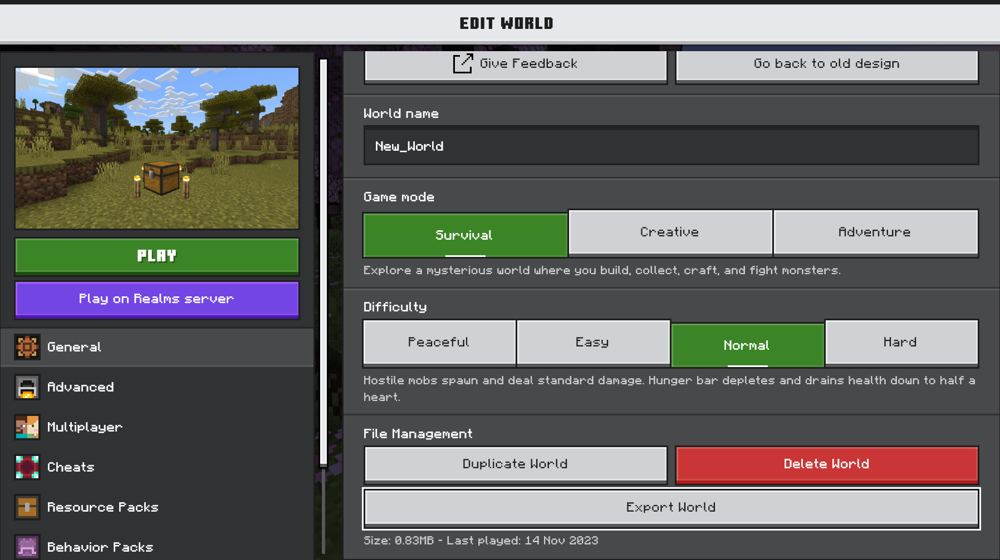
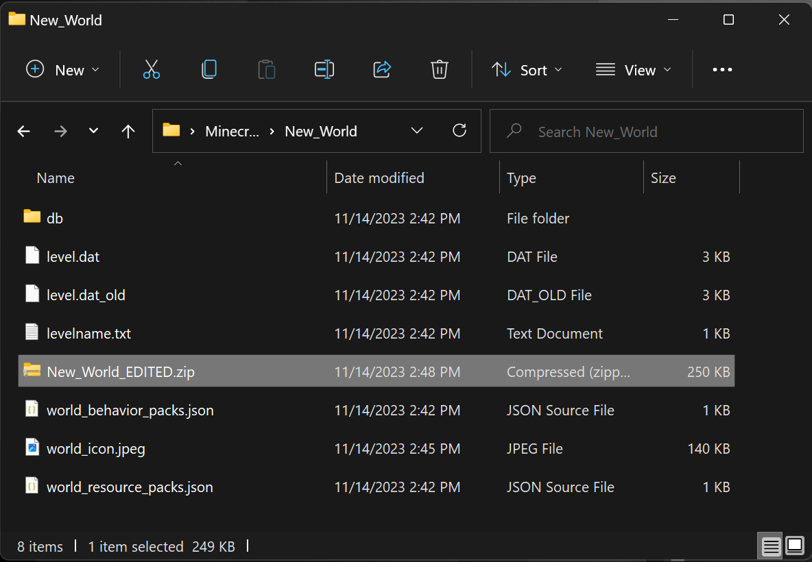

# Packaging a World Template

All of the Worlds in the Minecraft Marketplace, like [survival spawns](SurvivalSpawnCreation.md), are actually world templates. When a player creates a world from the template, they get their own fresh copy of the world.

Before we dive into creating a world template, let's first take a look at a Minecraft world file and learn some cool renaming tricks.

## Unpacking, Examining, and Re-Packing a Minecraft World File

We are going to create a world, export it, rename it, unzip it, look at the contents, zip the contents back up, and open it again in Minecraft. 

1. Launch Minecraft, create a world, give it a memorable name like **New_World**, and play in it to test it out. (I love it when instructions tell me to play Minecraft!)
1. Save and quit the world to go back to the Minecraft **Play** screen that shows you all of your worlds.


3. Click the Edit button for that world to go to the **Edit World** screen.



4. On the General tab, in the File Management section, find the **Export World** button and click it. The Save As window will be displayed.


5. Choose a location that is easy for you to find, like your computer's Desktop, and click the **Export** button.
1. Minimize Minecraft and go find the exported world file.
1. Change the file extension from **.mcworld** to **.zip**.


8. Your computer will warn you that the file might become unusable and ask "Are you sure you want to change it?" We're sure. Click **Yes**. The file's icon will look different.


9. Double-click the zip file to open it and choose **Extract All**. The structure should look something like this:


10. Open the files and check them out in Visual Studio code, but don't move them or change the names of anything.

### The structure of a Minecraft World file

- **db** folder that contains 4 files with names similar to this:
    - **000005.ldb** - Microsoft Access Record-Locking Information
    - **000006.log** - Text Document
    - **CURRENT** - File that contains something like "MANIFEST-000004"
    - **MANIFEST-000004** - Binary file that cannot be opened
- **level.dat** - DAT file that contains important data about your Minecraft world
- **level.dat_old** - DAT_OLD File that can be used as a backup for the other DAT file. 
- **levelname.txt** - Text document that holds the name of the world: "New_World"

11. Edit the **world_icon.jpeg** file in an app like Paint.


Don't get too attached to your edited world icon, though. Whenever you play the world and then Save & Exit, Minecraft will make a new icon to replace it to reflect your gameplay. We just want to make changes to this to distinguish it from the original world.

### Re-Package a Minecraft World File

Now we're going to gather everything back up into a world file and open it again in Minecraft.

1. Inside the world folder, select all of the individual files.
2. With all of the files selected, right-click any one of the selected files and choose "Compress to ZIP file."


3. The zip file will be created among the other files and the computer will automatically give it the same name as the file you right-clicked. That's okay. Name it something distinctive like **New_World_EDITED.zip**.



4. After the zip file is created, change the **.zip** extension to **.mcworld**.


>[!Note]
> You can just give the new zip file the name **New_World.mcworld** as it's being created, but I wanted to make sure to show you that the final **.mcworld** file is simply a re-named **.zip** file.

>[!Important]
> Do **not** try to zip the whole folder and rename it from .zip to .mcworld. When the computer zips a file, it creates a folder for the things you want zipped, so the world folder will go inside a another folder and Minecraft will not be able to import the world.


After you change the file extension to **.mcworld**, the file will have the Minecraft logo on it.

5. Double-click the **New_World.mcworld** to launch Minecraft and import the world. You should see messages that confirm that the world has started and finished being imported successfully.
1. Click **Play** to go to the Play screen, where this world will be displayed along with any others. 


7. When you play the edited world, it will look just like the original one.


## Structure of the World Template Package

To package a world template, create a `world_template` folder that contains the world files: 
  a `db` folder with a manifest.json, 
  `level.dat`, etc.), 
  `world_behavior_packs.json`, 
  `world_resource_packs.json`, and 
  your icon art as the `world_icon.jpeg`. 
  
  If you have a behavior pack, place it in the `world_template` folder (see [Introduction to Behavior Packs](BehaviorPack.md) for creating behavior packs).

Resource pack and behavior pack folder names in world templates must be **10 characters or shorter**. This is due to an issue on Xbox where long paths may cause resource or behavior packs to not load properly. We suggest using an acronym of the contents title for folder names.

> [!WARNING]
> With the release of `1.18`, templates created with base game version `1.17.4` or earlier will be updated with the new world generation tool and may break content when building new maps based upon that template.
>
> To learn more about this scenario, please visit [Updating a World Template's Base Game Version to 1.18](BaseGameVersioning.md#updating-a-world-templates-base-game-version-to-118)

## World template folder structure

The following image is how a world template folder structure may be configured.


> [!IMPORTANT]
> The default max file path allowed in Windows 10 is 260 characters. Please be mindful when setting up the folder directory and use shorthand naming conventions if you are near the character limit.

## manifest.json

Create a JSON file named `manifest.json` that defines your content as a world template.

- `name`: this field is always `pack.name`
- `description`: this field is always `pack.description`
- `version`: this tells the game what version of the pack this is. Always create new content with `[1, 0 ,0]`
- `uuid`: generate **two different UUIDs** from this site: <https://www.uuidgenerator.net/version4>.
- `type`: this tells the game to treat this pack as a world template

**Template world template manifest.json:**

```json
{
  "header": {
    "name": "pack.name",
    "description": "pack.description",
    "version": [1, 0, 0],
    "uuid": "<GENERATE A UUID>"
  },
  "modules": [
    {
      "version": [1, 0, 0],
      "type": "world_template",
      "uuid": "<GENERATE A UUID>"
    }
  ],
  "format_version": 2
}
```

## world_behavior_packs.json and world_resource_packs.json

If your world requires a resource and/or behavior pack, you must explicitly define them here using the `uuid` of the pack(s). Both of these JSON files use the same format; be sure you are entering the correct `uuid` in each of the files.

- `pack_id`: the uuid of the required resource or behavior pack.
- Ensure `world_resource_packs.json` only contains required resource packs and `world_behavior_packs.json` only contains required behavior packs.
- `version`: the version of the resource or behavior pack, defined in the packs' `manifest.json`.

### Template world_behavior/resource_packs.json

```json
[
    {
        "pack_id": "<UUID FROM REQUIRED PACK>",
        "version": [1, 0, 0]
    }
]
```

## world_icon.jpeg

This is the image that shows up when your world is created from the template. For world templates on the marketplace, this icon should be in a similar style as the key art. Non-marketplace templates do not need a world icon, though if a template is made from an existing world, the world icon will already be available to use.

- **Dimensions:** 800x450px
- **File format:** JPEG

## Texts folder

The texts folder inside the `world_template` folder is where the name and description of your world is defined in the `en_US.lang` file.

## en_US.lang

This is where the name and description of your world are defined. You are required to have these two lines in your `.lang` file:

- **Pack name:** `pack.name=[name of pack]`
- **Pack description:** `pack.description=[description of pack]`

**Template en_US.lang:**

The names after the `=` are what will show up in the UI of the game.

```json
pack.name=Western World
pack.description=Howdy partner
```

## languages.json

This file tells the game what languages your skin pack supports. The only language currently required is English. If you would like to support other languages, you can create additional `xx_YY.lang` files and edit them to tell the game to support those languages.

**Template languages.json:**

```json
[
    "en_US"
]
```
