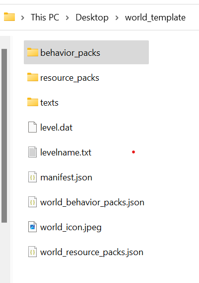

# Packaging a World Template

A world template is a framework that can be used to create new worlds. Each world created by the template is the same, which is particularly useful for [survival spawns](SurvivalSpawnCreation.md). All worlds in the marketplace are world templates. A world template has a `.mctemplate` file extension and a slightly different structure compared to a standard `.mcworld` world file.

To package a world template, create a `world_template` folder that contains the world files (a `db` folder with a manifest.json, `level.dat`, etc.), `world_behavior_packs.json`, `world_resource_packs.json`, and your key art as the `world_icon.jpeg`. If you have a behavior pack, place it in the `world_template` folder (see [Introduction to Behavior Packs](BehaviorPack.md) for creating behavior packs).

Note that you must keep your resource pack and behavior pack folder names to **10 characters or less**. This is due to an issue on Xbox where long paths may cause your resource or behavior pack to not load properly. We recommend using an acronym of the title of your content for your pack's folder names.

> [!WARNING]
> With the release of `1.18`, templates created with base game version `1.17.4` or earlier will be updated with the new world generation tool and may break content when building new maps based upon that template.
>
> To learn more about this scenario, please visit [Updating a World Template's Base Game Version to 1.18](BaseGameVersioning.md#updating-a-world-templates-base-game-version-to-118)

## World template folder structure

The following image is how a World Template folder structure may be configured.



> [!IMPORTANT]
> The default max file path allowed within Windows 10 is 260 characters. Please be mindful when setting up your folder directory and use shorthand naming conventions if you are near the character limit.

## manifest.json

Create a JSON file named `manifest.json` that defines your content as a world template.

- `name`: this field is always `pack.name`
- `description`: this field is always `pack.description`
- `version`: this tells the game what version of the pack this is. Always create new content with `[1, 0 ,0]`
- `uuid`: generate **two different UUIDs** from this site: https://www.uuidgenerator.net/version4.
- `type`: this tells the game to treat this pack as a world template

**Template world template manifest.json:**

```json
{
  "header": {
    "name": "pack.name",
    "description": "pack.description",
    "version": [1, 0, 0],
    "uuid": "<GENERATE A UUID>"
  },
  "modules": [
    {
      "version": [1, 0, 0],
      "type": "world_template",
      "uuid": "<GENERATE A UUID>"
    }
  ],
  "format_version": 2
}
```

## world_behavior_packs.json and world_resource_packs.json

If your world requires a resource and/or behavior pack, you must explicitly define them here using the `uuid` of the pack(s). Both of these JSON files use the same format; be sure you are entering the correct `uuid` in each of the files.

- `pack_id`: the uuid of the required resource or behavior pack.
- Ensure `world_resource_packs.json` only contains required resource packs and `world_behavior_packs.json` only contains required behavior packs.
- `version`: the version of the resource or behavior pack, defined in the packs' `manifest.json`.

### Template world_behavior/resource_packs.json:

```json
[
    {
        "pack_id": "<UUID FROM REQUIRED PACK>",
        "version": [1, 0, 0]
    }
]
```

## world_icon.jpeg

This is the image that shows up when your world is created from the template. For world templates on the marketplace, this icon should be in a similar style as your key art. Non-marketplace templates do not need a world icon, though if a template is made from an existing world, the world icon will already be available to use.

- **Dimensions:** 800x450px
- **File format:** JPEG

## Texts folder

The texts folder inside the `world_template` folder is where the name and description of your world is defined in the `en_US.lang` file.

## en_US.lang

This is where the name and description of your world are defined. You are required to have these two lines in your `.lang` file:

- **Pack name:** `pack.name=[name of pack]`
- **Pack description:** `pack.description=[description of pack]`

**Template en_US.lang:**

The names after the `=` are what will show up in the UI of the game.

```json
pack.name=Western World
pack.description=Howdy partner
```

## languages.json

This file tells the game what languages your skin pack supports. We only require English. If you would like to support other languages, you can create other `xx_YY.lang` files and then edit them to tell the game you support those languages.

**Template languages.json:**

```json
[
    "en_US"
]
```
