# Parkour Map Walkthrough

Our team a map that shows off cool parkour mechanics you can use to challenge players and create a fun gameplay loop. We'll walk through the parkour mechanics that go into this sample parkour map.

> [!div class="checklist"]
>
> - What is an objective that can drive player engagement.
> - How challenges can add "re-play-ability" to a world.
> - Examples of some (but not all!) parkour mechanics available to you in Minecraft.

## Objective

Establishing the overall map objective early on allows you to work your way to an end goal for the player to reach. Let's take a look at two popular gameplay loops: Survival and Parkour.

### Survivor Map

In a Vanilla Minecraft Survivor map, you can say that reaching The End and slaying the Ender Dragon is the main objective that each player must complete in order to 'win' the game. In this example, we can begin to break down some of the requirements and start asking game design questions for how a player can complete their objective.

- How do the player reach The End?
- What challenges will the player face on their journey to reach the End?
- What is the reward for completing the objective?

### Parkour Map

The objective in a parkour map could be as simple as getting across the finish line in the fastest time possible.

In the parkour example, we can also begin asking some questions about
the objective and start thinking about the challenges that a player will face to complete their objective.

- What is the path I want the player to take?
- What can I do that will challenge players but still be fun to attempt?
- Where is the start point and the end point (starting line and finishing line respectively)?

## Challenges

Simply crossing the finish line may be a rewarding task on their own, but adding player facing definition such as jumps, puzzles and traps can create unique challenges for the player to overcome in their journey to complete the map.

In a parkour map, challenges come from combining gameplay mechanics such as movement speed, jumps, blocks used, and logic puzzles, all while having to continue their journey to the finish line as fast as possible.

Examples of challenges for a parkour map:

- Jump distance - Various blocks placed at certain distances requiring the player to jump block to block in order to cross a dangerous path. Or, blocks are placed at different heights to add more challenge.
- Block properties - Different inherent properties such as ice's reduced friction or a drip leaf's collapsing capabilities can be used to add a timed element that requires fast decision making.
- Logical puzzles - Redstone piston and archery puzzles can reveal the path forward only after they are solved.

## Sample Parkour Map

The parkour map we'll be walking through is available at the [Minecraft Samples](https://github.com/microsoft/minecraft-samples) repo.

> [!div class="nextstepaction"]
> [Sample Parkour World](https://github.com/microsoft/minecraft-samples/tree/main/parkour_sample_world)

Use the following directions to add it to your game:

1. Download the `.mcworld` file from the repo.
2. Locate the `Sample Parkour World.mcworld` file and double click it.
3. Boom! You're in.

> [!NOTE]
> Be cautious about downloading files from the Internet!

This map uses walls and a ceiling to constrain the player to a particular path. It's very clear to any players getting started exactly where they're going, something we'll mimic in our own map.

NOW ... Let's dive in!

## Start of Map

### 1. Food is provided

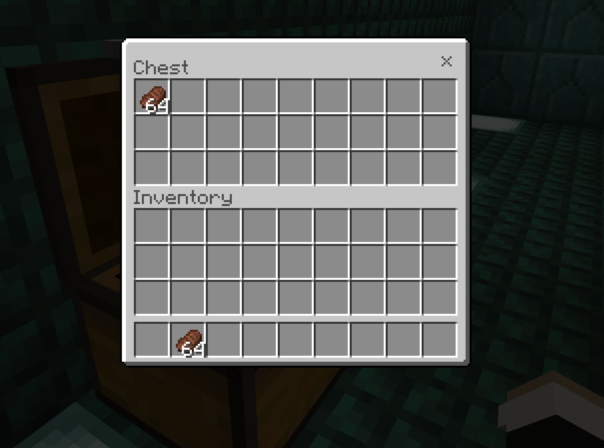

That's nice. The creator was kind enough to provide some food. Players will need it to heal from damage and sprint. You also will not simply die immediately, a nice touch.

### 2. Set spawn point

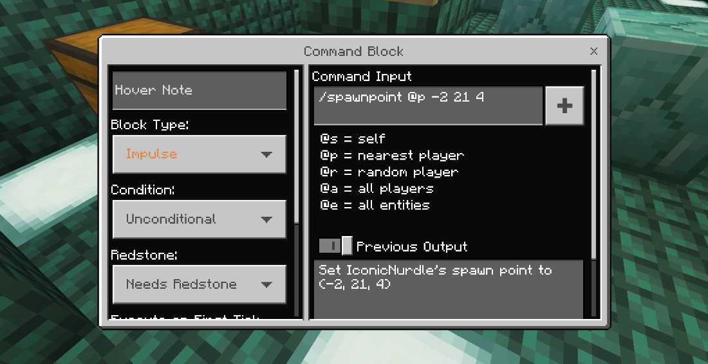

Clicking the `Set Spawnpoint` button triggers a command block that sets the closest player's spawnpoint to `--2 21 4` (where we happen to be standing).

Now we know how to set spawn points all through the map. Just remember to update the coordinates and include these between particularly difficult sections of the map.

## First Challenges - Player Mechanics

Once the player starts the course, they will face our first set of
challenges. These challenges will be based around various jumps that the player will have to make. With a focus on 'simple' jumps, we can
introduce players to how movement speed can affect jump distance. We can also vary block size to change up the difficulty. This way, players' skills can build on these early jumps later in the map.

#### Simple jumping challenge

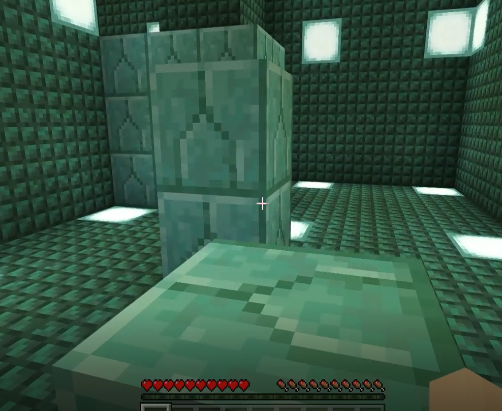

Normal jumps between blocks on the same plane are a great way to start a map. These jumps can be between 1-4 blocks wide. 4 blocks, or a quad, requires players to have a running start to complete them.

#### 2-block gap, one block up jumping challenge

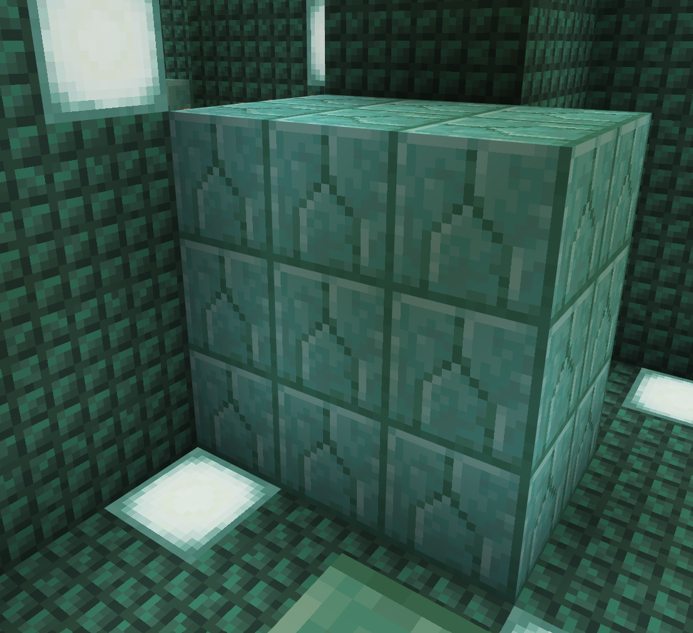

Player has to jump over and up. Slightly harder.

To get started, the player jumps up on the first block so they can jump to the next one. Over one, up one. Classic. If the players fails, they can start over by jumping back on the first block.

#### 3-block gap jumping challenge

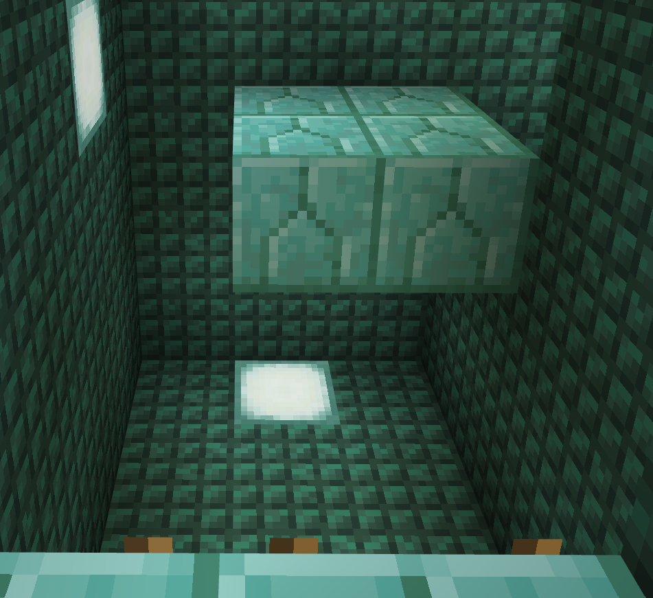

Player must jump straight across to a platform that is a 3-block gap
away. If the player fails, they have to climb back up the ladder and try again.

#### Really hard 4-block gap jumping challenge

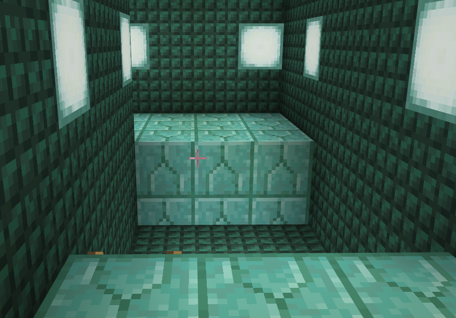

To make this jump, you need to spring and hang off the block. Or, like
me, you can add a ladder in Creative mode to make it.

#### Jumping onto floating wall blocks

Wall blocks have less space to land on and the drop distance means that failing any of the jumps means starting the section over.

#### Ladder jumps

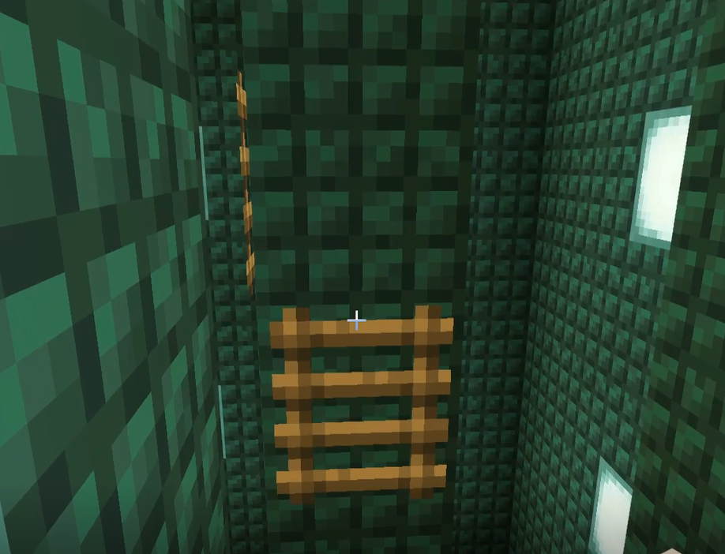

Player must jump from ladder to ladder and even go around a corner.

#### Head Hitters

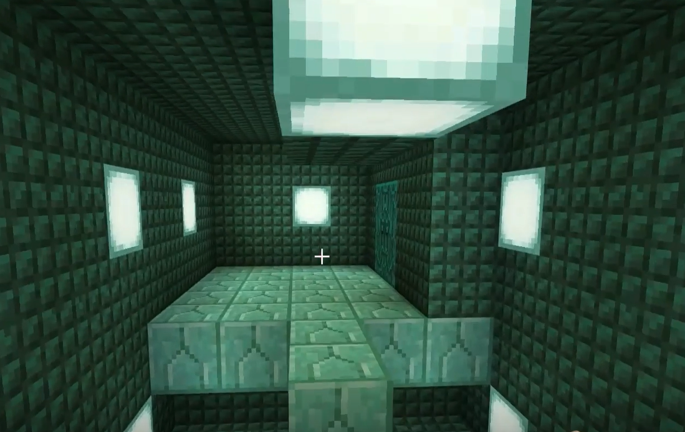

Try not to bump your head.

## Second Challenges - Block Mechanics

New décor! Nice!

This next section focuses on adding difficulty through the use of
different block properties. Players now have a firm grasp on some of the player mechanics. So we'll start varying some jumps by introducing some blocks with unique surface properties to alter player movement.

#### Soul Sand

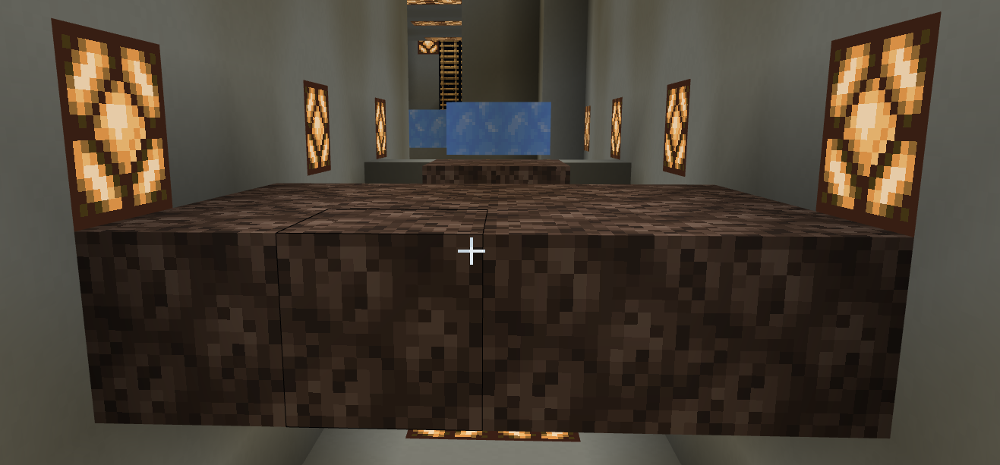

Soul sand slows down an entity's walk and player's walk when they step on it. This can make it more challenging to make longer jumps.

#### Ice Blocks

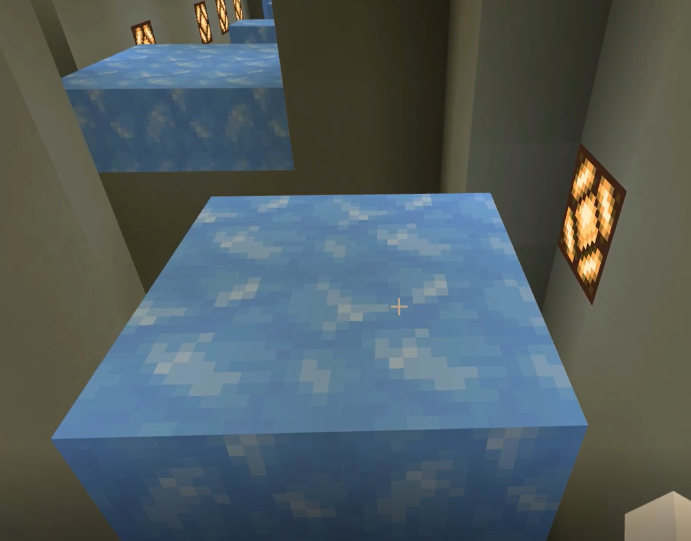

Packed or blue ice is slippery and makes it harder for players to land
and to jump to the next block.

> Note: Ice blocks may melt in some biomes. Packed ice or blue ice won't, so be sure to use those instead.

#### Slime jump

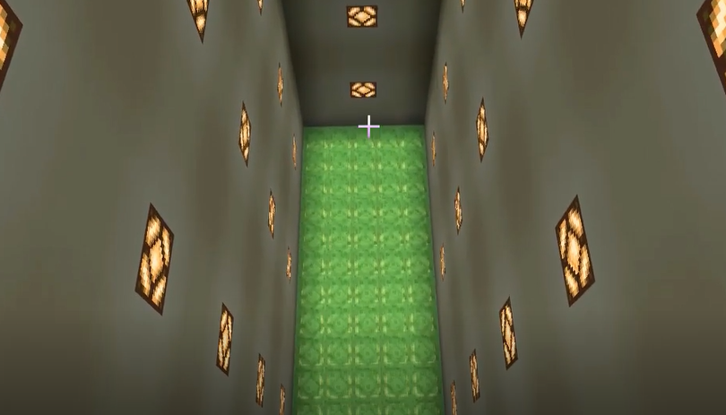

Run, jump, bounce ... land?

Slime offers a soft place to land and then will let players jump from
high places and land on the next block.

#### Honey block wall

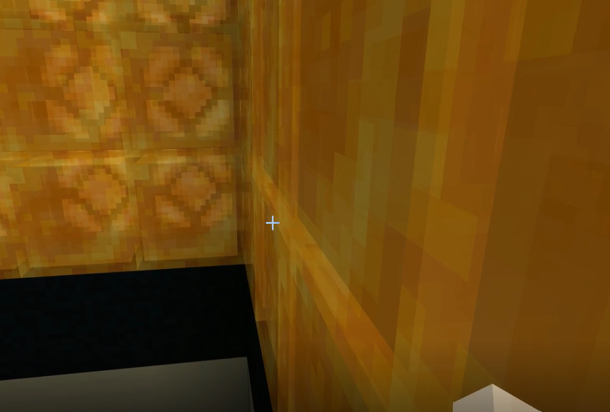

Honey blocks add a sticky effect on landing, making them harder to jump from. The parkour map uses it to make an otherwise impossible jump by sliding down the wall and slowing the player's fall speed.

#### Drip leaf plants

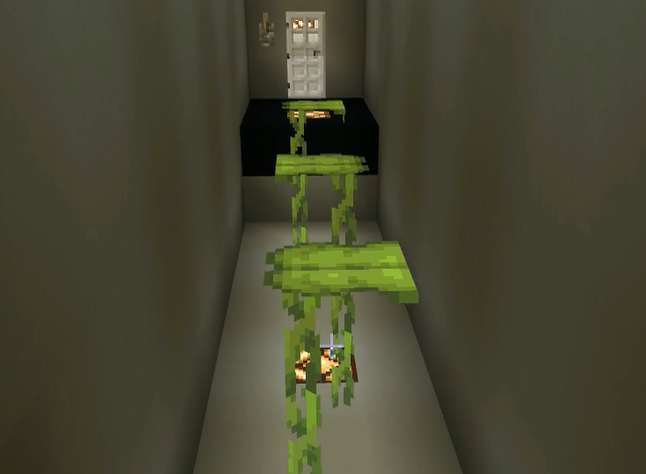

Jump before it collapses.

## Third Challenges - Redstone Puzzles

In our last set of challenges, we will introduce Redstone logic and some specific Redstone blocks to introduce more puzzle-based mechanics to the player that build upon what they have learned in the last two challenges. We will also look at ways to create traps to impede the player's progress as well.

#### Levers and pistons

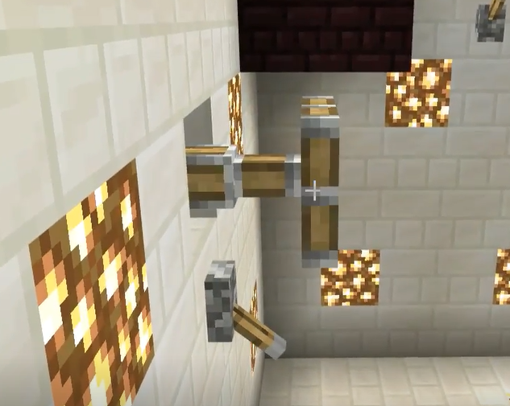

Pull levers, see what happens, plot your course accordingly.

#### Use bow and arrow to activate a button

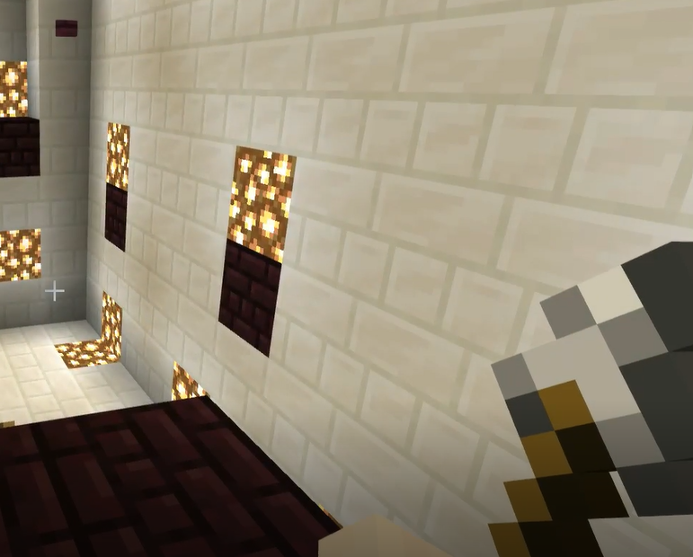

Shoot the button to activate the pistons that extend the necessary
footholds.

#### Pressure plate arrow activation

When you land on blocks with pressure plates on them, arrows shoot out
at you.

#### Rainbows and fireworks at the finish line

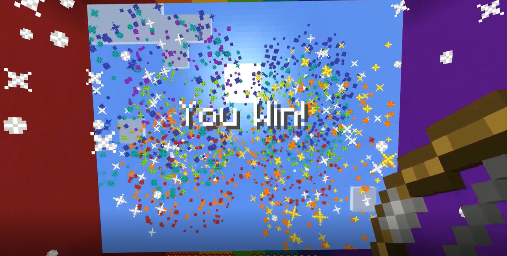

Finally, we will set up the finish line where the player reaches the
end. We will also look at setting up some celebration effects such as
celebration message, fireworks and other visual flair.

Go through the tripwire to trigger your well-deserved celebration.

Winning a parkour map (or any map in Minecraft) should feel like an event. There are tons of ways to make ending your map more fun.

- Make a more difficult final jump or area for players
- Make an interesting set piece for the end
- A sign congratulating the player

In this sample world, we can see all three.

## What's Next?

Get some guidance on how best to use gameplay development to create a parkour world you can share with your friends.

> [!div class="nextstepaction"]
> [Parkour World Creation Guide](ParkourWorldGuide.md)
