# Particle Effects

From firework rockets leaving smoke behind to bubbles coming out of a fish's mouth, Particles are a great way to add special effects to content within Minecraft: Bedrock Edition.

:::image type="content" source="Media/ParticleEffects/Particle-Effects.jpg" alt-text="Image showing Alex holding a wand with an array of sparks and flairs emitting from it":::

In this tutorial you will learn the following:

> [!div class="checklist"]
>
> - How to create custom particle effects in Minecraft: Bedrock Edition.
> - How to make a new particle effect to use in your map or Add-On.

### Requirements

It’s recommended that the following be completed before beginning this tutorial.

- [Introduction to Resource Packs](ResourcePack.md)

## Introduction

### Particle Use Cases

Particles can greatly enhance the visual experience of a map or Add-On. They can be used on entities for effects like exhaust smoke, and for attack effects like magic spells. Particles can be used for ambiance effects like falling leaves. You can even use particles to place simple 2D graphics in your world. Additionally, particles are typically more performant than custom entities because they’re simulated entirely client-side.

### Naming and Location

Bedrock uses a custom JSON format for its particle effects. Files are stored in the `particles` folder of your resource pack. Similar to models and entities, particles are referenced by their identifier, so you can save the file in any subfolder inside the `particles` folder without having to worry about referencing it.

The particle identifier is specified at the top of the JSON file. Just like with entities, it should consist of a namespace and name, for example `sample:colored_smoke`.

```json
    "description": {
    "identifier": "sample:colored_smoke",
    },
```

#### Units

All values in particle effects use **meters** (blocks) and **seconds** as units. Velocity is stated as meters per second (**m/s**) and acceleration meters per second squared (**m/s²**). Rotations use **degrees** both for rotations and trigonometric functions.

## Snowstorm

We’ll be using Snowstorm to create the particle effects in this guide. Snowstorm can be used as a [web app](https://snowstorm.app/) or as an [extension](https://marketplace.visualstudio.com/items?itemName=JannisX11.snowstorm) for VSCode. It allows us to preview the particle effect live while we change parameters. The web app can be useful for beginners, but after you’re working on a project with multiple particle effects, the VSCode extension offers a faster workflow.

### Interface

When you open Snowstorm, you’ll see a 3D preview section, a sidebar, the menu bar, and the expression bar below the menu.

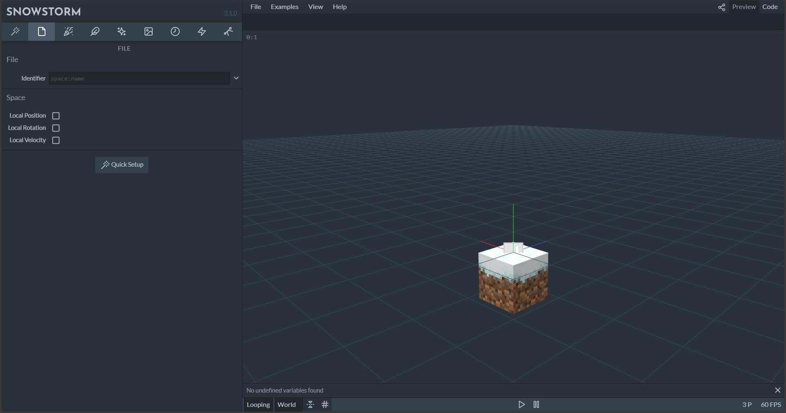

The sidebar is a list of all the different parameters and settings that make up your particle. Many of the fields support Molang. This means that you can input static numbers, but if you want to have more control over the value, you can use mathematical expressions that use the Molang language. Hover over each field to view a description of what it does.

If you end up with a very complex Molang expression, you can edit it in the expression bar right below the menu.

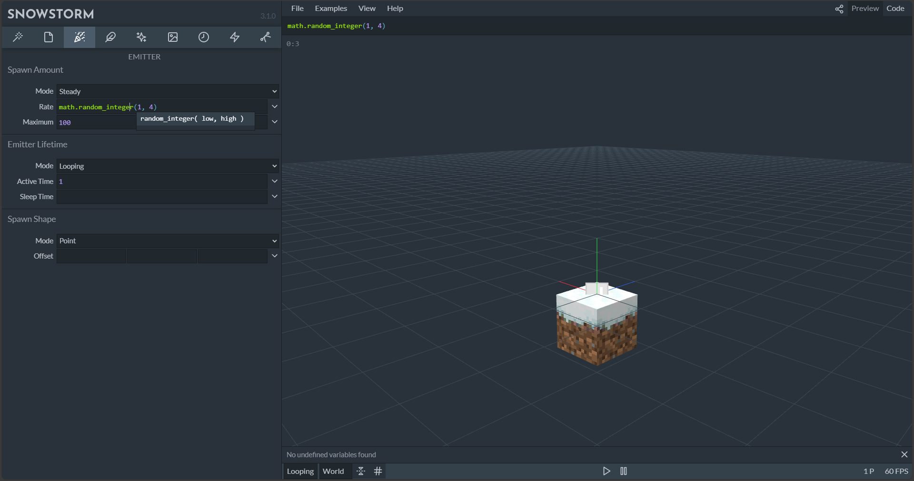

The menu bar is where you can import and export files in the web app, load examples, or check out references.

Below the expression bar, you can see the preview screen. You can navigate in 3D space by using the left and right mouse button, as well as the mouse wheel, and you can use the buttons below to start or pause the preview. In the bottom right corner, you’ll see the FPS and the current number of particles in the scene.

### Import and Export

If you’re using the web app, files have to be imported and exported via the **File** menu. You can also switch to the **Code** tab in the top right corner to preview the generated file.

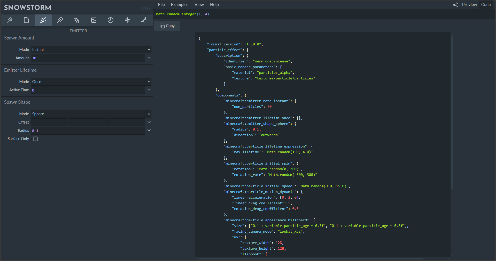

If you’re using custom textures, those have to be loaded individually in the **Textures** section of the sidebar.

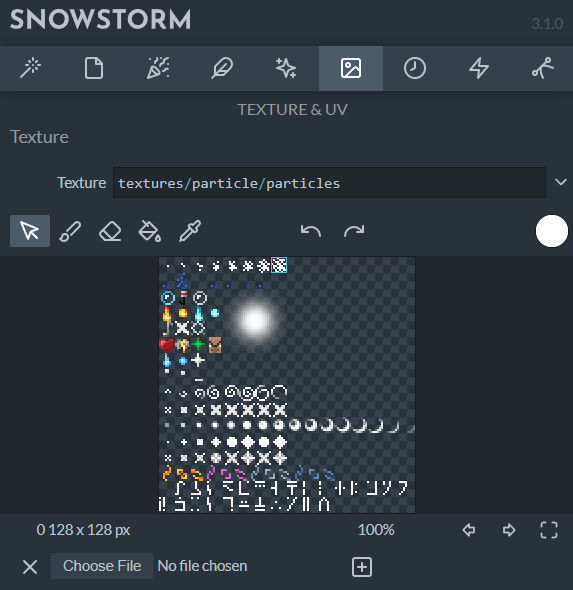

If you’re using the VSCode extension, create a new file named `<name>.particle.json` in the particles folder, and VSCode will open it with the Snowstorm editor automatically. You can also click **Open Code** in the top right corner to preview the generated code in a new tab, and you can even edit the code here directly.

## Creating a Particle Effect

In this guide, we’ll create a colored smoke effect step-by-step. First, open Snowstorm and locate the meta section in the sidebar. Type in the identifier of the particle effect – we’ll use **sample:colored_smoke**.

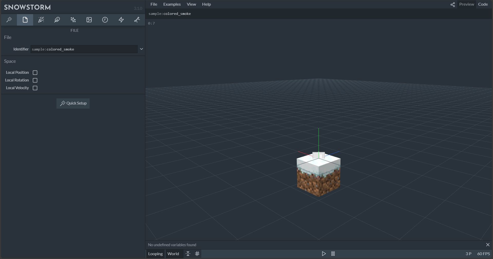

### Emitter

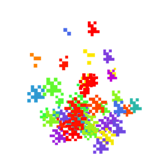

Now, we’ll change the emitter. The emitter is the centerpiece of the particle effect and is responsible for spawning particles. First, we need to open the **Rate** section and define how many particles are spawned. We’ll leave the mode setting at **Steady**, which means that the emitter will constantly spawn particles, and we’ll set the rate to **30** and the maximum to **100**. This means that the emitter will spawn 30 particles per second over its lifetime, as long as no more than 100 particles from this emitter exist in the world.

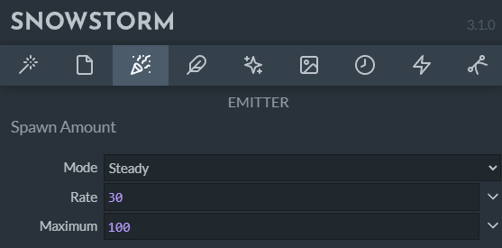

Next, we’ll define the emitter lifetime. We want to only play this particle effect once, but if you need a constant emitter, you can also set it to looping. We’ll also set the **Active Time** to **2**, which means that the emitter will spawn particles for two seconds.

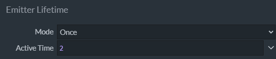

By default, particles will spawn at a single point at the center of the emitter. This is fine for our particle effect, so we don’t need to change anything in the **Shape** section.

### Particle Size

We’ll now move to the particle settings and configure the appearance settings. All particles are a 2D plane with a texture applied to it. In the size settings, we can define the width and height of this plane, where each value is the radius. This means that setting the size to 1 by 1 would make it 2 by 2 blocks large. We will use 0.25 by 0.25 in this example.

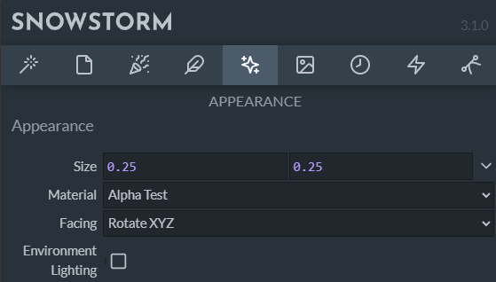

### Particle motion and physics

The next step is to define how the particles move. In the **Motion** section, we’ll leave the **Direction** mode set to **Outwards**. For point emitters, this always means that the particles will spread to all directions equally.

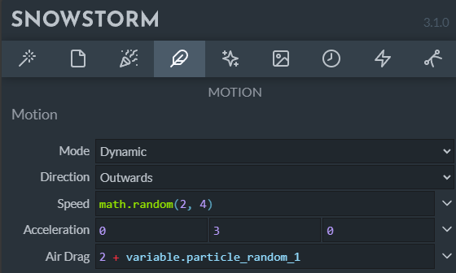

Now the particle has an initial direction, let’s change the speed now. In the **Motion** section, we’ll set the **Speed** to `math.random(2, 4)`. This is a simple math expression that will always output a random decimal number from 2 to 4. The speed is only calculated once when the particle is spawned, so now, each of our particles will have a random start speed.

**Acceleration** defines forces that act on the particle after it’s spawned. For example, to simulate gravity on earth, you would set the middle value (Y axis) to `-9.8`. For our smoke we’ll use `0`, `3`, `0` as the acceleration to get a slow upwards movement.

Right now, the acceleration will make our particle exponentially faster. To make them slow down after a bit and keep them in one space, we will add air drag. You can think of it as thick air that will gently slow down the acceleration when the particle reaches its terminal speed. We’ll set this to **2** for now.

To give the air drag bit more variation, let’s randomize this value. The air drag expression is evaluated once every frame, so using the math random function won’t work in this case because the random values would cancel each other out before you would even notice. Instead, we’ll use a built-in variable. Each particle and each emitter will automatically have 4 random variables assigned that won’t change over its lifetime. The variables contain a random number from 0 to 1. So to achieve a random air drag value from 2 to 3, we’ll set the value to `2 + variable.particle_random_1`.

### Particle Lifetime

Now, we want to define how long the particles exist in the world. To get a slow fade-out effect, we’ll randomize this number again. Since the **Max Age** is only evaluated once when the particle spawns, we can achieve this by setting its value to `math.random(1, 3)`.

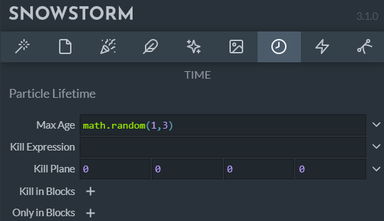

### Texture

You can create your own particle texture for the particle and save it in the textures folder of the resource pack. For simplicity, we’ll use the default Minecraft particle sprite in this example. To reference this texture, type **textures/particle/particles** into the **Path** field of the **Texture** section. The texture will be loaded automatically and will show in game, even if it’s not in your current texture pack since it will default to the vanilla version of the texture.

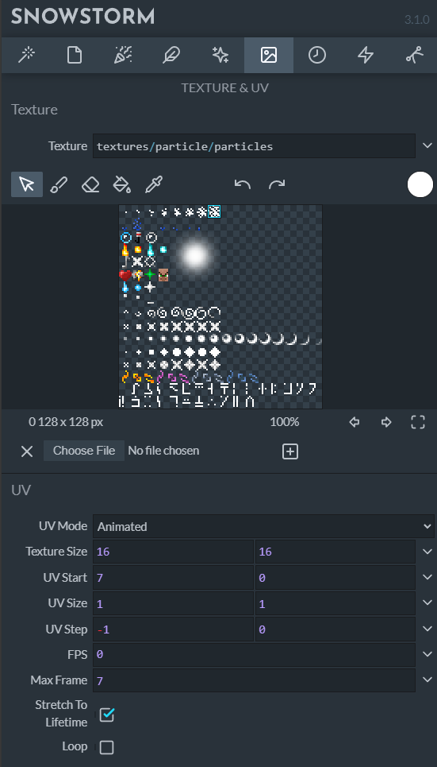

The particle texture we will use is the largest smoke particle. Since we want to animate the texture to gradually move to smaller smoke particle sizes, set the **UV Mode** to **Animated**.

The whole texture map, which includes textures for all particles, has a resolution of **128** x **128** pixels. Most individual pieces on the sprite have a dimension of **8** x **8** pixels. However, these values scale up by a factor of 2. So the **Texture Size** is going to end up being **16** x **16** pixels, and the remaining options will be based on that size.

The starting pixel of the largest smoke particle is 56 pixels horizontally, scaled up by a factor of 2 to **112**. Since textures are 16 by 16 in this context, dividing 112 by 16 will give **7**, which is the value of the **UV Start** field. Alternatively, you can count the number of textures that appear **before** the texture you want to start with (there are 7 textures that appear before the largest smoke particle). However, counting textures by hand may be more difficult if there is a lot of empty space.

Since the animation involves going to smaller smoke textures, the **UV Step** will be set to **-1** by **0**. This means it will go left by 16 pixels horizontally (based on the texture size) to the previous texture and not change vertically. We’ll also set **Max Frame** to `7`. The animation will have eight frames since there are 8 textures, and the first one is counted as "frame 0", so the last frame is frame 7.

In this case, we want to equally spread all frames across the lifetime of the particle. So, we’ll leave the **FPS** field blank, leave **Loop** unchecked, but check **Stretch To Lifetime**. Now, we have a working animated texture.

### Color

Now, we want to apply random colors to the particles. The base texture is white, which is a great starting point for tinting particles.

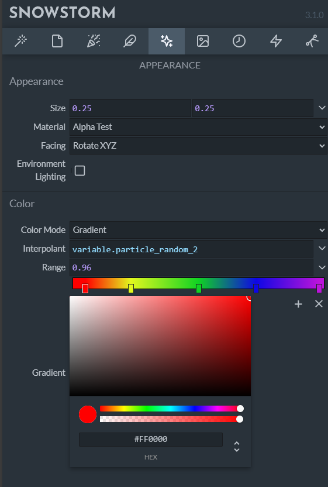

We’ll use a range of different colors, and each particle will pick a random value. First, open up the **Color & Light** section and select the **Gradient** mode. Let’s configure a nice, simple rainbow here. You can add a color point using the + icon, move it around, and change the color of each point.

The default color range is between 0 and 1. That means that we can now simply use another one of our built-in random variables to pick a random color. We’ll enter `variable.particle_random_2` into the **Interpolant** field. Now, each particle will spawn in a random color from the gradient.

The end result should look like something similar to this in Snowstorm:

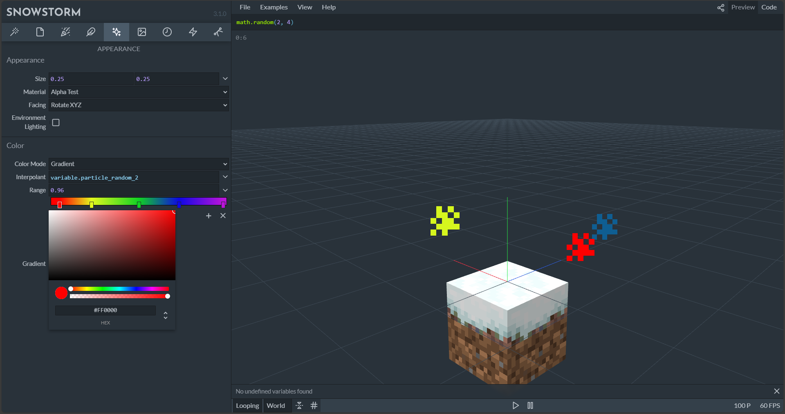

## Using the Particle Effect in Game

There are three main ways to play particle effects in-game:

### Commands

This is the simplest way to test an effect. Use the `/particle` command to summon a particle emitter into the world.

> [!NOTE]
> Because particle effects are entirely client-side and Commands are run server-side, the server is not aware of particle effects. This means that you won’t get an error message if you try to play a particle effect that doesn’t exist.

Here is an example command: The three tildes at the end of the command indicate the position, in this case the exact position where the command was executed, so the feet position of the player or the center of the command block running the command.

```json
/particle sample:colored_smoke ~ ~ ~
```

### Animations

Particles can also be played in entity animations. This is a two-step process. First, you need to link the particle effect in the client entity file and give it a short name. Then, you can use that short name in an animation.

Add this to your client entity file inside the description object:

```json
"particle_effects": {
    "smoke": "sample:colored_smoke"
}
```

Particle effect keyframes can be added to an animation in Blockbench. Click the **Animate Effects** button above the timeline and add a keyframe to the **Particle** channel. Now enter the short name (as defined in the client entity file) into the **Effect** input of the keyframe panel.

You can also specify a locator in the entity file where the particle effect will appear. You can also assign a variable in the **Script** input that can later be used inside the particle effect.

Example:

```json
variable.custom_size = 3.14;
```

### Animation Controllers

Particle effects can also be played by animation controllers. To do this, first add the particle effect to your client entity file as explained above. Next, add one or more particle effects to a specific state of your animation controller, as shown in this example:

```json
"particle_effects": [
    {
        "effect": "smoke"
    }
]
```

## What's Next?

Congratulations, you’ve made it to the end of the (p)article! You’ve learned how to create a custom particle effect, how to configure the emitter, change the physics, how to use an animated texture, and how to color it.

Creating particle effects is all about trial and error, combining different settings, and using Molang expressions to power parameters. To learn more, we encourage you to check out the example particles and look through the configuration to learn how different values and expressions can be used to create effects. And, most importantly, to just play around with all parameters, have fun, and to see what you can come up with.

> [!div class="nextstepaction"]
> [Particle JSON Documentation](../Reference/Content/ParticlesReference/index.yml)
