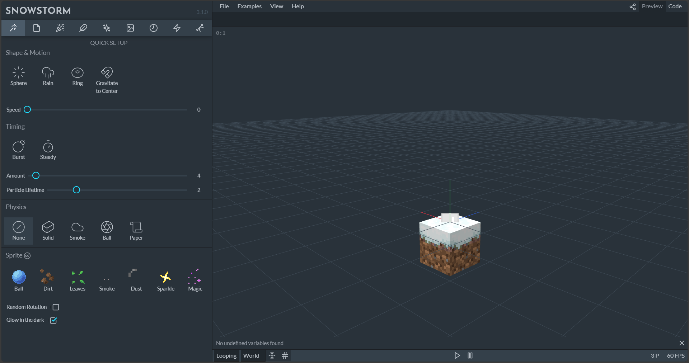

# Particle Effects

From firework rockets leaving smoke behind to bubbles coming out of a fish's mouth, particles are a great way to add special effects to content within Minecraft: Bedrock Edition.

:::image type="content" source="Media/ParticleEffects/Particle-Effects.jpg" alt-text="Image showing Alex holding a wand emitting an array of sparks":::

In this tutorial you will learn:

> [!div class="checklist"]
>
> - How to create custom particle effects in Minecraft: Bedrock Edition.
> - How to make a new particle effect.

You'll also use [Snowstorm](./SnowstormOverview.md) - a community tool that will make editing particle effects much easier!

### Requirements

It is recommended that the following be completed before beginning this tutorial:

- [Introduction to Resource Packs](ResourcePack.md)

## Introduction

Particles can greatly enhance the visual experience of a map or add-on, for effects such as exhaust smoke or magic spells. Particles can be used for ambiance effects like falling leaves, or even to place simple 2D graphics in your world.

### Naming and Location

Bedrock uses a custom JSON format for particle effects. Files are stored in the `particles` folder of a resource pack. Similar to models and entities, particles are referenced by their identifier, so the file can be saved in any subfolder inside the `particles` folder without having to reference it.

The particle identifier is specified at the top of the JSON file, and consists of a namespace and name, such as `sample:colored_smoke`.

```json
    "description": {
    "identifier": "sample:colored_smoke",
    },
```

#### Units

All values in particle effects use **meters** (blocks) and **seconds** as units. Velocity is stated as meters per second (**m/s**) and acceleration is meters per second squared (**m/s²**). Rotations use **degrees** for both rotations and trigonometric functions.

## Snowstorm

We'll be using Snowstorm to create the particle effects in this guide. [Snowstorm](./SnowstormOverview.md) can be used as a [web app](https://snowstorm.app/) or as an [extension](https://marketplace.visualstudio.com/items?itemName=JannisX11.snowstorm) for VSCode. It allows users to preview the particle effect live while changing parameters. The web app is useful for beginners, while the VSCode extension offers a faster process for working with multiple particle effects.

### Interface

Snowstorm includes a 3D preview section, sidebar organized by section tab buttons, a menu bar, and an expression bar below the menu.


Across the tabs and into the sidebar, you'll see the parameters and settings that make up a particle.

The first tab is the "Quick Setup" tab, which allows you to select from a set of pre-set motions, timings, and physics configurations.



Within the sidebar, many of the fields support Molang, which means static numbers can be added, but for more control over the value, mathematical expressions that use Molang can be used. Hovering over a field will cause a description of the field to appear.

If you end up with a complex Molang expression, it can be edited in the expression bar below the menu.


The menu bar is where files can be imported and exported in the web app, examples can be loaded, and references can be reviewed.

Below the expression bar is the preview screen. To navigate in the 3D space, use the left and right mouse button, as well as the mouse wheel; the buttons below can be used to start or pause the preview. Finally, in the bottom right corner is the FPS and the current number of particles in the scene.

### Import and Export

In the web app, files have to be imported and exported via the **File** menu. To see the markup for the file, switch to the **Code** tab in the top right corner of the window.


If using custom textures, they must be loaded individually in the **Textures** section of the sidebar.


If using the VSCode extension, create a new file named `<name>.particle.json` in the particles folder, and VSCode will open it with the Snowstorm editor automatically. Clicking **Open Code** in the top right corner will preview the generated code in a new tab, and the code can be edited here directly as well.

## Creating a Particle Effect

In this guide, we'll create a colored smoke effect step-by-step.

> [!NOTE]
> The Quick Setup tab in Snowstorm provides an easy way to get started with custom particle effects, but in this tutorial we'll take a more leisurely tour through various Snowstorm settings areas.

To begin, open Snowstorm and locate the meta section in the sidebar. Type in the identifier of the particle effect – we'll use **sample:colored_smoke**.


### Emitter


Next, we'll change the emitter. The emitter is the centerpiece of the particle effect and is responsible for spawning particles. To start, we need to open the **Rate** section and define how many particles are spawned. Leave the mode setting at **Steady**, which means that the emitter will constantly spawn particles, set the rate to **30**, and the maximum to **100**. This means that the emitter will spawn 30 particles per second over its lifetime as long as no more than 100 particles from this emitter exist in the world.


Now that the rate is set, it's time to define the emitter lifetime. We want to only play this particle effect once, but if you need a constant emitter, you can do so by setting it to looping. For this effect, set the **Active Time** to **2**, which means that the emitter will spawn particles for two seconds.


By default, particles will spawn at a single point at the center of the emitter. This is fine for our particle effect, so no changes are required in the **Shape** section.

### Particle Size

All particles are a 2D plane with a texture applied to it. In the size settings, the width and height of this plane can be defined, where each value is the radius. This means that setting the size to 1 by 1 would make it 2 by 2 blocks. We will use 0.25 by 0.25 in this example.


### Particle motion and physics

The next step is to define how the particles move. In the **Motion** section, leave the **Direction** mode set to **Outwards**. For point emitters, this means the particles will spread to all directions equally.


Now that the particle has an initial direction, let's change the speed. In the **Motion** section, set the **Speed** to `math.random(2, 4)`. This is a simple math expression that will output a random decimal from 2 to 4. The speed is calculated when the particle is spawned, so now each of our particles will have a random start speed.

**Acceleration** defines forces that act on the particle after it's spawned. For example, to simulate gravity on Earth, you would set the middle value (Y axis) to `-9.8`. For our smoke we'll use `0`, `3`, `0` as the acceleration to show a slow upwards movement.

The acceleration will make the particle exponentially faster. To make them slow down eventually and keep them in one space, we will add air drag, which will gently slow the acceleration when the particle reaches its terminal speed. We'll set this to **2**.

To give the air drag more variation, we will randomize this value using a built-in variable. Each particle and each emitter will automatically have 4 random variables assigned that won't change over its lifetime. The variables contain a random number from 0 to 1. To achieve a random air drag value from 2 to 3, we'll set the value to `2 + variable.particle_random_1`.

### Particle Lifetime

Next, we will define how long the particles exist in the world. To get a slow fade-out effect, we'll randomize this number. Since the **Max Age** is only evaluated when the particle spawns, we can achieve this by setting the value to `math.random(1, 3)`.


### Texture

It is possible to create your own particle texture and save it in the textures folder of the resource pack. For simplicity, we'll use the default Minecraft particle sprite. To reference this texture, type **textures/particle/particles** into the **Path** field of the **Texture** section. The texture will be loaded automatically and show in game even if it's not in your current texture pack, since it will default to the vanilla version of the texture.


The particle texture we will use is the largest smoke particle. To animate the texture to gradually move to smaller smoke particle sizes, set the **UV Mode** to **Animated**.

The whole texture map, which includes textures for all particles, has a resolution of **128** x **128** pixels, where most individual pieces on the sprite have a dimension of **8** x **8** pixels. These values scale up by a factor of 2, so the **Texture Size** is actually **16** x **16** pixels and the remaining options will be based on that size.

The starting pixel of the largest smoke particle is 56 pixels horizontally, scaled up by a factor of 2 to **112**. Since textures are 16 by 16 in this context, dividing 112 by 16 results in **7**, which is the value of the **UV Start** field. Alternatively, you can count the number of textures that appear **before** the texture you want to start with (there are 7 textures that appear before the largest smoke particle). However, counting textures by hand may be difficult depending on the amount of empty space.

Since the animation involves moving to smaller smoke textures, the **UV Step** will be set to **-1** by **0**. This means it will go left by 16 pixels horizontally (based on the texture size) to the previous texture and not change vertically. We'll set **Max Frame** to `7`, as the animation will have eight frames since there are 8 textures. The first frame of the animation is counted as "frame 0", so the last frame is frame 7.

In this case, we want to equally spread all frames across the lifetime of the particle. So, we'll leave the **FPS** field blank, leave **Loop** unchecked, and select **Stretch To Lifetime**. Now, we have a working animated texture.

### Color

Now, it's time to apply random colors to the particles. The base texture is white, which is a great starting point for tinting particles.


We'll use a range of different colors, and each particle will pick a random value. First, open the **Color & Light** section and select the **Gradient** mode. For our effect, let's configure a nice, simple rainbow. You can add a color point using the + icon, move it around, and change the color of each point.

The default color range is between 0 and 1. That means that we can use a built-in random variable to pick a random color by entering `variable.particle_random_2` into the **Interpolant** field. Now, each particle will spawn in a random color from the gradient.

The end result should look similar to this in Snowstorm:


## Using the Particle Effect in Game

There are three main ways to play particle effects in-game:

### Commands

This is the simplest way to test an effect. Use the `/particle` command to summon a particle emitter into the world.

> [!NOTE]
> Because particle effects are entirely client-side and commands are run server-side, the server is not aware of particle effects. This means an error message will not appear if you try to play a particle effect that doesn't exist.

Here is an example command: The three tildes at the end of the command indicate the position, in this case the exact position where the command was executed, so the feet position of the player or the center of the command block running the command.

```json
/particle sample:colored_smoke ~ ~ ~
```

### Animations

Particles can also be played in entity animations, which is a two-step process. The first step is to link the particle effect in the client entity file and give it a short name. Then, use the short name in an animation.

Add this to the client entity file inside the description object:

```json
"particle_effects": {
    "smoke": "sample:colored_smoke"
}
```

Particle effect keyframes can be added to an animation in Blockbench. Click the **Animate Effects** button above the timeline and add a keyframe to the **Particle** channel, then enter the short name (as defined in the client entity file) into the **Effect** input of the keyframe panel.

You can specify a locator in the entity file where the particle effect will appear, and can also assign a variable in the **Script** input that can be used inside the particle effect.

Example:

```json
variable.custom_size = 3.14;
```

### Animation Controllers

Particle effects can be played by animation controllers. To do this, first add the particle effect to the client entity file as explained previously. Next, add one or more particle effects to a specific state of the animation controller, as shown in this example:

```json
"particle_effects": [
    {
        "effect": "smoke"
    }
]
```

## What's Next?

Congratulations, you've made it to the end of the (p)article! You've learned how to create a custom particle effect, configure the emitter, change the physics, use an animated texture, and how to color it.

Creating particle effects is all about trial and error, combining different settings, and using Molang expressions to power parameters. To learn more, check out the example particles and look through the configurations to learn how different values and expressions can be used to create effects. Finally, and most importantly, play around with all parameters, have fun, and see what you can come up with.

> [!div class="nextstepaction"]
> [Particle JSON Documentation](../Reference/Content/ParticlesReference/index.yml)
