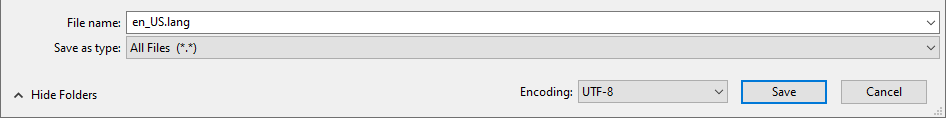

# Preparing Raw Text for Localization

Please adhere to these guidelines when preparing raw text files for localization. These guidelines are critical for both the technical aspect of localization - parsing and distributing content within the localization system - and for ensuring the best possible translations through comprehensive and descriptive commenting.

In this tutorial you will learn the following:

> [!div class="checklist"]
>
> - How to create a properly formatted language file.
> - Best practices for supplying context to each translation.

### Requirements

It’s recommended that *at least one* the following be completed before beginning this tutorial, as they make use of translations and can serve as examples for this tutorial.

- [Packaging a Skin Pack](PackagingASkinPack.md)
- [Packaging a World Template](PackagingAWorldTemplate.md)

## Text Strings

Text that you have created to appear in the game is found in the `en_US.lang` file. Each text string appears on a single line, specially formatted to include certain data:

1. String Name (required)
1. String Value (required)
1. String Comment (highly recommended)

In general, it looks like this:

```json
StringName=StringValue ###StringComment
```

## String Names

Each text string must have a *string name* (or *ID*, or *key*). This name is used to identify the text string within our translation system.

The string name (key/ID) starts at the beginning of a line and end with an equals `=` sign. It must also be unique when compared with all other names within the file.

### String Names Example

```json
Welcome.Message.1=
```

Be sure to create a descriptive string name. A good string name gives clues to the translator about how and where the text is used in the game.

## String Values

Each text string must have a *string value*. This value is the text that appears in the game to the player. Each value starts at the first equals `=` sign on the line and ends with a tab character followed by a hashtag character.

### String Values Example

```json
Welcome.Message.1=Welcome to our world! #
```

Here, the string name is Welcome.Message.1, and the string value is Welcome to our world!.

> [!NOTE]
> `<tab>#` is the required terminator for our parser to recognize the string. There’s no harm in adding extra hashtags because that is the start of a comment (see below). Watch out for programs and/or processing that convert tabs to spaces; that won’t work. The tab must be character code `U+0009`. Do **not** use leading or trailing spaces around the equals `=` sign.

## Comments

Comments provide key contextual information about a text string for translators. They are often critical for quality translations, so are highly recommended.

Associate a comment with a text string by adding two more hashtag characters at the end of the line, and then the comment. The comment is allowed to have a space after the last hashtag character.

```json
Author.Name.2=Created by <name> ###<name> is the proper name of the map creator, and he is a male person.
```

The comment, `<name> is the proper name of the map creator, and he is a male person`, is shown to the translator while they are translating the text, `Created by <name>`. Notice how the comment specifies that the person's name is a singular male proper name. This is a good practice, because translations in some languages are different depending on whether the context is a singular person (including their gender), a group of people, or a company name.

We highly recommended commenting every string to help the translators do the best possible work. Make sure to detail anything that will be helpful for translators, including:

1. Context and parts-of-speech
1. Proper names (with descriptions)
1. Subject/object gender, number, and whether it's a place/location
1. Meanings of characters and items
1. The intent of color codes
1. Any parts that should not be translated
1. The full text of any split or concatenated lines (see below)

> [!IMPORTANT]
> Comments are per string. If you want a comment to apply to multiple strings, copy and paste it for each line. Translators only see comments that are associated with strings. They do not get the entire `en_US.lang` file. Due to this, best practice would be to try not to split lines or conversations across multiple text strings. If you must, please enter the full text of the sentence or conversation into a comment on each string to help translators. Remember that translators will see each of these lines separately, and not necessarily in order.

### Comments Example

Here we include the full text of the sign in each line's comment. This makes it much easier for the translator to correctly translate.

```json
Welcome.Sign.1=Welcome to ### Welcome to our world! We hope you have fun!
Welcome.Sign.2=our world! ### Welcome to our world! We hope you have fun!
Welcome.Sign.3=We hope you ### Welcome to our world! We hope you have fun!
Welcome.Sign.4=have fun! ### Welcome to our world! We hope you have fun!
```

## Files

The `en_US.lang` file must be saved in UTF-8 encoding. Processing will fail if the file is encoded in ANSI, UTF-8 BOM, UCS-2, or any other encoding.

For example, if you are using Windows 10's Notepad, when saving a file, make sure the "encoding" drop-down menu has UTF-8 selected. You should also set the "Save as type" to "All files" to avoid accidentally creating a `.txt` file.



It is possible to send separate documents (like PNG images or PDF documents) that show context for translation, but this is a manual process outside of the regular translation pipeline, and so is not a replacement for well-authored comments and string names.
