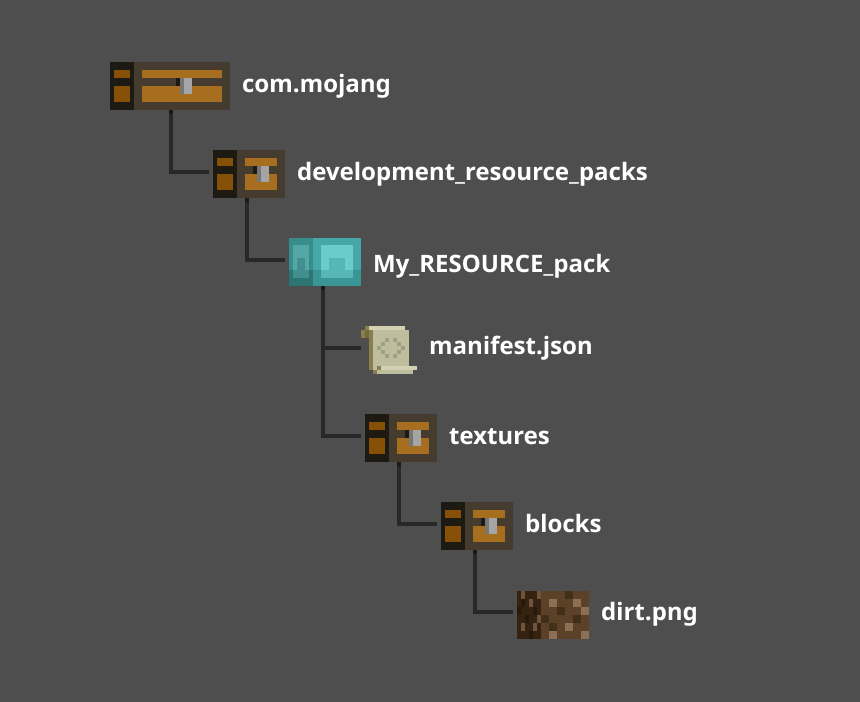
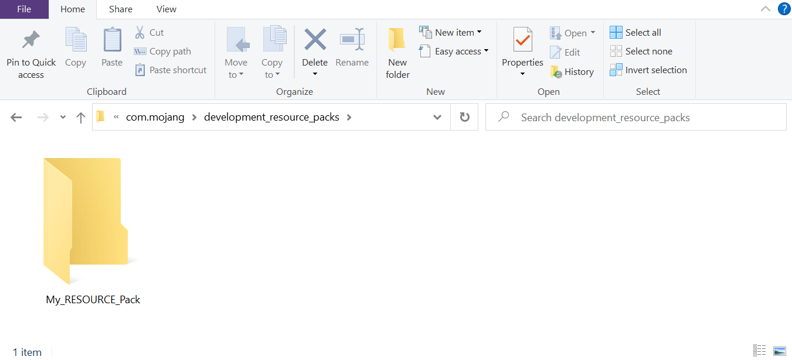
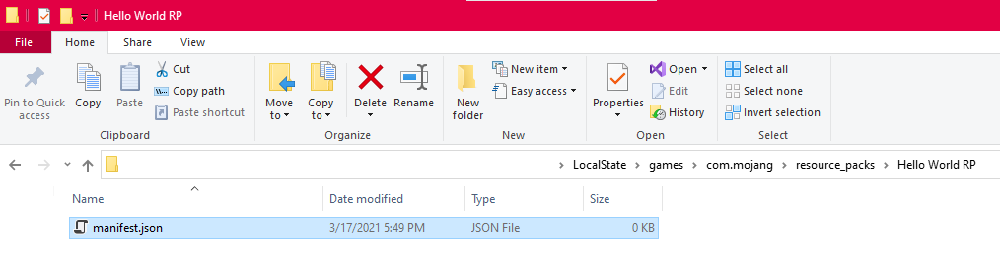
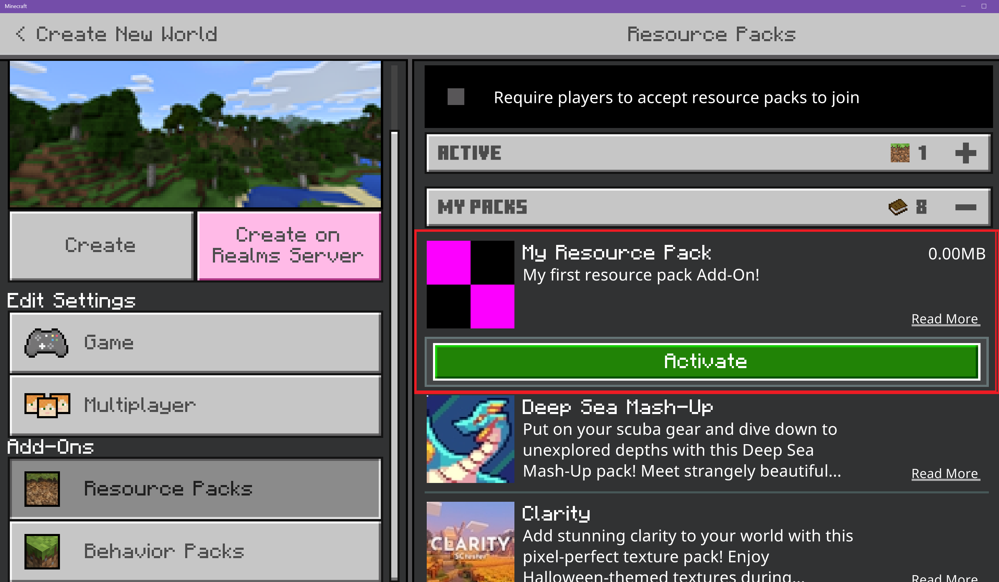

# Introduction to Resource Packs

Before building your first Add-On for Minecraft: Bedrock Edition, you need to create a pack to hold your custom content. There are two types of packs that a creator can make: resource packs and behavior packs. For this tutorial, we're going to be focusing on resource packs.

A **resource pack** is a folder structure that contains all of your custom models, sounds, textures, and other custom content.

:::image type="content" source="Media/ResourcePack/Introduction-to-Resource-Packs.jpg" alt-text="Image showing a pig deeply confused by its environment containing green dirt blocks":::

In this tutorial, you will learn:

> [!div class="checklist"]
>
> - How a **resource pack** is created.
> - How a **manifest file** is created.
> - How custom textures are loaded into Minecraft.
> - The concept of **Pack Stacking** when working with Add-On content.

## Sample Resource Pack

There is a [sample resource pack](https://github.com/microsoft/minecraft-samples/tree/main/resource_pack_sample) available on the Minecraft samples Github. This pack may be used to understand the structure of resource packs and to check your work after you complete this tutorial.

## Requirements

We recommend completing the following before beginning this tutorial:

- [Getting Started with Add-On Development](GettingStarted.md)

## Building the Resource Pack

For Minecraft to find and use your resource files, you must set up the folders and files in a specific way. This tutorial will guide you through creating this folder and file structure.



### Create a Resource Pack Folder

We will start by creating a folder called **My_RESOURCE_Pack**. Technically you can name this folder anything you want, but the other folders have to be named exactly as specified in this tutorial so that Minecraft knows where to find the information.

1. Open the **com.mojang** folder.
1. Double-click the **development_resource_packs** folder to open it.
1. Add a new folder and name it **My_RESOURCE_Pack**.
1. Double-click the **My_RESOURCE_Pack** folder to open it.
    

### Create a Manifest File

To load a resource pack into Minecraft, we need a manifest file. The manifest file is a JSON file that contains the following information:

- **Description**: In-game description of what the resource pack does.
- **Name**: In-game name of the resource pack.
- **UUID**: Universally Unique Identifier.
- **Version**: Version of the resource pack.
- **Minimum Engine Version**: Minimum required version of Minecraft for this pack to work properly.

> [!NOTE]
> To learn more about how a manifest.json file works, see the Addons Reference [manifest.json](../Reference/Content/AddonsReference/Examples/AddonManifest.md) documentation.

 Minecraft parses the information from the manifest file and displays it in the `Add-On` section of the game. Inside the file, the information is split into two separate sections: Header and modules. The header section contains the overall information for the pack, while the modules section contains the dedicated packages information. To create the manifest.json file:

1. Right-click in the Explorer window, and select **New > Text Document**.
1. Name it **manifest.json**.
    1. You will need to change the file extension from .txt to .json. If your Explorer window does not show file extensions, you can enable **File Name Extensions** under the **View** tab.
    
1. Double-click the **manifest.json** file to open it in a text editor.
1. Copy and paste the following code into your file.

```json
{
 "format_version": 2,
 "header": {
   "description": "My dirt resource pack Add-On!",
   "name": "My Resource Pack",
   "uuid": "<FIRST GENERATED UUID>",
   "version": [1, 0, 0],
   "min_engine_version": [1, 16, 0]
  },
 "modules": [
   {
     "description": "My First Add-On!",
     "type": "resources",
     "uuid": "<SECOND GENERATED UUID>",
     "version": [1, 0, 0]
   }
 ]
}
```

### UUID

A Universally Unique Identifier (UUID) is a unique number used to identification purposes. For Minecraft, the UUID is used to define a specific pack and to prevent any duplicate software from causing issues. For the header and modules, there will need to be two different UUID numbers entered in each of the `"uuid"` fields between the quotes. You can get UUIDs from an online UUID Generator such as https://www.uuidgenerator.net/.


1. Copy and paste a UUID into the header section. The UUID will need to be pasted in the `"uuid":""` field between the quotation ("") marks to be read correctly.
1. Refresh the webpage to generate a new UUID for use in the Modules section.
1. Copy and paste the new UUID into the modules section in the `"uuid"` field between the quotation marks.
1. Save the manifest.json file.

## Changing the Dirt Block

With the manifest file completed, you can now start adding custom content to Minecraft. Let's get started by applying a new texture to the Vanilla dirt block. The first part of the process involves creating a folder structure to hold the custom texture.

1. Open the **My_RESOURCE_Pack** folder and create a folder named **textures**.
1. Double-click the **textures** folder to open it.
1. Open the **textures** folder and create a folder named **blocks**.
1. Double-click the **blocks** folder to open it.

### Creating the texture

Now that the folder structure is created, we can start adding some custom textures. This green square is an example of the type of file created using the following steps.


You can download this green block and save it in your **blocks** folder or follow these steps to create your texture:

1. Open up an image editor such as MS Paint.
1. Go to the **File** menu and select **Properties**.
1. Set the **Width** and **Height** to **16 pixels** each.
1. Click **OK**.

You can now design a pattern or any artwork in the editor. To make the green square, a simple fill color was added.

> [!NOTE]
> MS Paint is used in this example for quick and easy access, but you will need to use a different graphics editor for more advanced graphic features like transparency effects or .tga file support.

1. After editing the texture, go to the **File** menu and select **Save As**.
1. Choose the **PNG picture** option.
1. In the **Save As** dialog box, navigate to the **blocks** folder.
1. Save the file as **dirt.png**.

### Testing the pack

Now that the pack has both a manifest file and a texture file, you can launch Minecraft and test your new resource Add-On.

> [!IMPORTANT]
> **Pack Stacking** is how content is loaded on top of Vanilla content, causing each object that has the same name in both packs to be overwritten by the *latest* applied pack. In our example, the original dirt texture is overwritten by the custom texture.
>
> If another pack that uses the dirt.png file is loaded **after** My_RESOURCE_Pack, then Minecraft will use that file instead.

Your custom texture will be used on every dirt.png block in the world, but it will not be used on blocks of dirt with grass on them because those blocks have a different name.

1. Launch Minecraft and select **Play**.
1. Select **Create New World**.
1. Under **Settings**, scroll down to the **Add-Ons** section.
1. Click on **Resource Packs** to see all available packs.
1. Click the **MY PACKS** drop-down.
1. Select **My RESOURCE Pack** and click **Activate** to add the resource pack to the world.
1. Click **Create**.


## Troubleshooting

Resource pack woes? Don't worry, troubleshooting is a normal part of any development process.

You can use the [sample resource pack](https://github.com/microsoft/minecraft-samples/tree/main/resource_pack_sample) on the Minecraft samples Github site to check the structure of your resource pack.

### Your Resource Pack Does Not Appear in Minecraft

If your resource pack does not appear in the Add-Ons section of a world, the issue may be a malformed `manifest.json` file. Let's investigate.

- Are there two different UUIDs in the `manifest.json` header and modules section? See the **UUID** section for more information.
- Have you turned on file extensions and paths? If your Explorer window does not show file extensions, you can enable **File Name Extensions** under the **View** tab.
- Double-check JSON curly braces and brackets. JSON linting tools can help.

### Resource Pack Shows Up, Content Doesn't Work

- Check that the `textures` folder is in the right place, and spelled correctly. Then check the `blocks` folder as well.
- Download the [Vanilla resource pack](https://aka.ms/resourcepacktemplate) and try adding your block to the existing `textures/blocks` folder.
- Make sure the new texture file is named the same as the Vanilla texture it's replacing.
- Move your pack above others to ensure your `dirt.png` texture is loaded before other resource packs.

## What's Next?

With a custom texture now a part of your Minecraft world, it's time to see how behavior packs alter existing entity behaviors. In our next tutorial, you will add aggressive behavior to a normally peaceful cow.

> [!div class="nextstepaction"]
> [Behavior pack](BehaviorPack.md)

To see examples of unchanged resource and behavior files, check out the Minecraft [Vanilla resource pack](https://aka.ms/resourcepacktemplate) and [Vanilla behavior Pack](https://aka.ms/behaviorpacktemplate).
