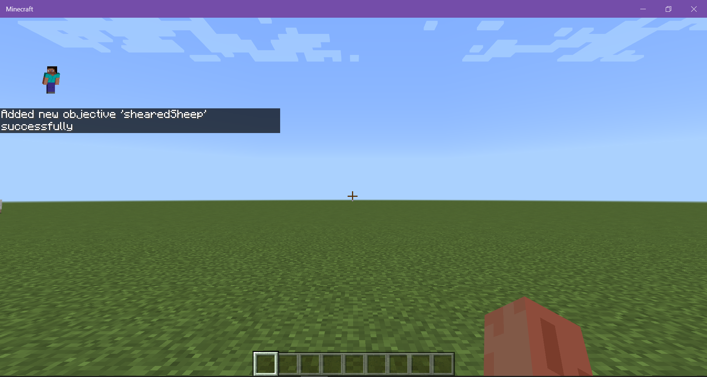
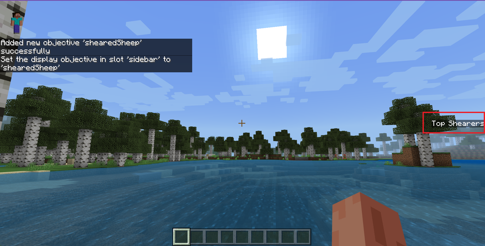
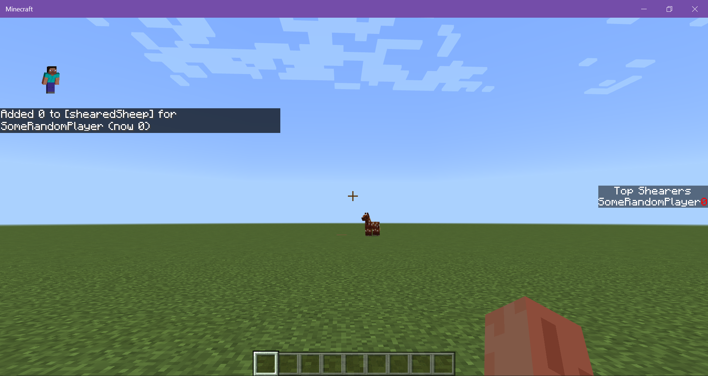
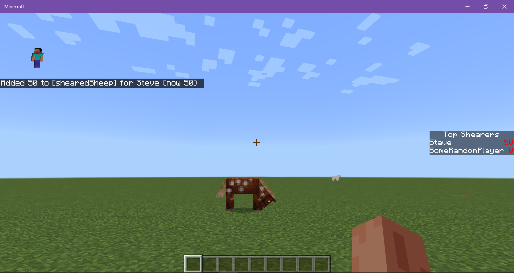
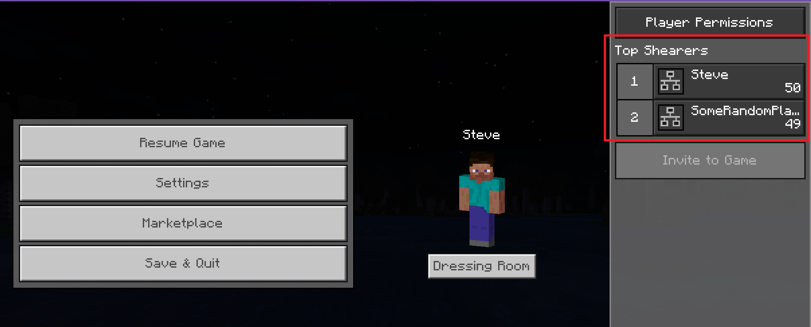

# Introduction to Scoreboards

Scoreboards can store and display information about your world. You can use commands in the chat, command blocks, functions, or a combination of these features to set up and interact with scoreboards.

In this tutorial you will learn the following:

> [!div class="checklist"]
>
> - The parts of a scoreboard and how to add information to them.
> - The `/scoreboard` command syntax.
> - How to use a scoreboard.

### Requirements

It's recommended that the following be completed before beginning this tutorial.

- [Introduction to Commands](CommandsIntroduction.md)

## Parts of a Scoreboard

In this example, you will create a basic scoreboard, display it on the screen, and make it show a few player names and values.

1. In a world with cheats enabled, open the chat window and enter `/scoreboard` with a space after the command. The chat window will display the available scoreboard commands.

The two main things to notice here are the subcategories for a scoreboard: **objectives** and **players**. An objective is something in the game you want to track, such as how many times a sheep is sheared or a potato is planted. You create objectives and give them an internal name and a name to display on the screen. In this example, we are going to create an objective to track the number of sheep that have been sheared. Then, we will add players and some made-up scores that say how many times each player accomplished the objective.

Because the objectives we are tracking do not already exist in the game, you will give them the type called "dummy."

1. In chat, enter `/scoreboard objectives add shearedSheep dummy "Top Shearers"`. You should get the message "Added new objective 'shearedSheep' successfully."

    

1. Your objective exists, but we can't see it until we display it on the screen. Your options are to display the information in a sidebar, on the pause screen, or below the player's name.

    Enter `/scoreboard objectives setdisplay sidebar shearedSheep`. You should now see a sidebar on the screen with the header Top Shearers.

    

1. Now that our objective exists, add a player named "SomeRandomPlayer" and give them a score of 0. Enter `/scoreboard players add SomeRandomPlayer shearedSheep 0`. The player's name will be displayed on the sidebar under Top Shearers.

    

1. Add yourself and give yourself a score of 50: `/scoreboard players add @s shearedSheep 50`. Your own name will be displayed on the list.

    


## Scoreboard Objectives Commands

The available scoreboard objective commands can be listed using the chat's auto-complete feature.

```
/scoreboard objectives 
```

### add

The first step to using a scoreboard is to add an objective for the game to track. Your objective will need one name for the game to use and another one to display to the players.  

```
/scoreboard objectives add <objective: string> dummy [displayName: string]
```

### list

This command returns a list of all of the objectives in the world.

```
/scoreboard objectives list
```

### remove

To remove an objective from the game use:

```
/scoreboard objective remove [objective name]
```

### setdisplay list

Use the **list** option of **setdisplay** to see scoreboard information listed on the pause screen. You can specify whether the players are ranked in ascending or descending order, according to score.

```
/scoreboard objectives setdisplay list [objective] [ascending|descending]
```

 

### setdisplay sidebar

Use the **sidebar** option to display objective information on the main screen. You can specify whether the players are ranked in ascending or descending order, according to score.

### setdisplay belowname

Use **setdisplay belowname [objective]** to display objective information below player names.

```
/scoreboard objectives setdisplay belowname <objective> 
```

If you use the command without specifying an objective, the "belowname" slot will be cleared.


## Scoreboard Players Commands

### add

You can use this to add players to an existing objective. The players don't have to be active in the world at the time or even be real players at all. The objective must already exist and you have to give them a score or you get an error.  

```
/scoreboard players add <player> <objective> <int>
```

### remove

This command is used to remove points from the player's score.

```
/scoreboard players remove <player> <objective> <int>
```

If you're actually trying to remove a player from a scoreboard, use the **reset** command (as explained below.)

### set

If you don't want to use math, you can use the **set** command to set a player's score for the objective to whatever you want it to be.

```
/scoreboard set <player> <objective> <int>
```

### list

To get a list of all of the players in a world (including any fake ones you created), enter:

```
/scoreboard players list
```

Use this command with the name of a player to get a list of that player's tracked objectives.

```
/scoreboard players list <player>
``` 

### operation

You can perform mathematical operations to calculate and assign scores.

```
/scoreboard players operation Player1 objective operation Player2 objective
```

Each operation uses the scores for two players.  The players can be from two different objectives, which is why you have to specify the objective for each player.

For each operation, the score for Player2 is used to get a result, and the result is returned as a new score for Player1. If that isn't super clear, here is a whole tutorial to show you how operations work: [Scoreboard Operations Tutorial](ScoreboardOperationsTutorial.md).

- **`%=` Modulo** - 
Divides the first score by the second score and returns the remainder.

- **`*=` Multiplication** - Returns the product of the scores after multiplying them.

- **`+=` Addition** - Returns the sum of the scores.

- **`-=` Subtraction** - Returns the value you get when you subtract the second score from the first.

- **`/=` Division** - Returns the number you get when you divide the first score by the second score.

- **`<` Compare, Less Than** - If the second score is lower than the first score, then the first score is replaced with that lower score.

- **`=` Assign** - Assigns the second score's value to the first score.

- **`>` Compare, Greater Than** - If the second score is higher than the first score, then the first score is replaced with that higher score.

- **`><` Swap Values** - The scores are given each other's values.

### random

Use this to give a player a random score within a certain range. The numbers you give for the minimum and maximum are included in the list of possible scores.

```
/scoreboard players random <player> <objective> <min> <max>
```

For example, if you want to assign Steve a random score of 1, 2, 3 or 4 for the shearedSheep objective, you would use:

```
/scoreboard players random Steve shearedSheep 1 4
```

If you try to use this command with the "all players" or '@a' selector, only real players are selected and given random scores - any players you created by giving them a name will have to be given a random score individually.

### reset

To remove a player from an objective (which removes them from the scoreboard), use:

```
/scoreboard players reset <player name> [optional objective name]
```

If you have only one scoreboard, you don't have to enter the name.

### test

You can test whether a player's score is within a specified range.

```
/scoreboard players test <player name> <objective> [min] [max]
```

You will get either a true or false message after running the command.
The range of test values is inclusive, which means that if the score you're testing is the same as either the min or max value, you will get a true message.

## What's Next?

Now that you have learned more about scoreboards, you could learn more about scoreboard operations or create a Complete the Monument challenge.

> [!div class="nextstepaction"]
> [Scoreboard Operations Tutorial](ScoreboardOperationsTutorial.md)
> [Complete the Monument](CommandsHowToMakeACTMWorld.md)
