# Working with Scoreboard Operations

The purpose of this tutorial is to show you how to use each of the scoreboard player operations.

The concept is to create one objective with six players to represent digits 0, 1, 2, 3, 5, and 10, and another objective to hold two players whose scores will be changed when you do the operations.

> Numbers: 0, 1, 2, 3, 5, 10

> Friends: Alex, Toast

## Setup

1. Start by creating two scoreboard objectives called "Numbers" and "Friends."

    ```
    /scoreboard objectives add Numbers dummy Numbers
    /scoreboard objectives add Friends dummy Friends
    ```

1. Display the Numbers objective with the **list** option and display the Friends objective with the **sidebar** option.

    ```
    /scoreboard objectives setdisplay list Numbers
    ```


    ```
    /scoreboard objectives setdisplay sidebar Friends
    ```


1. To the objective named **Numbers**, add players "Zero", "One", "Two", "Three", "Five", and "Ten" and give each one the same number of points as their name.

    ```
    /scoreboard players add One Numbers 1
    /scoreboard players add Two Numbers 2
    .
    .
    .
    /scoreboard players add Ten Numbers 10
    ```

    >[!Note]
    > After you add a player, when you go back into the chat screen to add another, you can press the up arrow on your keyboard to scroll through previous commands and just change the player name and score value. It saves a little bit of typing.

    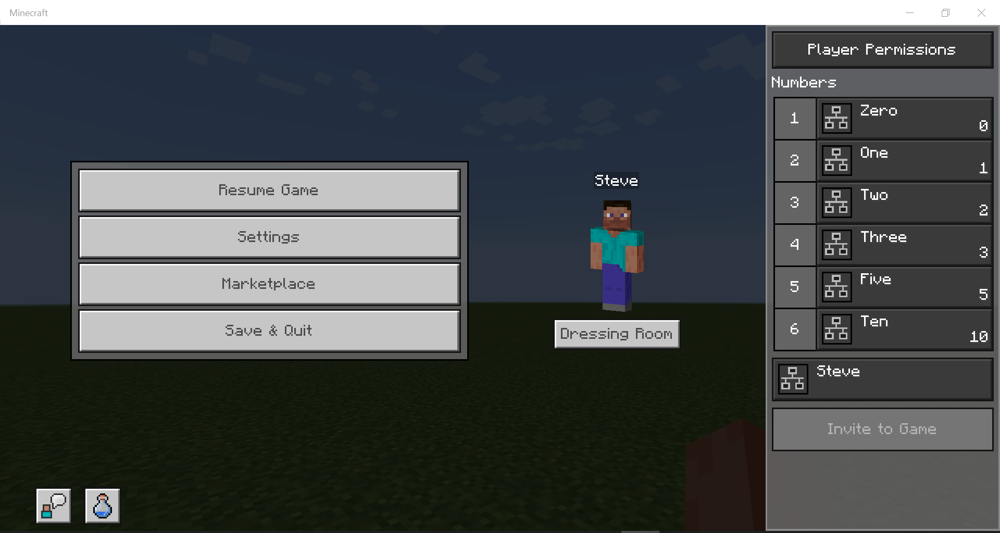

1. Add players named "Alex" and "Toast" to the **Friends** objective and give each of them a score of 4.

    ```
    /scoreboard players add Alex Friends 4
    /scoreboard players add Toast Friends 4
    ```

     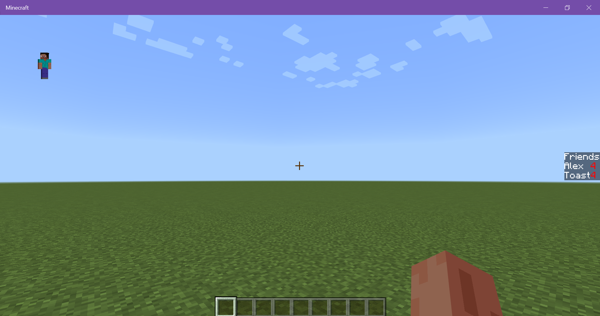


## Let's Operate

### 1. `=` Assign

The current value for Alex's score is 4. Use the `=` operator to assign the value of player Ten's score, which is 10.

```
/scoreboard players operation Alex Friends = Ten Numbers
```
Result: Alex now has a score of 10.

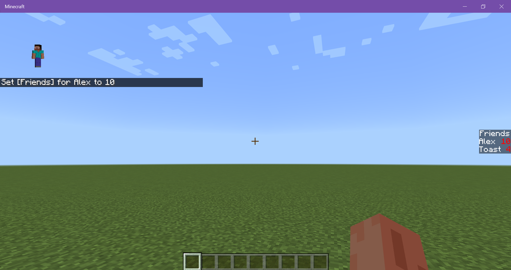

### 2. `><` Swap Values

One of the ways to give a player a particular score is to swap scores between two players.

```
/scoreboard players operation Alex Friends >< Toast Friends
```

Result: Alex has a score of 4, Toast has a score of 10.

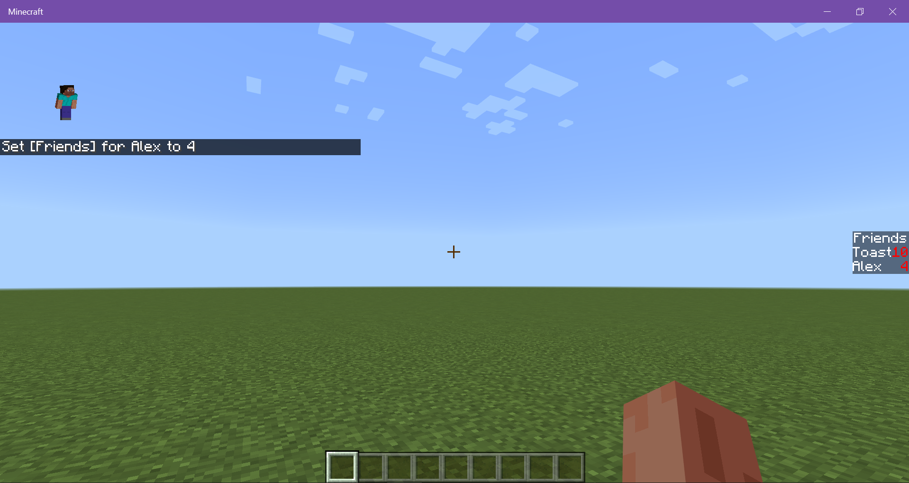


### 3. `*=` Multiply

Multiply Toast's score of 10 times 3.

```
/scoreboard players operation Toast Friends *= Three Numbers
```

Result: Toast has 30 points.

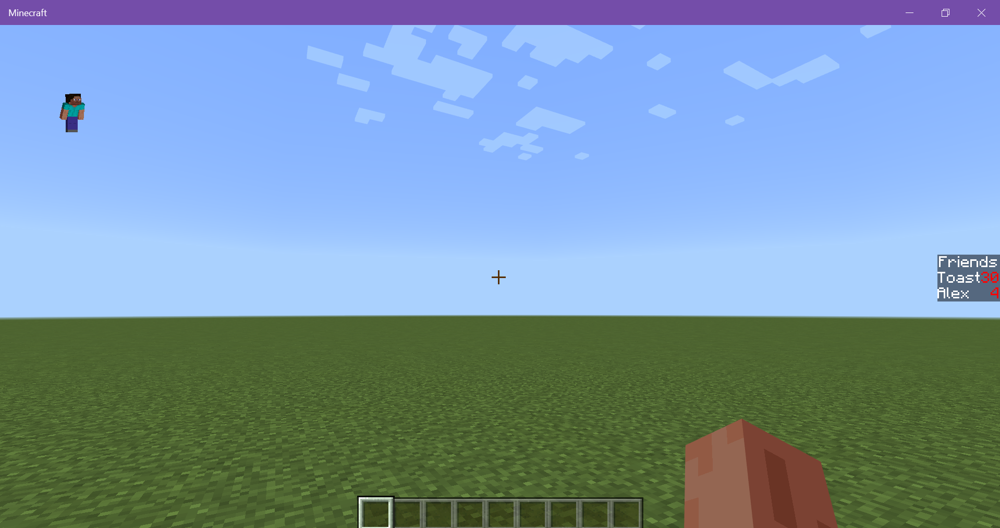

### 4. `+=` Add

Add Toast's score to Alex's score.

```
/scoreboard players operation Alex Friends += Toast Friends
```

Result: Alex has 34 points. Toast's score is unaffected so it stays at 30.

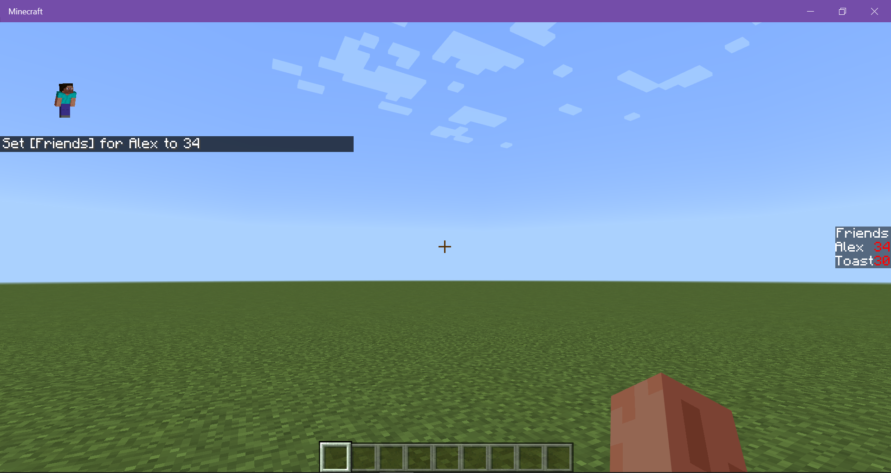

### 5. `-=` Subtract

Subtract 5 from Toast's score.

```
/scoreboard players operation Toast Friends -= Five Numbers
```

Result: Toast has 25 points.

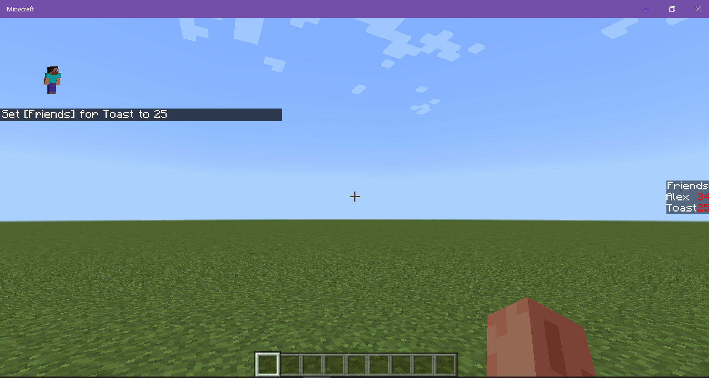

### 6. `/=` Divide

**Simple - No remainder** 

Divide Toast's score by 5.

```
/scoreboard players operation Toast Friends /= Five Numbers
```

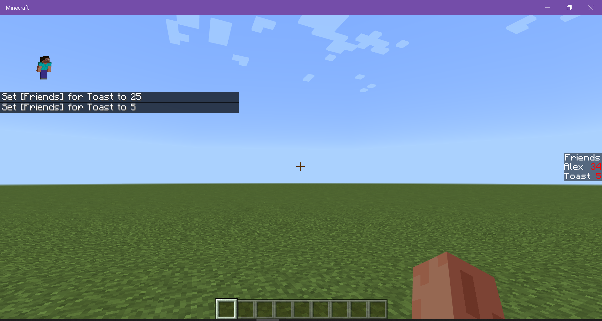

**More Complicated - Has remainder** 

Divide Alex's score by 5.

```
/scoreboard players operation Alex Friends /= Five Numbers
```

Result: Alex now has a score of 6. The remainder is ignored.

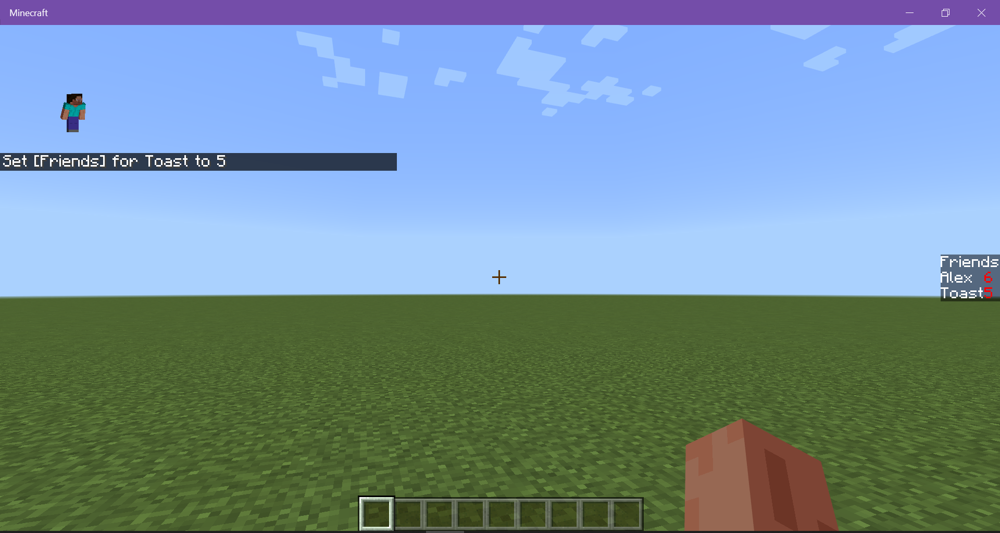

**What if I divide by zero?**

Divide Toast's score by 0.

```
/scoreboard players operation Toast Friends /= Zero Numbers
```

Result: Nothing happens. (Whew!)


### 7. `>` Compare - Greater Than

Compare Toast's score to Alex's score. Toast's score will be set to
 whichever score is higher.

```
/scoreboard players operation Toast Friends > Alex Friends
```

Result: Toast's score was set to 6, Alex's score is not affected.

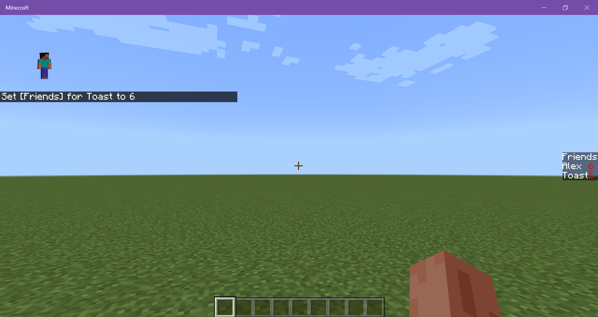

If you try the operation again with both scores being equal, you get the same message.

### 8. `<` Compare - Less Than

Compare Toast's score to Three's score of 3. Toast's score will be set to whichever score is lower.

```
/scoreboard players operation Toast Friends < Three Numbers
```

Result: Toast's score is set to 3.

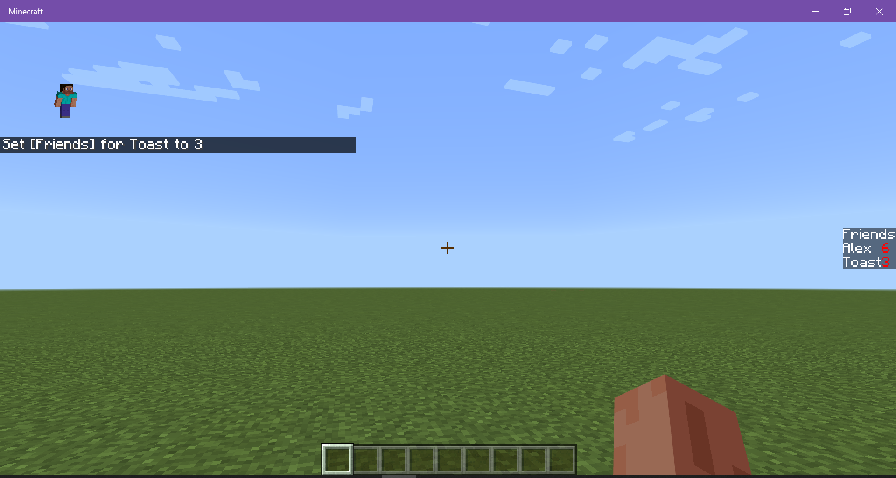


### 9. `%=` Modulo

This operation takes Alex's current score, divides it by 2, and then puts the remainder as Alex's new score.

```
/scoreboard players operation Alex Friends %= Two Numbers
```

Result: Alex's score is set to 0.
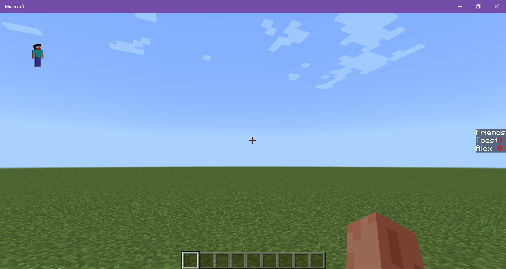

## What's Next?

Now that you have learned about scoreboard operations, you could learn more about command blocks and functions and try combining it all together.

> [!div class="nextstepaction"]
> [Command Blocks](CommandBlocks.md)
> [Introduction to Functions](FunctionsIntroduction.md)